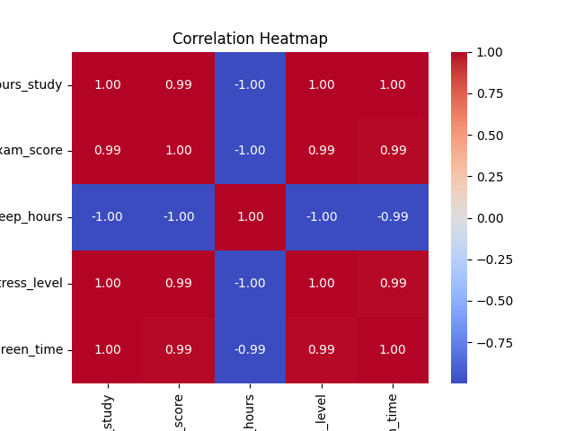

# Lesson 3: Correlation

## Wondering what is Correlation?

Correlation tells us how two things move together.

**Pearson correlation (r):** It’s a number between -1 and +1:  
- **+1**: Perfect positive relationship: as one goes up, the other goes up too.  
- **-1**: Perfect negative relationship: as one goes up, the other goes down.  
- **0**: No linear relationship: one moving doesn’t predict the other.  

**Real life examples:**  
- Positive correlation (+): Height vs shoe size (taller people usually have bigger feet).  
- Negative correlation (-): Hours spent gaming vs hours sleeping (the more you game, the less you sleep).  
- No correlation (0): Shoe size vs exam score (shoe size doesn’t affect grades).  

Correlation shows if two things move together, and how strongly.

---

## Important resources before we move on with the lesson

Before you begin this lesson, take a few minutes to go through the following resource:  
🔗 [Exploring Correlation in Python – GeeksforGeeks](https://www.geeksforgeeks.org/data-analysis/exploring-correlation-in-python/)

It provides a quick overview of how correlation works and will help you follow this lesson more easily.

Once you’ve gone through that article, come back here — we’ll build on those concepts step-by-step.

---

## Why Correlation Matters

Correlation is more than just a number, it’s a tool that helps us understand relationships in data.

**In real life it helps us answer questions like:**  
- Business: Does spending more on ads increase sales?  
- Education: Do more hours of study lead to better exam scores?  
- Health: Is exercise time linked with lower blood pressure?  

In data analysis & machine learning:  
- Correlation helps us choose useful features.  
- Example: If two variables are almost identical (like height in cm and height in inches), we don’t need both.  

⚠️ It also helps us avoid mistakes.  
Example: Ice cream sales and drowning both go up in summer. That doesn’t mean ice cream causes drowning.  

So, correlation matters because it helps us find patterns, make better decisions, and avoid false conclusions.

---

## Visualizing Correlation

Numbers are useful, but sometimes it’s easier to see relationships.

### Scatterplots (two variables)

Example: Study Hours vs Exam Scores  

```python
import matplotlib.pyplot as plt

# Slightly varied data to make it realistic (not perfectly linear)
study_hours = [1, 2, 3, 4, 5, 6, 7, 8]
exam_scores = [48, 55, 58, 67, 72, 74, 81, 84]

plt.scatter(study_hours, exam_scores, color='teal')
plt.title("Study Hours vs Exam Scores")
plt.xlabel("Study Hours")
plt.ylabel("Exam Scores")
plt.show()
```


**Interpretation:**  
The dots go upwards together, as study hours increase, exam scores increase.  
This shows a positive correlation (more study = better scores).

---

### Heatmaps (many variables at once)

```python
import pandas as pd
import seaborn as sns
import matplotlib.pyplot as plt

# More variety in numbers for realistic relationships
data = {
    "hours_study": [1, 2, 3, 4, 5, 6, 7, 8],
    "exam_score": [50, 54, 63, 66, 72, 77, 80, 86],
    "sleep_hours": [8.2, 7.8, 7.3, 6.7, 6.2, 5.8, 5.4, 4.9],
    "stress_level": [30, 35, 45, 55, 60, 65, 72, 80],
    "screen_time": [2.5, 3, 3.5, 4, 4.5, 5.2, 6, 6.5]
}

df = pd.DataFrame(data)

# Correlation matrix
corr = df.corr()

# Heatmap
sns.heatmap(corr, annot=True, cmap="coolwarm", fmt=".2f")
plt.title("Correlation Heatmap")
plt.show()
```




**Interpretation:**  
- `hours_study` and `exam_score` → show a **strong positive correlation (close to +1)** — students who study more generally score higher.  
- `sleep_hours` and `hours_study` → have a **negative correlation** — students who study more tend to sleep less.  
- `stress_level` increases with both `hours_study` and `screen_time`, showing how study pressure and screen exposure might add up.  
- The heatmap helps you quickly see **which factors move together** and **which move oppositely**.  

✅ Use scatterplots to see two-variable relationships.  
✅ Use heatmaps to see relationships across many variables.

---

## Calculating Correlation

### The Math Behind Pearson Correlation (Optional) 🧮  

If you’re curious about the math behind Pearson’s correlation coefficient, here’s the definition:  

\[
r = \frac{\text{cov}(X, Y)}{\sigma_X \, \sigma_Y}
\]

Where:  
- **cov(X, Y)** = covariance between X and Y (how much they vary together)  
- **σ_X, σ_Y** = standard deviations of X and Y (how much they vary individually)  

Intuitively:  
- The numerator (covariance) measures how much two variables move together.  
- The denominator (product of standard deviations) normalizes this, so we get a value between **-1 and +1**.  

So:  
- If X and Y always rise/fall together → **r = +1**.  
- If X rises when Y falls → **r = -1**.  
- If X and Y move independently → **r ≈ 0**.  

 For more details, see the [Pearson correlation documentation](https://en.wikipedia.org/wiki/Pearson_correlation_coefficient).  

---

### Using NumPy: `np.corrcoef()`

```python
import numpy as np

# Slightly varied data to make it more realistic
study_hours = [1, 2, 3, 4, 5, 6, 7, 8]
exam_scores = [48, 53, 60, 66, 72, 76, 80, 84]

# Correlation matrix
corr_matrix = np.corrcoef(study_hours, exam_scores)
print(corr_matrix)
```

**Output:**  
```
[[1.         0.97]
 [0.97       1.        ]]
```

---

### Using Pandas: `.corr()`

```python
import pandas as pd

# Slightly varied data for realistic correlations
data = {
    "hours_study": [1, 2, 3, 4, 5, 6, 7, 8],
    "exam_score": [52, 57, 62, 66, 71, 75, 79, 83],
    "sleep_hours": [8.1, 7.8, 7.3, 6.9, 6.4, 6.0, 5.6, 5.1]
}

df = pd.DataFrame(data)

# Correlation matrix
print(df.corr())
```

**Output:**  
```
             hours_study  exam_score  sleep_hours
hours_study     1.000000    0.999035    -0.999156
exam_score      0.999035    1.000000    -0.997778
sleep_hours    -0.999156   -0.997778     1.000000
```

**Interpretation:**  
- `hours_study` & `exam_score` → show a **strong positive correlation** — students who study more generally score higher.  
- `hours_study` & `sleep_hours` → have a **negative correlation** — students who study more tend to sleep less.  
- `exam_score` & `sleep_hours` → also show a **negative correlation** — less sleep is often linked with slightly higher scores (though not always a healthy pattern!).  

---

### Calculating Correlation with p-value (SciPy)

So far we’ve just seen the **correlation coefficient (r)**.  
But often, we also want to know: **is this correlation statistically significant, or could it be due to random chance?**  

That’s where `scipy.stats.pearsonr()` comes in — it gives both the correlation and a **p-value**.

```python
from scipy.stats import pearsonr
import numpy as np

# Example 1: Small dataset
study_hours = [1, 2, 3, 4, 5]
exam_scores = [52, 56, 63, 64, 71]  # not perfectly linear

r, p = pearsonr(study_hours, exam_scores)
print("Correlation (small sample):", round(r, 2))
print("p-value (small sample):", round(p, 4))

# Example 2: Larger dataset (100 samples, same general trend + noise)
np.random.seed(42)
x = np.linspace(0, 10, 100)
y = 2 * x + np.random.randn(100) * 2  # add random noise

r_large, p_large = pearsonr(x, y)
print("\nCorrelation (large sample):", round(r_large, 2))
print("p-value (large sample):", p_large)
```

# Outout(Simplified):

```
Correlation (small sample): 0.98
p-value (small sample): 0.0026

Correlation (large sample): 0.96
p-value (large sample): 3.4845523605597184e-54
```

---

## Positive, Negative & No Correlation Examples

### Positive Correlation

```python
import numpy as np

study_hours = [1, 2, 3, 4, 5]
exam_scores = [50, 55, 60, 65, 70]

print(np.corrcoef(study_hours, exam_scores))
```

Output shows correlation close to +1.

---

### Negative Correlation

```python
gaming_hours = [1, 2, 3, 4, 5]
sleep_hours = [8, 7, 6, 5, 4]

print(np.corrcoef(gaming_hours, sleep_hours))
```

Output shows correlation close to -1.

---

### No Correlation

```python
shoe_size = [38, 40, 42, 44, 46]
exam_scores = [60, 85, 70, 65, 90]

print(np.corrcoef(shoe_size, exam_scores))
```

Output shows correlation close to 0.

---

## Seeing Correlation Strengths in Action

Correlation values range between **-1 and +1**.  
To build intuition, here’s what scatterplots look like with different correlation strengths (using 100 noisy data points for each case):

**Reminder:** Try running this code yourself in VS Code and see how the plots look. Playing with the numbers is the best way to build intuition!

```python
import numpy as np
import matplotlib.pyplot as plt

np.random.seed(42)

# Correlation values we want to demonstrate
correlations = np.arange(-1.0, 1.1, 0.2)

fig, axes = plt.subplots(3, 4, figsize=(15, 10))
axes = axes.flatten()

for i, r in enumerate(correlations):
    # Create random data with desired correlation
    x = np.random.randn(100)
    y = r * x + np.sqrt(1 - r**2) * np.random.randn(100)
    
    axes[i].scatter(x, y, alpha=0.6)
    axes[i].set_title(f"r = {r:.1f}")

plt.tight_layout()
plt.show()
```

---

## Pitfalls of Correlation

- **Correlation ≠ Causation**: Ice cream sales ≠ drowning.  
- **Outliers Can Mislead**: One strange data point can distort correlation.  
- **Large Datasets**: Tiny effects can look “significant” in huge datasets.  

Always visualize and think logically before trusting correlation numbers.

---

### Correlation Only Captures Linear Relationships 📉📈  

Correlation is powerful, but it has limits:  
- It only measures **linear** relationships.  
- Two variables can have the *same correlation value* but completely different patterns.  

A famous example is **Anscombe’s Quartet** — four datasets with identical correlation (~0.82), but very different scatterplots.  

```python
import seaborn as sns
import matplotlib.pyplot as plt
from seaborn import load_dataset

# Load Anscombe’s quartet (built into seaborn)
df = sns.load_dataset("anscombe")

# Plot the four datasets
sns.lmplot(x="x", y="y", col="dataset", data=df, 
           col_wrap=2, ci=None, palette="muted", 
           scatter_kws={"s":50, "alpha":0.7}, 
           line_kws={"color":"red"})
plt.suptitle("Anscombe's Quartet: Same Correlation, Very Different Data", y=1.05)
plt.show()
```

---

## Check for understanding:

**Q1. If the correlation between study hours and exam scores is +0.9, what does that mean?**  
<details>
<summary>Show Answer</summary>  
It means students who study more tend to score higher (strong positive relationship).  
</details>

**Q2. If the correlation between gaming hours and sleep hours is -0.8, what does that mean?**  
<details>
<summary>Show Answer</summary>  
It means students who game more tend to sleep less (strong negative relationship).  
</details>

**Q3. Shoe size and exam scores show a correlation close to 0. What does that mean?**  
<details>
<summary>Show Answer</summary>  
It means shoe size and exam scores have no meaningful relationship (no correlation).  
</details>

---

✅ With this we have completed the **Correlation** section, let’s keep learning.
