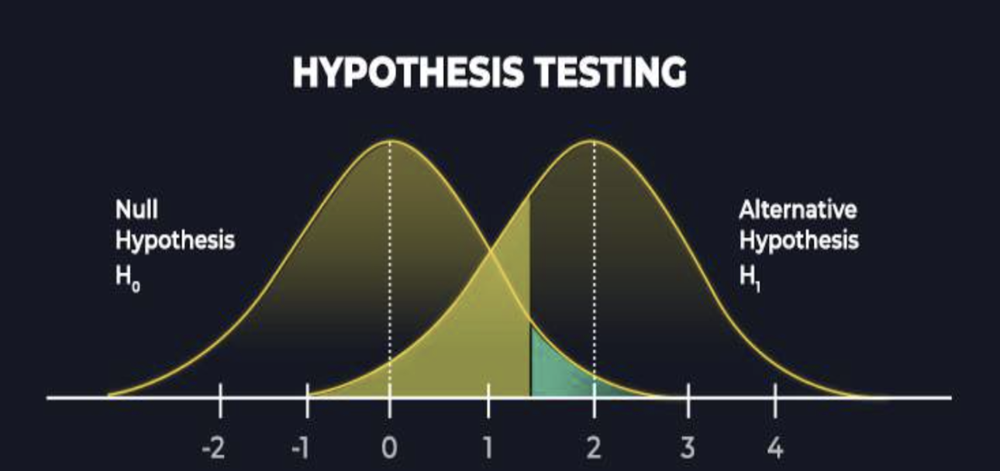
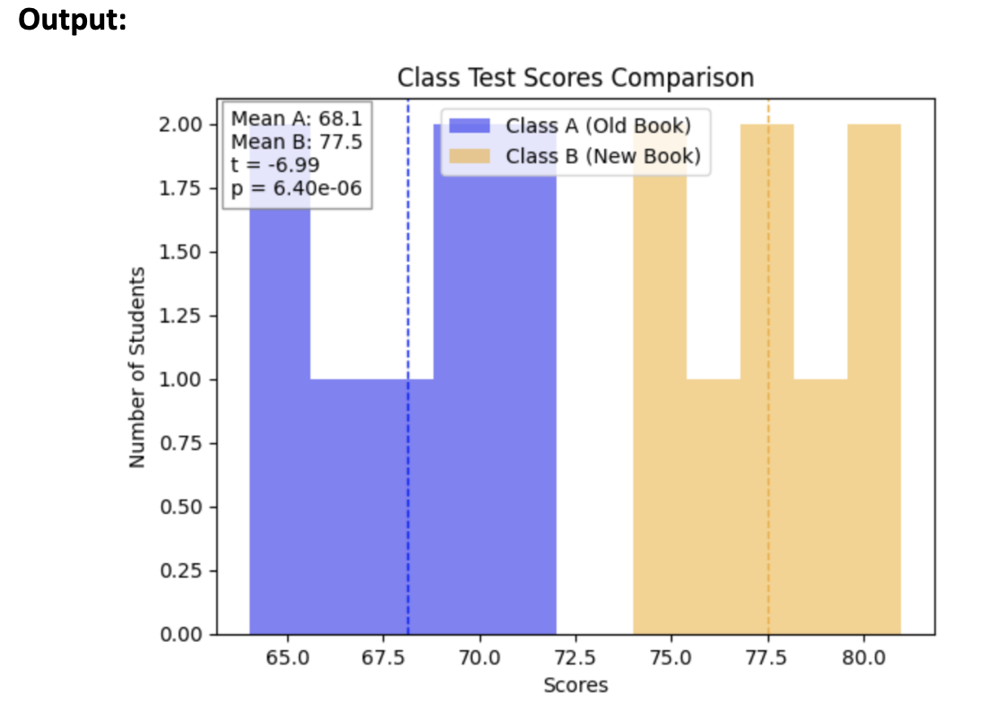

# Lesson 2: Hypothesis Testing

Let’s start a new chapter on Hypothesis testing. Evidence over intuition.

---

As we begin with the lesson here are some interesting references & resource on Statistics which will help you with follow the lesson more effectively:  

-  [Introduction to Hypothesis Testing (YouTube)](https://www.youtube.com/watch?v=0oc49DyA3hU)  
-  [Null vs. Alternative Hypotheses — Scribbr](https://www.scribbr.com/statistics/null-and-alternative-hypotheses/)  
-  [Statistics Crash Course (YouTube)](https://www.youtube.com/watch?v=kyjlxsLW1Is)  
-  [Simplilearn: Hypothesis Testing in Statistics](https://www.simplilearn.com/tutorials/statistics-tutorial/hypothesis-testing-in-statistics)  

---


Now let's walk through how hypothesis testing works:

Let’s think of it this way: In business, science, or product design, you can’t just rely on gut feelings:  
- A manager might say, “Version B of our website feels better.”  
- A teacher might say, “My new teaching method works better.”  

But without evidence, these are just opinions.  
Hypothesis testing is the statistical way to check: Are the differences we see real, or could they just be random chance?

---

## The Big Idea: Hypothesis Testing

A structured way to test an assumption using data.

**Decision-making connection:**  
“Hypothesis testing is used anytime you have to make a decision based on data, in medicine, business, education, or even sports.”

**Outcome reminder:**  
At the end of a hypothesis test, we don’t prove something 100%, we just decide if we have enough evidence to support one side.

Hypothesis testing ≠ absolute truth.  
Lastly, hypothesis testing doesn’t give us certainty, it helps us decide if there’s enough evidence to support a claim, or if the difference we see could just be random chance.



**What this figure shows:**

- **X-axis:** The range of possible outcomes (for example, different possible average scores).
- **Y-axis:** How likely each outcome is — this is called **probability density** (how common each value is if the null hypothesis is true).
- The **blue curve** shows what we would expect to see if the **null hypothesis (H₀)** were true (i.e., no real difference).
- The **shaded areas on the sides** represent **rare outcomes** — results that are unlikely if H₀ is true.
- If our observed result falls into those shaded regions, we **reject the null hypothesis**, because the outcome is too unlikely to be explained by random chance alone.

*Source: Adapted from www.analyticssteps.com/blogs/what-hypothesis-testing-types-and-methods*

---

## Null Hypothesis (H₀): No Effect / No Difference

The null hypothesis is our starting assumption:  
It says: “Nothing special is happening.”  
- In medicine: The new drug has no effect compared to the old one.  
- In business: The new website design performs the same as the old one.  
- In school: A new teaching method doesn’t change student scores.  

In plain words: The null hypothesis assumes that any difference we see is just random chance, not a real effect.

**Courtroom Example:**  
H₀ (Null) = “The accused is innocent.”  
We assume innocence by default until strong evidence shows otherwise.

Why is this important?  
The null hypothesis gives us a baseline to test against.  
Without it, we’d jump to conclusions every time we saw a small difference, even if it was just random noise.

---

## Alternative Hypothesis (H₁): There is an Effect / Difference

The alternative hypothesis is the opposite of the null.  
It says: “Something is happening.”  
- In medicine: The new drug does improve recovery.  
- In business: The new website gets more clicks than the old one.  
- In school: The new teaching method raises test scores.  

In simple terms: The alternative hypothesis assumes that the difference is real, not just random chance.

**Courtroom Analogy:**  
H₁ (Alternative) = “The accused is guilty.”  
We only accept this if the evidence is strong enough to reject H₀ (innocence).

Why is this important?  
The alternative hypothesis is what we’re actually hoping to prove with data.  
It represents the claim, effect, or improvement we’re testing for.

---

## p-value: Probability Under the Null

The p-value tells us: “If the null hypothesis (H₀) is true, how likely is it to see results as extreme as ours, just by random chance?”

**Coin Toss Analogy:**  
Imagine you believe a coin is fair (H₀).  
You flip it 10 times and get 9 heads.  
Could this happen by chance? Yes, but the probability is very small.  
That tiny probability is like the p-value.

If the p-value is very small, it suggests our assumption (fair coin / no effect) may not be true.

**Advertisement Example:**  
- Old ad gave a 5% click rate.  
- New ad gave a 7% click rate.  
- Difference = 2%.  

Now, the p-value asks:  
“If ads really perform the same (H₀), how likely is it to see a difference of 2% (or bigger) just by random chance?”  

- If p = 0.02 → Only a 2% chance it’s just luck → evidence the new ad is actually better.  
- If p = 0.40 → A 40% chance it’s just luck → too common to rule out chance → we can’t say the new ad is better.  

---

## Significance Level (α)

The significance level is the threshold we choose before testing (often 0.05 = 5%).  

Meaning: “I’m okay with being wrong 5% of the time when I say there’s a real effect.”

**Decision rule:**  
- If p < α → result is meaningful, support H₁.  
- If p > α → result not strong enough, stick with H₀.  

---

## t-Test for Comparing Means

A t-test is a tool we use when we want to check if two groups really have different averages, or if the difference might just be luck.

**Example: Two Classes' Test Scores**  
- Class A uses the old textbook.  
- Class B uses a new textbook.  
- Both classes take the same test.  

We want to know: “Did the new textbook actually help, or are the score differences just random?”  

This is exactly what a t-test does: it compares the average scores of the two groups to see if the difference is real.

**Steps:**  
1. Collect data from two groups (old vs new).  
2. Use the t-test to compare their averages.  
3. Look at the p-value:  
   - If it’s small → difference is real.  
   - If it’s big → difference could just be random chance.  

**Example Code:**  
```python
from scipy import stats

# Step 1: Collect data
class_a = [65, 70, 68, 72, 66, 64, 69, 71]
class_b = [75, 78, 74, 80, 76, 79, 77, 81]

# Step 2: Perform independent t-test
t_stat, p_val = stats.ttest_ind(class_a, class_b)

print("t-statistic:", t_stat)
print("p-value:", p_val)

# Step 3: Interpret results
if p_val < 0.05:
    print("The difference is significant: the new textbook likely improved scores.")
else:
    print("No significant difference: the new textbook may not have made a real impact.")
```

**Output:**  
```
t-statistic: -6.985114284057083
p-value: 6.3969825252044474e-06
The difference is significant: the new textbook likely improved scores.
```

**Note:** This kind of experiment is often called **A/B testing** in business.

---

## Visualizing the Groups

So far, we ran a t-test on the two classes’ scores. That gave us numbers (t-statistic and p-value).  
But numbers alone can feel abstract. To make it intuitive, we can visualize the same raw data.

```python
import numpy as np
import matplotlib.pyplot as plt
from scipy import stats

# --- Same data as before ---
class_a = [65, 70, 68, 72, 66, 64, 69, 71]
class_b = [75, 78, 74, 80, 76, 79, 77, 81]

# 1) Run the t-test
t_stat, p_val = stats.ttest_ind(class_a, class_b, equal_var=True)

# 2) Visualization
plt.hist(class_a, bins=5, alpha=0.5, label="Class A (Old Book)", color="blue")
plt.hist(class_b, bins=5, alpha=0.5, label="Class B (New Book)", color="orange")

# Show group means
mean_a = np.mean(class_a)
mean_b = np.mean(class_b)
plt.axvline(mean_a, color='blue', linestyle='dashed', linewidth=1)
plt.axvline(mean_b, color='orange', linestyle='dashed', linewidth=1)

# Annotate results
text = (
    f"Mean A: {mean_a:.1f}\n"
    f"Mean B: {mean_b:.1f}\n"
    f"t = {t_stat:.2f}\n"
    f"p = {p_val:.2e}"
)
plt.text(0.02, 0.98, text, transform=plt.gca().transAxes,
         verticalalignment='top', bbox=dict(facecolor='white', alpha=0.8, edgecolor='gray'))

plt.title("Class Test Scores Comparison")
plt.xlabel("Scores")
plt.ylabel("Number of Students")
plt.legend()
plt.show()
```

**Explanation:**  
- Step 1 (t-test): Calculated t-statistic & p-value.  
- Step 2 (plot): Drew histograms & marked averages.  
- Together: Numbers tell us if the difference is real; the picture helps us see that Class B’s scores sit higher overall.  

---

## Sharing Outcomes: Writing Conclusions in Plain Language

Statistical results are often written in technical terms like:  
“p < 0.05, reject null hypothesis.”  

But in real projects, you need to explain results so anyone can understand:  
👉 “We are 95% confident that students using the new textbook (Class B) scored higher than those using the old textbook (Class A).”  

---

## A/B Testing in the Real World 

What we just learned about hypothesis testing is exactly what powers **A/B testing**, one of the most common industry practices.

- **A/B testing** is when you compare two versions of something (e.g., a website button, an email subject line, a product feature) to see which one performs better.  
- Version **A** is often the "control" (the current version).  
- Version **B** is the "treatment" (the new variation).  
- You then collect data and use hypothesis testing to check:  
  - Is there a **real difference** in outcomes (e.g., clicks, purchases)?  
  - Or could the difference be due to random chance?

This is exactly the same statistical framework we’ve been learning:  
- Null hypothesis: there’s **no difference** between A and B.  
- Alternative hypothesis: there **is a difference**.  
- Test statistic & p-value: help you decide if the difference is meaningful.

 You’ve basically just learned the foundation of A/B testing — a tool you’ll see everywhere in data science and industry practice.

---

## Important Notes & Limitations 

### 1. Assumptions of the t-test
The common **t-test** relies on some assumptions:
- Data should be **roughly normally distributed**.  
- Observations should be **independent** from each other.  

If these assumptions are violated, other tests (e.g., **non-parametric tests**) may be more appropriate.

---

### 2. One-Sided vs Two-Sided Tests
- A **two-sided test** checks for **any difference** between two groups (values could be higher or lower).  
- A **one-sided test** checks for a difference in **one direction only** (e.g., “Group A mean is greater than Group B mean”).  

In practice, two-sided tests are more common unless you have a strong reason to test only one direction.

---

### 3. Just Scratching the Surface
What we covered here are the fundamentals.  
There are many statistical tests for many measures, not just the mean:  
- Median  
- Standard deviation  
- Correlation (we’ll dive deeper into this in a later lesson)  

As you move forward with Python 200, you’ll learn when and how to choose the right test depending on the type of data and research question.

---

Lastly, hypothesis testing is a core skill in data science.  
From comparing test scores to running large-scale A/B experiments, it helps us move from **hunches** to **evidence-based decisions**.  
We’ll keep building on this foundation in upcoming lessons.


