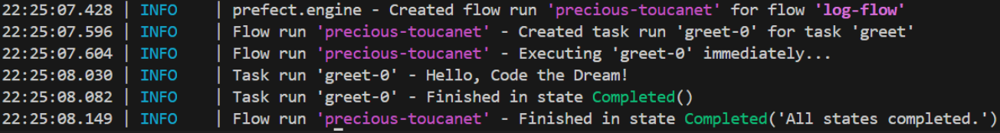

# Introduction to Data Pipelines

Imagine running your analysis once, then being asked to run it again tomorrow, next week, or on a larger dataset. Manually re-running each step - loading, cleaning, analyzing, and reporting - would be painful, error-prone, and time-consuming.

**Pipelines solve this**. They give us reproducible, modular workflows where each step is defined and orchestrated. This approach becomes especially powerful in **cloud computing**, a topic we’ll explore in more detail in future lessons of Python 200.

### Learning objectives: 
By the end of this lesson, you’ll be able to:

- See why pipelines make analysis reproducible, modular, and scalable.
- Build and orchestrate workflows using Prefect tasks and flows.
- Make pipelines resilient and efficient with retries and logging.
- Monitor and debug workflows in real time using the Orion dashboard.
- Run a full data analysis workflow - load, clean, explore, analyze, and report - with a single command.

### Table of Contents
1. Understanding Data Pipelines
2. Prefect
3. Building Your First Prefect Pipeline
4. Wrap-up

## 1. Understanding Data Pipelines

What is a **Data Pipeline**?

A **data pipeline** is a series of connected data processing steps where the output of one step becomes the input of the next. Think of it like a factory assembly line for data - raw materials (data) enter at one end, go through various transformation stations, and emerge as a finished product (insights, reports, or processed datasets).

```text
Raw Data → Load → Clean → Analyze → Visualize → Report
```
- Without pipelines → manual re-runs, messy scripts, hard to reproduce results.
- With pipelines → clear modular steps, easy to run end-to-end, scalable to cloud systems.

## Key Features & Benefits of Data Pipelines

Data pipelines are essential because they enable:

- **Single-source limitations** → overcome reliance on one dataset by combining multiple sources.  
- **Data integration** → enrich analysis by connecting diverse datasets.  
- **Automated analysis** → schedule regular data collection and processing, saving time and reducing errors.  
- **Data consistency** → standardize and transform data from multiple sources to maintain uniformity.  
- **Efficiency** → streamline workflows for faster and more reliable analysis.

## Types of Data Pipelines

There are several types of pipelines, each suited for specific tasks and platforms:

### Batch Processing Pipelines
- Process data in chunks or batches at scheduled intervals.  
- Ideal for large datasets that don’t require real-time processing.
- **Examples:** nightly sales reports, daily ETL jobs.  

### Streaming Data Pipelines
- Handle continuous, real-time data flow.  
- Useful for monitoring live events or fast-moving data sources.
- **Examples:** social media feeds, IoT sensor data, stock tickers. 

### Data Integration Pipelines
- Combine data from multiple sources into a unified format or system.  
- Often used to consolidate data for reporting, analytics, or machine learning.
- **Examples:** merging customer data from CRM and e-commerce platforms.  

## ETL Pipeline

An **ETL pipeline** (Extract, Transform, Load) is a specific type of data pipeline designed for structured movement and preparation of data.  

### How ETL Pipelines Work
1. **Extract** – Data is pulled from one or more sources such as databases, APIs, logs, or flat files.  
2. **Transform** – The extracted data is cleaned, reshaped, aggregated, or enriched in a staging area. This ensures the data is consistent and ready for analysis.  
3. **Load** – The processed data is moved into its final destination, such as a **data warehouse**, **data lake**, or **analytics platform**.  

This process is especially common in organizations that rely on large volumes of structured data for **reporting, dashboards, and business intelligence**.

### How ETL Pipelines Differ from General Data Pipelines
- **ETL pipelines** are a **subset of data pipelines**:  
  Every ETL pipeline is a data pipeline, but not every data pipeline follows the ETL structure.  

- Some data pipelines may **skip transformation** entirely, moving raw data from one location to another (Extract → Load).  
- Others use an **ELT approach** (Extract, Load, Transform), where data is first moved into a data lake or warehouse in raw form, and transformations happen later within that system.  

### Example
- A company collecting sales data from multiple regional databases might use an **ETL pipeline** to pull all sales records (Extract), clean and standardize currencies and formats (Transform), and then store them in a central warehouse (Load) for unified reporting.  

In short, ETL pipelines are designed for **structured data preparation**, while general **data pipelines** can include a broader range of workflows, such as real-time streaming, machine learning model deployment, or automated alerts.

## Pipeline Tools in Python

Python provides several powerful tools for building pipelines:

- **Luigi** – workflow management and batch pipeline scheduling.  
- **Airflow** – orchestrates complex workflows with dependencies.  
- **Metaflow** – simplifies data science pipelines and ML workflow management.  
- **Dagster** – modern framework for data orchestrations and testing pipelines.  

In this lesson, we will focus on **Prefect**, a Python workflow orchestration tool that provides a gentle learning curve and allows us to build and run pipelines locally. We'll explain Prefect in detail in the next topic.  

### Further Learning  

Watch this video for an overview of data pipeline basics: https://www.youtube.com/watch?v=DHO2PuR3jrs 

## 2. Prefect

Now that we understand why pipelines are essential, let's look at a tool that helps us build them: **Prefect**.  

Prefect is an open-source workflow orchestration tool that helps you define, run, and monitor your data pipelines. It’s designed to make workflows more **robust** (automatic retries, error handling) and more **observable** (logs, states, dashboards).

Instead of writing plain Python scripts that can silently fail or become difficult to manage, Prefect gives you structure and visibility. You can break your work into tasks, connect them in flows, and then track everything in real-time through the Prefect UI.

💡 **When to use Prefect:**

- Automating a daily data pipeline (e.g., load → clean → analyze → report).
- Running machine learning training jobs with monitoring.
- Orchestrating ETL workflows across multiple systems.

👉 At the heart of Prefect are two simple but powerful building blocks - tasks and flows. We’ll explore each of them in the next section.

### 2.1 Core Concepts in Prefect

At its core, Prefect uses two main concepts to define your pipeline:

1. **`@task()` decorator**  
    - Transforms a Python function into a Prefect **task**.
    - Prefect tracks its state (running, successful, failed), logs its output, and can retry on failure.

2. **`@flow()` decorator**  
   - Transforms a Python function into a Prefect **flow**.  
   - A flow is a collection of tasks and defines the overall workflow logic. It orchestrates the execution order of your tasks and handles dependencies.  
   - Provides a single entry point to run your entire pipeline. 

📖 For more details, you can also check out the [official Prefect docs on flows](https://docs.prefect.io/v3/concepts/flows).

### Simple Example

Let's see a super simple example to get the idea. In your IDE, create a file called `hello_prefect.py` and run from the command line:

```python
from prefect import task, flow

# Define a task
@task
def say_hello(name):
    print(f"Hello, {name}!")

# Define a flow that uses the task
@flow
def output():
    say_hello("Code The Dream")
    say_hello("Students")

# To run the flow
# This condition checks if the current script is the one being executed directly.
if __name__ == "__main__":  
    output()
```
- Each function decorated with `@task` becomes a distinct step in your workflow.
- The `@flow` function orchestrates those steps.
- Running `output()` executes the whole workflow. 

**What Happens When You Run It?**

You may notice that when you run the code, you don’t just see:

```bash
Hello, Code The Dream!
Hello, Students!
```
Instead, you’ll also see extra startup messages in your terminal - something like this:


**Here’s what’s happening:**

When you decorate a function with `@flow`, Prefect orchestrates the workflow rather than just running it like plain Python.

To do this, Prefect spins up a small temporary local server in the background to track the execution of your flow.

That’s why you see lines like “Starting temporary server on http://127.0.0.1:8597”

Prefect is not just a typical library with functions you run - it’s a framework that manages and tracks how your code is executed.

By handing control to Prefect through `@task` and `@flow`, you gain features like Centralized logging, automatic retries on failure, viewing run history in a UI, tracking task states. 

👉 Later in this lesson, we’ll explore the Orion UI to see how Prefect logs, retries, and statuses appear visually - but for now, just know that Prefect is setting the stage for all that automatically.

### 2.2 How Prefect enhances your workflows

Once you've built a basic pipeline using @task and @flow, Prefect gives you powerful tools to make your workflows more **reliable**, **efficient**, and **production-ready**. In this section, we’ll focus on three essential features: 

**1. Logging**

Instead of relying on `print()`, Prefect provides structured logging through `get_run_logger()`. These logs are automatically captured and shown in the Orion UI, making debugging much easier.

```python
from prefect import task, flow
from prefect.logging import get_run_logger

@task
def greet(name):
    logger = get_run_logger()
    logger.info(f"Hello, {name}!")

@flow
def log_flow():
    greet("Code the Dream")

if __name__ == "__main__":
    log_flow()

```
Console Output:



👉 This is how the logs look in your console output after using `get_run_logger()`.

The same logs also appear in Orion, where they’re stored for later runs.

✨ That’s why logging is the recommended best practice - unlike print(), logs are timestamped, structured, saved, and easy to search later.

**2. Retries and Failure Handling**

Suppose a network call fails intermittently. Prefect allows you to declare retries.

Here's a very simple example showing retries in action with a flaky function using Prefect:

```python
from prefect import flow, task
from random import random
import time

# Define a flaky task
@task(retries=3, retry_delay_seconds=2)
def flaky_task():
    print("Trying to run task...")
    if random() < 0.7:  # 70% chance to fail
        raise ValueError("Task failed! Retrying...")
    print("Task succeeded!")

# Define a flow
@flow
def retry_demo_flow():
    flaky_task()

if __name__ == "__main__":
    retry_demo_flow()
```

- The task flaky_task has a 70% chance to fail each run. Prefect automatically retries it up to 3 times, waiting 2 seconds between attempts. If it eventually succeeds within 3 retries, the flow continues normally. If it still fails after 3 retries, the flow marks the task as failed.

**Sample Output (your console or Orion logs):**

```bash
Trying to run task...
Task failed! Retrying...
Trying to run task...
Task failed! Retrying...
Trying to run task...
Task succeeded!

```

This makes your pipeline robust without manual try/except blocks.

**3. Monitoring and Visualization with Orion UI**

Prefect provides a web-based UI (**the Prefect Server UI**, often called ***Orion***), where you can:

- Visualize your pipeline's execution flow
- See task logs, states, retries
- Monitor scheduled runs
- Debug failed steps interactively

*To launch Orion:*

**Step 1**: Install Prefect
```bash
pip install prefect
```

**Step 2**: Start Orion
```bash
prefect server start
```
This command launches the Orion server, which you can access via your web browser at:

```
http://localhost:4200
```

```text
Note:
To launch the Prefect UI (version-dependent).
- For many Prefect 2.x installs run: `prefect orion start`.
- For some later releases the equivalent command is: `prefect server start`.
- If unsure, run `prefect --help` (or check `pip show prefect` / your installed version) and follow the CLI shown by your version.
```

**Step 3: Run Your Flow**

Let’s use the same example from earlier:

```python
from prefect import flow, task
from prefect.logging import get_run_logger

@task
def greet(name: str):
    logger = get_run_logger()
    logger.info(f"Hello, {name}!")

@flow
def log_flow():
    greet("Code the Dream")

if __name__ == "__main__":
    log_flow()
```
**Step 4: Explore in Orion**

After running your flow, open the Orion UI in your browser. Here’s what you’ll see:

- The Dashboard shows your active and completed flow runs.
- Clicking on a flow run opens details about its tasks and logs.
- Logs are structured with timestamps, levels (INFO, WARNING, ERROR), and are saved for later review.


As you can see, the Orion UI provides a clear overview of your flow runs, their statuses, and detailed logs - all in one place. This makes it much easier to monitor and debug your workflows compared to relying on terminal output alone.

**Why This Matters**

Prefect automatically tracks your pipeline runs. The Orion UI gives you:

- Real-time monitoring of flows and tasks
- Easy log search & filtering
- Retry history and error tracking

✨ That’s why Prefect encourages logging and visualization in Orion - it turns simple Python scripts into fully observable workflows.

#### Advanced Features of Prefect

Prefect isn’t just about running tasks and viewing logs - it also comes with powerful features to handle real-world workflows. We won’t dive into these right away, but here’s a preview of what’s ahead:

- Caching – Skip re-running expensive tasks if their inputs haven’t changed. This makes your workflows faster and more efficient.

- Parallelism – Run tasks concurrently to speed up data processing and reduce bottlenecks.

- Scheduling – Automate your flows to run on a set interval or a cron-like schedule, so they can operate hands-free in production.

📌 We’ll explore these in later weeks, once we’ve built a strong foundation with tasks, flows, and the Orion UI.

📺 Want to see this in action?
In this video, you’ll see how Prefect not only schedules a Python script but also solves common workflow challenges. 

https://www.youtube.com/watch?v=Kt8GAZRpTcE

### Why Prefect and Not Just Python Functions?  

You might have wondered earlier: *“Couldn’t we just write Python functions and call them in order?”*  

The short answer is **yes** - you can build a simple pipeline by chaining plain Python functions.  
But the moment you need reliability, monitoring, retries, scheduling, or scaling, plain functions quickly become fragile and hard to manage.  

That’s where **Prefect** makes the difference. It takes ordinary Python code and turns it into **production-ready workflows** - with features like retries, logging, monitoring, and scheduling built in, so you don’t have to reinvent the wheel.  

Here’s the side-by-side view:  

| **Feature**               | **Plain Python**        |  **With Prefect**                    |
|---------------------------|-------------------------|--------------------------------------|
| Retry failed steps        | Manual try/except       | Declarative retries (`retries=3`)    |
| Cache expensive results   | Manual caching          | Built-in caching                     |
| Parallel execution        | Manual threading        | Easy parallel mapping                |
| Monitoring & debugging    | Print statements & logs | UI with history & logs *(Orion)*     |
| Resilience to failures    | Manual error handling   | Automatic retries & recovery         |
| Scheduling workflows      | Manual script runs      | Built-in scheduling & orchestration  |

👉 In short, Prefect handles the *operational complexity* so you can focus on writing clear analysis logic. 

## 3. Building Your First Prefect Pipeline

Now that we’ve seen Prefect’s core concepts and enhancements, let’s put it all together.  
In this section, we’ll build a **tiny end-to-end data analysis pipeline** step by step:  

- Load exam scores for two classes
- Clean the data with retries (in case of transient issues)  
- Perform a statistical test (t-test)  
- Visualize results with a simple chart  
- Wrap it all in Prefect tasks and flows with logging

By the end, you’ll see how Prefect makes even small pipelines more **structured, observable, and reusable**.  

### Step 0: Setup
```python
# First, install Prefect:
pip install prefect pandas matplotlib scipy
```

### Step 1: Imports & Data Loader `(load_data)` with logging

We import necessary libraries:
- `pandas` → handle data as tables (`DataFrame`).  
- `prefect` → build workflows with tasks/flows.  
- `matplotlib.pyplot` → visualize data.  
- `scipy.stats` → run statistical tests. 

We also use Prefect’s logger so messages appear in Orion with timestamps and log levels.

```python
from prefect import task, flow
from prefect.logging import get_run_logger 
import pandas as pd
import matplotlib.pyplot as plt
from scipy.stats import ttest_ind

@task
def load_data() -> pd.DataFrame:
    logger = get_run_logger()
    """
    Create a tiny, readable dataset:
      - Class: which class the student is in ('A' or 'B')
      - Score: exam score (numeric)
    """
    data = {
        "Class": ["A","A","A","A","A",  "B","B","B","B","B"],
        "Score": [65, 70, 68, 72, 66,    78, 82, 80, 79, 81]
    }
    df = pd.DataFrame(data)
    logger.info("Exam scores loaded successfully")
    return df

```
🔎 Utility:

- Instead of plain prints, logs are searchable, timestamped, and stored in Prefect’s UI.
- If this pipeline ran every day, you could filter logs for today’s runs without digging through raw output.

#### 📌Function Reference:

- pd.DataFrame(data) → creates a table (DataFrame) from a dictionary.
- `logger.info("...")` → adds timestamped logs in Prefect.
- Task returns a DataFrame for downstream tasks.

💡 Shortcut to repeat labels:

```python
["A"]*5 + ["B"]*5
# → ["A","A","A","A","A","B","B","B","B","B"]
```
👉 Next step: Once data is loaded, we need to clean it for reliability.

### Step 2: Clean the Data `(clean_data)` with Retries

Sometimes data is messy or missing. Prefect’s retries make the pipeline fault-tolerant.

```python
@task(retries=3, retry_delay_seconds=3)
def clean_data(df: pd.DataFrame) -> pd.DataFrame:
    logger = get_run_logger()
    """
    Basic cleaning:
      1) Ensure Score is numeric.
      2) Drop missing values.
    (This is minimal on purpose for clarity.)
    """
    df = df.copy()
    df["Score"] = pd.to_numeric(df["Score"], errors="coerce")
    df = df.dropna(subset=["Score", "Class"])
    logger.info(" Data cleaned")
    return df

```
🔎 Utility:

- If the first attempt fails, Prefect waits 3 seconds and tries again (up to 3 retries).
- No manual restart needed → pipelines are more resilient.

#### 📌Function Reference:
- df.copy() → makes a safe copy so we don’t overwrite the original.
- pd.to_numeric(..., errors="coerce") → converts values to numbers (invalid → NaN).
- df.dropna(...) → removes rows with missing values

👉 Once the data is clean, the next step is to explore and visualize it so we can understand class-wise performance.

### Step 3: Describe & Plot (describe_and_plot)

After cleaning, let’s summarize the dataset and visualize the score distribution.

```python
@task
def describe_and_plot(df: pd.DataFrame) -> None:
    logger = get_run_logger()
    """
    - Log summary stats per class.
    - Make a boxplot comparing Class A vs Class B scores.
    - Save the plot.
    """
    # Generate descriptive statistics for each class
    summary = df.groupby("Class")["Score"].describe()
    logger.info("Summary statistics per class:\n%s", summary)

    # Plot
    ax = df.boxplot(by="Class", column="Score")
    plt.title("Exam Scores by Class")
    plt.suptitle("")  # removes automatic 'Score by Class' super-title
    plt.xlabel("Class")
    plt.ylabel("Score")

    # Save the plot
    plt.savefig("scores_boxplot.png")
    logger.info('Plot saved to "scores_boxplot.png"')
    plt.close()

```
When this task runs, it logs something like:

```
       count   mean   std   min   25%   50%   75%   max
Class
A        5.0  68.2   2.59  65.0  66.0  68.0  70.0  72.0
B        5.0  80.0   1.87  78.0  79.0  80.0  81.0  82.0
```

**Explanation**
Here, `.describe()` automatically gives us a mini summary for each group (Class A and Class B):

- **count** tells us how many scores are in the group.
- **mean** is the average score.
- **std** (standard deviation) shows how spread out the scores are.
- **min** and **max** are the lowest and highest scores.
- **25%, 50%, 75%** are the quartiles - with 50% being the median.

From the output, we can see that **Class B has higher average scores (80 vs 68.2)**, and both groups are fairly consistent since the standard deviation is small.


#### 📌Function Reference: 

- df.groupby("Class") → splits data into Class A and Class B. 
- .describe() → gives stats: count, mean, std, min, max, quartiles. 
- df.boxplot(by="Class", column="Score") → makes side-by-side boxplots.
- plt.savefig("file.png") → saves plot as an image.

👉 With this overview, we now have both numerical summaries and visual patterns, making it easier to move into statistical testing in the next step.

### Step 4: Run a t-test (run_ttest)

Once we’ve explored the data, the next step is to formally test whether the difference between Class A and Class B is statistically significant. For this, we use a t-test.

```python
@task
def run_ttest(df: pd.DataFrame) -> tuple[float, float]:
    """
    Independent samples t-test:
      - Compares average Score between Class A and Class B.
      - Returns (t_statistic, p_value).
    """
    logger = get_run_logger()

    a = df[df["Class"] == "A"]["Score"]
    b = df[df["Class"] == "B"]["Score"]

    # Welch’s t-test is more robust when groups have unequal variance
    t_stat, p_val = ttest_ind(a, b, equal_var=False)

    logger.info("T-test result: t=%.2f, p=%.4f", t_stat, p_val)
    return t_stat, p_val
```

#### 📌 Function Reference:

- df[df["Class"] == "A"]["Score"] → filter rows where Class = A, get scores.
- ttest_ind(a, b, equal_var=False) → compares mean of group A vs group B.
- t-statistic = size of the difference relative to variation.
- Null hypothesis (H0): both classes have the same average score.
- p-value: probability we’d see a difference this large if H0 were true.

**T-test output**
```bash
T-test result: t = -8.07, p = 0.0002
```

**Interpreting Results:**

**1. t = -8.07**

- This is the t-statistic. It measures how many standard errors the difference between the group means is away from zero.
- Negative sign just means the mean of the first group (Class A) is less than the mean of the second group (Class B).
- The magnitude (8.07) is large, which indicates a strong difference between the groups.

**2. p = 0.0002**

- This is the p-value, which tells you the probability of observing such a difference if the groups were actually the same (null hypothesis).
- A very small p-value (< 0.05) means the difference is statistically significant.

✅ With the t-test done, we now have statistical evidence. But numbers alone aren’t enough -  let’s translate them into clear conclusions in the next step.

### Step 5: Report Results (report_results)

Finally, we summarize the statistical test by showing the group means and stating whether the difference is significant.

```python
@task
def report_results(ttest_result: tuple[float, float], df: pd.DataFrame) -> None:
    """
    Report the results of the t-test with group means.
    """
    logger = get_run_logger()

    t_stat, p_val = ttest_result
    mean_a = df[df["Class"] == "A"]["Score"].mean()
    mean_b = df[df["Class"] == "B"]["Score"].mean()

    logger.info("Class A mean: %.1f, Class B mean: %.1f", mean_a, mean_b)

    if p_val < 0.05:
        logger.info("Conclusion: The difference is statistically significant (p < 0.05).")
    else:
        logger.info("Conclusion: No statistically significant difference (p ≥ 0.05).")
```

**Sample Output:**

```bash
Conclusion: The difference is statistically significant (p < 0.05)
```

📌 Function Reference:
- .mean() → calculates average of values.
- if p_val < 0.05: → 5% threshold is a common cutoff for significance.

With this final reporting step, your pipeline now summarizes group means and explains whether the difference is statistically meaningful.

### Step 6: Orchestrate Everything (@flow)

We bring it all together using the `@flow` decorator:

```python
@flow
def analysis_pipeline():
    """
    The *recipe* that runs all steps in order.
    """
    df = load_data()
    clean_df = clean_data(df)
    describe_and_plot(clean_df)
    result = run_ttest(clean_df)
    report_results(result, clean_df)

if __name__ == "__main__":
    analysis_pipeline()
```
Now you have a full mini pipeline - from data loading to cleaning, visualization, statistical testing, and reporting - all orchestrated with Prefect in a single flow.

- The **@flow** decorator turns `analysis_pipeline` into a complete workflow.
- When called, it executes all steps in sequence, automatically passing data between tasks.

✨ This gives you a clear, reproducible, and automated workflow that’s easy to run, track, and extend as your project grows.

📝 In your homework, we’ll dive deeper into the Orion UI, where you’ll run this pipeline, explore logs, observe retries, and monitor task states in a dashboard.

## 4. Wrap-up

In this lesson, you’ve learned how pipelines automate complex workflows, making your data analysis **reproducible**, **modular**, and **scalable**. Prefect enhances this process by providing decorators for tasks and flows, built-in centralized **logging**, **retries**, caching, and seamless **monitoring** through the *Orion* dashboard. By building your pipeline from clear, modular steps, you can run the entire analysis with one command, handle failures automatically, and monitor your workflow in real time, all while keeping your code maintainable.

For your upcoming assignment, you’ll build your own data pipeline following this structure. Define each analysis step as a Prefect task, orchestrate them in a flow, and consider how you can use retries and logging to make your pipeline robust and observable. Think about how the Orion dashboard can help you monitor and debug your workflow efficiently as you run it on different datasets.

**👏 Well done!**
You just walked through your very first Prefect pipeline. 🎉Keep this momentum for your assignment. 