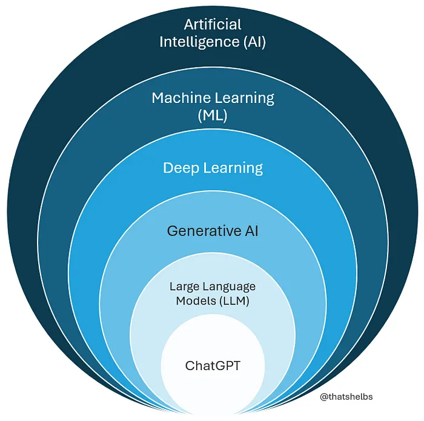
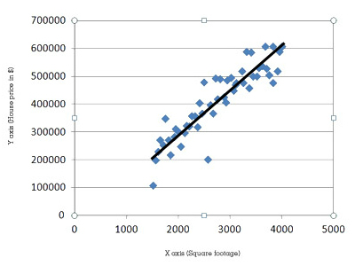
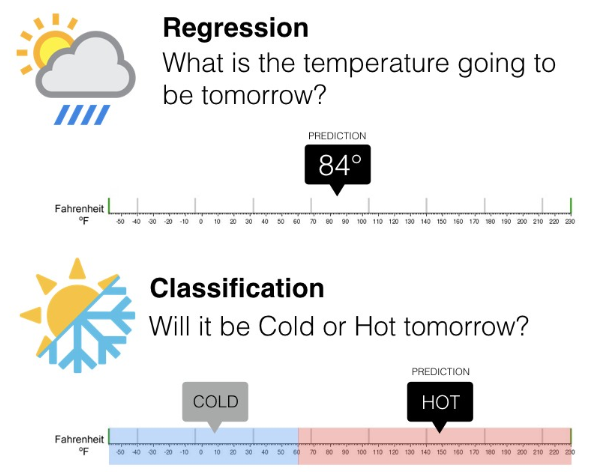
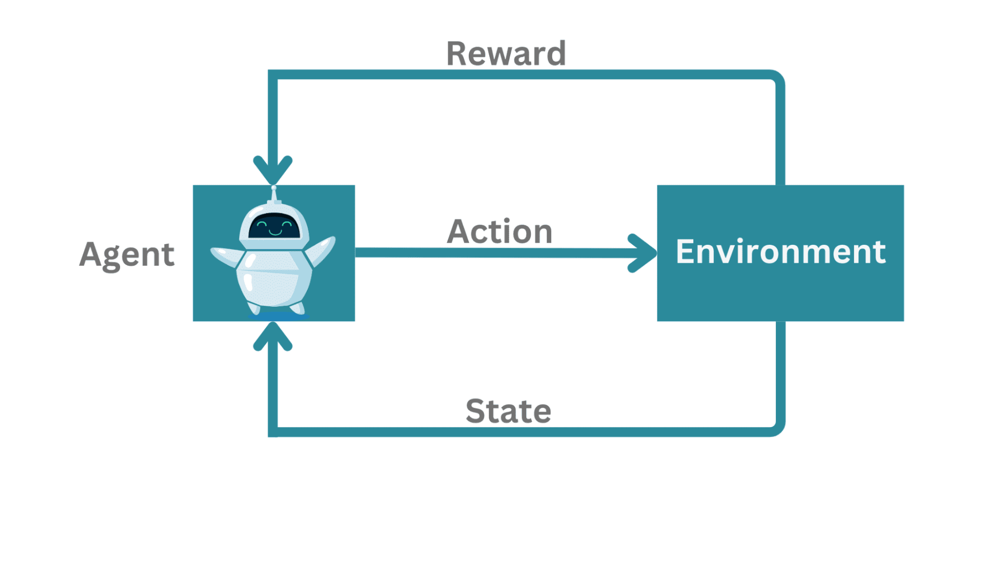

# Introduction to Machine Learning

## Learning Objective
AI is everywhere - from predicting what you’ll watch next to diagnosing diseases. But at the heart of it all lies Machine Learning (ML), the engine that helps systems learn from data. Before we dive deep into algorithms, it’s important to see where ML fits in the bigger picture and why it matters in today’s world.

This lesson places Machine Learning in the larger landscape of Artificial Intelligence, helping you understand what ML really is, where it’s used, and the different ways machines can learn from data. You’ll explore how ML allows computers to find patterns, make decisions, and improve with experience - all without being explicitly programmed for every rule.

## Learning Goals

By the end of this lesson, you’ll be able to:

- Understand how *Machine Learning* fits within Artificial Intelligence.  
- Explain why Machine Learning matters and where it’s applied.  
- Distinguish between **Supervised**, **Unsupervised**, and **Reinforcement Learning**.  
- Identify key differences between **classification**, **regression**, and **clustering** problems.  
- Match real-world examples to the correct type of learning.  
- Build intuition for how data, labels, and feedback shape the learning process.

## Why Machine Learning Matters

Think about the apps you use every day: Netflix suggesting the perfect series for your evening, your phone unlocking when it recognizes your face, Google Maps routing you around traffic, Instagram filling your feed with posts you actually enjoy, or Spotify building a mood-matching playlist. None of that is magic - it’s **Machine Learning**.

Machine Learning (ML) gives software the ability to learn patterns from data instead of only following explicit, hand-written rules. The more data we collect, the better these systems become at recognizing patterns, making predictions, and improving over time. For a developer or data enthusiast, ML is a way to add smart behavior to your projects: a chatbot that learns from conversations, a model that predicts house prices, or automation that reduces repetitive work. In short, ML helps your code move from fixed instructions to adaptable, data-driven behavior.

If you’re building software that would benefit from predictions, personalization, or automation, ML becomes a practical tool in your toolbox - not just a research topic. Throughout this course we’ll build intuition first, then show how to turn those ideas into working models you can use in real projects.

Watch:
To get an overview of what Machine Learning is and how it works, watch this short and engaging video: https://www.youtube.com/watch?v=QghjaS0WQQU

💭 **Check for Understanding**

**Question:**  
Which of the following best describes Machine Learning?

A. A process where computers are manually programmed for every possible situation.  
B. A method where computers learn from examples or data to make predictions.  
C. A database used to store information.  
D. A programming language used to build software.

 
Show Answer

✅ Answer: B

## Where Machine Learning Fits in the World of AI

Before we define Machine Learning precisely, let’s zoom out and understand where it fits within the broader world of **Artificial Intelligence**.

You’ve probably heard the terms **Artificial Intelligence (AI)**, **Machine Learning (ML)**, and **Deep Learning (DL)** used interchangeably - but they actually represent different layers of the same concept.

  

### Artificial Intelligence (AI)
AI is the **broadest field** - it focuses on building machines that can perform tasks requiring **human-like intelligence**, such as reasoning, planning, or understanding language. The main goal of AI is to create systems that can think, learn, and make decisions the way humans do.

### Machine Learning (ML)
Within AI lies **Machine Learning**, a specialized subset that gives machines the ability to **learn from data** and improve automatically through experience. Instead of being explicitly programmed for every rule, ML models learn patterns from past data and use them to make predictions or decisions.

###  Deep Learning (DL)
Going even deeper, **Deep Learning** is a branch of ML that uses structures called **neural networks** - algorithms inspired by how the human brain works, to process and learn from **vast amounts of data** such as images, text, and speech. Deep Learning powers many of today’s advanced AI systems - from voice assistants like **Siri**, to **facial recognition**, and **self-driving cars**.

**Watch this to understand Deep Learning in action:** https://www.youtube.com/watch?v=6M5VXKLf4D4

### Generative AI
**Generative AI** is a newer branch built on top of Deep Learning. Instead of just recognizing patterns, **it learns to create new content** such as text, images, audio, or even code, that resembles what humans might produce. It’s what powers tools like **DALL·E**, **Midjourney**, and **ChatGPT**. Generative AI models don’t just classify or predict - they *generate*, using patterns they’ve learned from massive datasets.

### Large Language Models (LLMs)
A subset of generative AI, **Large Language Models (LLMs)** are deep learning models trained on vast amounts of text to understand and generate human language. They predict the next word in a sentence based on context - a simple goal that, when scaled up with billions of parameters and massive data, results in systems capable of conversation, summarization, translation, and reasoning.  

### ChatGPT
**ChatGPT** is a practical example of an LLM - fine-tuned to carry out natural conversations, answer questions, and assist with a wide range of tasks. It represents how multiple layers of AI - from deep learning to generative modeling, come together to create an interactive AI system capable of producing human-like responses.

**If you want to understand this concept easily with a short video, check out:** [AI vs Machine Learning vs Deep Learning vs Generative AI](https://www.youtube.com/watch?v=qYNweeDHiyU)

### 💡 Key Insight: Start Simple, Scale Smart

Not every problem requires Deep Learning. In fact, most real-world problems can be solved with simpler, more interpretable methods that train faster, require less data, and are easier to debug. Think of machine learning algorithms as tools in a toolkit - you wouldn’t use a sledgehammer to hang a picture frame. Similarly, using deep learning for a problem that can be solved with simpler techniques is often overkill and counterproductive. The key is to match the complexity of your method to the complexity of your problem.

Many other practical problems such as predicting house prices, estimating delivery time, or classifying flowers in the Iris dataset - can be solved effectively using **simpler, classical ML models**. We’ll start with those, because understanding and interpreting these simpler models lays a strong foundation for exploring deeper, more complex systems later on.

## What Exactly Is Machine Learning?

Now that we know where ML fits, let’s define it clearly:

> **Machine Learning** is the study of computer algorithms that improve automatically through experience (data).

Think of it as teaching by example rather than by rule. Instead of giving the computer step-by-step instructions, we provide it with data and the desired outcomes. The computer then finds the **patterns** and builds its own rules - this set of learned rules is called a **model**.

### Comparison: Traditional Programming vs. Machine Learning

| **Traditional Programming** | **Machine Learning** |
|-----------------------------|----------------------|
| We write explicit rules. | The computer learns rules from data. |
| **Input + Rules → Output** | **Input + Output → Model (Rules)** |
| Example: `If age < 18 → "minor"` | Example: Learn from thousands of labeled examples to predict `"minor"` |

### 💬 Example
You want to recognize **cats in photos**.  
Instead of writing complex logic like:  
> “If there are whiskers + fur + two eyes + pointy ears = cat,”  

you feed hundreds of labeled photos (“cat,” “not cat”) into an ML model.  
The model learns patterns automatically - **edges**, **shapes**, **textures** and then predicts whether a new photo is a cat. 

For more real-world context, check out this great introductory article by IBM:https://www.ibm.com/think/topics/machine-learning 

## Types of Machine Learning

Machine Learning can be divided into several major types based on the kind of data available and what the model is trying to predict or discover.

Each type has its own purpose, learning process, and use cases. The main categories are:

1. **Supervised Learning**
2. **Unsupervised Learning**
3. **Reinforcement Learning**

🎥 **Want a quick visual overview before we dive deeper?**  
Check out this short video: https://www.youtube.com/watch?v=ZNrwlu7cvsI

We’ll start with **Supervised Learning**, which is the most common and widely used type in practical machine learning tasks.

**1. Supervised Learning**

Supervised machine learning is a type of artificial intelligence in which an algorithm learns to make predictions or decisions based on a labeled dataset. The "supervision" comes from the fact that the training data includes a known output, or "ground truth," which the algorithm uses to learn the correct relationship between inputs and outputs. 

The goal is to build a model that can accurately generalize and predict the output for new, unseen data. 

Think of it like a teacher guiding a student - the student learns from examples and correct answers until they can generalize on their own.

💡 *Real-World Analogy*

Imagine you’re teaching a child to identify fruits.
You show them pictures and say:

“This is an apple 🍎.”

“This is a banana 🍌.”

Over time, the child learns what features define an apple versus a banana.
That’s supervised learning - learning from labeled examples.

### Subtypes of Supervised Learning

Supervised learning problems are typically categorized into two main types based on the nature of the output variable: **Regression** and **Classification**.

**1.1 Regression**

**Regression** is a type of Supervised Learning used when the target variable is continuous, meaning it can take on any numerical value. In simple terms, regression helps us predict numbers like estimating a house’s price, tomorrow’s temperature, or a car’s fuel efficiency. When you hear “regression,” think of it as the model trying to find a relationship between two things, for example, a house’s size and its price.

Now, let’s look at a simple example. In the scatterplot below, each dot represents a house. The **x-axis** shows its size (in square feet) and the **y-axis** shows its sale price.

Now, notice how a single line passes through the cloud of points. This line helps us estimate the price of a new house we haven’t seen yet, based on its size. We draw one line that best fits the trend in the data, and that line becomes our **model**. The model learns a rule that maps inputs to a number. For a simple example with one feature (just size), this rule looks like a straight line, often written as:

\[
y = mx + b
\]

where `m` is the slope (how much price changes with size) and `b` is the intercept (the base value when size is zero).

In real-world cases, the model might use **many features** such as the number of bedrooms, location, and age and combine them to produce a single prediction: the **price**. The **vertical gaps** between each dot and the line represent errors, also called *residuals*. The best-fit line is the one that minimizes these errors on average, meaning it captures the overall trend of the data as closely as possible.

Regression is most useful when the **target output is a numerical value** rather than a category. A simple straight line is an excellent starting point because it’s easy to interpret and provides clear intuition.However, if the relationship between variables isn’t perfectly straight - for example, if prices don’t increase exactly in proportion to house size - the pattern is no longer purely linear. A **visualization** helps reveal whether a straight-line assumption makes sense or if we’ll need more flexible models later.

In upcoming lessons, we’ll actually fit this line using scikit-learn, examine the slope and intercept it learns, and measure how well it performs on unseen data.

**1.2 Classification**

Classification is a supervised learning task that categorizes data into discrete, predefined classes or labels. The model learns patterns in labeled training data to decide which category a new, unseen data point belongs to. Instead of a numerical value, the output is a qualitative label.

How it works:
The model learns from examples with known categories, then predicts which class a new observation belongs to.

Before we look at specific examples, it helps to understand that classification problems generally fall into two main types:

1. Binary Classification
2. Multi-Class Classification

With these categories in place, we’re now ready to look at each one more closely.

**1.2.1 Binary Classification**

Binary Classification is all about making a yes/no decision - the model chooses between two possible outcomes.

A great real-world example is *customer churn prediction*.

Imagine you run a subscription-based app, and you want to figure out which customers are likely to stay and which ones might leave soon. Instead of manually reviewing thousands of accounts, a model can learn to recognize the early warning signs.

To do this, we feed the model patterns from past customer behavior:
How often they log in, how many payments they’ve missed, whether they’ve contacted support recently, how long they’ve been subscribed, and so on.
Over time, the model begins to notice which patterns usually belong to customers who eventually cancel versus those who remain loyal. Once trained, the model looks at a new customer’s recent activity and makes a simple call:
“Will this customer churn or stay?”

Even though the prediction is just yes or no, the impact is huge. Companies can reach out with better support, special offers, or personalized nudges before a customer decides to leave.

**1.2.2 Multi-Class Classification**

Multi-class classification works the same way as binary classification, but instead of choosing between two outcomes, the model chooses from several possible categories.

A classic example is *Image Classification*. 

Think of showing the model a picture and asking it:
“Is this a cat, a dog, or a rabbit?”

At the very beginning, the model has no understanding of what any of these animals look like, the image is nothing more than thousands of pixel values. But as it trains on many examples, it starts to pick up patterns. It notices the shapes of ears, the textures of fur, the general outline of the body, and the color patterns that tend to appear with each type of animal. None of this is taught explicitly; the model discovers these differences by seeing enough labeled images and learning what makes each class visually distinct.

When you give the trained model a new picture, it doesn’t “recognize” the animal the way humans do. Instead, it analyzes the visual patterns in the pixels and compares them with the patterns it learned during training. Based on this comparison, it selects the category that feels most consistent with its experience.

You interact with this kind of system all the time: photo apps that group pictures by subject, plant-identification apps that guess the species from a snapshot, or tools that sort documents into different types. In each case, the idea is the same, the model looks at an input and decides which class it most likely belongs to. 

**Visual Comparison: Regression vs Classification**

To make the distinction clearer, take a look at this image:

This example shows how both models can approach the same problem differently:
- **Regression** predicts a *numerical value* - e.g., the exact temperature tomorrow might be **84°F**.
- **Classification** predicts a *category* - e.g., tomorrow will be **Hot** or **Cold**.

Notice how regression gives a *specific number*, while classification assigns a *label* based on learned thresholds.

**2. Unsupervised Learning**

Unsupervised learning is a machine learning technique that uses algorithms to analyze and cluster unlabeled datasets. 
In Unsupervised Learning, the data does not include any labels - there are no “right answers.” Instead, the model’s task is to discover hidden patterns, structures, or relationships in the data on its own.

**How it works:**

The algorithm is given raw, unlabeled data and must infer its own rules for organizing the information based on similarities, differences, and patterns. It is most useful for tasks involving data exploration and analysis. 

It’s like exploring a new city without a map. The model figures out how different areas (data points) connect or group together.

💡 *Real-World Analogy*

Imagine walking into a party where you know no one.
You naturally start observing people - noticing that some are talking about sports, others about technology, and some about art.

Without anyone telling you, you’ve grouped people into clusters based on behavior and interests.
That’s unsupervised learning.

### Subtypes of Unsupervised Learning

**2.1 Clustering** 

Clustering is one of the most popular techniques in unsupervised learning. It involves grouping similar data points together based on shared characteristics. 

*Example: Customer segmentation.*

A retailer can use clustering to group customers based on their purchasing behavior and demographics, enabling more targeted marketing strategies.

**2.2 Dimensionality Reduction**

This subtype focuses on simplifying data by reducing the number of features (dimensions) while keeping important information. It’s useful when dealing with high-dimensional datasets that are hard to visualize or process.

*Example: Music Preferences*

Imagine analyzing thousands of songs, each with features like tempo, pitch, loudness, energy, and rhythm complexity. **Dimensionality reduction** simplifies this data into just a few main components like “mood” or “energy level.” This helps Spotify cluster songs and create mood-based playlists.

**3. Reinforcement Learning**

Reinforcement Learning (RL) is one of the most fascinating and dynamic branches of Machine Learning. Unlike supervised learning, where a model learns from labeled examples, or unsupervised learning, where the goal is to find patterns in data, Reinforcement Learning is about learning through interaction.

In this paradigm, the learning system called an agent isn’t simply fed a dataset. Instead, it must explore, experiment, and learn from experience. The agent takes actions within an environment, observes what happens, and receives feedback in the form of rewards or penalties. Over time, it learns a strategy, or policy, that helps it make better decisions to maximize its long-term reward.

Think of it as how we humans (or animals) learn through trial and error. For example, learning to ride a bike or play a video game. At first, we make mistakes, but with each attempt, we improve based on the feedback we receive.

A simple way to visualize this concept is by imagining you’re teaching a dog new tricks. Every time the dog performs the right action like sitting on command, you give it a treat. If it doesn’t, there’s no treat. Over time, the dog learns that sitting leads to a positive outcome.

That’s reinforcement learning in its simplest form!

**How it works:**

At its core, the reinforcement learning process is a continuous feedback loop between the agent and its environment.

  

Here are the main components:

Agent: The learner and decision-maker (e.g., a software program or a robot).

Environment: The external world that the agent interacts with (e.g., a virtual game or the real world).

Actions: The choices the agent can make at each step.

Reward: The positive or negative feedback the agent receives after taking an action. 

Policy: The agent’s evolving strategy that maps situations to the best possible actions based on experience.

Each interaction between the agent and the environment follows a cycle:

- The agent observes the state of the environment. 
- It takes an action based on its current policy. 
- The environment responds with a new state and a reward (positive or negative).
- The agent updates its policy based on this feedback, improving its decision-making over time.

This process repeats thousands even millions of times, allowing the agent to learn optimal behavior through continuous feedback.

To get a clearer picture of how this works, you can watch this beginner-friendly video that visually demonstrates the process: https://www.youtube.com/watch?v=nIgIv4IfJ6s

**Real-world Applications:** 

- Self-driving cars: RL is used to make real-time driving decisions, such as accelerating, braking, and steering, in a complex and unpredictable environment like city traffic.

- Robotics: A robotic arm can be trained to pick and place objects by receiving rewards for successful actions. It learns the best way to manipulate objects through repeated trial and error.

- Gaming: AI agents trained with RL have achieved superhuman performance in complex games like chess and Go by learning optimal strategies through countless rounds of play against themselves. 

So far, we’ve seen how Reinforcement Learning enables agents to learn from rewards and penalties through trial and error.
But what if the environment is too complex to be represented by simple inputs?

That’s where *Deep Reinforcement Learning* steps in - combining the perception power of Deep Learning with the decision-making framework of RL.

**Deep Reinforcement Learning (DRL)**

Deep Reinforcement Learning (DRL) combines the decision-making power of Reinforcement Learning (RL) with the pattern-recognition strength of Deep Learning (DL) - creating a powerful system that can both understand complex environments and make intelligent decisions within them.

In traditional Reinforcement Learning, the agent learns through feedback in the form of rewards or penalties. However, this approach struggles when dealing with environments that are extremely complex or have a large state space, meaning there are too many possible situations for the agent to handle effectively.
Think of challenges like video games, robotics, or self-driving cars, where every frame or movement represents a new, high-dimensional state.

That’s where Deep Learning comes in.
By using deep neural networks to approximate the agent’s policy (how it chooses actions) or value function (how it evaluates situations), the model can process raw, high-dimensional inputs such as images, videos, or sensor data and still make effective decisions.

In essence, the neural network acts as the “brain” of the agent, enabling it to see, understand, and act - all at once.
Just like humans use their eyes and experience to interpret the world before deciding what to do next, a DRL agent uses deep networks to interpret data and choose the best possible actions.

*Example Applications:*

🎮 Game AI: Algorithms like Deep Q-Networks (DQN) learned to play Atari games directly from pixels, achieving human-level performance.

🚗 Autonomous Driving: DRL helps vehicles learn how to navigate safely by observing the environment and optimizing driving actions.

🤖 Robotics: Robots can learn complex motion control tasks such as grasping, balancing, or walking - purely through simulated experience.

**Key Takeaway:**

Deep Reinforcement Learning is a powerful hybrid that brings together learning from experience (RL) and understanding complex data (DL) - enabling machines to operate intelligently in highly dynamic environments.

💭 **Check for Understanding**
 
Q1. You have customer purchase data but no labels. You just want to find groups of customers who buy similar products.  
Which type of learning should you use?

A. Supervised Learning  
B. Unsupervised Learning  
C. Regression  
D. Reinforcement Learning  

 
Show Answer

✅ Answer: B

Q2. Which of the following is an example of supervised learning?

A. Grouping customers by buying patterns  
B. Predicting house prices based on data  
C. Teaching a robot to play chess  
D. Detecting new topics in a dataset  

 
Show Answer

✅ Answer: B

Q3. Which statement about Deep Learning is true?

A. It doesn’t require data  
B. It’s a subset of Machine Learning that uses neural networks  
C. It replaces classical ML completely  
D. It only works for text-based problems  

 
Show Answer

✅ Answer: B

Q4. A robot learns to walk by trying different movements and receiving positive feedback when it makes progress and negative feedback when it falls.

A. Supervised Learning  
B. Unsupervised Learning  
C. Regression  
D. Reinforcement Learning  

 
Show Answer
 ✅ Answer: D 

Q5. An AI agent learns to play chess by playing millions of games against itself, improving every time by rewarding winning moves and punishing losing ones - with a deep neural network guiding its strategy.
Which method does this describe?

A. Supervised Learning  
B. Unsupervised Learning  
C. Reinforcement Learning
D. Deep Reinforcement Learning 

 
Show Answer
 ✅ Answer: D  

## Lesson Summary

In this lesson, we uncovered where Machine Intelligence (MI) fits within the world of Artificial Intelligence (AI) and explored the key branches: Machine Learning, Deep Learning, and Reinforcement Learning. We learned how these approaches differ, when to use them, and why starting with simpler models often leads to smarter solutions.

You also saw that while AI is the broader goal of making machines “think,” Machine Learning is how they learn from data, and Deep Learning helps them see and understand complex patterns, pushing the boundaries of what machines can do.

As we move ahead, we’ll transition from theory to practice - stepping into one of the most powerful and beginner-friendly libraries in the ML world: Scikit-learn.

In the next lesson, we’ll explore the Scikit-learn ecosystem, understand its structure, and see how it serves as the foundation for implementing everything we’ve just learned from data preprocessing to building real models.

>“Now that you understand the landscape of Machine Learning, it’s time to open the toolbox and start creating.”
