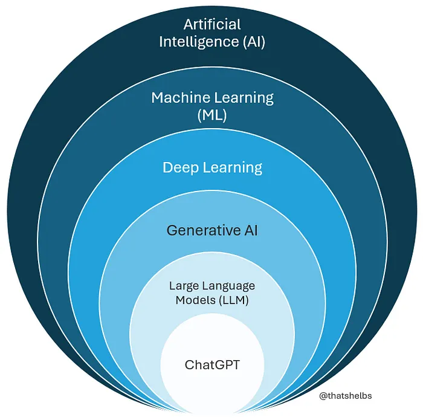

# Introduction to Machine Learning

## Learning Objective

AI is everywhere -- from predicting what you'll watch next to diagnosing diseases. At the heart of it all lies machine learning, the engine that helps systems learn from data. Before we dive deep into algorithms, it's important to see where ML fits in the bigger picture and why it matters in today's world.

Before we dive into coding with scikit-learn or building real models, this lesson serves as a big-picture, conceptual overview of where ML fits in the broader world of AI. Think of it as a low-resolution map of the field, an orientation to the landscape before we begin the hands-on work that comes next.

## Learning Goals

The goal here is to help you:

- Explain why machine learning matters and where it's applied.
- Understand how machine learning relates to artificial intelligence.
- Distinguish between *supervised*, *unsupervised*, and *reinforcement learning*.
- Identify key differences between *classification*, *regression*, and *clustering* problems.
- Match real-world examples to the correct type of learning.
- Build intuition for how data, labels, and feedback shape the learning process.

## Why Machine Learning Matters

Think about the apps you use every day: Netflix suggesting the perfect series for your evening, your phone unlocking when it recognizes your face, Google Maps routing you around traffic, Instagram filling your feed with posts you actually enjoy, or Spotify building a mood-matching playlist. None of that is magic -- it's *machine learning*.

Machine Learning (ML) gives software the ability to learn patterns from data instead of only following explicit, hand-written rules. The more data we collect, the better these systems become at recognizing patterns, making predictions, and improving over time.  ML helps your code move from fixed instructions to adaptable, data-driven behavior.

To get an overview of what machine learning is and how it works, watch this [short introductory video](https://www.youtube.com/watch?v=QghjaS0WQQU).

### Check for Understanding

Which of the following best describes machine learning?

A. A process where computers are manually programmed for every possible situation.
B. A method where computers learn from examples or data to make predictions.
C. A database used to store information.
D. A programming language used to build software.

 
Show Answer

Answer: B

## Where Machine Learning Fits in the World of AI

Before we define machine learning precisely, let's zoom out and understand where it fits within the broader world of artificial intelligence.

You've probably heard the terms *artificial intelligence (AI)*, *machine learning (ML)*, and *deep learning (DL)* used interchangeably -- but they are actually different levels in a hierarchy of concepts: DL is a subset of ML, and ML is a subset of AI.

  

### Artificial Intelligence (AI)

AI is the broadest field -- it focuses on building machines that can perform tasks that have traditionally required human-like intelligence, such as reasoning, planning, or understanding language. The main goal of AI is to create systems that can think, learn, and make decisions the way humans do.

### Machine Learning (ML)

Within AI lies *machine learning*, a specialized subset that gives machines the ability to learn from data and improve through experience. Instead of being explicitly programmed for every rule, ML models learn patterns from past data and use them to make predictions or decisions.

### Deep Learning (DL)
*Deep learning* is a branch of ML that uses structures called *neural networks* -- algorithms inspired by how the human brain works -- to process and learn from vast amounts of data such as images, text, and speech. Deep learning powers many of today's advanced AI systems -- from voice assistants like Siri, to facial recognition, and self-driving cars.

Watch: [Deep Learning in action](https://www.youtube.com/watch?v=6M5VXKLf4D4)

### Generative AI

*Generative AI* is a newer branch built on top of deep learning. Instead of just recognizing patterns, it learns to create *new* content -- text, images, audio, or even code -- that resembles what humans might produce. It's what powers tools like DALL-E, Midjourney, and ChatGPT. Generative AI models don't just classify or predict -- they *generate*, using patterns they've learned from massive datasets.

### Large Language Models (LLMs)

A subset of generative AI, *large language models (LLMs)* are deep learning models trained on vast amounts of text to understand and generate human language. They predict the next word in a sentence based on context -- a simple goal that, when scaled up with billions of parameters and massive data, results in systems capable of fluent conversation, summarization, translation, and reasoning.

### ChatGPT

ChatGPT is a practical example of an LLM -- fine-tuned to carry out natural conversations, answer questions, and assist with a wide range of tasks. It represents how multiple layers of AI -- from deep learning to generative modeling -- come together to create an interactive AI system capable of producing human-like responses.

For a concise visual overview, check out: [AI vs Machine Learning vs Deep Learning vs Generative AI](https://www.youtube.com/watch?v=qYNweeDHiyU)

### What tool to use?

Not every problem requires deep learning. In fact, most real-world problems can be solved with simple models that train faster, require less data, and are easier to debug. Think of machine learning algorithms as tools in a toolkit -- you wouldn't use a sledgehammer to hang a picture frame. Similarly, using deep learning for a problem that can be solved with simpler techniques is often overkill and counterproductive. 

Many practical problems -- predicting house prices, estimating delivery time, or classifying flowers in a picture -- can be solved effectively using *simpler, classical ML models*. We'll start with those, because understanding and interpreting these simpler models lays a strong foundation for exploring deeper, more complex systems later on.

## What Exactly Is Machine Learning?

Now that we know where ML fits, let's define it clearly:

> *Machine learning* is the study of computer algorithms that improve automatically through experience (data).

Think of it as teaching by example rather than by rule. Instead of giving the computer step-by-step instructions, we provide it with data and the desired outcomes. The computer then finds the patterns and builds its own rules -- this set of learned rules is called a *model*.

### Example

You want to recognize cats in photos. Instead of writing complex logic like "if there are whiskers + fur + two eyes + pointy ears = cat," you feed hundreds of labeled photos ("cat," "not cat") into an ML model. The model learns patterns automatically -- edges, shapes, textures -- and then predicts whether a new photo is a cat.

For more real-world context, check out this [introductory article by IBM](https://www.ibm.com/think/topics/machine-learning).

## Types of Machine Learning

Machine learning can be divided into several major types based on the kind of data available and what the model is trying to predict or discover. Each type has its own purpose, learning process, and use cases. The main categories are:

1. Supervised Learning
2. Unsupervised Learning
3. Reinforcement Learning

For a quick visual overview before we dive deeper, check out this [short video](https://www.youtube.com/watch?v=ZNrwlu7cvsI).

We'll start with *supervised learning*, which is the most common and widely used type in practical machine learning tasks.

## 1. Supervised Learning

Supervised machine learning is a type of artificial intelligence in which an algorithm learns to make predictions or decisions based on a labeled dataset. The "supervision" comes from the fact that the training data includes a known output, or "ground truth," which the algorithm uses to learn the correct relationship between inputs and outputs.

The goal is to build a model that can accurately generalize and predict the output for new, unseen data.

Think of it like a teacher guiding a student -- the student learns from examples and correct answers until they can generalize on their own. Imagine you're teaching a child to identify fruits. You show them pictures and say: "This is an apple." "This is a banana." Over time, the child learns what features define an apple versus a banana. That's supervised learning -- learning from labeled examples.

### Subtypes of Supervised Learning

Supervised learning problems are typically categorized into two main types based on the nature of the output variable: *regression* and *classification*.

### 1.1 Regression

*Regression* is a type of supervised learning used when the target variable is continuous, meaning it can take on any numerical value. In simple terms, regression helps us predict numbers like estimating a house's price or tomorrow's temperaturey. When you hear "regression," think of it as the model trying to find a relationship between two things, for example, a house's size and its price.

Now, let's look at a simple example. In the scatterplot below, each dot represents a house. The x-axis shows its size (in square feet) and the y-axis shows its sale price.

Notice how a single line passes through the cloud of points. This line helps us estimate the price of a new house we haven't seen yet, based on its size. We draw one line that best fits the trend in the data, and that line becomes our *model*. The model learns a rule that maps inputs to a number. For a simple example with one feature (just size), this rule looks like a straight line, often written as:

\[
y = mx + b
\]

where `m` is the slope (how much price changes with size) and `b` is the intercept (the base value when size is zero).

In real-world cases, the model might use many features -- such as the number of bedrooms, location, and age -- and combine them to produce a single prediction: the price. The vertical gaps between each dot and the line represent errors, also called *residuals*. The best-fit line is the one that minimizes these errors on average, meaning it captures the overall trend of the data as closely as possible.

Regression is most useful when the target output is a numerical value rather than a category. A simple straight line is an excellent starting point because it's easy to interpret and provides clear intuition. However, if the relationship between variables isn't perfectly straight -- for example, if prices don't increase exactly in proportion to house size -- the pattern is no longer purely linear. A visualization helps reveal whether a straight-line assumption makes sense or if we'll need more flexible models later.

### 1.2 Classification

Classification is a supervised learning task that categorizes data into discrete, predefined classes or labels. The model learns patterns in labeled training data to decide which category a new, unseen data point belongs to. Instead of a numerical value, the output is a qualitative label like "dog" or "cat".

The model learns from examples with known categories, then predicts which class a new observation belongs to.

**Binary classification** is about choosing between exactly two categories. A classic example is deciding whether a photo contains a cat or a dog. The model trains on thousands of labeled images and learns the patterns that distinguish the two -- shapes, textures, features. Given a new photo, it makes one call: cat or dog? That's it. The output is always one of two options.

**Multi-class classification** is when you have more than two categories. So you might have an image, and the classifier has to decide if it is a cat, dog, or rabbit. 

At the very beginning, the model has no understanding of what any of these animals look like -- the image is nothing more than thousands of pixel values. But as it trains on many examples, it starts to pick up patterns. It notices the shapes of ears, the textures of fur, the general outline of the body, and the color patterns that tend to appear with each type of animal. None of this is taught explicitly; the model discovers these differences by seeing enough labeled images and learning what makes each class visually distinct.

When you give the trained model a new picture, it doesn't "recognize" the animal the way humans do. Instead, it analyzes the visual patterns in the pixels and compares them with the patterns it learned during training. 

You interact with this kind of system all the time: photo apps that group pictures by subject, plant-identification apps that guess the species from a snapshot, or tools that sort documents into different types. In each case, the idea is the same -- the model receives input values, and its output is its prediction of which class it most likely belongs to.

#### Visual Comparison: Regression vs. Classification

To make the distinction clearer, take a look at this image:

This example shows how both models can approach the same problem differently:

- *Regression* predicts a *numerical value* -- e.g., the exact temperature tomorrow might be 84 degrees F.
- *Classification* predicts a *category* -- e.g., tomorrow will be "Hot" or "Cold".

Notice how regression gives a specific number, while classification assigns a label based on learned thresholds.

## 2. Unsupervised Learning

Unsupervised learning is a machine learning technique where the data has no ground-truth labels. There are no right or wrong answers for the model to learn from. Instead, the goal is for the algorithm to discover patterns, structures, or groups on its own.

The algorithm receives raw data and must organize it based on similarities and differences. This makes unsupervised learning especially useful for data exploration and finding hidden structure in a dataset.

Two of the most common types of unsupervised learning are *clustering* and *dimensionality reduction*.

### 2.1 Clustering

Clustering means grouping together data points that are similar to one another.

Think about walking into a party where you do not know anyone. You start noticing that:

- one group is talking about sports
- another group is talking about tech
- another is talking about art

No one labeled these groups for you. You naturally discovered the groups by noticing patterns. That is what clustering algorithms do.They group similar data points together based on the intrinsic structure of the dataset. We will see a practical example of a clustering algorithm (using scikit-learn) in the next lesson.

### 2.2 Dimensionality Reduction

Sometimes a dataset has so many columns (features) that it becomes difficult to visualize, slow to process, or hard to reason about. Dimensionality reduction simplifies the dataset by reducing the number of features while preserving the important structure.

Imagine you have an extremely high-resolution photo with millions of pixels (features). You can compress the image and still recognize the main shapes and colors, you can still "see" your friend's face. Even though the final image has fewer pixels, the essential information remains.

That's the idea behind dimensionality reduction: we reduce the number of features while keeping the core patterns. This helps us visualize high-dimensional data, speed up models, and uncover structure hidden across many dimensions.

We will explore one popular technique, PCA (Principal Component Analysis), next week using scikit-learn. It is a very important preprocessing and feature engineering technique. 

## 3. Reinforcement Learning

Reinforcement Learning (RL) is one of the most fascinating and dynamic branches of machine learning. Reinforcement learning derives from the study of how animals learn to adaptively interact with the world via trial and error.  Reinforcement learning is about *agents learning through interaction with an environment*. 

In this paradigm, the learning system -- called an *agent* -- isn't simply fed a dataset. Instead, it must explore, experiment, and learn from experience. The agent takes actions within an *environment*, observes what happens, and receives feedback in the form of rewards or penalties. Over time, it learns a *policy*, a strategy that helps it make better decisions to maximize its long-term reward.

We will not be doing hands-on activities with RL in Python 200, but it is important to know about this branch of ML. It is used to train many AI systems such as ChatGPT. 

Think of it as how we humans (or animals) learn through trial and error. For example, learning to ride a bike or play a video game -- at first, we make mistakes, but with each attempt, we improve based on the feedback we receive.

A simple way to visualize this concept is by imagining you're teaching a dog new tricks. Every time the dog performs the right action like sitting on command, you give it a treat. If it doesn't, there's no treat. Over time, the dog learns that sitting leads to a positive outcome.

At its core, the reinforcement learning process is a continuous feedback loop between the agent and its environment.

  

Here are the main components:

- *Agent*: The learner and decision-maker (e.g., a software program or a robot).
- *Environment*: The external world that the agent interacts with (e.g., a virtual game or the real world). At any given time, the environment is in some state.
- *Actions*: The choices the agent can make at each step.
- *Reward*: The positive or negative feedback the agent receives after taking an action.
- *Policy*: The agent's evolving strategy that maps situations to the best possible actions based on experience.

Each interaction between the agent and the environment follows a cycle: the agent observes the state of the environment, takes an action based on its current policy, and the environment responds with a new state and a reward (positive or negative). The agent updates its policy based on this feedback, improving its decision-making over time. This process repeats thousands -- even millions -- of times, allowing the agent to learn optimal behavior through continuous feedback.

To get a clearer picture of how this works, watch this [beginner-friendly video on reinforcement learning](https://www.youtube.com/watch?v=nIgIv4IfJ6s).

Real-world applications include:

- Self-driving cars: RL is used to make real-time driving decisions, such as accelerating, braking, and steering, in a complex and unpredictable environment like city traffic.
- Robotics: A robotic arm can be trained to pick and place objects by receiving rewards for successful actions. It learns the best way to manipulate objects through repeated trial and error.
- Gaming: AI agents trained with RL have achieved superhuman performance in complex games like chess and Go by learning optimal strategies through countless rounds of play against themselves.

Reinforcement learning can be combined with large neural networks (discussed above) to yield cutting-edge *deep reinforcement learning* approaches, which can yield extremely powerful robotic agents. 

## Check for Understanding

*Q1.* You have customer purchase data but no labels. You just want to find groups of customers who buy similar products. Which type of learning should you use?

A. Supervised Learning
B. Unsupervised Learning
C. Regression
D. Reinforcement Learning

 
Show Answer

Answer: B

*Q2.* Which of the following is an example of supervised learning?

A. Grouping customers by buying patterns
B. Predicting house prices based on data
C. Teaching a robot to play chess
D. Detecting new topics in a dataset

 
Show Answer

Answer: B

*Q3.* Which statement about deep learning is true?

A. It doesn't require data
B. It's a subset of machine learning that uses neural networks
C. It replaces classical ML completely
D. It only works for text-based problems

 
Show Answer

Answer: B

*Q4.* A robot learns to walk by trying different movements and receiving positive feedback when it makes progress and negative feedback when it falls. Which type of learning is this?

A. Supervised Learning
B. Unsupervised Learning
C. Regression
D. Reinforcement Learning

 
Show Answer

Answer: D

*Q5.* An AI agent learns to play chess by playing millions of games against itself, improving every time by rewarding winning moves and punishing losing ones -- with a deep neural network guiding its strategy. Which method does this describe?

A. Supervised Learning
B. Unsupervised Learning
C. Reinforcement Learning
D. Deep Reinforcement Learning

 
Show Answer

Answer: D

## Lesson Summary

In this lesson, we covered where machine learning fits within the world of artificial intelligence and explored the key branches: machine learning, deep learning, and reinforcement learning. We learned how these approaches differ, when to use them, and why starting with simpler models often leads to smarter solutions.

You also saw that while AI is the broader goal of making machines "think," machine learning is how they learn from data, and deep learning helps them see and understand complex patterns, pushing the boundaries of what machines can do.

As we move ahead, we'll transition from theory to practice -- stepping into one of the most powerful and beginner-friendly libraries in the ML world: scikit-learn.

In the next lesson, we'll explore the scikit-learn ecosystem, understand its structure, and see how it serves as the foundation for implementing everything we've just learned -- from data preprocessing to building real models.

> "Now that you understand the landscape of machine learning, it's time to open the toolbox and start creating."
