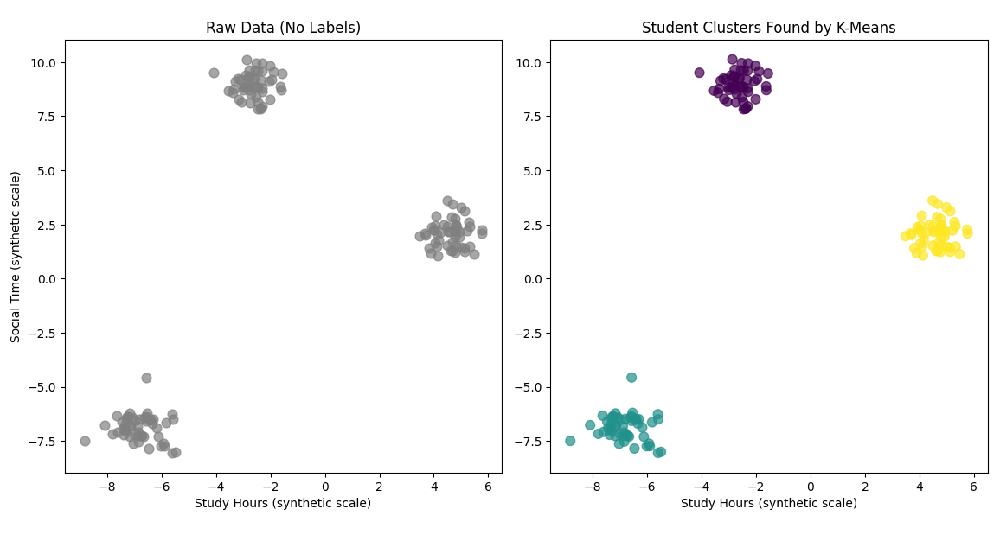

# Introduction to scikit-learn
If you'd like more practice with scikit-learn basics before or after looking over the material here, check out the following resources: 

- [scikit-learn crash course (YouTube)](https://www.youtube.com/watch?v=SW0YGA9d8y8)
- [scikit-learn tutorial for beginners (YouTube)](https://www.youtube.com/watch?v=SIEaLBXr0rk)

## Why learn scikit-learn?

When you start doing machine learning in Python, the first tool most professionals reach for is *scikit-learn* (often imported as `sklearn`). It's the go-to library for *classical ML* -- the kind that works on tables, CSVs, and structured data. It's free and open source, beautifully designed, and one of the best-maintained projects in the Python ecosystem. Before moving on to deep-learning frameworks like PyTorch, it's important to understand how things work in scikit-learn -- because nearly every modern ML project builds on these same ideas.

## What you'll learn today

By the end of this lesson, you'll be able to:

1. Explain why scikit-learn is such a core part of the ML toolkit.
2. Recognize the core API pattern every scikit-learn model follows: `create → fit → predict`.
3. Try a quick demo of *K-Means clustering*, an unsupervised algorithm that finds patterns without being told what's right or wrong.

## The scikit-learn API

`scikit-learn` is built on top of NumPy, SciPy, and Matplotlib, and gives you tools for nearly every classical ML task:

- Supervised learning -- predicting labels from examples *(e.g., spam vs not-spam, house-price prediction)*
- Unsupervised learning -- finding structure without labels *(e.g., clustering similar records, reducing data dimensions)*
- Utilities -- preprocessing data, splitting into train/test sets, evaluating models, and building pipelines that keep your workflow tidy

What is great about the package is that every model, from a simple linear regression to a random forest, follows the same basic pattern: 

```python
model = ModelClass()                      # 1. Create
model.fit(X_data, y_data)                 # 2. Learn from data
y_predictions = model.predict(X_test)     # 3. Predict on new inputs
```

That `create → fit → predict` pattern is what makes scikit-learn so pleasant to use -- once you learn it, you can apply it to almost any algorithm.

If you'd like to explore the official documentation (highly recommended!), visit: [scikit-learn.org](https://scikit-learn.org/stable/)

### Seeing the API in action

Let's warm up with a tiny example. Imagine you own a bakery and want to predict cupcake sales based on the temperature outside. We'll use *linear regression* for that. We'll take a deeper dive into linear regression in the next lesson. Don't worry about the details, we're just looking at the pattern here.

```python
from sklearn.linear_model import LinearRegression
import numpy as np

# temperature (degrees C) vs cupcakes sold
x_values = np.array([15, 18, 21, 24, 27]).reshape(-1, 1)
print(x_values.shape, x_values.ndim)
y_values = np.array([150, 200, 240, 310, 400])
new_x = np.array([17, 22]).reshape(-1, 1)

model = LinearRegression()                    # 1. create model
model.fit(x_values, y_values)                 # 2. fit model to data (learn)
y_predicted = model.predict(new_x)            # 3. predict with new data
print(y_predicted)  
```

```text
[178.67, 280.33]
```

So on a 17 degree C day, our model predicts we'll sell about 179 cupcakes, and on a 22 degree day about 280! This pattern -- `create → fit → predict` -- is an extremely common pattern with scikit-learn.

You may wonder why we reshaped the 1d array of input (x) values, which converted the initial array into a 2d array with a single feature (temperature). In scikit-learn, the input X must always be a 2D array with shape `(num_samples, num_features)`, even if you only have one feature. A 1D array like `np.array([1, 2, 3])` would have caused an error (feel free to try it). If you have a single feature, use `.reshape(-1, 1)` to convert it into a 2D array before calling `.fit()` or `.predict()`.

## Demo -- K-Means clustering (unsupervised learning)
Now let's look at an example where the model finds patterns without any supervision. As discussed in [Intro to ML](01_machine_learning.md) this is known as *unsupervised learning*. There is a nice video that goes over similar material here: https://www.youtube.com/watch?v=hBHoEbZohI0

K-Means clustering works by grouping points that are close together in feature space, iteratively adjusting cluster centers until the groupings stabilize. The details aren't important here -- what matters is the idea: give it unlabeled data, tell it how many clusters to find, and it figures out the rest.

Imagine you're analyzing student behavior data: how much time each student spends studying versus socializing. You suspect there are a few natural groups -- maybe students who study a lot, students who balance both, and students who prioritize social time -- but you don't know in advance who belongs where. We'll use *K-Means clustering* to discover those groups automatically.

One important note before we start: the data below is synthetic, generated by `make_blobs()` to produce three well-separated clusters. The numeric values don't correspond to actual hours -- they're on an arbitrary scale chosen to make the clusters clearly visible. In a real project you'd use real data, but synthetic data is great for learning how things work.

```python
from sklearn.cluster import KMeans
from sklearn.datasets import make_blobs
import matplotlib.pyplot as plt

# Synthetic student data with 3 natural groups.
# Values are on an arbitrary scale -- not real hours.
X, _ = make_blobs(n_samples=150, centers=3, cluster_std=0.6, random_state=42)
print(X.shape)

fig, (ax1, ax2) = plt.subplots(1, 2, figsize=(12, 5))

# Left plot: the raw, unlabeled data as the algorithm first sees it
ax1.scatter(X[:, 0], X[:, 1], color='gray', s=60, alpha=0.7)
ax1.set_title("Raw Data (No Labels)")
ax1.set_xlabel("Study Hours (synthetic scale)")
ax1.set_ylabel("Social Time (synthetic scale)")

# Right plot: what K-Means discovers
kmeans = KMeans(n_clusters=3, random_state=42)  # 1. Create the model
kmeans.fit(X)                                    # 2. Fit -- find cluster centers
labels = kmeans.predict(X)                       # 3. Predict a label for each point

ax2.scatter(X[:, 0], X[:, 1], c=labels, cmap='viridis', s=60, alpha=0.7)
ax2.set_title("Student Clusters Found by K-Means")
ax2.set_xlabel("Study Hours (synthetic scale)")

plt.tight_layout()
plt.show()
```
You will see something like this:



The left plot shows exactly what K-Means sees when it starts: a cloud of undifferentiated points. The right plot shows what it finds: three distinct groups, each colored differently. K-Means figured out which points belong together based purely on the data -- without you ever telling it what the groups should mean. That interpretation (are these "studious," "balanced," and "social" students?) is still up to you!

## Key takeaways

*scikit-learn* is the foundation of most everyday ML projects in Python. Its consistent `create → fit → predict` API makes it easy to experiment with different algorithms -- the same code structure works whether you're fitting a linear regression or a random forest. Supervised learning uses labeled data to make predictions; unsupervised learning finds structure in data that has no labels. K-Means is one concrete example of the latter.

## Next steps

In the next lesson we'll build on this foundation by training our first real model -- a linear regression on housing data -- and learning how to evaluate whether it actually works.


