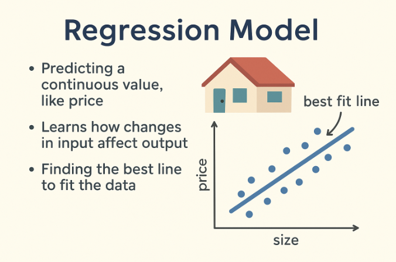
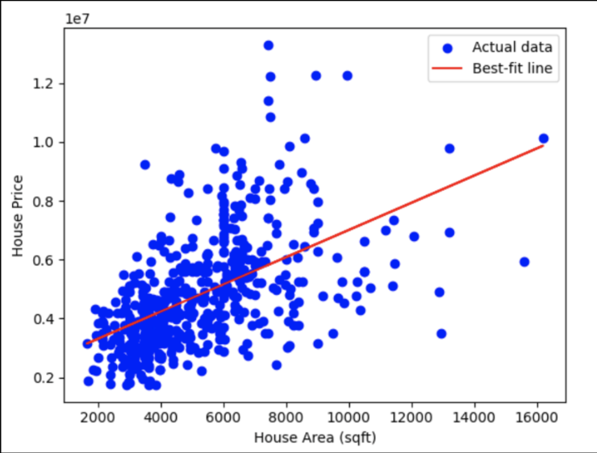
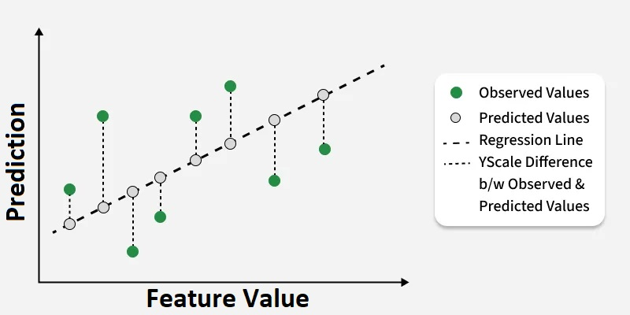
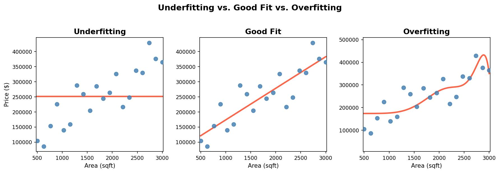

# Linear Regression

For a helpful overview before diving in: [Linear Regression explained (YouTube)](https://youtu.be/ukZn2RJb7TU?si=Jz65OxZeGuUKDbO7)

### Recap

In week 1 we explored *correlation* -- a way to measure how strongly two variables move together. This week we shift from measuring relationships to modeling them. You have also seen the scikit-learn `create → fit → predict` workflow. This lesson brings those ideas together with a close look at *regression* -- the kind of ML problem where the goal is to predict a continuous number.

We will build a regression model step by step using a synthetic housing dataset, starting with one predictor and gradually extending to multiple variables so you can see clearly how the model grows.

## What is a Regression Model?

A regression model is used when we want to predict a *continuous value* -- a number that can take on any value in a range, like a price, a temperature, or a duration. In all these cases, the answer is a number rather than a label, and that is what distinguishes regression from classification.

## The Intuition Behind Regression

Suppose we want to predict the price of a house. One obvious factor is *the size of the house in square feet*.



Imagine plotting that data with house size on the x-axis and price on the y-axis. Each house becomes a point in that scatterplot, and you will usually see a trend: bigger houses tend to cost more. The goal of linear regression is to draw a straight line through that cloud of points that best captures the trend. That line lets us answer questions like "If a house is 1800 square feet, what price should we expect?" -- and that is where machine learning becomes useful.

The *steepness* of the line (the slope) tells us how much price increases for every additional square foot. scikit-learn finds that line automatically.

## Fitting a Line Through Points

The `create → fit → predict` workflow works the same way for regression. Let's see it with a minimal synthetic example before moving to more realistic examples.

```python
import numpy as np
import matplotlib.pyplot as plt
from sklearn.linear_model import LinearRegression

np.random.seed(42)
sqft = np.linspace(500, 3000, 50).reshape(-1, 1)
price = 150 * sqft.ravel() + np.random.normal(0, 40000, 50)

model = LinearRegression()       # 1. create
model.fit(sqft, price)           # 2. fit
predicted = model.predict(sqft)  # 3. predict

print("Slope:", model.coef_[0])
print("Intercept:", model.intercept_)

plt.scatter(sqft, price, color="blue", alpha=0.5, label="Data")
plt.plot(sqft, predicted, color="red", label="Linear fit")
plt.xlabel("Square Feet")
plt.ylabel("Price ($)")
plt.legend()
plt.show()
```



Each blue dot is one house; the red line is what the model learned. The slope should be close to 150 -- the true relationship we baked into the data. Even with noise, the model recovers the trend cleanly. That is the core idea: linear regression finds the straight line that best describes the relationship between an input and an output.

Now let's apply this to a more realistic dataset, and along the way introduce the tools we need to evaluate a model properly.

## Working with a Synthetic Housing Dataset

We will use a synthetic dataset of 500 house sales with four columns:

`sqft` -- size of the house in square feet, ranging from about 600 to 3000.
`distance` -- distance from the city center in miles.
`is_new` -- 1 if the home was recently built, 0 if older.
`price` -- sale price in dollars.

The data was designed to be somewhat realistic and illustrate the core concepts in regression. Let's load it and take a quick look.

```python
import pandas as pd
import numpy as np
from sklearn.linear_model import LinearRegression
from sklearn.model_selection import train_test_split
from sklearn.metrics import mean_squared_error, r2_score

df = pd.read_csv("resources/synthetic_housing_data.csv")
print(df.head())
print(df.describe())
```

`df.describe()` gives you the value ranges for each column and confirms there are no missing values -- both important things to check before modeling.

## Simple Linear Regression: sqft → price

We start with the simplest possible case: a single predictor where we will predict price from square footage alone. The model learns one equation:

price = slope × sqft + intercept

### Define Features and Target

```python
X = df[["sqft"]]   # 2D -- scikit-learn expects features as a DataFrame or 2D array
y = df["price"]
```

### Train-Test Split

Before we fit anything, we need to talk about evaluation. When we train a model, we want to know how well it performs on *new* data -- data it has never seen. Without that check, we have no way to know whether the model is genuinely learning the pattern or just memorizing the training examples.

Think of it like studying for an exam: you practice on notes and homework (*training*), then the real exam tests you on questions you have not seen before (*testing*). In machine learning, we simulate this by splitting the dataset into two parts before training. The *training set* is what the model learns from. The *test set* is held aside to check how well the model generalizes. We will use 80% for training and 20% for testing.

Luckily, scikit-learn has built-in tools for splitting data into testing and training subsets. This is an extremely important idea, that you will see time and time again in ML and other contexts.

```python
X_train, X_test, y_train, y_test = train_test_split(
    X, y, test_size=0.2, random_state=42
)
```

`random_state=42` makes the split repeatable -- you will get the same assignment of rows every time you run the code.

Create the model, come up with the best fit, and predict values on the test data:

```python
model = LinearRegression()
model.fit(X_train, y_train)
y_pred = model.predict(X_test)
```

Inspect the learned parameters

```python
print("Slope:", model.coef_[0])
print("Intercept:", model.intercept_)
```

The *slope* is the most important number here. It tells you how much the predicted price increases for each additional square foot, all else being equal. With this dataset the slope comes out around $107 -- meaning the model predicts roughly a $107 increase in price for each additional square foot.

The *intercept* is the predicted price when sqft is 0 -- not meaningful in this context (no real house has zero square footage), but mathematically required to define a line.

### Evaluate: RMSE and R²
The above yielded the best fitting line, but how can we tell how *good* the model is?  There are a couple of measures that are common in regression contexts, RMSE and R-squared. For reasons stated above, we evaluate how good the model is on the data that it was not trained on, on the *test* data:

```python
rmse = np.sqrt(mean_squared_error(y_test, y_pred))
r2 = r2_score(y_test, y_pred)

print("RMSE:", rmse)
print("R²:", r2)
```


#### Root Mean Squared Error (RMSE)
The most natural question to ask is: how far off are our predictions? For each house in the test set, we could compute the difference between the predicted price and the actual price. 

Image from Geeks for Geeks:


But if we average those raw differences, positive and negative errors cancel each other out -- a $10,000 overprediction and a $10,000 underprediction would average to zero, making the model look perfect when it is not.

The standard fix is to square each error before averaging. Squaring does two things: it makes every error positive, and it penalizes large errors more heavily than small ones -- a prediction that is $20,000 off contributes four times as much to the average as one that is $10,000 off. This quantity is *MSE* (Mean Squared Error).

The catch is that squaring changes the units. If house prices are in dollars, MSE ends up in dollars², which is not intuitive to report or explain.

To fix the units problem, we take the square root of MSE. The result is *RMSE* -- Root Mean Squared Error:

$$
\text{RMSE} = \sqrt{\text{MSE}}
$$

RMSE keeps the penalty for large errors while returning the result to the same units as the target. The interpretation is direct: with square footage as the only predictor, this model's RMSE comes out around $42,000 -- meaning predictions are typically off by about $42,000. That is a real number you can reason about. It also tells us there is a lot of variation in price that sqft alone cannot explain, which motivates adding more features.

#### R²
R² answers a different question: how much better is the model than simply predicting the mean price every time (the baseline)? It is defined as:

$$
R^2 = 1 - \frac{\text{Model MSE}}{\text{Baseline MSE}}
$$

An R² of 1.0 means perfect predictions. An R² of 0.0 means the model does no better than guessing the mean. Despite the name, R² is *not* defined as a mathematical square -- it is one minus a ratio of errors. That is why R² can be negative: if the model performs worse than predicting the mean on test data (which happens when a model has overfit the training set), the ratio exceeds 1.0 and R² drops below zero. 

> On *training* data, R² is always non-negative, because the fitted line is guaranteed to do at least as well as just estimating the average.

#### Connecting R² to Correlation

There is a direct connection between R² and the Pearson correlation coefficient r that you computed in week 1: in simple linear regression with one feature, R² equals the square of the correlation between that feature and the target. Let's verify it directly:

```python
corr_coeff = df["sqft"].corr(df["price"])
print("Correlation coefficient:", corr_coeff)
print("Correlation coefficient squared:", corr_coeff ** 2)
```

Compare `corr_coeff ** 2` to the R² you computed above -- they should be very close. This is the numerical bridge between week 1 and week 2. 

## Adding Distance as a Second Feature

Here is where things get much more powerful. 🏠

Everything we just did -- the split, the fit, the evaluation -- used a single column of data. `X` was a (500, 1) array: 500 houses, one feature each. What happens if we just... add another column?

That is it. That is the whole move. We pass `X` with two columns instead of one, and the *exact same* `LinearRegression()` model, the *exact same* `.fit()` call, and the *exact same* evaluation code all work without any modification. scikit-learn figures out that there are now two features and adapts automatically. You do not change a single line of the training or evaluation code.

What changes is the geometry. With one feature, the model fit a straight line in two dimensions (sqft on one axis, price on the other). With two features, it fits a *plane* in three dimensions -- sqft, distance, and price each get an axis, and the plane tilts to best match all 500 houses at once. That may sound more complex, but the equation is still just addition and multiplication:

price = b1 × sqft + b2 × distance + c

No curves, no tricks. The model is still *linear* -- a linear combination of the features. And because linear algebra generalizes naturally to higher dimensions, this same approach scales to 10 features, 100 features, or more, with the same code every time. That is one of the reasons linear regression remains one of the most powerful and widely used tools in data science. We are not going to worry about this mathematical voodoo wizardry here, but it is one of the best worked-out fields in mathematics, so we are resting on good foundations here. 

Houses closer to the city center typically sell for more, so `distance` should have a negative coefficient -- more miles means lower price. Let's see.

```python
X_multi = df[["sqft", "distance"]]   # now (500, 2): 500 houses, 2 features each

X_train_m, X_test_m, y_train_m, y_test_m = train_test_split(
    X_multi, y, test_size=0.2, random_state=42
)

model_multi = LinearRegression()
model_multi.fit(X_train_m, y_train_m)

print("R²:", model_multi.score(X_test_m, y_test_m))
print("Area coefficient:    ", model_multi.coef_[0])
print("distance coefficient:", model_multi.coef_[1])
```
Check out the coefficients (slopes) for the two features: does it match your expectations?

What about R²? It has the same meaning in higher dimensions as well. How much better does the model do than when you just use the baseline (mean). The R² should be higher than the single-feature model -- adding a relevant predictor almost always helps. The `sqft` coefficient tells you how much price increases per square foot while holding distance constant; the `distance` coefficient (likely negative) tells you how much price drops per additional mile from the city center while holding sqft constant.

This is the essential idea of multiple regression: each coefficient tells you about one feature's relationship with the outcome while the model accounts for all the others.

## Adding a Binary Feature: is_new

Our dataset also records whether a home is newly built. Let's add `is_new` and fit a third model. This is a categorical feature (0/1). Binary (0/1) variables slot naturally into linear regression -- no special encoding is required. The coefficient for a binary variable is interpreted as the shift in the predicted outcome when that variable goes from 0 to 1, with all other features held constant.

Our new model is: 

price = b1 × sqft + b2 × distance + b3 x is_new +  c

Let's check it out:

```python
X_multi2 = df[["sqft", "distance", "is_new"]]

X_train_m2, X_test_m2, y_train_m2, y_test_m2 = train_test_split(
    X_multi2, y, test_size=0.2, random_state=42
)

model_multi2 = LinearRegression()
model_multi2.fit(X_train_m2, y_train_m2)

print("R²:", model_multi2.score(X_test_m2, y_test_m2))
print("sqft coefficient:     ", model_multi2.coef_[0])
print("distance coefficient: ", model_multi2.coef_[1])
print("is_new coefficient:   ", model_multi2.coef_[2])
```

The `is_new` coefficient gives you the average price premium for a new home, holding square footage and distance constant. With this dataset it comes out around $27,500 -- the model predicts that new homes sell for roughly $27,500 more than otherwise comparable older homes in the same location and size range.


### On overfitting

Overfitting happens when a model learns the training data *too well* -- so well that it memorizes the noise rather than the underlying pattern. The image below illustrates what this looks like visually. With too little flexibility (left panel), the model misses the real trend entirely. With just enough flexibility (middle), it captures the trend without chasing every fluctuation. With too much flexibility (right), the curve bends and twists to pass near every training point -- but that curve represents noise, not reality.



The key diagnostic is the gap between train R² and test R². A model that has overfit will score well on training data and poorly on new data. The more dramatic the gap, the worse the overfit.

To see this clearly, we can use a small synthetic dataset where overfitting is easy to induce. With only 30 points and a degree-10 polynomial -- which adds 10 columns of features (x, x², x³, all the way to x¹⁰) -- the model has far more flexibility than the data can support.

```python
from sklearn.preprocessing import PolynomialFeatures

np.random.seed(0)
n = 30
X_demo = np.sort(np.random.uniform(0, 10, n)).reshape(-1, 1)
y_demo = 2 * X_demo.ravel() + np.random.normal(0, 3, n)

X_train_d, X_test_d, y_train_d, y_test_d = train_test_split(
    X_demo, y_demo, test_size=0.3, random_state=42
)

model_lin = LinearRegression().fit(X_train_d, y_train_d)

poly = PolynomialFeatures(degree=10, include_bias=False)
X_poly_d = poly.fit_transform(X_demo)
X_train_p, X_test_p, y_train_p, y_test_p = train_test_split(
    X_poly_d, y_demo, test_size=0.3, random_state=42
)
model_poly = LinearRegression().fit(X_train_p, y_train_p)

print("Linear    -- Train R²:", model_lin.score(X_train_d, y_train_d))
print("Linear    -- Test R²: ", model_lin.score(X_test_d, y_test_d))
print("Degree-10 -- Train R²:", model_poly.score(X_train_p, y_train_p))
print("Degree-10 -- Test R²: ", model_poly.score(X_test_p, y_test_p))
```

```text
Linear    -- Train R²: 0.6617   Test R²:  0.6690
Degree-10 -- Train R²: 0.7614   Test R²: -2.1644
```

The linear model shows a small, healthy gap -- train and test R² are nearly identical (0.66 and 0.67), meaning the model generalizes well. The degree-10 model trains slightly better (0.76 vs 0.66), but collapses completely on the test set: R² = -2.16.

A negative R² means the degree-10 model is *worse than just predicting the mean for every point*. It has memorized the specific wiggles of the training data so precisely that its predictions on new data are actively harmful. This is what overfitting looks like when you measure it rather than just imagine it.

The goal is always a model that finds the right level of complexity: expressive enough to capture the real trend, but not so flexible that it memorizes noise. Comparing train R² and test R² is your first and most useful diagnostic. Linear regression is often the first model you reach for precisely because it is so constrained -- a line or a plane does not have enough flexibility to memorize noise, which makes it naturally resistant to overfitting. More powerful models will give you more flexibility, but they will also require more care.

## Pulling It Together

It is worth pausing to consolidate what we have built across this lesson.

"Linear" in linear regression means the prediction is a *linear combination* of the features: each feature is multiplied by its coefficient and the results are summed. A model with ten features is still linear regression; the decision surface is just a hyperplane in ten dimensions instead of a line in two.

R² continues to measure the fraction of variance in the target that the model explains, regardless of how many features are in the model. In the one-feature case it has a clean numerical connection to the Pearson correlation between that feature and the target. In the multi-feature case that connection no longer holds, but R² remains a useful summary of overall model fit.

Correlation, which we covered in week 1, is a *pairwise* measure -- it describes the relationship between exactly two variables. Multiple regression brings all the features together simultaneously and estimates each feature's relationship with the target after accounting for everything else. That is why a feature can appear weakly correlated with the target on its own but still be a useful predictor in a multi-feature model.

Each coefficient in multiple regression reflects the relationship between that feature and the outcome *holding all other features constant*. This concept of controlling for other variables is what separates multiple regression from simply looking at pairwise correlations, and it is one of the core reasons regression is such a powerful analytical tool.

## Key Takeaways

Linear regression predicts continuous values by fitting a line (with one feature) or a plane/hyperplane (with multiple features) through the data. MSE and RMSE measure the size of prediction errors in interpretable units; R² measures how much better the model does than simply predicting the mean. As we add more predictors, each coefficient tells us about one variable's relationship with the outcome holding all others constant -- the central idea of multiple regression. 

## Check for Understanding

1. What does R² measure?

    a. The slope of the regression line
    b. How much variation in the target the model explains compared to predicting the mean
    c. The number of data points
    d. The size of the largest error

    <details>
    <summary>Show Answer</summary>
    b -- R² measures how much better the model performs compared to always predicting the mean target value.
    </details>

2. Why can R² be negative when evaluated on test data?

    a. Because the Pearson correlation can be negative
    b. Because R² is defined as error reduction relative to a baseline, not as a mathematical square
    c. Because the dataset is too small
    d. Because the slope is negative

    <details>
    <summary>Show Answer</summary>
    b -- R² is defined as 1 - (model error / baseline error). If the model performs worse than predicting the mean on test data, this ratio exceeds 1.0 and R² drops below zero.
    </details>

3. What changes conceptually when we add a second feature to a regression model?

    a. The model fits a plane instead of a line, and each coefficient reflects a partial relationship
    b. R² is no longer a valid metric
    c. The model requires a different algorithm
    d. The train-test split is no longer needed

    <details>
    <summary>Show Answer</summary>
    a -- Multiple regression extends the model to higher dimensions. Each coefficient reflects the relationship between one feature and the outcome while holding all other features constant.
    </details>

