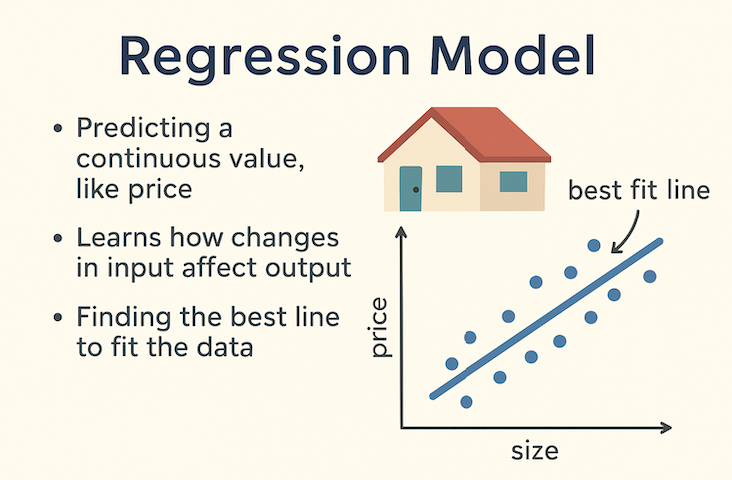
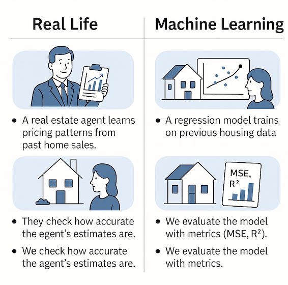
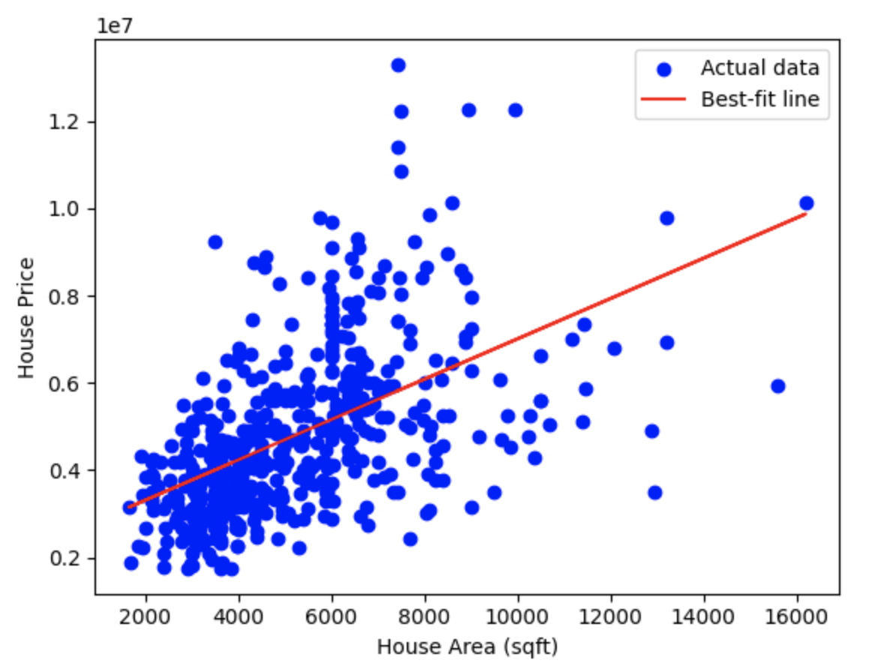
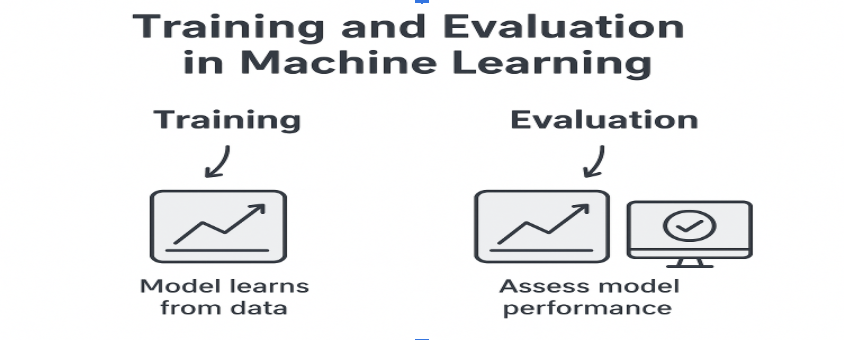
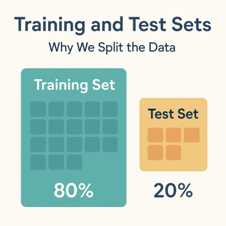
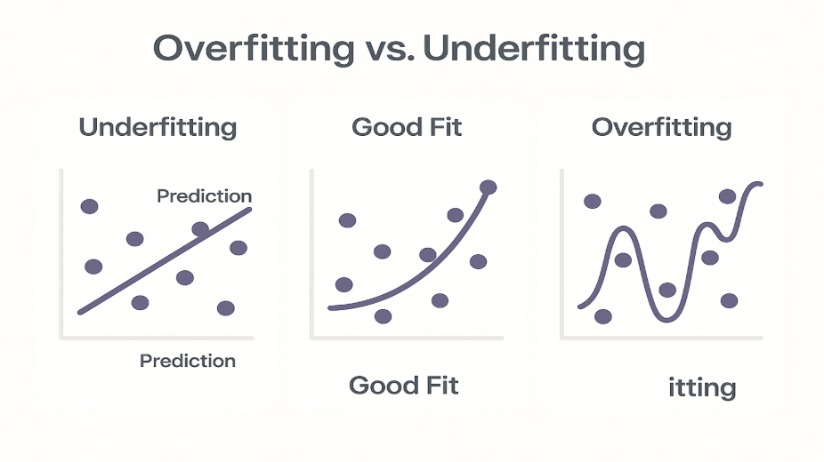
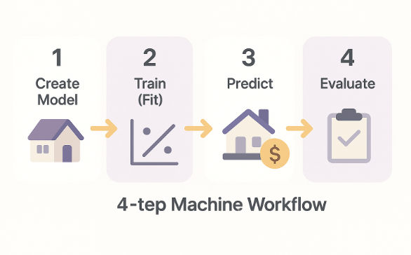

# CTD Python 200 (Weeks 2–4 : Machine Learning)

## Week 2: Introduction to Machine Learning and Regression  
### 4. Train and Evaluate a Regression Model Using scikit-learn

---

### Let’s pause and recap

In week 2, machine learning, by now you might have learned most of it:

- Heard what machine learning is.  
- Seen examples of ML problems.  
- Learned about types of ML,  
  **like:** supervised and unsupervised learning, regression and classification.  
- Explored scikit-learn.

---

### Essential Resources  
These will help you follow along:

**YouTube:** https://youtu.be/ukZn2RJb7TU?si=Jz65OxZeGuUKDbO7

---

## Let’s also quickly recap Regression Model & scikit-learn

### What is a Regression Model?

A regression model is used when we want to predict a number, a value that can go up and down.  
This kind of value is called a **continuous value**.

### Examples of things we might want to predict:

- House price (in dollars)  
- Car mileage (in miles per gallon)  
- Temperature (in degrees)  
- Time something will take (in minutes)

In all these cases, the answer is a **number**, not a label.  
That’s why we use regression.

---


### Let’s understand with House Prices example:

Suppose we want to predict the price of a house.

We know that things like:  
We know that one important factor that affects price is **the area of the house (square feet)**.

A regression model looks at many past houses and learns:

- “If size increases, price tends to increase.”  
- “If located in area A, the price might be higher.”

It learns the relationship between the **inputs (features)** and the **price (target)**.

---

### Before we build anything in scikit-learn, let’s understand the idea behind regression:

Imagine you collect data from many different houses:
- each house has a size (in square feet)  
- each house has a price  

We can plot this information on a graph:
- **x-axis (horizontal)** → house area  
- **y-axis (vertical)** → house price  

This creates a scatterplot, a cloud of points where each point is one house.

If you look at the points, you’ll usually notice a trend:  
**As the area of the house gets bigger, price tends to increase.**  
That’s our real-world pattern.

Now, the goal of linear regression is simple:  
**Draw a straight line through this cloud of points that best represents the trend.**

This line helps us answer questions like:  
*“If a new house is 1800 square feet, what price should we expect?”*  
That prediction is where machine learning becomes useful.

### Here’s the intuition:

- Houses above the line cost more than usual for their size  
- Houses below the line cost less than usual  
- The **steepness of the line** tells us how much price increases for every extra square foot  

---

### So regression is really just this:

Find a line that describes how one number (area) affects another number (price),  
and use that line to predict future prices.

Once we understand this visual idea, then scikit-learn simply helps us compute and draw that line automatically.

---

### Quick recap: What is scikit-learn?

scikit-learn is a Python library that gives us easy-to-use tools for building machine learning models.  
Instead of writing math from scratch, we use scikit-learn to handle the heavy lifting.

---

### Why we use scikit-learn

- It provides ready-to-use models (like Linear Regression).  
- It provides tools to split data into training and test sets.  
- It provides evaluation metrics to measure how good our model is.  
- It keeps our code simple, clear, and consistent.

---

### Connecting to Our Housing Example

Think about predicting house prices.

If we tried to figure this out ourselves, we’d need to:

- Study a lot of past house sales  
- Notice patterns (like bigger houses cost more)  
- Build a formula  
- Test whether our formula works on new houses  

Scikit-learn helps us do exactly this, but automatically.  
We just tell scikit-learn:

- What data to learn from (house size, number of bedrooms…)  
- What value we want to predict (house price)  

And scikit-learn learns the relationship for us.

### The scikit-learn basic workflow:

**1. Choose a model:**
```python
from sklearn.linear_model import LinearRegression
model = LinearRegression()
```

**2. Train the model on the training data:**
```python
model.fit(X_train, y_train)
```

**3. Make predictions on new data:**
```python
predictions = model.predict(X_test)
```



---

### Let’s take a look at how this idea of “fitting a line through points” looks in code.

Here we’re doing something very simple:

- loading a small dataset with area and price  
- training a basic Linear Regression model  
- plotting the scatterplot of points  
- drawing the best-fit line that the model learns  

This helps us see the relationship before we learn the full training and evaluation steps.

**Try this example in the coding environment (VS Code, Jupyter Notebook) for better understanding.**

```python
import pandas as pd
import matplotlib.pyplot as plt
from sklearn.linear_model import LinearRegression

# Simple example dataset
data = pd.read_csv("resources/Week2_Housing_Data.csv", usecols=["area", "price"])  # contains: area, price

X = data[["area"]]   # feature (must be 2D)
y = data["price"]    # target

# Create and train the model
model = LinearRegression()
model.fit(X, y)

# Make predictions for drawing the line
predicted_prices = model.predict(X)

# Plot
plt.scatter(X, y, color="blue", label="Actual data")
plt.plot(X, predicted_prices, color="red", label="Best-fit line")

plt.xlabel("House Area (sqft)")
plt.ylabel("House Price")
plt.legend()
plt.show()
```
**Output:**



### What this plot shows:

This scatterplot shows real houses from our dataset, each blue dot is one house, with its area on the x-axis and price on the y-axis.

The red line is the best-fit line that linear regression learns. It represents the general trend: **As house area increases, house price tends to increase.**

This is the core idea of simple linear regression: **find the straight line that best describes the relationship between one input (area) and one output (price).**

---

## Now what?

### Let’s understand what is training and evaluation (testing) in ML:



**Training** is the process where a machine learning model learns patterns and relationships from the data we give it.

It looks at many examples of inputs (features) and their correct answers (labels or targets), and tries to find a rule or formula that connects them.

In other words, during training the model is learning how changes in the input affect the output, so it can make good predictions on new, unseen data later.

---

### Think of training this way:

If we show the model house sizes (input) and their prices (output), it learns how price usually changes when the size changes — that’s training.

Think of training like *studying from examples*. The model “studies” the training data to learn how inputs relate to outputs.

**In scikit-learn, this happens when we call:** .fit(X_train, y_train). We will learn more in this lesson.

And, **evaluation** (we will learn more about this in future lessons) is the process of checking how well a trained model performs — in other words, how good it is at making predictions on new, unseen data.

---

## How Do We Measure How Good a Regression Model Is?

After training a regression model, we need a way to measure **how close our predictions are to the real house prices**.  
These measurements are called **error metrics**.

In regression, the most common metrics you’ll see are:

- **MSE (Mean Squared Error)**
- **RMSE (Root Mean Squared Error)**
- **R² Score**

Each metric tells us something slightly different about how well our model is performing.

---

### Mean Squared Error (MSE)


**MSE** measures the average of the **squared differences** between predicted house prices and the actual house prices.

In simple terms:
1. Take the difference between each predicted price and the real price  
2. Square that difference  
3. Average all of those squared differences  

**Why do we square the errors?**

- Squaring makes **large mistakes matter more** than small ones  
- It prevents positive and negative errors from canceling each other out  

**Downside of MSE**

Because we square the errors, the units become harder to interpret.

- If house prices are measured in dollars  
- MSE is measured in **dollars²**

This makes MSE useful for optimization, but not very intuitive for explaining real-world prediction quality.

---

### Root Mean Squared Error (RMSE)

To make the error easier to understand, we take the square root of MSE.

\[
\text{RMSE} = \sqrt{\text{MSE}}
\]

**RMSE is the most commonly used regression error metric in practice.**

Why?

- It still penalizes large errors  
- **But it returns the error in the same units as the target value**

That means RMSE has a clear, real-world interpretation.

**Example interpretation:**

> “On average, our house price predictions are off by about **$48,000**.”

If you want a number that makes sense in everyday terms, **RMSE is usually the best choice**.

---

### Why Do We Also Use R²?

If RMSE tells us *how wrong our predictions are*, you might wonder:

> “Why do we also need R²?”

R² answers a **different kind of question**.

---

### R² Score (Coefficient of Determination)

**R² compares your regression model to a very simple baseline model.**

That baseline model:
- Ignores house size completely  
- Always predicts the **average house price**  

Think of this as the **“just guess the average price” strategy**.

Both your regression model and this baseline model make errors, which we measure using **MSE**.

R² tells us **how much smaller your model’s error is compared to the baseline error**.

\[
R^2 = 1 - \frac{\text{Model MSE}}{\text{Baseline MSE}}
\]

---

### Interpreting R²

- **R² = 1.0** → Perfect predictions  
- **R² = 0.0** → No better than always guessing the average price  
- **R² < 0.0** → Worse than guessing the average  

**Example:**

If **R² = 0.72**, that means:

> “Using house size, our model removes **72% of the error** we would make by always guessing the average house price.”

In plain language:

**R² measures the fraction of the original prediction error that the model explains.**

---

### Connecting Back to Week 1: Correlation

In **Week 1**, we learned about **correlation**, which measures how strongly two variables move together.

There is a direct connection here:

> In **simple linear regression with one feature**,  
> **R² is the square of the Pearson correlation coefficient** between the feature (house area) and the target (house price).

What this means:

- Strong correlation between area and price → high R²  
- Weak correlation → low R²  

This makes intuitive sense:
- If house prices increase steadily as area increases, a straight line fits well  
- If there is no clear linear relationship, regression will struggle  

This shows how **correlation (Week 1)** and **regression (Week 2)** are closely related.

---

### How Does Linear Regression Find the “Best” Line?

Linear regression does not guess randomly.

It finds the straight line that **minimizes the Mean Squared Error (MSE)**.

This method is called **least squares**.

**In other words:**
- The model considers many possible lines  
- It chooses the one where the **average squared difference between predicted and actual house prices is as small as possible**

This is how scikit-learn finds the best-fit line — it’s an optimization process, not a mystery.

---

### Quick Summary

- **MSE** measures squared prediction error (useful but hard to interpret)
- **RMSE** is the square root of MSE and is measured in dollars
- **R²** compares your model to guessing the average house price
- Linear regression uses **least squares** to minimize MSE and find the best line


---

## Training and Test Sets, Why We Split the Data?



When we train a model, we want to know how well it can make predictions on **new** data, not just the data it has already seen.

Think of it this way:  
When you study for a test, you practice using your notes and homework problems (**training**).  
Then, during the real exam (**testing**), you get new questions you haven’t seen before — that’s how we see if you truly understand the topic!

To do this in machine learning, we divide our dataset into two parts:

### **1. Training set**
The data the model learns from.  
The model uses this data to find patterns and relationships.

### **2. Test set**
The data we keep aside to check how well the model learned.  
This simulates how the model will perform on real-world, unseen data.

### Typical Split
We usually use around **70–80%** of the data for training and **20–30%** for testing.

### Splitting the Data in scikit-learn

In scikit-learn, we can easily split the data using:

```python
from sklearn.model_selection import train_test_split  # imports the function

X_train, X_test, y_train, y_test = train_test_split(
    X, y, test_size=0.2, random_state=42
)
```

This line splits our data into **four parts**:

- **X_train**: features for training  
- **X_test**: features for testing  
- **y_train**: labels (answers) for training  
- **y_test**: labels for testing  

### What the parameters mean:

- **test_size=0.2** → 20% of the data will be used for testing, and the rest (80%) for training.  
- **random_state=42** → makes the split repeatable, so we get the same result every time we run the code.

---

## Introduction to Overfitting and Underfitting

When we train a machine learning model, we want it to learn the **real pattern** in the data so it can make good predictions on new houses, not just the ones it has already seen.  
But a model can learn **too little** or **too much**.  
This leads to **underfitting** or **overfitting**.



---

### **Underfitting**

Underfitting happens when the model is **too simple** to capture the pattern in the data.

**In the housing example:**  
If the relationship between area and price is not perfectly straight, a simple straight line might miss important patterns, so the predictions will not be very accurate.

**Signs of Underfitting:**
- Low performance on training data  
- Low performance on test data  

**Think of it like:**  
A student who barely studied — they do poorly on homework **and** the test.

---

### **Overfitting**

Overfitting happens when the model becomes **too complex** and starts memorizing noise or random fluctuations in the training data.

Even with **one feature**, this can happen — for example, if we fit a complicated curved line instead of a simple straight one.

**Signs of Overfitting:**
- Very high accuracy on training data  
- Poor accuracy on test data  

**Think of it like:**  
A student who memorized every answer — great on practice questions but struggles with new ones.

---

### **Goal: Find the Right Balance**

We want a model that:

- Learns the important pattern  
- Ignores random noise  
- Performs well on new, unseen houses  

This is called **generalization**.

---

## Next Step



Now that we understand what regression is and how a line can describe the relationship between house area and price, we are ready to train a **real model**.

We will go through the basic steps of building a simple linear regression model using scikit-learn:

**Creating the model → Fitting it → Making predictions → Evaluating the results**

---

## Hands-on Activity: Train a Simple Linear Regression Model

In this activity, we will use a small housing dataset to build a model that predicts the **price of a house based only on its area (square feet)**.  

This keeps things simple and helps us clearly see how linear regression works.

**The dataset is included in the `resources` folder.**

## Steps We Will Follow

1. **Explore the dataset**  
   Look at the data and understand what information we have:  
   - `area` (input)  
   - `price` (output)

2. **Split the data into training and test sets**  
   We train the model on one part of the data and test how well it performs on new, unseen data.

3. **Train a Linear Regression model**  
   Use scikit-learn to learn the relationship between area and price.

4. **Make predictions**  
   Use the trained model to predict the prices of houses in the test set.

5. **Evaluate the model**  
   We measure how well the model performs using:  
   - **RMSE (Root Mean Squared Error)**  
   - **R² Score**  
   These tell us how close the predictions are to the real prices.

6. **Reflect on what we learned**  
   Interpret the results and think about:  
   - How the model performed  
   - Whether the line fit the trend well  
   - How we might improve predictions later

---

## Let’s Begin

### **Step 1: Imports**

```python
import pandas as pd
from sklearn.model_selection import train_test_split
from sklearn.linear_model import LinearRegression
from sklearn.metrics import mean_squared_error, r2_score
import numpy as np
```

### **Step 2: Load and Explore the Dataset**
```python
# Load the data (only the columns we need)
data = pd.read_csv("resources/Week2_Housing_Data.csv", usecols=["area", "price"])

# Look at the first few rows
print("First 5 rows of the dataset:")
print(data.head())

# Basic info
print("\nBasic info:")
print(data.info())

# Simple statistics
print("\nSummary statistics:")
print(data.describe())
```

### **Step 3: Set Up Features (X) and Target (y)**
```python
# X = input (feature) → area
# y = output (target) → price
X = data[["area"]]   # 2D DataFrame
y = data["price"]    # 1D Series
```

### **Step 4: Split into Training and Test Sets**

```python
# Split into training and test sets
# 80% training, 20% testing
X_train, X_test, y_train, y_test = train_test_split(
    X, y, test_size=0.2, random_state=42
)

print("Number of training examples:", len(X_train))
print("Number of test examples:", len(X_test))
```

### **Step 5: Create and Train the Model**
```python
# Create the Linear Regression model
model = LinearRegression()

# Train (fit) the model on the training data
model.fit(X_train, y_train)

print("Model trained!")
print("Slope (coefficient):", model.coef_[0])
print("Intercept:", model.intercept_)
```

### **Step 6: Make Predictions on the Test Set**
```python
# Use the model to predict prices for the test set
y_pred = model.predict(X_test)

print("First 5 predicted prices:", y_pred[:5])
print("First 5 actual prices:", y_test.values[:5])

```

### **Step 7: Evaluate the Model (RMSE and R²)**
```python
# Mean Squared Error
mse = mean_squared_error(y_test, y_pred)

# Root Mean Squared Error (easier to interpret)
rmse = np.sqrt(mse)

# R² score
r2 = r2_score(y_test, y_pred)

print("RMSE (Root Mean Squared Error):", rmse)
print("R² score:", r2)
```

**Note:**

- **RMSE** tells us, on average, how far the predictions are from the actual prices (in the same units as price).  
- **R²** tells us how well the model explains the variation in house prices (closer to 1 is better).

### **Step 8: A Small Comparison Table**

```python
results = pd.DataFrame({
    "area": X_test["area"],
    "actual_price": y_test,
    "predicted_price": y_pred
})

print(results.head(10))
```

### **Final Results**

    area  actual_price  predicted_price
316  5900       4060000     5.024060e+06
77   6500       6650000     5.279498e+06
360  4040       3710000     4.232203e+06
90   5000       6440000     4.640903e+06
493  3960       2800000     4.198144e+06
209  6720       4900000     5.373159e+06
176  8520       5250000     6.139473e+06
249  4990       4543000     4.636646e+06
516  3240       2450000     3.891619e+06
426  2700       3353000     3.661725e+06

### What Do These Results Tell Us? (Quick Explanation)

Each row compares a house’s **actual price** with the **predicted price** from our model.

The predictions are not exact, but they follow the general trend:

- Bigger houses → higher predicted prices  
- The model gets close, but sometimes predicts too high or too low  

This is normal for a **simple linear model** using only **one feature (area)**.  
It captures the overall pattern, but real house prices depend on many factors we are not including yet.

**Overall:**

- The model is doing an *okay* job  
- Predictions are reasonable, not perfect  

This is exactly what we expect from **simple linear regression**.

---

## Check for Understanding  
### Week 2 Quiz: Introduction to Machine Learning & Regression

---

**1. What is the goal of training a machine learning model?**  
a. To memorize the dataset  
b. To learn patterns in the data and make predictions  
c. To generate random numbers  
d. To sort data alphabetically  

<details>
<summary><strong>Show Answer</strong></summary>
b — The model learns patterns so it can make useful predictions on new data.
</details>

---

**2. Why do we split data into training and test sets?**  
a. To make the dataset smaller  
b. To make the model run faster  
c. To check if the model can handle new, unseen data  
d. Because scikit-learn requires it  

<details>
<summary><strong>Show Answer</strong></summary>
c — The test set shows whether the model can generalize instead of memorizing.
</details>

---

**3. In a regression problem, what type of value are we trying to predict?**  
a. A category (like cat vs. dog)  
b. A continuous number (like price or temperature)  
c. A color  
d. A True/False answer  

<details>
<summary><strong>Show Answer</strong></summary>
b — Regression predicts continuous numeric values.
</details>

---

**4. What does the R² score tell us?**  
a. How random the model is  
b. How close the model is to making accurate predictions  
c. The number of errors the model made  
d. The size of the dataset  

<details>
<summary><strong>Show Answer</strong></summary>
b — R² closer to 1 means the model fits the data well.
</details>

---

**5. If the model performs well on training data but poorly on test data, what is happening?**  
a. Underfitting  
b. Overfitting  
c. Perfect learning  
d. The dataset is broken  

<details>
<summary><strong>Show Answer</strong></summary>
b — Overfitting means the model memorized the training data but struggles with new data.
</details>


---

### 🎉 Congratulations & Thank You!

Great job completing Week 2 of the Machine Learning module!  
You’ve learned ML concepts, explored real data, trained a regression model, and evaluated its performance.

Your effort, curiosity, and consistency are what make you a stronger developer each week.  
Keep going, the skills you’re building now will open many opportunities ahead.

**See you in the next lesson!**
