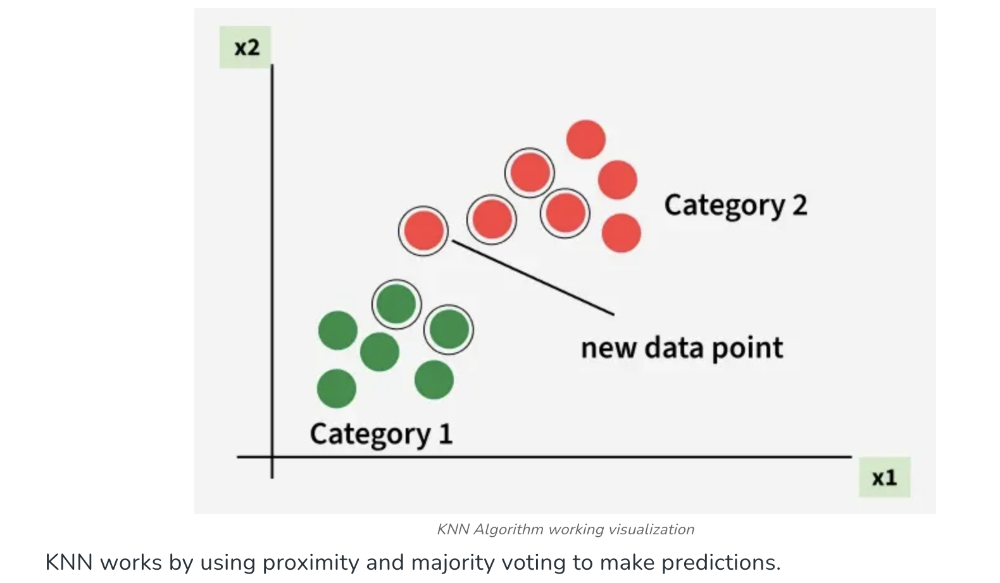
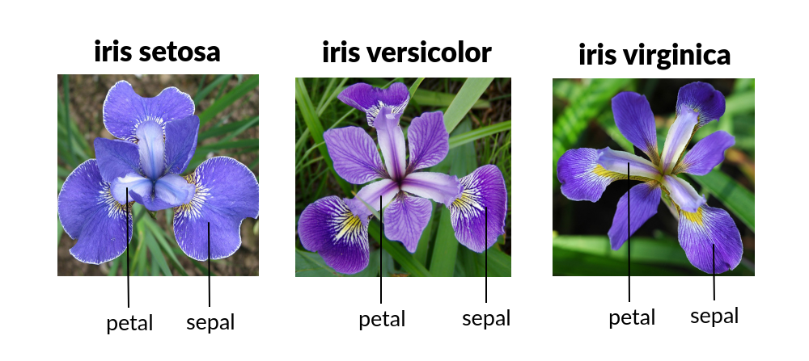
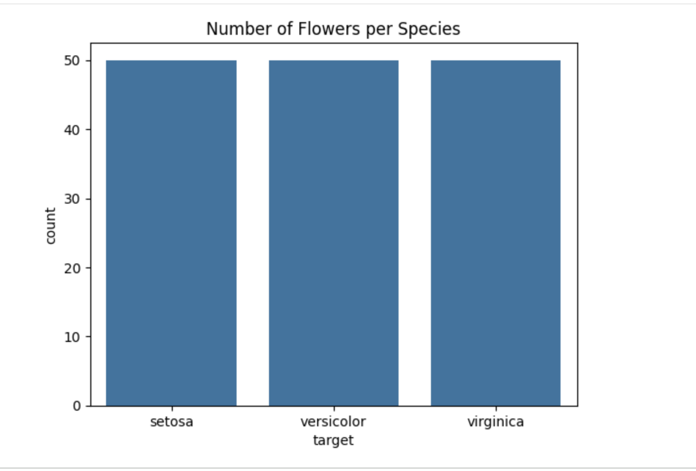

# k-Nearest Neighbor (KNN) Classifiers
In this lesson, you will build and evaluate your first hands-on classifier using the *k-Nearest Neighbor (KNN)* algorithm.

KNN is simple. That simplicity allows us to focus on the *core ideas behind classification* before moving on to more complex models later in the course.

- [IBM article overview](https://www.ibm.com/think/topics/knn)
- [IBM video (10 minutes)](https://www.youtube.com/watch?v=b6uHw7QW_n4)


## The Intuition Behind KNN
Imagine you discover a new flower in a garden. You don’t know its species, but you *do* know the species of many nearby flowers.

A natural strategy might be:

> Look at the flowers that are most similar to this one. If most of them belong to the same species, this one probably does too.


*Image credit:* GeeksforGeeks

This is exactly how *k-Nearest Neighbor* works. When KNN classifies a new data point (from the test data), it finds the `k` closest points in the training data, looks at their labels, and lets them vote on the final prediction. k is some number you choose, it can be as little as 1, or as high as 10. There is no complex training phase -- KNN simply stores the data and compares new points to what it has already seen.

## A Tiny Example 

Suppose we choose `k = 5`.

A new flower’s three nearest neighbors include:

* two flowers from the *Setosa* species,
* one flower from the *Versicolor* species.

KNN predicts *Setosa*, because that label receives the majority of votes.

This simple voting idea is the foundation of the entire algorithm.

## The Iris Dataset: The "Hello World" of Classification

Before building any model, we need to understand our data. The *Iris dataset* is often called the *hello world of classification* -- small, clean, balanced, and extremely well-studied, making it perfect for learning.

Each row represents a flower, one sample from three species of iris (setosa, versicolor, or virginica). For each flower, we measure:

* sepal length
* sepal width
* petal length
* petal width


*Image credit:* CodeSignal

All measurements are in centimeters. The label tells us which species the flower belongs to: *Setosa*, *Versicolor*, or *Virginica*. In real-world projects, data exploration always comes *before* modeling, so we begin with a small amount of exploratory data analysis (EDA) to build intuition.

## Setup

```python
import pandas as pd
import numpy as np
import matplotlib.pyplot as plt
import seaborn as sns

from sklearn.datasets import load_iris
from sklearn.model_selection import train_test_split, cross_val_score
from sklearn.neighbors import KNeighborsClassifier
from sklearn.metrics import (
    accuracy_score,
    classification_report,
    confusion_matrix,
    ConfusionMatrixDisplay
)
```

## Loading the Dataset

```python
iris = load_iris(as_frame=True)

X = iris.data
y = iris.target

print(X.shape)
X.head()
```

You will find that the dataset contains 150 flowers and 4 numeric features. There are no missing values, and all features are measured in the same units.

## Quick EDA: Building Intuition

First, we check whether the dataset is balanced.

```python
sns.countplot(x=y.map(dict(enumerate(iris.target_names))))
plt.title("Number of Flowers per Species")
plt.show()
```



Each species appears the same number of times, which makes model evaluation more reliable. Next, we look at how petal measurements separate species:

```python
sns.scatterplot(
    x=X["petal length (cm)"],
    y=X["petal width (cm)"],
    hue=y.map(dict(enumerate(iris.target_names)))
)
plt.title("Petal Length vs Petal Width")
plt.show()
```

You will see that petal measurements separate species extremely well, especially *Setosa*. Sepal measurements overlap more, but the pairplot below gives a fuller picture of all feature relationships together.

```python
sns.pairplot(
    pd.concat([X, y.rename("species")], axis=1),
    hue="species"
)
plt.show()
```

From just a few plots, we already learn that some features are much more informative than others and that a simple classifier should work well.

## Train / Test Split

Before modeling, we split the data.

```python
X_train, X_test, y_train, y_test = train_test_split(
    X,
    y,
    test_size=0.2,
    random_state=42,
    stratify=y
)
```

The `stratify=y` argument ensures each species appears in similar proportions in both sets, making our evaluation fair.

## A Note on Feature Scaling

As you learned in the preprocessing lesson, KNN relies entirely on distance calculations, which means features with larger numbers can dominate the result even if they are no more informative than features with smaller numbers. The standard advice is to scale before applying any distance-based model.

We are deliberately skipping that step here. All four Iris features are measured in the same units (centimeters) and fall in a similar numerical range, so they are already roughly comparable. When we experimented with scaling on this dataset, it actually produced slightly *worse* results -- scaling reduced the natural separation that raw petal measurements provide between species. This is an unusual situation, and a useful reminder that rules of thumb are not always right, and preprocessing is an art not a science.

## Our First KNN Model

In the previous scikit-learn lesson, you learned the *standard model-building API* used throughout this course:

1. Create the model
2. Fit the model
3. Make predictions
4. Evaluate results

We follow that exact pattern here.

```python
knn = KNeighborsClassifier(n_neighbors=5)
knn.fit(X_train, y_train)

preds = knn.predict(X_test)

print("Accuracy:", accuracy_score(y_test, preds))
print(classification_report(y_test, preds))
```

You should see strong performance. The `classification_report` shows four metrics for each class: *precision* (of everything the model predicted as class X, how many were actually X), *recall* (of all true examples of class X, how many did the model catch), *F1-score* (a combination of precision and recall), and support (the count of true examples for that class). These metrics matter most when errors are costly or classes are imbalanced -- we covered them in detail in the classifier evaluation lesson, so refer back there as needed.

You may find the numbers suspiciously high -- possibly 1.0 across the board. Part of that is just Iris being clean data. But there is another reason to be skeptical: you made one particular split with `random_state=42`. A different split might tell a different story. With only 30 test samples, one unusual partition can shift the numbers noticeably. The same concern applies to any model -- including the linear regression work you did earlier.

## Cross-Validation: A More Reliable Picture

The solution is to not commit to a single split. Instead, divide the training data into several equal groups called *folds* -- typically 5 -- and rotate which group is held out for evaluation. Train on 4 folds, evaluate on the fifth; repeat 5 times, each time using a different fold; then average the scores. This is *k-fold cross-validation*. (Note: the k here refers to the number of folds, not the k in KNN -- the naming collision is unfortunate but standard.)

Because every training example participates in evaluation at some point, the averaged score is more stable than any single split. The standard deviation across folds also tells you how consistent the result is -- a low std means it is not just a fluke. And the test set is never used.

```python
knn = KNeighborsClassifier(n_neighbors=5)
cv_scores = cross_val_score(knn, X_train, y_train, cv=5)

print(cv_scores)           # accuracy on each fold
print(f"Mean: {cv_scores.mean():.3f}")
print(f"Std:  {cv_scores.std():.3f}")
```

You will likely see a mean closer to 0.97 -- still excellent, but a more honest picture than a single 1.0. This pattern generalizes to any model: with linear regression you would get R² or RMSE for each fold instead of accuracy. The metric changes; the structure stays the same.

A variant worth knowing is *leave-one-out cross-validation* (LOOCV), where `cv` is set equal to the number of training samples -- each fold contains exactly one example. This gives the most thorough evaluation possible and works well on small datasets, but becomes slow as data grows. For most practical purposes, 5 or 10 folds is a good default.

If you want to learn more about cross-validation, check out the following video: https://www.youtube.com/watch?v=IygUTo-mem0


## Confusion Matrix: Seeing Errors Clearly

The confusion matrix shows where the model is getting confused. Each row represents the true species and each column the predicted species, so numbers along the diagonal are correct predictions and off-diagonal numbers are mistakes.

```python
cm = confusion_matrix(y_test, preds)
disp = ConfusionMatrixDisplay(
    confusion_matrix=cm,
    display_labels=iris.target_names
)

disp.plot()
plt.title("KNN Confusion Matrix (Iris)")
plt.show()
```

Even when accuracy is high, it is worth generating the confusion matrix. On a dataset this clean you may see a perfect or near-perfect diagonal -- but in real problems, the off-diagonal cells are where the interesting analysis lives.

## Choosing k

The only tunable parameter in KNN is `k`, and it matters more than you might expect.

With a very small `k` (say, `k=1`), the model makes decisions based on a single neighbor. This makes predictions highly sensitive to noise and outliers: one unusual or mislabeled point can flip the result. This is *overfitting* -- the model memorizes the training data rather than learning a general pattern.

With a very large `k`, the model averages over so many neighbors that local structure gets washed out, and it may simply predict the most common class for every input. This is *underfitting*.

Now that we have cross-validation, we can sweep a range of k values and find the best one without touching the test set. Note that for KNN specifically, evaluating on the entire *training* data set all at once would be completely useless: with `k=1`, every training point's nearest neighbor is itself (distance zero), so the model trivially recalls every label and always scores 1.0. Cross-validation avoids this by always evaluating on held-out data.

```python
k_values = list(range(1, 20, 2))  # odd values to avoid tied votes

for k in k_values:
    knn = KNeighborsClassifier(n_neighbors=k)
    scores = cross_val_score(knn, X_train, y_train, cv=5)
    print(f"k={k:2d}:  mean={scores.mean():.3f}  std={scores.std():.3f}")
```

Once you have identified the best k from the output, retrain on the full training set and evaluate on the test set exactly once:

```python
best_k = 5  # replace with whichever k gave the highest mean CV score above

knn_final = KNeighborsClassifier(n_neighbors=best_k)
knn_final.fit(X_train, y_train)

final_preds = knn_final.predict(X_test)
print(f"Final test accuracy: {accuracy_score(y_test, final_preds):.3f}")
```

On Iris, the CV scores will be nearly flat across all k values -- again, a sign of how clean the data is. On real-world data, this sweep typically reveals a clear peak (or small range of peaks) before accuracy falls off as k grows too large. The test set score at the end is the one number you report: uncontaminated and used exactly once.

## Check for Understanding

1. When KNN classifies a new data point, what does it do?

- A. It fits a line through the training data and predicts where the new point falls
- B. It finds the k closest training examples and takes a majority vote on their labels
- C. It builds a tree of decision rules from the training data
- D. It computes the average label of all training examples
<details> <summary><strong>Click to reveal answer</strong></summary>
Correct answer: B
</details>

2. What is the main risk of choosing a very small value of k (such as k=1)?

- A. The model becomes too slow to run
- B. The model ignores all training data
- C. The model becomes sensitive to noise and individual outliers, leading to overfitting
- D. The model always predicts the most common class
<details> <summary><strong>Click to reveal answer</strong></summary>
Correct answer: C
</details>

3. Why is cross-validation a more reliable evaluation strategy than a single train/test split?

- A. It uses more data for the final test evaluation
- B. It evaluates the model on multiple different held-out subsets and averages the results
- C. It prevents the model from overfitting to the training data
- D. It removes the need to tune k
<details> <summary><strong>Click to reveal answer</strong></summary>
Correct answer: B
</details>

4. Why does KNN require careful attention to feature scaling?

- A. Scaling is required by the scikit-learn implementation of KNN
- B. KNN uses a sigmoid function that requires normalized inputs
- C. Features with larger numerical ranges can dominate distance calculations, regardless of how informative they are
- D. Scaling speeds up the nearest-neighbor search
<details> <summary><strong>Click to reveal answer</strong></summary>
Correct answer: C
</details>

5. In a confusion matrix, what do the numbers along the diagonal represent?

- A. The features the model found most important
- B. The cases where the model was uncertain between two classes
- C. Correct predictions -- cases where the predicted label matches the true label
- D. The number of training examples per class
<details> <summary><strong>Click to reveal answer</strong></summary>
Correct answer: C
</details>

## What We've Learned

KNN is a useful first classifier because its logic is so transparent: find similar examples, let them vote. There is no equation to fit, no model to discover. But that simplicity comes with trade-offs. KNN stores the entire training set and must search through all of it for every new prediction, which becomes slow on large datasets. It also treats all features as equally important, so irrelevant or unscaled features can distort distance calculations.

In this lesson you built and evaluated your first classifier, explored a real dataset through EDA, learned why cross-validation gives more reliable estimates than a single split, and used it to choose k without contaminating the test set. Congratulations!
