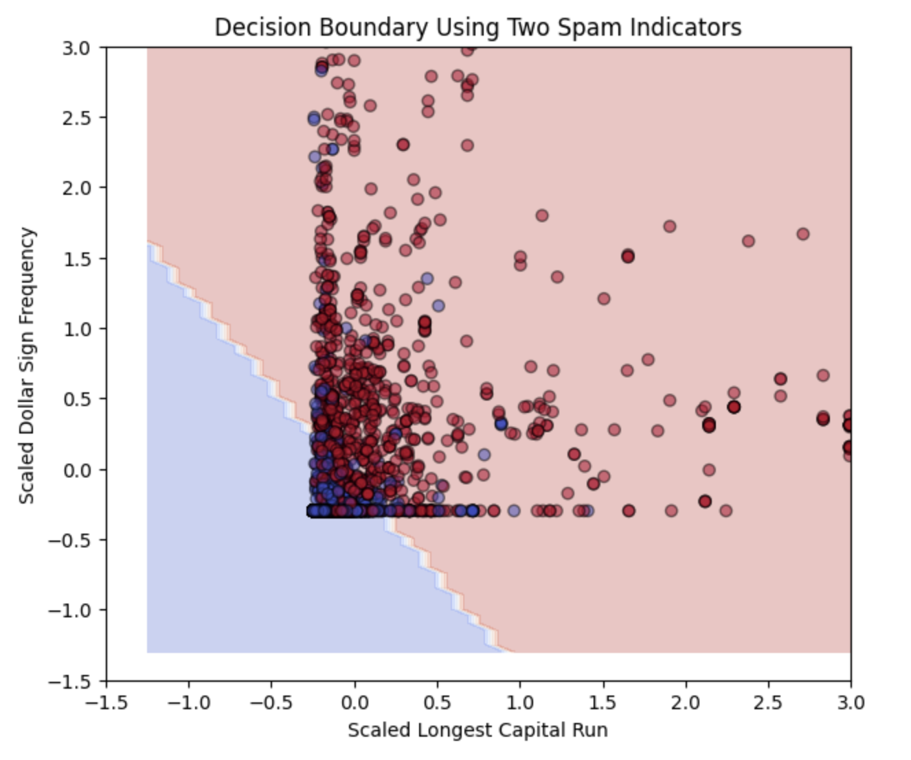

# Logistic Regression

When you first hear the term "Logistic Regression," it sounds like something complicated from a math textbook. In reality, it is one of the most approachable and friendly machine learning algorithms you will ever learn. In fact, most data scientists and ML engineers start with Logistic Regression because it gives you a simple, interpretable, and surprisingly powerful way to make predictions about real-world problems. The goal of this lesson is to guide you step-by-step, so by the end you'll feel confident explaining how Logistic Regression works without relying on formulas or heavy math.

## What Problem Does Logistic Regression Solve?

Let's start with a simple question: when would someone even use Logistic Regression? Imagine you are building a system that reads emails and decides whether each one is spam or not spam. Or maybe you are trying to predict whether a customer will buy a product, whether a patient has a disease, or whether a transaction is fraudulent. All of these tasks share the same structure: there are only two possible outcomes. Logistic Regression is built exactly for this kind of problem. It is a binary classifier, meaning it tries to split the world into two groups, like yes/no, true/false, spam/not spam, or 1/0. But what makes Logistic Regression special is that it doesn't just say "yes" or "no." It produces a probability, which makes its predictions smoother, more interpretable, and incredibly useful in practical settings.

## The Big Idea

At its heart, logistic regression asks:
"How strongly do the input features suggest that this example belongs to class 1 instead of class 0?"

To answer this question, logistic regression starts with something familiar:
it uses the same idea as *linear regression*.

Before it becomes a classifier, it behaves like a linear model: taking all your input features, multiplying them by learned weights, adding them together, and producing a single score.

Something like this:

```
z=b0​+b1​x1​+b2​x2​+…
```

If this were ordinary linear regression, the model would output that number directly.

But we can't use raw numbers for classification. A score like 4.3 or -2.8 doesn't tell us "spam" or "not spam," let alone the probability. So logistic regression takes this linear score, feeds it through a special transformation, and turns it into a clear probability between 0 and 1.

That transformation is the star of this algorithm: the *sigmoid function*.

## The Sigmoid Function

Right after the linear part produces a number like -5 or +7, logistic regression passes that value to the sigmoid.


Now look at the curve. It's smooth, soft, and shaped like the letter "S." What this function does is beautifully simple:

- Large negative numbers get squeezed near 0
- Large positive numbers get pushed toward 1
- Numbers near zero end up close to 0.5

The formula is:  

The math isn't particularly important, and you definitely don't need to memorize it. What you need to understand is its *behavior*.

If the weighted sum of features produces a small value (something like -3), the sigmoid outputs a tiny probability, maybe around 0.05. If the model produces a large value (like +4), the sigmoid outputs something like 0.98. These are clean, intuitive probabilities.

This is what makes logistic regression special. You don't just get a hard "yes/no" -- you get a measure of how confident the model is in its answer.

A probability of 0.52 might mean "a toss-up, but slightly leaning toward class 1," while 0.98 means "I'm almost certain."

This probabilistic nature is why logistic regression is loved in fields like medicine, finance, and social sciences. You can interpret and explain what the model is thinking.

If you prefer to read a gentle text explanation with intuition and analogies, this [Medium article](https://medium.com/%40roseserene/back-to-basics-logistic-regression-less-math-more-intuition-e473aebcf64a) breaks it down very clearly.

## Logistic Regression as a Classifier (The Decision Boundary)

Once we have a probability, we need to make a final decision: should this example be class 0 or class 1?

Most commonly, logistic regression uses 0.5 as a threshold:
- Probability > 0.5 → class 1
- Probability < 0.5 → class 0

But here is where logistic regression shows its structure. Recall from linear regression that adding a second input feature extends the model's output from a line into a plane -- each feature gets its own weight, all combined in a single expression. Logistic regression works exactly the same way: it computes `z = b0 + b1*x1 + b2*x2 + ...`, one weight per feature, just like multiple regression. The sigmoid then maps that combined score to a probability, and the decision boundary -- where probability equals 0.5, i.e., where z=0 -- is that same flat surface: a line in 2D, a plane in 3D, a hyperplane with more features. Adding features shifts and rotates that boundary, but never curves it.

This means logistic regression is looking for one clean dividing boundary.

Where KNN makes decisions by looking at the closest neighbors, logistic regression draws one clean linear boundary between the classes.

This makes it incredibly easy to interpret:
- If a weight is positive, that feature pushes the example toward class 1
- If it's negative, that feature pushes it toward class 0
- The magnitude of the weight tells you how influential the feature is 

You can watch this [YouTube video](https://www.youtube.com/watch?v=yIYKR4sgzI8) for another high-level, visual explanation of logistic regression and how it works.


### An Example Intuition (Spam Classifier)

Suppose you're building a spam detector. Logistic regression might notice:
- Emails with lots of exclamation marks → more likely spam
- Emails with frequent business terms → less likely spam
- Emails with "free," "credit," or "money" → more likely spam

Each of these gets a weight:

- A positive weight means "more of this pushes toward spam"
- A negative weight means "more of this pushes toward not spam"

All these weighted pieces get added together into the "z" score. The sigmoid then converts that score into something like 0.89, meaning an 89% chance of spam.

## How Logistic Regression Learns

The model starts with random weights. It sees each training email and asks:

> "How wrong was my guess?"

It then adjusts the weights a little bit to reduce future errors. This is done using a method called gradient descent, which is basically the model taking tiny steps downhill on an error curve.

Even without the math, think of the model learning like a student practicing flashcards, improving a bit every time it makes a mistake.


## When to Use Logistic Regression

Logistic Regression is usually a good choice when the relationship between your features and the outcome is *roughly linear*. That doesn't mean perfect straight lines everywhere, but it does mean that as a feature increases, the likelihood of the outcome tends to increase or decrease in a steady, predictable way. In those situations, Logistic Regression fits naturally. It also shines when you want something fast to train, simple to understand, and not too computationally heavy. If your dataset isn't enormous or if the classes are separated reasonably well in the feature space, Logistic Regression can perform surprisingly well. One of its strengths is that it gives probabilities rather than just a yes/no answer, which helps it express uncertainty in a realistic way.

But like any model, it has limitations. Logistic Regression can only draw linear boundaries between classes, which means if the data falls into swirling or curved patterns, the model will struggle unless you create new features. It can also become unstable when features are highly correlated, or when outliers pull coefficients to extreme values -- both cases where something known as *regularization* helps. We will describe what regularization is in more detail below. 

In the next section, we'll walk through a complete coding example where we load a dataset, train a logistic regression classifier, visualize some results, and interpret what the model learned.

## 1. Importing the Tools We Need

A few of these imports will be new -- `requests`, `BytesIO`, `StandardScaler`, and `DecisionBoundaryDisplay` -- and we'll explain each one when we use it.

```python
import warnings
import numpy as np
import pandas as pd
import matplotlib.pyplot as plt
import requests
from io import BytesIO

from sklearn.linear_model import LogisticRegression
from sklearn.preprocessing import StandardScaler
from sklearn.model_selection import train_test_split, cross_val_score
from sklearn.metrics import (
    confusion_matrix,
    accuracy_score,
    precision_score,
    recall_score,
    f1_score,
    classification_report
)
from sklearn.inspection import DecisionBoundaryDisplay

warnings.filterwarnings("ignore", category=RuntimeWarning)
```

## 2. Loading the Dataset

For this lesson, we'll use a classic dataset for spam detection. Each row represents an email, and each feature describes something measurable about that email like how often certain words appear or how many capital letters it contains.

We define column names so the data is easier to understand once it's loaded.

```python
COLUMN_NAMES = [
    "word_freq_make",        # 0   percent of words that are "make"
    "word_freq_address",     # 1
    "word_freq_all",         # 2
    "word_freq_3d",          # 3   almost never appears
    "word_freq_our",         # 4
    "word_freq_over",        # 5
    "word_freq_remove",      # 6   common in "remove me from this list"
    "word_freq_internet",    # 7
    "word_freq_order",       # 8
    "word_freq_mail",        # 9
    "word_freq_receive",     # 10
    "word_freq_will",        # 11
    "word_freq_people",      # 12
    "word_freq_report",      # 13
    "word_freq_addresses",   # 14
    "word_freq_free",        # 15  classic spam word
    "word_freq_business",    # 16
    "word_freq_email",       # 17
    "word_freq_you",         # 18
    "word_freq_credit",      # 19
    "word_freq_your",        # 20  often high in spam
    "word_freq_font",        # 21  HTML emails
    "word_freq_000",         # 22  "win $ x,000" style offers
    "word_freq_money",       # 23  money related
    "word_freq_hp",          # 24  HP specific
    "word_freq_hpl",         # 25
    "word_freq_george",      # 26  specific HP person
    "word_freq_650",         # 27  area code
    "word_freq_lab",         # 28
    "word_freq_labs",        # 29
    "word_freq_telnet",      # 30
    "word_freq_857",         # 31
    "word_freq_data",        # 32
    "word_freq_415",         # 33
    "word_freq_85",          # 34
    "word_freq_technology",  # 35
    "word_freq_1999",        # 36
    "word_freq_parts",       # 37
    "word_freq_pm",          # 38
    "word_freq_direct",      # 39
    "word_freq_cs",          # 40
    "word_freq_meeting",     # 41
    "word_freq_original",    # 42
    "word_freq_project",     # 43
    "word_freq_re",          # 44  reply threads
    "word_freq_edu",         # 45
    "word_freq_table",       # 46
    "word_freq_conference",  # 47
    "char_freq_;",           # 48  frequency of ';'
    "char_freq_(",           # 49  frequency of '('
    "char_freq_[",           # 50  frequency of '['
    "char_freq_!",           # 51  exclamation marks (often big)
    "char_freq_$",           # 52  dollar sign (money related)
    "char_freq_#",           # 53  hash character
    "capital_run_length_average",  # 54  average length of capital letter runs
    "capital_run_length_longest",  # 55  longest capital run
    "capital_run_length_total",    # 56  total number of capital letters
    "spam_label"                    # 57  1 = spam, 0 = not spam
]
```

```python
url = "https://archive.ics.uci.edu/ml/machine-learning-databases/spambase/spambase.data"
response = requests.get(url)
response.raise_for_status()

df = pd.read_csv(BytesIO(response.content), header=None)
df.columns = COLUMN_NAMES
df.head()
```

When you run this cell, you'll see the first few rows of the dataset.


This is your first chance to visually confirm that the data looks reasonable and structured.


## 3. Separating Features and Target

Now we split the data into two parts:
- X: the input features (what the model learns from)
- y: the target label (spam or not spam)

```python
X = df.drop("spam_label", axis=1)
y = df["spam_label"]

```
This step is simple, but extremely important. Logistic Regression learns a relationship between X and y, so they must be clearly separated.

## 4. Protecting Ourselves from Data Leakage: Train/Test Split

Next, we split the data into training and testing sets.

```python
X_train, X_test, y_train, y_test = train_test_split(
    X, y, test_size=0.2, random_state=42, stratify=y
)
```

This is one of the most important steps in machine learning.

The model will only learn from the training data. The test data is kept hidden until the very end, so we can honestly evaluate how well the model performs on unseen data.

We also use stratification to make sure the proportion of spam and non-spam emails stays consistent across both sets. This ensures a fair evaluation.

Once the split is done, the test data is off-limits until evaluation time.

## 5. Manually Selecting a Single Feature

At this point, we have all features available in `X_train` and `X_test`.
However, instead of immediately training a model with dozens of features, we are going to slow down and take a deliberate step.

We will start by training Logistic Regression using just one carefully chosen feature -- this lets us clearly understand what the model is learning, visually interpret how it separates spam from non-spam, and build intuition before adding more complexity.

### Choosing Feature 1: `capital_run_length_longest`

We begin by selecting a feature that has a strong intuitive relationship with spam. This feature measures the length of the longest sequence of consecutive capital letters in an email.

```python
# Feature 1: capital_run_length_longest
feature_1 = ["capital_run_length_longest"]

# Now that we've chosen our feature, we extract it from the training and test datasets.
X1_train = X_train[feature_1]
X1_test = X_test[feature_1]
```

## 6. Feature Scaling 

Before we train our Logistic Regression model, we need to take one more important step: feature scaling. We discussed this in the [Preprocessing](01_preprocessing.md) lesson. 

Even though we are currently working with just one feature, when we combine multiple features it will become important. Logistic Regression learns by adjusting weights based on numerical values, and features with larger numeric ranges can dominate the learning process if they are left unscaled. To prevent this, we standardize the feature so the model learns from relative patterns, not raw magnitudes.

```python
# Feature Scaling
scaler_1 = StandardScaler()

X1_train_scaled = scaler_1.fit_transform(X1_train) # Fit only on training data

# Transform test with same scaling
X1_test_scaled = scaler_1.transform(X1_test)
```

Here we use something called `StandardScaler`, which is a very common and beginner-friendly way to scale data.

When we call `scaler_1.fit_transform(X1_train)`, the scaler learns the statistics only from the training set. This prevents information from the test set from leaking into the model. If we were to fit the scaler on all the data, the model would indirectly "peek" at the test set, which would make our evaluation unreliable.

After fitting the scaler on `X1_train`, we use the same scaler to transform both the training and test sets. This keeps them comparable while maintaining fairness.

## 7. Training the Logistic Regression using one Feature

Now that our feature is scaled and ready, we can train our Logistic Regression model.

```python
# Train Logistic Regression Model with 1 feature
log_reg_1 = LogisticRegression(
    max_iter=1000,
    solver="liblinear"
)
log_reg_1.fit(X1_train_scaled, y_train)
```

Here, we create a Logistic Regression model and set a couple of important parameters. `max_iter` controls how many optimization steps the model is allowed to take while learning. We increase this value to make sure the model has enough opportunity to converge.
The `liblinear` solver is a reliable choice for smaller datasets and works well when using one or a few features.

The real learning happens when we call the `.fit()`function. In machine learning,`.fit()` is a very common function name, and it always means the same idea: *learn patterns from the training data*. When we write `log_reg_1.fit(X1_train_scaled, y_train)`, we are explicitly telling the model, "Here are the inputs, and here are the correct answers, figure out the best way to connect them."

At this point, the model has learned a decision boundary based only on `capital_run_length_longest`, and it is ready to be evaluated on unseen data.

## 8. Visualizing the Sigmoid Curve

Now that the model is trained, we want to see what it has learned. Since we are using only one feature, we can directly visualize how Logistic Regression converts feature values into probabilities.

```python
# Generate smooth input range
x_range = np.linspace(
    X1_train_scaled.min(),
    X1_train_scaled.max(),
    300
).reshape(-1, 1)
```

Here, we generate a smooth range of values spanning the minimum to maximum of the scaled training feature. This does not represent actual emails -- it creates evenly spaced inputs so we can observe how the model behaves across the full feature range. We reshape the array to match the format expected by the model.

```python
# Predict probabilities
y_probs = log_reg_1.predict_proba(x_range)[:, 1]
```

The model outputs probabilities for both classes: non-spam and spam. By selecting the second column (`[:, 1]`), we extract the probability of spam, giving us a smooth curve rather than just yes/no predictions.


```python
# Plotting the Data and the Model
plt.figure(figsize=(8, 5))
plt.scatter(X1_train_scaled, y_train, alpha=0.2, label="Emails")
plt.plot(x_range, y_probs, color="red", linewidth=2, label="Spam Probability")
plt.axhline(0.5, linestyle="--", color="gray")
plt.xlim(-3, 3)
plt.ylim(-0.1, 1.1)
plt.xlabel("Scaled Longest Capitalization Run")
plt.ylabel("Probability of Spam")
plt.title("Logistic Regression with One Feature")
plt.legend()
plt.show()
```


This graph shows how Logistic Regression uses `capital_run_length_longest` to estimate the probability that an email is spam.

The x-axis represents the scaled feature values, and the y-axis shows the predicted probability of spam. Each blue dot is a real email from the training data, plotted at either 0 (not spam) or 1 (spam).

The red curve is the sigmoid -- as capitalization increases, predicted spam probability rises from near 0 and quickly approaches 1. The dashed line at 0.5 is the decision threshold: once the curve crosses it, the model classifies the email as spam. The steep slope tells us this feature carries a strong signal.

## 9. Adding a Second Feature to the Model

So far, we trained Logistic Regression using a single feature. Now, we take the next step by adding a second intuitive feature to give the model more information.

The feature `char_freq_$` measures how frequently the dollar sign appears in an email. Since spam emails often involve money, prizes, or financial offers, this feature is another strong and easily interpretable indicator of spam.

```python
# Adding a second feature
# Feature: char_freq_$

features_2 = [
    "capital_run_length_longest",
    "char_freq_$"
]

X2_train = X_train[features_2]
X2_test = X_test[features_2]
```

By combining capitalization patterns with dollar-sign frequency, we move from a one-dimensional view of the problem to a two-dimensional one -- which means we can visualize a decision boundary instead of a simple probability curve.

## 10. Scaling the Two Selected Features

We apply the same scaling process as before -- fit only on training data, then transform both sets.

```python
# Scale feature_2
scaler_2 = StandardScaler()
X2_train_scaled = scaler_2.fit_transform(X2_train)
X2_test_scaled = scaler_2.transform(X2_test)
```

## 11. Training Logistic Regression with Two Features

```python
# Train Logistic Regression with 2 features
log_reg_2 = LogisticRegression()
log_reg_2.fit(X2_train_scaled, y_train)
```

The model now learns how both features work together, finding a decision boundary in two dimensions rather than one.

## 12. Plotting the Decision Boundary for Two Features

`DecisionBoundaryDisplay` sweeps a grid of points through the feature space, asks the model to classify each one, and colors the background accordingly -- no manual prediction loop required.

```python
fig, ax = plt.subplots(figsize=(7,6))

DecisionBoundaryDisplay.from_estimator(
    log_reg_2,
    X2_train_scaled,
    response_method="predict",
    cmap="coolwarm",
    alpha=0.3,
    ax=ax,
    grid_resolution=500
)

ax.scatter(
    X2_train_scaled[:, 0],
    X2_train_scaled[:, 1],
    c=y_train,
    cmap="coolwarm",
    edgecolor="k",
    alpha=0.5
)

ax.set_xlim(-1.5, 3)
ax.set_ylim(-1.5, 3)

ax.set_xlabel("Scaled Longest Capital Run")
ax.set_ylabel("Scaled Dollar Sign Frequency")
ax.set_title("Decision Boundary Using Two Spam Indicators")

plt.show()
```



Each dot is a real training email; the background color shows the model's prediction for that region. The line where the colors shift is the decision boundary -- emails on one side are classified as spam, those on the other as not spam. Because Logistic Regression always learns a linear boundary, that dividing line is straight regardless of how many features you add.

## 13. Scaling All Features for the Full Model

Up to this point, we explored Logistic Regression using one and then two carefully chosen features to build intuition. Now we train on all 57.

```python
# Scale all features
scaler_full = StandardScaler()
X_train_scaled = scaler_full.fit_transform(X_train)
X_test_scaled = scaler_full.transform(X_test)
```

## 14. Training the Full Logistic Regression Model

```python
# Train full model
log_reg_full = LogisticRegression(C=1.0, max_iter=1000, solver="liblinear")
log_reg_full.fit(X_train_scaled, y_train)
```

Logistic Regression combines signals from words, characters, and capitalization patterns to find the best linear boundary separating spam from non-spam emails.

### A Note on Regularization

You may have noticed that in the full model we have included a parameter `C`. That `C=1.0` parameter controls something called *regularization* -- an important concept that applies to many models beyond logistic regression.

Regularization discourages the model from assigning very large weights to individual features. If the model learns an enormous coefficient for one feature, it becomes over-reliant on that signal, and any noise or outlier in that feature can swing the entire prediction. Regularization adds a penalty for large coefficient values, keeping them contained and making the model more stable. This is exactly the outlier sensitivity mentioned earlier -- regularization is the standard remedy.

The `C` parameter controls how strong this penalty is, but the direction is counterintuitive: `C` is the *inverse* of regularization strength. A small `C` (like 0.01) applies heavy regularization, pushing all coefficients toward zero. A large `C` (like 100) applies almost none. `C=1.0` is the default and a reasonable starting point, which is why we set it explicitly here. On noisier datasets, tuning `C` with cross-validation -- the same way we tuned `k` in KNN -- can improve results meaningfully. 

In ML pipelines, `C` is known as a "hyperparameter" because it's not technically a parameter of the model itself (it's not a weight in your logistic model), but it's something that strongly influences the model.

## 15. Interpreting the Model Using Feature Coefficients

After training the full Logistic Regression model, we can examine which features influence the model's decisions the most.

```python
# Feature Coefficients (Interpretability)
coef_df = pd.DataFrame({
    "feature": X.columns,
    "coefficient": log_reg_full.coef_[0]
})

coef_df["abs_importance"] = coef_df["coefficient"].abs()
coef_df.sort_values("abs_importance", ascending=False).head(10)
```


Each row pairs a feature with its learned coefficient -- a measure of how strongly that feature pushes the prediction toward spam or non-spam. We sort by absolute value so features with strong influence in either direction rise to the top.

## 16. Final step: Evaluating the Model on Unseen Data

So far, everything we've seen used training data. Now comes the most important moment: evaluation on untouched test data.

```python
y_pred = log_reg_full.predict(X_test_scaled)
```

We then compute multiple evaluation metrics.

```python
print("Confusion Matrix:\n", confusion_matrix(y_test, y_pred))
print("Accuracy:", accuracy_score(y_test, y_pred))
print("Precision:", precision_score(y_test, y_pred))
print("Recall:", recall_score(y_test, y_pred))
print("F1 Score:", f1_score(y_test, y_pred))

print("\nClassification Report:\n")
print(classification_report(y_test, y_pred))
```

Each metric tells a slightly different story about model performance, especially in a spam-detection problem where false positives and false negatives have different costs.


We'll start with the confusion matrix: Out of all non-spam emails (class 0), the model correctly identified 530 emails as not spam, but 28 non-spam emails were mistakenly flagged as spam. For spam emails (class 1), the model correctly detected 326 spam messages, while 37 spam emails slipped through and were predicted as non-spam. This tells us the model is strong overall, but like any real system, it still makes a small number of mistakes in both directions.

Next, let's look at the accuracy, which is 0.92. This means the model correctly classified about 92% of all test emails. While accuracy gives a quick high-level view, it doesn't tell the full story by itself, especially for problems like spam detection where false positives and false negatives matter differently.

That's why precision and recall are important. The precision score is 0.92, which means that when the model predicts an email is spam, it is correct 92% of the time -- the model is not overly aggressive in labeling emails as spam.

The recall score is 0.90, meaning the model catches about 90% of all actual spam emails. A small portion slips through, but most of it is detected.

The F1 score is 0.91, which balances precision and recall into a single number. The model maintains a good trade-off between catching spam and avoiding false alarms.

The classification report breaks this down further by class. For non-spam (class 0), the model achieves 95% recall, meaning it almost always correctly recognizes legitimate emails. For spam (class 1), the recall is 90%, which is still strong and expected in real-world spam filtering. The weighted averages across both classes remain around 0.93, showing consistent performance across the dataset.

Overall, these results show that Logistic Regression performs very well on this problem. It learns a clean linear boundary, provides strong predictive performance, and most importantly, gives us interpretable metrics that help us understand exactly how and where the model succeeds or fails.

## 17. Cross-Validation Sanity Check

In the KNN lesson, we used cross-validation to get a more reliable accuracy estimate than any single train/test split can provide. The same principle applies here. With 4,601 samples, our 80/20 split is large enough that a single split is already fairly stable -- but a quick CV run confirms that the result isn't a lucky draw from one particular partition.

```python
cv_scores = cross_val_score(log_reg_full, X_train_scaled, y_train, cv=5)

print(cv_scores)
print(f"Mean: {cv_scores.mean():.3f}")
print(f"Std:  {cv_scores.std():.3f}")
```

You should see fold scores clustered tightly around 0.93 with a low standard deviation -- consistent with the test-set result and confirming that the model's performance is stable across different subsets of the data.

## Check for Understanding

1. What is the main role of the sigmoid function in Logistic Regression?

- A. To scale features between -1 and 1
- B. To convert a linear combination of features into a probability between 0 and 1
- C. To select the most important features
- D. To draw multiple decision boundaries
<details> <summary><strong>Click to reveal answer</strong></summary>
Correct answer: B
</details>

2. Why do we fit the StandardScaler only on the training data and not on the test data?

- A. To make training faster
- B. To reduce model complexity
- C. To prevent information leakage from the test set
- D. To increase accuracy artificially
<details> <summary><strong>Click to reveal answer</strong></summary>
Correct answer: C
</details>

3. Which statement best describes the decision boundary learned by Logistic Regression?

- A. It learns multiple curved boundaries
- B. It memorizes training points like KNN
- C. It learns a single linear boundary separating the classes
- D. It builds a tree of if-else rules
<details> <summary><strong>Click to reveal answer</strong></summary>
Correct answer: C
</details>

4. In the feature importance output, what does a large absolute coefficient value indicate?

- A. The feature has many missing values
- B. The feature strongly influences the prediction
- C. The feature is perfectly correlated with others
- D. The feature must be removed
<details> <summary><strong>Click to reveal answer</strong></summary>
Correct answer: B
</details>

5. Which metric is most important when you want to minimize false positives in spam detection?

- A. Accuracy
- B. Recall
- C. Precision
- D. F1 Score
<details> <summary><strong>Click to reveal answer</strong></summary>
Correct answer: C
</details>


## Lesson Wrap-Up

🎉 In this lesson, we built a full intuition for Logistic Regression -- from how the sigmoid function converts a linear combination of features into a probability, to how the model learns a single interpretable decision boundary for binary classification. We trained a real spam classifier end-to-end, visualized decision boundaries with one and two features, and examined feature coefficients to see which signals the model weighted most. Along the way, we evaluated performance with accuracy, precision, recall, F1, and the confusion matrix, and emphasized best practices like proper train/test splitting and scaling to avoid data leakage.

