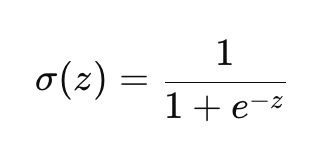
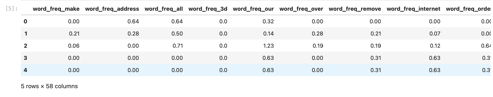
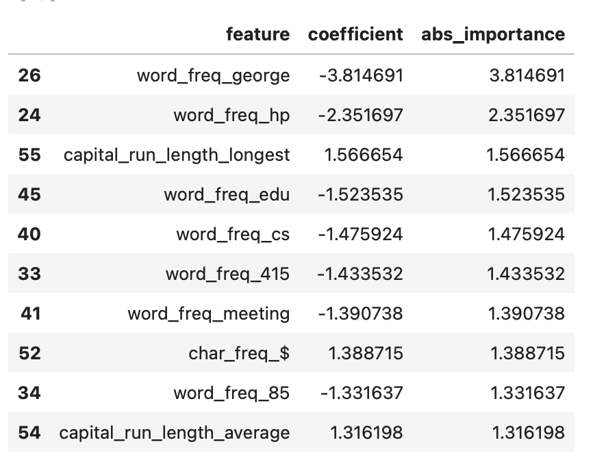

# LOGISTIC REGRESSION

When you first hear the term “Logistic Regression,” it sounds like something complicated from a math textbook. In reality, it is one of the most approachable and friendly machine learning algorithms you will ever learn. In fact, most data scientists and ML engineers start with Logistic Regression because it gives you a simple, interpretable, and surprisingly powerful way to make predictions about real-world problems. The goal of this lesson is to guide you step-by-step, so by the end you’ll feel confident explaining how Logistic Regression works without relying on formulas or heavy math.

## What problem does Logisic Regression solve? 

Let’s start with a simple question: when would someone even use Logistic Regression? Imagine you are building a system that reads emails and decides whether each one is spam or not spam. Or maybe you are trying to predict whether a customer will buy a product, whether a patient has a disease, or whether a transaction is fraudulent. All of these tasks share the same structure: there are only two possible outcomes. Logistic Regression is built exactly for this kind of problem. It is a binary classifier, meaning it tries to split the world into two groups, like yes/no, true/false, spam/not spam, or 1/0. But what makes Logistic Regression special is that it doesn’t just say “yes” or “no.” It produces a probability, which makes its predictions smoother, more interpretable, and incredibly useful in practical settings.

## THE BIG IDEA 

At its heart, logistic regression asks:
“How strongly do the input features suggest that this example belongs to class 1 instead of class 0?”

To answer this question, logistic regression starts with something familiar:
it uses the same idea as **linear regression**.

Before it becomes a classifier, it behaves like a linear model: taking all your input features, multiplying them by learned weights, adding them together, and producing a single score.

Something like this:

 ```
 z=b0​+b1​x1​+b2​x2​+…
 ```

 If this were ordinary linear regression, the model would output that number directly.

 But we can’t use raw numbers for classification. A score like 4.3 or –2.8 doesn't tell us “spam” or “not spam,” let alone the probability. So logistic regression takes this linear score, feeds it through a special transformation, and turns it into a clear probability between 0 and 1.

That transformation is the star of this algorithm: the **sigmoid function.**

## The Sigmoid Function

Right after the linear part produces a number like –5 or +7, logistic regression passes that value to the sigmoid.


Now look at the curve. It’s smooth, soft, and shaped like the letter “S.” What this function does is beautifully simple:

Large negative numbers get squeezed near 0
Large positive numbers get pushed toward 1
Numbers near zero end up close to 0.5

The formula is:  

but you don’t need to memorize it. What you need to understand is its *behavior*.

If the weighted sum of features produces a small value (something like –3), the sigmoid outputs a tiny probability, maybe around 0.05. If the model produces a large value (like +4), the sigmoid outputs something like 0.98. These are clean, intuitive probabilities.

This is what makes logistic regression special. You don’t just get a hard “yes/no.”
You get how confidently the model believes its answer.

A probability of 0.52 might mean “a toss-up, but slightly leaning toward class 1,” while 0.98 means “I’m almost certain.”

This probabilistic nature is why logistic regression is loved in fields like medicine, finance, and social sciences. You can interpret and explain what the model is thinking.

If you prefer to read a gentle text explanation with intuition and analogies, this Medium article breaks it down very clearly: https://medium.com/%40roseserene/back-to-basics-logistic-regression-less-math-more-intuition-e473aebcf64a

## Logistic Regression as a Classifier (The Decision Boundary)

Once we have a probability, we need to make a final decision: should this example be class 0 or class 1?

Most commonly, logistic regression uses 0.5 as a threshold:
- Probability > 0.5 → class 1
- Probability < 0.5 → class 0

But here is where logistic regression shows its structure. Because the “z” value inside the sigmoid comes from a linear combination of features, the surface separating the two classes is a straight line (or a plane, in higher dimensions). 

This means logistic regression is looking for one clean dividing boundary.

If KNN makes decisions by looking at the closest neighbors,
and Decision Trees build decisions by splitting the data into rule-based steps,
logistic regression draws one smooth linear boundary between the classes.

This makes it incredibly easy to interpret:
- If a weight is positive, that feature pushes the example toward class 1
- If it’s negative, that feature pushes it toward class 0
- The magnitude of the weight tells you how influential the feature is 

You can watch this YouTube video for another high-level, visual explanation of logistic regression and how it works: https://www.youtube.com/watch?v=yIYKR4sgzI8


### An Example Intuition (Spam Classifier)

Suppose you’re building a spam detector. Logistic regression might notice:
- Emails with lots of exclamation marks → more likely spam
- Emails with frequent business terms → less likely spam
- Emails with “free,” “credit,” or “money” → more likely spam

Each of these gets a weight:

- A positive weight means “more of this pushes toward spam”
- A negative weight means “more of this pushes toward not spam”

All these weighted pieces get added together into the “z” score. The sigmoid then converts that score into something like 0.89, meaning an 89% chance of spam.

## How Logistic Regression Learns

The model starts with random weights. It sees each training email and asks:

`“How wrong was my guess?”`

It then adjusts the weights a little bit to reduce future errors. This is done using a method called gradient descent, which is basically the model taking tiny steps downhill on an error curve.

Even without the math:
think of the model learning like a student practicing flashcards,  improving a bit every time it makes a mistake.


## When Logistic Regression is a great choice

Logistic Regression is usually a great choice when the relationship between your features and the outcome is *roughly linear*. That doesn’t mean perfect straight lines everywhere, but it does mean that as a feature increases, the likelihood of the outcome tends to increase or decrease in a steady, predictable way. In those situations, Logistic Regression fits naturally. It also shines when you want something fast to train, simple to understand, and not too computationally heavy. If your dataset isn’t enormous or if the classes are separated reasonably well in the feature space, Logistic Regression can perform surprisingly well. One of its strengths is that it gives probabilities rather than just a yes/no answer, which helps it express uncertainty in a realistic way.

But like any model, it has limitations. Logistic Regression can only draw linear boundaries between classes, which means if the data falls into swirling or curved patterns, the model will struggle unless you create new features or use polynomial transformations. It can also become unstable when your features are highly correlated with each other, which is why regularization is often helpful. Outliers can pull the decision boundary too far in one direction, and extremely imbalanced classes can cause the model to assign misleading probabilities unless you handle the imbalance with care.

Now that you understand the intuition, strengths, and weaknesses of Logistic Regression, we’re ready to put everything into action. In the next section, we’ll walk through a complete coding example where we load a dataset, train a logistic regression classifier, visualize some results, and interpret what the model learned.

## From Idea to Code: Our Logistic Regression Workflow

Before we dive into the code, let’s take a step back and look at the entire journey our data will take.

Below is a workflow diagram that shows the full pipeline of what we’re about to build using Logistic Regression - from raw data all the way to model evaluation.

You don’t need to memorize this diagram, and we are not going to explain every box right now. Instead, think of it as a *map*. As we move through the code, we’ll keep coming back to different parts of this map so you always know where you are and why you’re doing something.

### The Workflow 

Load Dataset (df)
    ↓
Separate Features and Target
X = df without "spam_label"
y = spam_label
    ↓
Train-Test Split 
(protect test data from leakage)
    ↓
Lock Away Test Data
X_test, y_test  → untouched until evaluation
    ↓
────────────────────────────────────────
Intuition Building Phase
────────────────────────────────────────
    ↓
Manually Select 1 Intuitive Feature
(capital_run_length_longest)
    ↓
Fit Scaler ONLY on X_train (1 feature)
    ↓
Transform:
X1_train → scaled
X1_test  → scaled
    ↓
Train Logistic Regression (1 feature)
    ↓
Visualize:
Probability Curve & Decision Threshold
    ↓
────────────────────────────────────────
Feature Interaction Phase
────────────────────────────────────────
    ↓
Manually Select 2 Intuitive Features
(capital_run_length_longest, char_freq_$)
    ↓
Fit Scaler ONLY on X_train (2 features)
    ↓
Transform:
X2_train → scaled
X2_test  → scaled
    ↓
Train Logistic Regression (2 features)
    ↓
Visualize:
2D Decision Boundary
    ↓
────────────────────────────────────────
Full Model Phase
────────────────────────────────────────
    ↓
Scale ALL Features
(fit scaler only on X_train)
    ↓
Transform:
X_train → scaled
X_test  → scaled
    ↓
Train Logistic Regression (all features)
    ↓
Interpret Model:
Extract Feature Coefficients
    ↓
Identify Strongest Features
    ↓
────────────────────────────────────────
Evaluation Phase (Final Step)
────────────────────────────────────────
    ↓
Evaluate on Untouched Test Data:
Confusion Matrix
Accuracy
Precision
Recall
F1 Score
Classification Report


Everything we do in code will follow this exact path. If at any point you feel confused later, you can come back to this diagram and ask yourself, “Which step am I in right now?” 

### Let’s Start Coding: 1. Importing the Tools We Need

We’ll begin by importing the libraries that help us work with data, visualize patterns, and build our Logistic Regression model.

As you read through this code, don’t worry if some imports feel unfamiliar. What matters is understanding why each group of tools exists. We’ll see them in action very soon.

```python
# Import Core Libraries
import numpy as np
import pandas as pd
import matplotlib.pyplot as plt

```
NumPy helps us work with numbers, Pandas helps us work with tables of data, and Matplotlib lets us create visualizations so we can actually see what our model is doing. 

We also include a small piece of code to suppress warnings. This doesn’t change how the model works, it simply keeps the output clean and easier to read while we’re learning.

```python
import warnings
warnings.filterwarnings("ignore", category=RuntimeWarning)

```

Next, we import the machine learning tools from scikit-learn. This is where Logistic Regression and most of the modeling utilities come from.

```python
# Import Scikit-Learn Components
from sklearn.linear_model import LogisticRegression
from sklearn.preprocessing import StandardScaler
from sklearn.model_selection import train_test_split
from sklearn.metrics import (
    confusion_matrix,
    accuracy_score,
    precision_score,
    recall_score,
    f1_score,
    classification_report
)

# Visualization helper
from sklearn.inspection import DecisionBoundaryDisplay

```

## 2. Loading the Dataset

For this lesson, we’ll use a classic dataset for spam detection. Each row represents an email, and each feature describes something measurable about that email like how often certain words appear or how many capital letters it contains.

We start by downloading the dataset directly from an online source.

```python
import requests
from io import BytesIO

```

We also define column names so the data is easier to understand once it’s loaded.

```python
COLUMN_NAMES = [
    "word_freq_make",        # 0   percent of words that are "make"
    "word_freq_address",     # 1
    "word_freq_all",         # 2
    "word_freq_3d",          # 3   almost never appears
    "word_freq_our",         # 4
    "word_freq_over",        # 5
    "word_freq_remove",      # 6   common in "remove me from this list"
    "word_freq_internet",    # 7
    "word_freq_order",       # 8
    "word_freq_mail",        # 9
    "word_freq_receive",     # 10
    "word_freq_will",        # 11
    "word_freq_people",      # 12
    "word_freq_report",      # 13
    "word_freq_addresses",   # 14
    "word_freq_free",        # 15  classic spam word
    "word_freq_business",    # 16
    "word_freq_email",       # 17
    "word_freq_you",         # 18
    "word_freq_credit",      # 19
    "word_freq_your",        # 20  often high in spam
    "word_freq_font",        # 21  HTML emails
    "word_freq_000",         # 22  "win $ x,000" style offers
    "word_freq_money",       # 23  money related
    "word_freq_hp",          # 24  HP specific
    "word_freq_hpl",         # 25
    "word_freq_george",      # 26  specific HP person
    "word_freq_650",         # 27  area code
    "word_freq_lab",         # 28
    "word_freq_labs",        # 29
    "word_freq_telnet",      # 30
    "word_freq_857",         # 31
    "word_freq_data",        # 32
    "word_freq_415",         # 33
    "word_freq_85",          # 34
    "word_freq_technology",  # 35
    "word_freq_1999",        # 36
    "word_freq_parts",       # 37
    "word_freq_pm",          # 38
    "word_freq_direct",      # 39
    "word_freq_cs",          # 40
    "word_freq_meeting",     # 41
    "word_freq_original",    # 42
    "word_freq_project",     # 43
    "word_freq_re",          # 44  reply threads
    "word_freq_edu",         # 45
    "word_freq_table",       # 46
    "word_freq_conference",  # 47
    "char_freq_;",           # 48  frequency of ';'
    "char_freq_(",           # 49  frequency of '('
    "char_freq_[",           # 50  frequency of '['
    "char_freq_!",           # 51  exclamation marks (often big)
    "char_freq_$",           # 52  dollar sign (money related)
    "char_freq_#",           # 53  hash character
    "capital_run_length_average",  # 54  average length of capital letter runs
    "capital_run_length_longest",  # 55  longest capital run
    "capital_run_length_total",    # 56  total number of capital letters
    "spam_label"                    # 57  1 = spam, 0 = not spam
]

url = "https://archive.ics.uci.edu/ml/machine-learning-databases/spambase/spambase.data"

response = requests.get(url)
response.raise_for_status()

df = pd.read_csv(BytesIO(response.content), header=None)
df.columns = COLUMN_NAMES
df.head()

```

When you run this cell, you’ll see the first few rows of the dataset.



This is your first chance to visually confirm that the data looks reasonable and structured.

At this stage, we are still in the “**Load Dataset**” box of our workflow diagram.

## 3. Seperating Features and Target

Now we split the data into two parts:
- X: the input features (what the model learns from)
- y: the target label (spam or not spam)

```python
X = df.drop("spam_label", axis=1)
y = df["spam_label"]

```
This step is simple, but extremely important. Logistic Regression learns a relationship between X and y, so they must be clearly separated.

## 4. Protecting Ourselves from Data Leakage: Train–Test Split

Next, we split the data into training and testing sets.

X_train, X_test, y_train, y_test = train_test_split(
    X, y, test_size=0.2, random_state=42, stratify=y
)

This is one of the most important steps in machine learning.

The model will only learn from the training data. The test data is kept hidden until the very end, so we can honestly evaluate how well the model performs on unseen data.

We also use stratification to make sure the proportion of spam and non-spam emails stays consistent across both sets. This ensures a fair evaluation.

Once the split is done, the test data is off-limits until evaluation time.

## 5. Manually Selecting a Single Feature

At this point, we have all features available in `X_train` and `X_test`.
However, instead of immediately training a model with dozens of features, we are going to slow down and take a deliberate step.

We will start by training Logistic Regression using just one carefully chosen feature.

Because this allows us to clearly understand what the model is learning and visually interpret how Logistic Regression separates spam vs non-spam and build intuition before adding more complexity. 

Choosing Feature 1: `capital_run_length_longest`

We begin by selecting a feature that has a strong intuitive relationship with spam. This feature measures the length of the longest sequence of consecutive capital letters in an email.

```python
# Feature 1: capital_run_length_longest
feature_1 = ["capital_run_length_longest"]

# Now that we’ve chosen our feature, we extract it from the training and test datasets.
X1_train = X_train[feature_1]
X1_test = X_test[feature_1]
```

## 6. Feature Scaling 

Before we train our Logistic Regression model, we need to take one more important step: feature scaling.
Even though we are currently working with just one feature, the scale of that feature still matters. Logistic Regression learns by adjusting weights based on numerical values, and features with larger numeric ranges can dominate the learning process if they are left unscaled.
To prevent this, we standardize the feature so the model learns from relative patterns, not raw magnitudes.

```python
# Feature Scaling
scaler_1 = StandardScaler()

X1_train_scaled = scaler_1.fit_transform(X1_train) # Fit only on training data

# Transform test with same scaling
X1_test_scaled = scaler_1.transform(X1_test)
```

Here we use something called `StandardScaler`, which is a very common and beginner-friendly way to scale data.

When we call `scaler_1.fit_transform(X_train)`, the scaler learns the statistics only from the training set. This prevents information from the test set from leaking into the model. If we were to fit the scaler on all the data, the model would indirectly “peek” at the test set, which would make our evaluation unreliable.

After fitting the scaler on `X1_train`, we use the same scaler to transform both the training and test sets. This keeps them comparable while maintaining fairness.

## 7. Training the Logistic Regression using one Feature

Now that our feature is scaled and ready, we can train our Logistic Regression model.

```python
# Train Logistic Regression Model with 1 feature
log_reg_1 = LogisticRegression(
    max_iter=1000,
    solver="liblinear"
)
log_reg_1.fit(X1_train_scaled, y_train)
```

Here, we create a Logistic Regression model and set a couple of important parameters. `max_iter` controls how many optimization steps the model is allowed to take while learning. We increase this value to make sure the model has enough opportunity to converge.
The `liblinear` solver is a reliable choice for smaller datasets and works well when using one or a few features.

The real learning happens when we call the `.fit()`function. In machine learning,`.fit()` is a very common function name, and it always means the same idea: *learn patterns from the training data*. When we write `log_reg1.fit(X1_train_scaled, y_train)`, we are explicitly telling the model, “Here are the inputs, and here are the correct answers, figure out the best way to connect them.”

At this point, the model has learned a decision boundary based only on `capital_run_length_longest`, and it is ready to be evaluated on unseen data.

## 8. 1-Feature Decision Boundary

Now that the model is trained, we want to see what it has learned.
Since we are using only one feature, we can directly visualize how Logistic Regression converts feature values into probabilities.

```python
# Generate smooth input range
x_range = np.linspace(
    X1_train_scaled.min(),
    X1_train_scaled.max(),
    300
).reshape(-1, 1)

```
Here, we generate a smooth range of values that spans the minimum to maximum of the scaled training feature. This does not represent actual emails. Instead, it creates evenly spaced inputs so we can observe how the model behaves across the entire feature range.
We reshape the data so it matches the format expected by the model.

### Predicting Spam Probabilities

`# Predict probabilities
y_probs = log_reg_1.predict_proba(x_range)[:, 1]
`
The model outputs probabilities for both classes: non-spam and spam.
By selecting the second column, we extract the probability that an email is classified as spam. This gives us a smooth probability curve rather than just yes/no predictions.


```python
# Plotting the Data and the Model
plt.figure(figsize=(8, 5))
plt.scatter(X1_train_scaled, y_train, alpha=0.2, label="Emails")
plt.plot(x_range, y_probs, color="red", linewidth=2, label="Spam Probability")
plt.axhline(0.5, linestyle="--", color="gray")
plt.xlabel("Scaled Longest Capitalization Run")
plt.ylabel("Probability of Spam")
plt.title("Logistic Regression with One Feature")
plt.legend()
plt.show()
```


This graph shows how Logistic Regression uses one feature `the scaled longest run of capital letters` to estimate the probability that an email is spam.

The x-axis represents the scaled feature values, and the y-axis shows the predicted probability of spam. Each blue dot is a real email from the training data, plotted at either 0 (not spam) or 1 (spam).

The red curve shows how the model’s predicted probability changes as capitalization increases. At very low capitalization values, the model assigns a low spam probability. As the capitalization run increases, the probability rises sharply and quickly approaches 1.

The dashed line at 0.5 marks the decision threshold. Once the red curve crosses this line, the model begins classifying emails as spam. The steep shape of the curve indicates that this feature is a strong signal in the dataset. Even moderate capitalization is enough for the model to become highly confident that an email is spam. 

This visualization helps us see that Logistic Regression is not making a sudden yes/no decision. Instead, it smoothly converts feature values into probabilities and then applies a threshold to classify emails.

## 9. Adding a Second Feature to the Model

So far, we trained Logistic Regression using a single feature. Now, we take the next step by adding a second intuitive feature to give the model more information.

The feature `char_freq_$` measures how frequently the dollar sign appears in an email. Since spam emails often involve money, prizes, or financial offers, this feature is another strong and easily interpretable indicator of spam.

```python
# Adding a second Intuitive Feature
# Feature: char_freq_$

features_2 = [
    "capital_run_length_longest",
    "char_freq_$"
]

X2_train = X_train[features_2]
X2_test = X_test[features_2]

```
Here, we define a list containing both features we want the model to use. By combining capitalization patterns with money-related symbols, we allow the model to learn from two complementary signals instead of just one. 

Finally, we extract these two features from the training and test sets. The training data will be used to learn how the two features interact, while the test data remains untouched for later evaluation.

At this point, we are moving from a one-dimensional view of the problem to a two-dimensional one. This sets the stage for visualizing a decision boundary instead of a simple probability curve, and helps us see how Logistic Regression combines multiple features to make more informed decisions.

## 10. Scaling the Two Selected Features

Now that we are using two features, we apply the same scaling process as before. 

```python
# scaling feauture_2

scaler_2 = StandardScaler()
X2_train_scaled = scaler_2.fit_transform(X2_train)
X2_test_scaled = scaler_2.transform(X2_test)
```
We create a new scaler to standardize both features together. The scaler is fit only on the training data and then applied to both the training and test sets. This ensures that both features are on a comparable scale and that no information from the test set leaks into the training process.

## 11. Training Logistic Regression with Two Features

```python
# Train Logistic Regression with 2 features
log_reg_2 = LogisticRegression()
log_reg_2.fit(X2_train_scaled, y_train)

```
Here, we train a new Logistic Regression model using two features instead of one. The model now learns how capitalization patterns and dollar-sign frequency work together to distinguish spam from non-spam emails.

By fitting the model on the scaled training data, Logistic Regression finds a decision boundary in two dimensions, allowing it to make more informed predictions than with a single feature alone.

## 12. Plotting the Decision Boundary for Two Features

After training the Logistic Regression model with two features, we want to understand how the model is making decisions across the feature space. To do this, we visualize the decision boundary learned by the model.

```python
plt.figure(figsize=(7, 6))

DecisionBoundaryDisplay.from_estimator(
    log_reg_2,
    X2_train_scaled,
    response_method="predict",
    cmap="coolwarm",
    alpha=0.3
)

plt.scatter(
    X2_train_scaled[:, 0],
    X2_train_scaled[:, 1],
    c=y_train,
    cmap="coolwarm",
    edgecolor="k",
    alpha=0.5
)

plt.xlabel("Scaled Longest Capital Run")
plt.ylabel("Scaled Dollar Sign Frequency")
plt.title("Decision Boundary Using Two Spam Indicators")
plt.show()

```

This time, we get a 2D decision boundary. The background colors show which regions of the feature space are classified as spam or not spam, and each dot is still a real email.

To create this visualization, we used Scikit-Learn’s **DecisionBoundaryDisplay**, which automatically shows how the trained Logistic Regression model separates the feature space into spam and non-spam regions. This saves us from manually computing predictions and makes the decision boundary easy to interpret.


### Interpreting the Decision Boundary

The colored background shows how Logistic Regression divides the feature space into spam and non-spam regions. The line where the colors change represents the decision boundary.

Emails that fall on one side of the boundary are classified as spam, while those on the other side are classified as non-spam. The plot shows how the model combines both capitalization patterns and dollar sign frequency to make its decisions.

This visualization highlights the key idea that adding features allows the model to make more nuanced decisions than a single-feature model, while still remaining interpretable.

## 13. Scaling All Features for the Full Model

Up to this point, we explored Logistic Regression using one and then two carefully chosen features to build intuition. Now, we move to the final step: training a model using all available features.

Before doing that, we need to scale the entire feature set.

```python
# Scale all features 
scaler_full = StandardScaler()
X_train_scaled = scaler_full.fit_transform(X_train)
X_test_scaled = scaler_full.transform(X_test)

```
We create a new scaler that will be applied to every feature in the dataset.

As before, the scaler is fit only on the training data and then applied to both the training and test sets. This ensures that all features are on a comparable scale and that no information from the test set influences the training process.

## 14. Training the Full Logistic Regression Model

Now that all features have been scaled, we can train the final Logistic Regression model using the complete feature set.

```python
# Train full model
log_reg_full = LogisticRegression(max_iter=1000, solver="liblinear")
log_reg_full.fit(X_train_scaled, y_train)

```
In this step, the model learns from all available features at once. Logistic Regression combines signals from words, characters, and capitalization patterns to find the best decision boundary that separates spam from non-spam emails.

## 15. Interpreting the Model Using Feature Coefficients

After training the full Logistic Regression model, we can examine which features influence the model’s decisions the most.

```python
# Feature Coefficients (Interpretability)
coef_df = pd.DataFrame({
    "feature": X.columns,
    "coefficient": log_reg_full.coef_[0]
})

coef_df["abs_importance"] = coef_df["coefficient"].abs()
coef_df.sort_values("abs_importance", ascending=False).head(10)
```
This code creates a table that pairs each feature with its learned coefficient. In Logistic Regression, coefficients represent how strongly a feature pushes the prediction toward spam or non-spam.



We take the absolute value of each coefficient to measure its overall importance, regardless of direction. Sorting by this value highlights the features that have the greatest impact on the model’s decisions.

## 16. Final step: Evaluating the Model on Unseen Data

So far, everything we’ve seen used training data. Now comes the most important moment: evaluation on untouched test data.

```python
y_pred = log_reg_full.predict(X_test_scaled)
```

We then compute multiple evaluation metrics.

```python
print("Confusion Matrix:\n", confusion_matrix(y_test, y_pred))
print("Accuracy:", accuracy_score(y_test, y_pred))
print("Precision:", precision_score(y_test, y_pred))
print("Recall:", recall_score(y_test, y_pred))
print("F1 Score:", f1_score(y_test, y_pred))

print("\nClassification Report:\n")
print(classification_report(y_test, y_pred))
```

Each metric tells a slightly different story about model performance, especially in a spam-detection problem where false positives and false negatives matter.

OUTPUT: 


Now let’s interpret how well our Logistic Regression model performed on the unseen test data.

We’ll start with the confusion matrix: Out of all non-spam emails (class 0), the model correctly identified 530 emails as not spam, but 28 non-spam emails were mistakenly flagged as spam. For spam emails (class 1), the model correctly detected 326 spam messages, while 37 spam emails slipped through and were predicted as non-spam. This tells us the model is strong overall, but like any real system, it still makes a small number of mistakes in both directions.

Next, let’s look at the accuracy, which is **0.92**. This means the model correctly classified about 92% of all test emails. While accuracy gives a quick high-level view, it doesn’t tell the full story by itself especially for problems like spam detection where false positives and false negatives matter differently.

That’s why precision and recall are important. The precision score is 0.92, which means that when the model predicts an email is spam, it is correct 92% of the time. This is important because it shows the model is not overly aggressive in labeling emails as spam. 

The recall score is 0.90, meaning the model successfully catches about 90% of all actual spam emails. A small portion of spam still gets through, but most of it is detected.

The F1 score is 0.91, which balances precision and recall into a single number. This tells us that the model maintains a good trade-off between catching spam and avoiding false alarms.

The classification report breaks this down further by class. For non-spam (class 0), the model achieves 95% recall, meaning it almost always correctly recognizes legitimate emails. For spam (class 1), the recall is 90%, which is still strong and expected in real-world spam filtering. The weighted averages across both classes remain around 0.93, showing consistent performance across the dataset.

Overall, these results show that Logistic Regression performs very well on this problem. It learns a clean linear boundary, provides strong predictive performance, and most importantly gives us interpretable metrics that help us understand exactly how and where the model succeeds or fails.

## Check for Understanding: 

1. What is the main role of the sigmoid function in Logistic Regression?

- A. To scale features between −1 and 1
- B. To convert a linear combination of features into a probability between 0 and 1
- C. To select the most important features
- D. To draw multiple decision boundaries
<details> <summary><strong>Click to reveal answer</strong></summary>
Correct answer: B
</details>

2. Why do we fit the StandardScaler only on the training data and not on the test data?

- A. To make training faster
- B. To reduce model complexity
- C. To prevent information leakage from the test set
- D. To increase accuracy artificially
<details> <summary><strong>Click to reveal answer</strong></summary>
Correct answer: C
</details>

3. Which statement best describes the decision boundary learned by Logistic Regression?

- A. It learns multiple curved boundaries
- B. It memorizes training points like KNN
- C. It learns a single linear boundary separating the classes
- D. It builds a tree of if-else rules
<details> <summary><strong>Click to reveal answer</strong></summary>
Correct answer: C
</details>

4. In the feature importance output, what does a large absolute coefficient value indicate?
- A. The feature has many missing values
- B. The feature strongly influences the prediction
- C. The feature is perfectly correlated with others
- D. The feature must be removed
<details> <summary><strong>Click to reveal answer</strong></summary>
Correct answer: B
</details>

5. Which metric is most important when you want to minimize false positives in spam detection?
- A. Accuracy
- B. Recall
- C. Precision
- D. F1 Score
<details> <summary><strong>Click to reveal answer</strong></summary>
Correct answer: C
</details>


## Lesson Wrap up: 

Well done 🎉 Congratulations on completing the Logistic Regression lesson!
In this lesson, we built a full intuition for Logistic Regression, from how it turns linear combinations of features into probabilities using the sigmoid function, to how it learns a single, interpretable decision boundary for binary classification. We trained a real spam classifier end-to-end, explored feature importance to see how the model “thinks,” visualized decision boundaries with one and two features, and evaluated performance using accuracy, precision, recall, F1 score, and the confusion matrix. Along the way, we emphasized best practices like train–test splitting, scaling correctly to avoid data leakage, and interpreting results rather than treating the model as a black box.

 **Next up:** Now that we understand how machine learning works with structured, numeric data, we’ll move into Computer Vision, where models learn from images and pixels instead of rows and columns.

