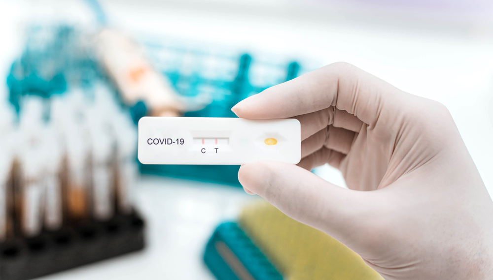
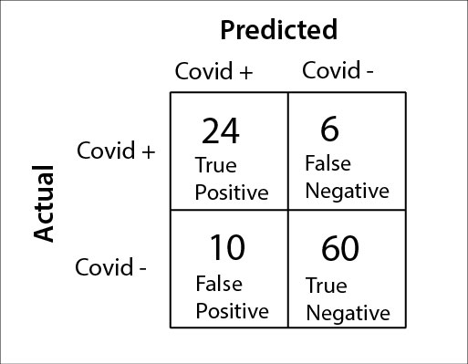

# Understanding Classification Metrics 
Before we begin to work with real classifers, we should discuss how we will *evaluate* their performace -- how good is a classifer? For this we will use a real-world classification machine: a Covid test.



A covid test is a **real-life classifier**. It takes an input (a biologial sample), processes it internally via a chemical reaction, and outputs a prediction: 'positive' or 'negative'. Also, like any classifier from ML, it sometimes gets things right and sometimes gets things wrong. This makes it an instructive way to learn about how to evaluate errors in ML. 

While covid tests are not implementing ML algorithms, we will use these real-life classifiers to understand different metrics to evaluate classifier performance. Then, when we use scikit-learn to build ML models, we will evaluate them using *these exact same metrics*.

If you prefer a video explanation, this short 10-minute walkthrough does a good job explaining the confusion matrix, precision, recall, and F1 score using simple examples. It matches the concepts we introduce in this lesson and reinforces them visually:
[Evaluating a classifier](https://www.youtube.com/watch?v=-ORE0pp9QNk)

## From test results to the confusion matrix
To evaluate a classifier, we need to have a ground-truth. Let's imagine 100 patients come to a clinic with signs of illness and that we know that 

- 30 patients actually have Covid  
- 70 patients do NOT have Covid  

These are the true labels. Let's also say that they are all given a rapid Covid test. We want to know how good it is. Suppose the rapid Covid test produces the following predictions:

- Of the 30 people who have Covid:
  
  - 24 test positive (true positives)
  - 6 test negative (misses, or false negatives)  

- Of the 70 people who do *not* have Covid: 
  - 10 test positive (false alarms)  
  - 60 test negative (true negatives)

To clearly see how Covid test performed, we can organize the results in a small table called a **confusion matrix**. The rows represent the actual condition (Covid or not), and the columns represent the tests prediction (positive or negative). This gives us a clean way to see all four possibilities in one place: correct positives, correct negatives, false positives, and false negatives.



It is called a confusion matrix because while the numbers along the main diagonal represent correct predictions, the numbers off the diagonal show how "confused" the classifier is, revealing the pattern of errors. 

We use abbreviations below for some of these numbers:

  - TP = True Positive  = 24  
  - FN = False Negative = 6  
  - FP = False Positive = 10  
  - TN = True Negative  = 60  
  
Also, we will typically denote the total number of tests given as `N` (which in this case is 100). 
  
All of the metrics we use to evaluate a classifier come from these four numbers. It is really important to understand this deceptively simple representation of the performance of the classifier. 

We will look at four metrics commonly used to evaluate classifier performance: accuracy, precision, recall, and F1 (which is a combination of precision and recall). 

### Accuracy
What percent of predictions were correct overall? This is the total number of correct predictions divided by the total number of tests. In this case it is: 

```
accuracy = (TP + TN) / N
accuracy = (24 + 60) / 100
accuracy = 84 percent
```

Accuracy is the first thing most people want to know about a classifier: "Out of all the cases, how many did it get right?"

This is helpful because it gives one simple overall number. However, accuracy has well-known limitations: for one, it does not tell us what *kinds* of mistakes the test made.

Two classifiers can have the same accuracy but behave very differently, one might have lots of false positives, another might have lots of false negatives, and a third may have a balance between the two. This is useful to know. It would be useful to have measures that can distinguish such cases.

You should trust a Covid test when it tells you that you have Covid: that is, if it has a very low false positive rate. Is there some metric that summarizes this particular aspect of a classifier? It turns out there is, it is called the *precision*. A classifier (or a Covid test) can have moderate accuracy but very high precision. 

### Precision 
Precision focuses on cases when the test says someone has Covid (the left column of the confusion matrix). A test with low precision produces many false positives, which can cause unnecessary worry, extra doctor visits, or unneeded medication.

We can think of this as a "trustworthiness" metric. [The boy who cried wolf](https://en.wikipedia.org/wiki/The_Boy_Who_Cried_Wolf) would have a very low precision score. 

A test with high precision, on the other hand, is very trustworthy: when it says someone has Covid, it is usually right. You can calculate it solely from the elements along the left column of the confusion matrix:

```
precision = TP / (TP + FP)
precision = 24 / (24 + 10)
precision = 24 / 34
precision = 70.6 percent
```

### Recall (aka Sensitivity)
We've discussed how trustworthy the test is when it says someone has Covid. But there is another way to look at things. If someone has Covid, how likely is the test to actually detect it, how *sensitive* is the test to covid. 

Recall — also called sensitivity — focuses on the people who actually have Covid: the top row of the confusion matrix. It asks: "Out of all the people who truly have Covid, how many did the test catch?" A super-sensitive test will correctly identify all of them (no *false negatives*). 

That is, recall measures the proportion of false negatives (or *misses*) among those that actually are positive: what proportion slipped through the cracks. 

Calculating recall from the confusion matrix cells can be done using only the elements from the top row of the confusion matrix:
```
recall = TP / (TP + FN)
recall = 24 / (24 + 6)
recall = 24 / 30
recall = 80 percent
```

### F1 Score: A balanced metric
Precision highlights false positives, and recall highlights false negatives. Is there a metric that gives us a sense for the classifier performance generally? Isn't that *accuracy*? 

Accuracy may seem like a great measure at first: just count how often the classifier is correct. As we saw above, it hides the pattern of errors (it won't tell you if your classifier gets more false positives or false negatives). 

Another problem with accuracy, not mentioned above, is that it can be very misleading when one category is much more common than the other, which is when you have *imbalanced* data. For example, if only 2 out of 100 people have Covid. A "classifier" that simply predicts negative for everyone would be right 98% of the time -- an impressive accuracy number! However, it completely fails to detect any of the real Covid cases (zero recall/sensitivity). In other words, overall accuracy can look great even when the classifier is doing a terrible job at the task you actually care about.

This is why there is an alternative to accuracy called the F1 score. It is a weighted sum of precision and recall, and will be high if both are high, and low if *one* of them is low. So you can't "cheat" the measure by having high precision and low recall (or vice versa). Technically, it is the harmonic mean of the precision and recall. 

F1 is especially useful in situations where we cannot afford to ignore one type of error, or when the underlying data is imbalanced and accuracy could become a misleading metric. 

For those that want the math, F1 is a function of both precision and recall: 
   
$$
    F1 = 2\frac{\text{precision} \cdot  \text{recall}}{\text{precision}+\text{recall}}
$$

## Metrics in scikit-learn
Later in this lesson when we build algorithms, we will evaluate them using the *same metrics*:

- confusion matrix  
- precision  
- recall  
- accuracy  
- F1

These are all built into scikit-learn, and we can construct them from our example above. First, we can create a list of the actual covid cases (positive and negative), and the predictive cases. 

```python
# actual values: 100 people: 30 have covid, 70 do not
y_true =  ['covid +']*30 + ['covid -']*70
# predicted values:
# for positive cases: predictions: 24 tp, 6 fn
# for negative cases: predictions 10 fp, 60 tn
y_pred =  ['covid +']*24 + ['covid -']*6 + ['covid +']*10 + ['covid -']*60 
```

Let's import what we need from scikit-learn:

```python
import matplotlib.pyplot as plt
from sklearn.metrics import confusion_matrix, ConfusionMatrixDisplay
from sklearn.metrics import accuracy_score, precision_score, recall_score, f1_score
from sklearn.metrics import classification_report
```

### Confusion matrix 
From the actual and predicted outputs (y values) we can determine the pattern of correct/incorrect predictions from the Covid tests, and produce a confusion matrix:

```python
labels = ['covid +', 'covid -']
positive_label = 'covid +'
cm = confusion_matrix(y_true, y_pred, labels=labels)
print(cm)
```

This will give:

    [[24  6]
    [10 60]]

You can visualize this in a color-coded way using a built-in function:

```python
disp = ConfusionMatrixDisplay(confusion_matrix=cm,
                              display_labels=labels)
disp.plot(colorbar=False)
plt.title("COVID Test Confusion Matrix")
plt.show()
```

### Metrics
Given the ground truth data, and predictions, we can also calculate the four metrics using scikit-learn functions we imported.

```python
accuracy = accuracy_score(y_true, y_pred)
precision = precision_score(y_true, y_pred, pos_label=positive_label)
recall = recall_score(y_true, y_pred, pos_label=positive_label)
f1 = f1_score(y_true, y_pred, pos_label=positive_label)

print("Accuracy:", accuracy)
print("Precision (covid+):", precision)
print("Recall (covid+):", recall)
print("F1 score (covid+):", f1)
```
This will print out the same values we calculated by hand above! We already understand what these numbers mean. Now scikit-learn just saves us the arithmetic.

We are leaving one important detail out: we have only calculated precision, recall, and F1 for the `covid+` case. We'll get to that last piece of the classification evaluation puzzle next. 

## Multi-Class Classification: The Final Piece of the Puzzle
So far, to simplify our analysis, we have focused only on **one** category in our example: `covid +`, and evaluated how our classifier did on that one category. However, as we saw last week, most machine learning classifiers have multiple categories, for instance, they might be shown a picture and classify what type of animal it is (out of hundres), or what digit it is (out of ten). 

With *multiple categories* instead of calculating precision/recall/F1 for just one label, you calculate *all the scores for each category*.

This creates a natural question: How do we summarize the classifier’s performance across all classes? There are two standard ways this is done in scikit-learn. One, the *macro average*, in which each class contributes equally to the mean, no matter how many examples it has. Secondly, the *weighted average*, in which classes with with more data count more heavily.  

In other words, in multi-class classification, you end up with *multiple* precision/recall/F1 scores, so you need to average them to get a single summary score.

### Back to Covid: The classification report
Technically, even our Covid test has two classes (`covid +` and `covid -`). To simplify, we only focused on `covid +`. However,  `covid -` is also important: we could ask of everyone who is covid negative, how likely is the test to correctly identify them? This would be a *recall* measure for the `covid -` category (which could be calculated by looking along the bottom row of our confusion matrix). 

In general, to get a full summary of a classifier, for each category, and a average score across all categories, scikit-learn produces what is known as a `classification_report`. For our example:

```python
print(classification_report(y_true, y_pred))
```

Which outputs:

```
            precision    recall  f1-score   support #how many samples

covid +       0.71      0.80      0.75        30
covid -       0.91      0.86      0.88        70

accuracy                          0.84        100
macro avg     0.81      0.83      0.82        100
weighted avg  0.85      0.84      0.84        100
```

At the top, we see one row of metrics for `covid +` and another for `covid -` : this is the "one set of scores per class" idea in action. We just calculated the `covid +` metrics above.

Below that, scikit-learn lists the aggregatre metrics:
- **accuracy**: a single overall metric
- **macro avg** and **weighted avg**: the two multi-class summary measures we discussed above

Those bottom rows are exactly the multi-class averages we just discussed. These aggregated rows are not particularly interesting for a simple two-class COVID test, since our focus was mainly on detecting COVID cases. But once you work with more realistic multi-class problems—like digits, animals, or clothing categories—these averages become essential for understanding overall classifier performance.

### Which measure to use?  Yes
At this point, you might be wondering which metric is "best" or which one you should rely on. The answer is: all of them. Each metric highlights a different aspect of the classifier's behavior, and none of them tell the whole story by themselves.

- Accuracy gives you a quick sense of overall correctness, but it can hide important problems.
- Precision tells you how reliable the positive predictions are.
- Recall tells you how many true cases the model actually catches.
- F1 summarizes precision and recall together, making it harder for a model to hide a weakness in one area behind strength in the other.

The goal is not to pick a favorite metric. The goal is to use these measures together to understand how the classifier is making mistakes and whether those mistakes matter for the task you care about.

And sometimes the most helpful tool is the simplest one: the confusion matrix. It lays out every type of outcome in a single table -- true positives, false positives, false negatives, and true negatives -- so you can literally see where your classifier is succeeding and where it is failing. When in doubt, start with the confusion matrix, and let precision, recall, F1, and accuracy help you interpret what you see.

## Key Takeaways
We used a Covid test as our example because it is a simple, real-life classifier and makes the same types of mistakes all classifiers can make. The confusion matrix is the foundation of all classifier evaluation, and all metrics can be derived from it:

- Accuracy alone is not enough.  
- Precision measures false positives (false alarms like the boy who cries wolf).  
- Recall measures misses (false negatives).  
- F1 is a combination of precision and recall. 

Scikit-learn returns these same metrics, both for individual categories, and averaged across categories. 

We have been through a lot of discussion of how to evaluate classifiers. Hopefully you feel like you can go forward and determine if a classifier is "good" or not using the above metrics.