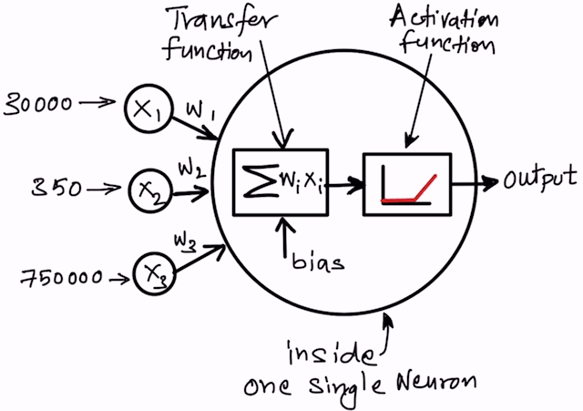

# Intro to Neural Networks and Deep Learning

Welcome to the exciting world of deep learning! In this lesson, we will introduce the core ideas behind neural networks and explain why deep learning has become such an important tool in modern data science and AI.

At a high level, deep learning is a style of machine learning where models learn *their own internal representations* from data. Instead of relying on hand-crafted rules or clever preprocessing of features, deep learning models automatically discover patterns by passing data through many layers of simple computational units called neurons, inspired by real biological neurons from the brain. 

These models are loosely inspired by biological brains, which are made up of large networks of interconnected neurons. Artificial neural networks are *not* realistic brain simulations, but they borrow one key idea from biology: intelligent behavior emerges from the collective activity of many simple units working together.

In this lesson, we will keep things light and intuitive. The goal is not to memorize equations, but to build a mental model that will make the hands-on work feel natural.

We will briefly cover the following topics:
- **Neural Network Basics**: An introduction to neural networks: what they are and how they learn from data.
- **The deep learning revolution**: How deep learning has transformed AI and enabled breakthroughs in various applications.
- **Deep learning frameworks**: A brief overview look at modern tools that make deep learning practical, setting the stage for hands-on work with PyTorch.

## Neural network basics

A neural network is built from layers of neurons stacked on top of each other. The first layer is called the *input layer*, the last layer is the *output layer*, and any layers in between are called *hidden layers*:

The above diagram is taken from an [excellent lesson on neural networks](https://www.geeksforgeeks.org/artificial-intelligence/artificial-neural-networks-and-its-applications/) from Geeks for Geeks, which we recommend that you go and check out. 

Each circle represents a neuron, and the lines between them represent connections with associated weights. Data flows from the input layer, through the hidden layers, to the output layer, where a prediction is made.

Each of those circles (neurons) in a neural network performs a very simple operation:
- It takes in numbers (inputs)
- Multiplies them by weights (which can be modified with learning)
- Adds them together (this is known as a weighted sum, or transfer function)
- Passes the result through a *nonlinear activation function* to produce an output.

This is all illustrated in the following diagram:

That last step is crucial. Without nonlinearity, even very large networks would behave like simple linear models. Nonlinear activation functions allow neural networks to learn arbitrarily complex patterns.

When data moves forward through the network to produce a prediction, this is called the **forward pass**.

To learn, the network compares its prediction generated in the output layer to the correct answer. The error is then sent backward through the network, and the weights in the network are adjusted using a process called *backpropagation*. During this **backward pass**, each weight is adjusted slightly to reduce error. Repeating this process many times allows the network to gradually improve. 

Based on the above, we can conclude that when designing a neural network, we need to specify a few things:
- The basic architecture (how many layers, the type of activation function in individual neurons).
- The *loss function* that measures how far off the network's predictions are from the true values.
- The *optimizer* that decides how to adjust the weights based on the calculated errors during backpropagation.

What is nice is that you don't have to implement these processes from scratch. As we will see below, modern deep learning libraries like PyTorch and TensorFlow handle the details of backpropagation and optimization for you. You just need to define the architecture, loss function, and optimizer, and the library takes care of the rest for you. For data engineers who are new to deep learning, this is a huge advantage. If you are building a pipeline, you don't need to be an expert in neural network mathematics to get started. You just need to understand the high-level concepts, and some of the ways to evaluate how well your model is performing, which we will cover in our hands-on lessons (and which we have already covered in our classical ML lessons).

## The deep learning revolution
Early neural networks date back to the 1950s, but progress was slow for many decades. Simple models, like the original perceptron, could only solve very limited problems. This led many researchers to believe neural networks were a dead end. 

The modern deep learning era began when two main ideas came together in the 2010s:
- **Multiple layers**, which let networks build hierarchical representations for complex problem spaces (in the 190s, most networks had only one or maybe two hidden layers). 
- **Computational power**, especially GPUs, which made training practical. 

These ideas proved especially powerful for images. Convolutional neural networks (CNNs) use layers that look at small regions of an image at a time and build up more complex representations of features in the images, from edges to shapes to objects. You will learn more about CNNs in the hands-on lesson later in this module. 

In 2012, CNNs started to dramatically outperform older methods in computer vision, triggering an explosion of interest that has not slowed down since. You will use and train a CNN in the hands-on portion of this course. It is hard to overstate how important this breakthrough was for AI. 

Before moving on, please watch the [video at this site](https://edhub.ama-assn.org/jn-learning/video-player/16845576) about how CNNS work. It is a great explanation with clear visuals.

Before CNNs, image recognition was a very difficult problem that only worked in limited settings. After CNNs, accurate image recognition became possible in many real-world applications, from medical imaging to self-driving cars.

The same basic neural network ideas now power systems for vision, speech, and language. While architectures continue to evolve, the foundations remain the same: lots of layers, learning through backpropagation, and many other tricks that we won't have time to cover in this introduction. In the future module on LLMs, we will discuss other architectures like transformers that have proven very effective for language tasks. But the core ideas of deep learning remain the same.

## Deep learning frameworks
Training neural networks from scratch would be extremely tedious without good tools. Deep learning frameworks like PyTorch, JAX, and TensorFlow provide everything needed to build, train, and evaluate neural networks efficiently.

These frameworks handle:
- Error calculation and backpropagation (automatic differentiation)
- Optimization algorithms for learning and adjusting weights
- GPU acceleration
- Providing pretrained models
- Common neural network building blocks

In this course, we will use **PyTorch**, a widely used framework known for its clear design and flexibility. It is very simple and Pythonic, so is comparatively easy to learn. It is known for its intuitive API, and strong community support (Tensorflow for instance, stopped supporting native GPU on Windows a few years ago).  You will focus on understanding models and data, not on implementing low-level math. This is so you will be able to build and deploy deep learning models as part of data engineering pipelines without needing to become an expert in neural network mathematics.

With these ideas in place, we are ready to move from concepts to practice. The next lessons will guide you through hands-on examples, starting simple and moving toward training a CNN. 
