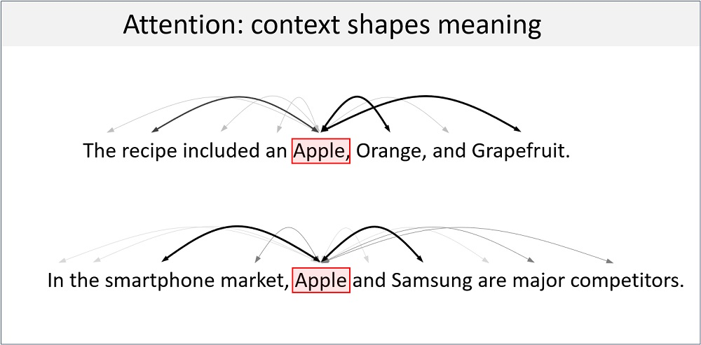
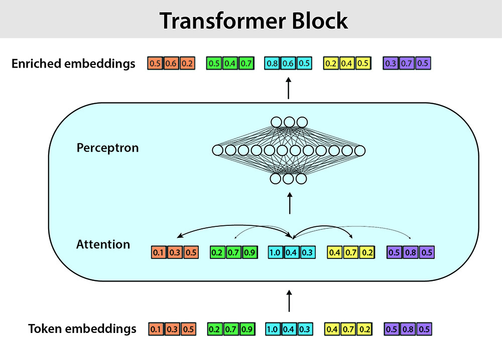

# Introduction: Large Language Models
Welcome to the first lesson in the AI module! In this lesson, you’ll get a behind-the-scenes look at how Large Language Models (LLMs) like ChatGPT work. We’ll start with a quick tour of natural language processing (NLP)--the field that helps computers understand and generate human language. 

## Overview of topics
- **1. Natural language processing**: an overview of the general field of natural language processing
- **2. Introduction to LLMs**: what are large language models, and how do they work?
- **3. LLM architecture**: a deeper dive into what makes LLMs tick.
- **4. Demo: Visualizing embeddings** Visualizing how meanings are represented in LLMs.

## 1. Natural language processing (NLP)
While we will provide a brief overview of NLP, we could easily spend an entire course on the topic. If you want to learn more about NLP, check out the following resources:

- [Overview from deeplearning.ai](https://www.deeplearning.ai/resources/natural-language-processing/)
- [YouTube video summary](https://www.youtube.com/watch?v=Uuz8ZTV5vdA)
- [Full Stanford online course](https://www.youtube.com/playlist?list=PLoROMvodv4rMFqRtEuo6SGjY4XbRIVRd4)

### What is NLP?
NLP is a subfield of artificial intelligence (AI) that aims to give computers the ability to process and generate meaningful human language. This is a very difficult problem: there is a wide gap between the subtle nuances of natural human communication, on one hand (things like slang, jokes, sarcasm, and cultural references), and the rigid, logical structures of computer programs on the other. 

The goals of NLP span a wide spectrum, including:
- *Text classification*: sorting content into predefined categories (e.g., spam)
- *Machine translation*: converting text from one language to another
- *Sentiment analysis*: determining the emotional tone a text as positive, negative, or neutral. 
- *Conversational AI*: building programs such as chatbots that engage in fluid, multi-turn dialogues. 

Ultimately, NLP aims to make human-computer interaction as intuitive as human-to-human exchanges, so it can be used in fields as diverse as healthcare diagnostics, explaining complex legal documents, and personalized education. 

### NLP Methods: A brief history
The field of NLP has evolved dramatically over the past 50 years—from rigid, rule-based systems to data-driven methods powered by machine learning and neural networks. In its early days, human experts manually encoded linguistic rules into NLP programs, but these rule-based systems were brittle and struggled with the variability of real-world language.

In the late 20th century, statistical methods introduced probabilities to model language patterns, paving the way for machine learning approaches that learn directly from data. Today, the dominant paradigm is deep learning. This is a subset of machine learning that uses multilayer neural networks to automatically extract features from raw text.

At the forefront of this approach are large language models (LLMs), such as those powering tools like GPT, which are pre-trained on billions of internet-scale sources of text. The release of ChatGPT on November 30, 2022, was a watershed moment for NLP, bringing LLMs into everyday use. Within a day, over a million people interacted directly with an advanced AI model, spurring adoption across education, customer service, and content creation. 

The newest wave of LLMs inspired a surge in research as well as ethical debates on issues like misinformation (LLM hallucinations), job displacement, and even concerns about [conscious AI](https://www.scientificamerican.com/article/google-engineer-claims-ai-chatbot-is-sentient-why-that-matters/). For an interesting discussion of the impact of ChatGPT on the field of NLP, see the [oral history in Quanta Magazine](https://www.quantamagazine.org/when-chatgpt-broke-an-entire-field-an-oral-history-20250430/). 

Since 2022, LLMs have shifted from being mostly academic curiosities to tools that attract billions in investment every year. They are reshaping how people learn and interact with computers. 

## 2. Large language models (LLMs)
### LLMs: autocomplete at scale
Modern LLMs are machine learning models that are trained to predict the next word in a sequence, given all the words that came before. Imagine starting a sentence, and the model is tasked with filling in the blank: 

    The cat sat on the ___

The model looks at the context -- the first five words -- and generates a probability distribution to find the most likely next word. It might estimate that "mat" has a 70% chance, "floor" 20%, "sofa" 5%, and so on. It then picks the most likely candidate (or sometimes samples from that distribution to keep things more varied). 

This simple "predict the next word" trick turns out to be extremely powerful. By repeating it over and over, LLMs can generate entire paragraphs, answer questions, write code, or carry on conversations.

There is an excellent discussion of this at 3blue1brown (the following will open a video at YouTube):

[](https://www.youtube.com/watch?v=LPZh9BOjkQs)

You have likely seen a similar mechanism on your phone when writing text when it suggests the next word using its *autocomplete* feature. Basically what LLMs do is autocompletion on a very large scale. What makes LLMs *large* is the amount of data used to train them, and the size of the models. 

LLMs are trained on enormous collections of text, including books, Wikipedia, articles, and large parts of the internet. The models also contain billions (sometimes even trillions) of parameters, which allow the model to capture much more subtle patterns in language. It's this large scale, as well as the underlying transformer architecture (which we will discuss below) that makes modern LLMs so much more fluent and flexible than your phone's autocomplete feature. 

### How LLMs Learn: Self-supervised learning 
The training process for LLMs is different from what we saw in the ML module -- there, we learned that humans provide labeled data as ground truth to help train the models. Instead, LLMs use what's called *self-supervised learning*. Because the "correct next word" is already present in every text sequence, training data effectively labels itself!

For example, in the phrase "The cat sat on the mat," the model can practice by hiding "mat" and predicting it from the context. This setup is also called *autoregression*, because the model predicts each word based on all the words before it.

With this approach, you can train on billions or trillions of examples without having to manually annotate ground-truth data. 

There are really *two* different learning modes for LLMs. First, by training on huge bodies of text in the next-word-prediction task, we end up with what are often called *foundational*, *pretrained*, or *base* models. These are general purpose models that embody information from extremely broad sources. 

However, these foundational models don't work well in special-purpose jobs like personal assistants, chatbots, etc. A *second* training step fine-tunes these models on smaller, labeled datasets for specific applications.

<p align="center">
  <br>
  <b>Types of LLM training</b>
</p>

In other words, fine-tuning takes a foundational model and adjusts it for specific purposes, such as answering questions, following instructions, or writing in a particular style. There are various ways to do this. One, *supervised fine-tuning* (SFT) follows a more traditional ML approach where the model is given paired examples of inputs and desired output text snippets. 

Another extremely powerful fine-tuning method is [reinforcement learning from human feedback](https://www.youtube.com/watch?v=T_X4XFwKX8k) (RLHF). With RLHF the model adapts (using reinforcement learning procedures) to produce responses that are ranked more highly by human judges.

If you have ever been using ChatGPT and it has asked you to rank two responses, this is OpenAI collecting data for future rounds of RLHF.

The result with fine-tuning is the production of specialized models built on top of the same foundation. While in this course we will not go through the process of building your own LLM, the excellent book [Build a Large Language Model from Scratch](https://www.manning.com/books/build-a-large-language-model-from-scratch) by Sebastian Raschka, walks you through this in detail using PyTorch if you are interested. The above picture is adapted from his book.

In the next section we will dig into the details about how LLMs actually work. As we said, it isn't just that they are *large*, but their *architecture*, that makes them so powerful. 

## 3. LLM architecture
In this section we will walk step-by-step through the following simplifed LLM architecture diagram:

<p align="center">
  <br>
  <b>LLM Architecture Diagram</b>
</p>

The above diagram is adapted from Chapter 2 of Raschka's excellent book.


### Tokenization: From raw text to token IDs
You can learn more about tokenization at the following resources:
- [Super Data Science video](https://www.youtube.com/watch?v=ql-XNY_qZHc)
- [Huggingface introduction](https://huggingface.co/learn/llm-course/en/chapter2/4)

Tokenization is the process of breaking chunks of text into smaller pieces of text that the LLM works with. The LLM's full body of tokens is called its *vocabulary*. For example, the sentence "The cat sat on the mat." might be split into tokens like ["The", " cat", " sat", " on", " the", " mat", "."]. These tokens are then mapped to unique integer IDs.

<p align="center">
  <br>
  <b>Tokenization example</b>
</p>

Importantly, tokens are not typically whole English words. To keep the vocabulary a manageable size, many tokenizers break rare or long words into smaller chunks. For example, "blueberries" might become ["blue", "berries"]. This makes it possible to represent *any* string of text, even if it never appeared in training.

You can [play online]( https://platform.openai.com/tokenizer) with a popular tokenizer, *tiktoken*. There, you can explore how tiktoken breaks down text into parts and creates numerical ids for each token. 

### Embeddings: From IDs to semantics
Embedding resources:
- [Excellent Medium article](https://medium.com/@saschametzger/what-are-tokens-vectors-and-embeddings-how-do-you-create-them-e2a3e698e037)
- [YouTube video](https://www.youtube.com/watch?v=lPTcTh5sRug)

Once a tokenizer has converted text into integer IDs, these don't "mean" anything to the model -- they are just arbitrary integers. Deep learning models can't operate directly on words or integers. As we saw in the ML module, they operate in the continuous, numerical language of vectors and tensors. The *embedding layer* performs that translation step. It maps each token ID to a tensor or vector -- an array of real numbers that lives in a high-dimensional vector space.

 In the following image each token ID is mapped to a small vector of numbers (three values). In reality the embedding layer typically maps each token to a tensor of thousands of numbers. 

<p align="center">
  <br>
  <b>Token embedding example</b>
</p>

At first these vectors are random. But as training proceeds, the token embeddings that appear in similar contexts end up closer together in the embedding space. The embedding for "brother" moves closer to "sister," while "car" and "bicycle" cluster elsewhere. Over time, this produces a semantic similarity space -- a geometric landscape where related meanings are near each other and unrelated ones are far apart:

<p align="center">
  <br>
  <b>Embedding space semantics</b>
</p>

Words with related meanings cluster together. In this diagram the high-dimensional token embedding is projected to a low-dimensional space for visualization purposes.

Below, we'll explore a practical demo visualizing embedding spaces.Embeddings aren't limited to individual tokens -- there are tools to create embeddings for whole sentences, paragraphs, or entire documents. This is important because it provides a powerful search technique: searching by based on semantic similarity rather than exact keywords. Searching by semantic similarity allows models to find conceptually related text even when the exact same words aren't used. We will revisit this concept next week.

> We are leaving out some details of how LLM embeddings work. In particular, in language, the position of a word in a sentence is extremely important for determining its meaning. In modern LLMs, there are also [positional embeddings](https://www.ibm.com/think/topics/positional-encoding), which encode the position of tokens in a sequence. We are leaving this step out for now. 

### Attention: Context-aware embeddings
 *Attention* was the final puzzle piece needed to make modern LLMs so powerful. It was introduced by a team of researchers at Google Brain in a groundbreaking paper called [Attention is all you need](https://arxiv.org/abs/1706.03762) in 2017.

In the above static embedding space, each token has a fixed default neighborhood: `apple` lies near other fruits, and `car` clusters with other vehicles. But language isn't static -- meanings shift with context. In a sentence about fruit salad, `apple` clearly belongs with oranges and grapefruits. In a sentence about smartphones, `Apple` should move toward phones and computers. Static token embeddings can't make this adjustment on their own. 

Attention fixes this by letting tokens dynamically adjust their meaning based on context. To get an quick intuitive understanding of attention, before reading on, please watch the following short video: 

[](https://www.youtube.com/shorts/0aG4cSfFvC0)

As that video explains, attention acts as a *similarity-based weighting system*: words that are closer to each other in the original embedding space exert a stronger pull (so in a sentence about phones, Apple will end up closer to the technology sector of the semantic map). This process turns a static semantic map into a context-sensitive semantic space.

<p align="center">
  <br>
  <b>Self attention mechanism</b>
</p>

We are leaving out the mathematical details here, because this is a conceptual overview. There are *many* in-depth treatments online, such as: 

- [Video](https://www.youtube.com/watch?v=OxCpWwDCDFQ) 
- [Web page](https://cohere.com/llmu/what-is-attention-in-language-models)
  
Attention was the final ingredient that supercharged progress in NLP. When combined with massive training data and large models, it enabled LLMs to generate remarkably human-like speech patterns.

### Transformer blocks: bringing things together
The transformer architecture (where the GPT get's it's "T" from) combines attention into a mechanism for predicting the next word. 

As we saw, the attention mechanism produces a a richer, context-aware vector. This enriched token is then fed through a neural network (a multilayered perceptron, or MLP), that processes the outputs of these context-aware embeddings, producing a final set of *enriched embeddings* that can are optimized for predicting the next word in the sequence:

<p align="center">
  <br>
  <b>Transformer block</b>
</p>

GPT models stack *many* of these these transformer blocks together (GPT3 has 96 transformer blocks), generating highly contextualized and refined representations of tokens. 

> We are skipping *many* of the details here. For instance, *multi-head attention* runs several of these blocks in parallel. For now, the key idea is that transformers combine attention (context gathering) and neural networks (pattern extraction) in a deep, repeated structure that enables remarkable predictive power.

### The last step: Predicting the next word
The transformer’s job is done. Its final layer outputs an enriched embedding for the last token--one that encodes the entire context of the sequence. Now the model just needs to predict what comes next.

This prediction step is actually very simple: this single vector is fed through a small neural network that maps it to a score for every token in the vocabulary--say, 50,000 scores total.The token with the highest score is chosen as the next word.

That’s the entire final step: one context-rich vector in, one predicted token out. Repeat this autoregressively--word by word--and full passages like you get with ChatGPT and other interfaces will emerge!

For a quick overview of LLM function, [check out this video](https://www.youtube.com/watch?v=5sLYAQS9sWQ).

## 4. Demo: Visualizing embeddings
In the following demonstration we will visualize text embeddings based on their semantic similarity. Instead of similarity of single words like `apple` and `phone`, we will look at similarities among entire *sentences*.  The following should be run from your local machine so you can see the result of the embedding visualization, and tinker with it as you see fit. 

Embeddings are a concept that will come up again and again in this course, so it is worth spending some time understanding how they work, and building some intuitions.

First, let's import the packages required for this demo:

```python
import numpy as np
import matplotlib.pyplot as plt
from openai import OpenAI
from dotenv import load_dotenv
from sklearn.decomposition import PCA
```
We first need to load our OpenAI API key so you can use the embedding model that is part of their suite of models. We will discuss this more in the lesson on chat completions: briefly, `load_dotenv()` will look for a file called `.env` in the current directory (or parent directories) that contains your API key. 

```python
if load_dotenv():
    print("Successfully loaded api key")
```

Next, we will generate a movie summary dictionary that we will use to detect semantic similarities.

```python
movies = [
    # Marvel Superhero Movies
    {
        "title": "Iron Man (2008)",
        "summary": "Billionaire genius Tony Stark builds a high-tech suit to escape captivity and becomes Iron Man, fighting global threats with his wit and advanced technology."
    },
    {
        "title": "The Avengers (2012)",
        "summary": "Earth’s mightiest heroes, including Iron Man, Captain America, Thor, and Hulk, unite to stop Loki and his alien army from conquering the planet."
    },
    {
        "title": "Black Panther (2018)",
        "summary": "T’Challa, king of Wakanda, embraces his role as Black Panther to protect his nation and the world from a powerful enemy threatening their vibranium resources."
    },
    {
        "title": "Spider-Man: No Way Home (2021)",
        "summary": "Peter Parker, unmasked as Spider-Man, teams up with alternate-universe heroes to battle villains from across the multiverse after a spell goes wrong."
    },
    {
        "title": "Captain Marvel (2019)",
        "summary": "Carol Danvers unlocks her cosmic powers as Captain Marvel, joining the fight against the Kree-Skrull war while uncovering her lost memories on Earth."
    },
    # Christmas-Themed Movies
    {
        "title": "Home Alone (1990)",
        "summary": "Young Kevin is accidentally left behind during Christmas vacation and must defend his home from bumbling burglars with clever traps and holiday spirit."
    },
    {
        "title": "Elf (2003)",
        "summary": "Buddy, a human raised by elves, journeys to New York City to find his real father, spreading Christmas cheer in a world that’s lost its festive spark."
    },
    {
        "title": "The Polar Express (2004)",
        "summary": "A young boy boards a magical train to the North Pole, embarking on a heartwarming adventure that tests his belief in the magic of Christmas."
    },
    {
        "title": "A Christmas Carol (2009)",
        "summary": "Ebenezer Scrooge, a miserly old man, is visited by three ghosts on Christmas Eve, learning the value of kindness and the true meaning of the holiday."
    },
    {
        "title": "Love Actually (2003)",
        "summary": "Interwoven stories of love, loss, and connection unfold in London during the Christmas season, celebrating the messy beauty of human relationships."
    },
    # Romantic Comedies
    {
        "title": "When Harry Met Sally... (1989)",
        "summary": "Harry and Sally’s evolving friendship over years sparks debates about love and friendship, culminating in a heartfelt realization during a New Year’s Eve confession."
    },
    {
        "title": "The Proposal (2009)",
        "summary": "A high-powered executive forces her assistant into a fake engagement to avoid deportation, leading to unexpected romance during a chaotic family weekend in Alaska."
    },
    {
        "title": "Crazy Rich Asians (2018)",
        "summary": "Rachel Chu accompanies her boyfriend to Singapore, facing his ultra-wealthy family’s disapproval in a whirlwind of opulence, tradition, and newfound love."
    },
    {
        "title": "10 Things I Hate About You (1999)",
        "summary": "A rebellious teen, Kat, is wooed by bad-boy Patrick in a modern Shakespearean tale of high school romance, deception, and heartfelt connection."
    },
    {
        "title": "Notting Hill (1999)",
        "summary": "A humble London bookseller falls for a famous American actress, navigating fame, cultural clashes, and personal insecurities to pursue an unlikely love story."
    }
]
```
Let's use the above to create lists of titles and summaries:

```python
movie_titles = [m["title"] for m in movies]
movie_summaries = [m["summary"] for m in movies]
```

### Generate embeddings 

The `text-embedding-3-small` model converts text into embedding vectors that, as discussed above, capture the "meaning" of the input text (in this case the movie reviews). Above, we discussed embedding vectors for single tokens, but OpenAI's model will do this for any length of text, such as our movie summaries. We will discuss the OpenAI API in much more detail in the next lesson, here we are just *using* it to demonstrate the power of embedding models. 

```python
client = OpenAI()
response = client.embeddings.create(
    model="text-embedding-3-small",
    input=movie_summaries
)

embeddings = np.array([item.embedding for item in response.data])
print(embeddings.shape)
```
In this case, each summary is projected to vector that's a little more than 1500-dimensions. 

### Visualize embeddings
It is impossible to visualize a 1500-dimension vector space directly, so we will use our old stand-by from Week 2, principal component analysis (PCA), to project the 1500-dimension embedding to a 2D space to create more intuitive plots. It makes more clear the similarity relations among the embeddings, revealing the semantic structure between the summaries. 


```python
# Do PCA to project to lower-dimensional embedding space
pca = PCA(n_components=2)
embeddings_2d = pca.fit_transform(embeddings)

# Visualize embeddings
plt.figure(figsize=(8, 6))
for i, summary in enumerate(movie_summaries):
    title = movie_titles[i]
    plt.scatter(embeddings_2d[i, 0], embeddings_2d[i, 1])
    plt.text(embeddings_2d[i, 0] + 0.02, embeddings_2d[i, 1], title, size=8)
plt.title("2D Visualization of Summary Embeddings")
plt.xlabel("PCA Component 1")
plt.ylabel("PCA Component 2")
plt.show()
```

This mapping shows that similar movies tend to cluster together in the embedding space. E.g., Christmas movies in one region of the space, romcons in another (note `Love Actually` is a Christmas Romcom). Feel free to drop new summaries in to see where they fall in this movie map.

You can now experiment with any text you like. Embedding models allow us to search and compare text based on *meaning*, not literal keywords. This is the foundation for semantic search, and most modern-day retrieval-augmented generation (RAG) systems, which we will explore next week. 

## 5. Key points
Congrats: you have just covered the basics of natural language processing and modern LLM function! Some of the key points we covered:

- Modern NLP helps computers process and generate human language using data-driven deep learning rather than hand-crafted rules.
- LLMs like GPT are trained with self-supervised learning (autoregression) to predict the next word in a sequence -- essentially, autocomplete at scale.
- Transformers incorporate attention layers and neural networks to generate  context-aware text predictions.

While in subsequent lessons we will use APIs that rely on models built with LLM architectures, it is helpful to understand what is happening on the back end. Hopefully, knowing a little bit about how tokenization, embeddings, and attention works will help demystify LLMs and gives you intuition for why they can generate language so effectively (and sometimes make such strange errors and "hallucinations", which we will discuss more next week).