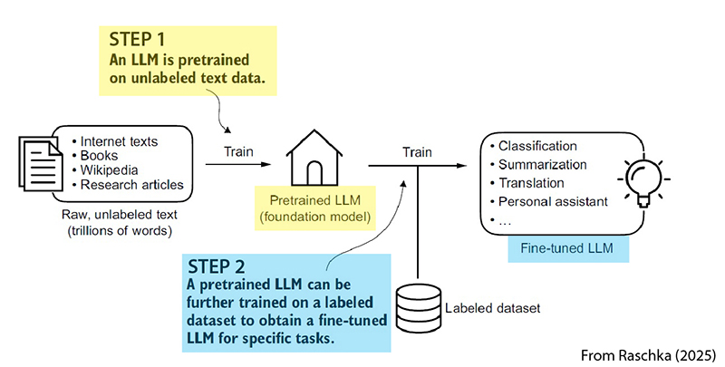
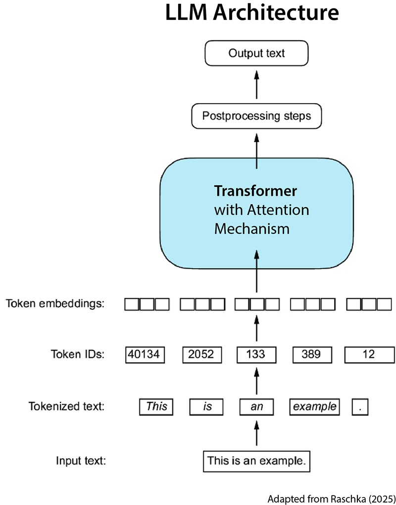
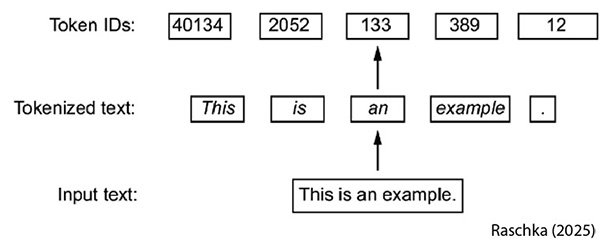
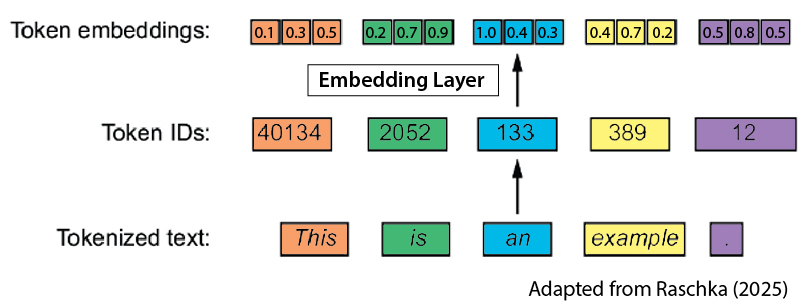
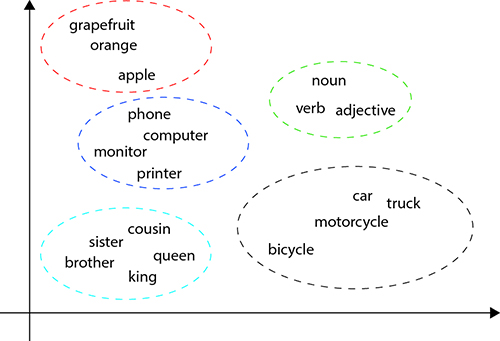

# Introduction: Large Language Models
General overview aned introduction. GPT etc etc. 

> Welcome to the first lesson in the AI module! In this lesson, we will look at how Large Language Models (LLMs) like ChatGPT work. First, we will explore field of natural language processing (NLP) more generally. Next, we will demystify how models such as GPT are built, explain key ideas like tokenization, embeddings, and self-attention, and connect these concepts back to the machine learning skills you’ve already learned. By the end, you’ll have a clearer sense of how modern AI models represent meaning, generate new text, and why this matters for the AI tools you will be learning about in later lessons.

## 1. Natural language processing (NLP)
While we will provide a brief overview of NLP, we could easily spend an entire course on the topic. If you want to learn more about NLP, check out the following resources:

- [Brief overview from deeplearning.ai](https://www.deeplearning.ai/resources/natural-language-processing/)
- [YouTube video summary](https://www.youtube.com/watch?v=Uuz8ZTV5vdA)
- [Full Stanford online course](https://www.youtube.com/playlist?list=PLoROMvodv4rMFqRtEuo6SGjY4XbRIVRd4)

### What is NLP?
NLP is a subfield of artificial intelligence (AI) that aims to give computers the ability to process and generate meaningful human language. This is a very difficult problem: there is a wide gap between the subtle nuances of natural human communication, on one hand (things like slang, jokes, sarcasm, and cultural references), and the rigid, logical structures of computer programs on the other. 

The goals of NLP span a wide spectrum, including:
- *Text classification*, where content is sorted into predefined categories (e.g., spam)
- *Machine translation*, which converts text from one language to another
- *Sentiment analysis*, where the emotional tone of text as positive, negative, or neutral is determined. 
- *Conversational AI*, which powers chatbots and virtual assistants that engage in fluid, multi-turn dialogues. 

Ultimately, NLP aims to make human-computer interaction as intuitive as human-to-human exchanges, so it can be used in fields as diverse as healthcare diagnostics, explaining complex legal documents, and personalized education. 

### NLP Methods
The field of NLP has seen a transformation in methods over the past 50 years. It has seen a progression from rigid, rule-based approaches to data-driven, adaptive techniques that leverage machine learning and neural networks. 

In its early days, NLP depended on rule-based systems and hand-crafted grammars to parse linguistic inputs. In these days, human experts manually encoded explicit linguistic rules into NLP systems. These methods were brittle, and struggled with the variability in real-world language. 

The shift to statistical methods in the late 20th century marked a shift in method, incorporating probabilities to model patterns in language. This paved the way for machine learning, where algorithms learn directly from examples. Today, the dominant paradigm is deep learning. As we saw last week, deep learning is a subset of machine learning that uses neural networks with multiple layers to automatically extract features from raw data. 

At the forefront of this approach are large language models (LLMs), such as those powering tools like GPT, which are pre-trained on billions of internet-scale sources of text. 

The release of ChatGPT (from OpenAI) on November 30, 2022, was a watershed moment in the history of NLP. It lead to a massive surge in public awareness and usage of LLMs. This easily accessible chatbot allowed millions to interact directly with an advanced LLM. The app amassed over a million users in one day, instantly creating awareness of the power of AI. It also accelerated its adoption in industries like education, customer service, and content creation. 

The newest wave of LLMs inspired a surge in research, and spawned ethical debates on issues like misinformation (LLM hallucinations), job displacement, and even concerns about [conscious AI](https://www.scientificamerican.com/article/google-engineer-claims-ai-chatbot-is-sentient-why-that-matters/). For an interesting discussion of the impact of ChatGPT on the field of NLP, see the [oral history in Quanta Magazine](https://www.quantamagazine.org/when-chatgpt-broke-an-entire-field-an-oral-history-20250430/). 

Since 2022, LLMs have shifted from being mostly academic curiosities to tools that attract billions in investment every year, and they are reshaping how people learn and interact with computers. 

In the rest of this lesson, we will learn some of the technical basics of how LLMs like ChatGPT work, and try to demystify their operations. Ultimateley, they are just another machine learning model, and they are trained to predict the next token in a string of tokens. 


## 2. Large language models (LLMs)
### LLMs: autocomplete at scale
Modern LLMs are machine learning models that are trained to predict the next word in a sequence, given all the words that came before. Imagine starting a sentence, and the model is tasked with filling in the blank: 

    The cat sat on the ___

The model looks at the context -- the first five words -- and generates a probability distribution to find the most likely next word. It might estimate that "mat" has a 70% chance, "floor" 20%, "sofa" 5%, and so on. It then picks the most likely candidate (or sometimes samples from that distribution to keep things more varied). 

This simple "predict the next word" trick turns out to be extremely powerful. By repeating it over and over, LLMs can generate entire paragraphs, answer questions, write code, or carry on conversations.

There is an excellent discussion of this at 3blue1brown (the following will open a video at YouTube):

[](https://www.youtube.com/watch?v=LPZh9BOjkQs)

You have likely seen a similar mechanism on your phone when writing text and it suggests the next word using its *autocomplete* feature. Basically what LLMs do is autocompletion on a large scale. What makes LLMs *large* is the amount of data used to train them, and the size of the models. 

LLMs are trained on enormous collections of text, including books, Wikipedia, articles, and large parts of the internet. The models also contain billions (sometimes even trillions) of parameters, which allow the model to capture much more subtle patterns in language. It's this large scale, as well as the underlying transformer architecture (which we will discuss below) that makes modern LLMs so much more fluent and flexible than your phone's autocomplete feature. 

### How LLMs Learn: Self-supervised learning 
The training process for LLMs is different from what we saw in the ML module -- there, we learned that humans provide labeled data as ground truth to help train the models. Instead, LLMs use what’s called *self-supervised learning*. Because the "correct next word" is already present in every text sequence, the data effectively labels itself. 

For example, in the phrase "The cat sat on the mat," the model can practice by hiding "mat" and predicting it from the context. This setup is also called *autoregression*, because the model predicts each word based on all the words before it.

With this approach, you can train on billions or trillions of examples without having to manually annotate ground-truth data. Over time, the model learns facts, grammar, and reasoning patterns simply by getting better at predicting the next word.

There is one wrinkle we should cover regarding how LLMs learn before moving on to more technical matters. There are really *two* different learning modes for LLMs. First, by training on huge bodies of text in the next-word-prediction task, we end up with *foundational* or *pretrained* or *base* models. These are general purpose models that embody information from extremely broad sources. 

However, just foundational models don't work well in special-purpose jobs like personal assistants, chatbots, etc. To get good performance on such specialized tasks, a second training step is needed, where these foundational models are *fine-tuned* on a labeled dataset that is tailored to a specific task or application.



In other words, fine-tuning takes a foundational model and adjusts it for specific purposes, such as answering questions, following instructions, or writing in a particular style. There are various ways to do this. One, supervised fine-tuning (SFT) follows a more traditional ML approach where the model is given paired examples of inputs and desired outputs. 

Another is [reinforcement learning from human feedback](https://www.youtube.com/watch?v=T_X4XFwKX8k) (RLHF). With RLHF the model adapts (using reinforcement learning procedures) to produce responses that are ranked more highly by human judges. 

The result with fine-tuning is the production of specialized models built on top of the same foundation -- one model might become a customer service chatbot, another a medical assistant, and another a coding helper. The distinction between the general pretrained model and its fine-tuned variants is key to understanding why LLMs are so adaptable in practice.

While in this course we will not go through the process of building your own LLM, the excellent book [Build a Large Language Model from Scratch](https://www.manning.com/books/build-a-large-language-model-from-scratch) by Sebastian Raschka, walks you through this in detailk using PyTorch if you are interested. The above picture is adapted from his book.

In the next section we will dig into the details about how LLMS actually work: as we said, it isn't just that they are *large*, but their *architecture*, that makes them so powerful. 


## 3. LLM architecture
In this section we will walk step-by-step through the following simplifed LLM architecture diagram, which is adapted from Chapter 2 of Raschka's excellent book:



There are three main steps that it is important to focus on when understanding how LLMs get so good at predict the next word in a sequence:

- tokenization
- token embedding
- attention

### Tokenization: From raw text to token IDs
You can learn more about tokenization at the following resources:
- [Super Data Science video](https://www.youtube.com/watch?v=ql-XNY_qZHc)
- [Huggingface introduction](https://huggingface.co/learn/llm-course/en/chapter2/4)

Tokenization is the process of breaking chunks of text into smaller pieces that are in the LLM's vocabulary. For example, the sentence "The cat sat on the mat." might be split into tokens like ["The", " cat", " sat", " on", " the", " mat", "."]. These tokens are then mapped to unique integer IDs.



Importantly, tokens are not always whole words. To keep the vocabulary a manageable size, many tokenizers break rare or complex words into smaller chunks. For example, "blueberries" might become ["blue", "berries"]. This makes it possible to represent *any* string of text, even if it never appeared in training.

You can [play online]( https://platform.openai.com/tokenizer) with a popular tokenizer, *tiktoken*. There, you can explore how tiktoken breaks down text into parts and creates numerical ids for each token. 

[add practical exercise here]


### Token embeddings: from IDs to semantics
Once a tokenizer has converted text into integer IDs, but these don't "mean" anything -- the tokenizer has just created some arbitrary numbers to stand in for words or subwords. 



The magic starts to happen when the token IDs are passed through an *embedding layer*, which assigns each token a tensor, a numerical array of values. At first these token embeddings embeddings are assigned small random numbers. However, as training proceeds, semantically similar tokens drift closer together. So `brother` and `sister` end up near each other, while `car` and `bicycle` cluster elsewhere. Over time, this training process produces what we might call a semantic similarity space: a geometric landscape where semantically related tokens cluster together in a heirarchical way:



in the above pic it's only 3 elt arrray but in practice it's thousands. 
also make point that this pic is 2d projion of the emedding, using something like PCA whic we saw with ML.

Point out the issue with *apple* in the semantic space above....what are we to do?

Embedding resources:
https://medium.com/@saschametzger/what-are-tokens-vectors-and-embeddings-how-do-you-create-them-e2a3e698e037
https://www.youtube.com/watch?v=wgfSDrqYMJ4

What is an LLM:
https://www.youtube.com/watch?v=5sLYAQS9sWQ


### Attention: the breakthrough
Embeddings don't have to be just tokens or words, but can be paragraphs, but lets pretend that for now. 

Embeddings: https://www.youtube.com/watch?v=OxCpWwDCDFQ 
How does transformer architecture solve this problem? (attention)

Brief discussion of attention and how it helps solve this (attention is all you need), and how attention is wrapped into transformer. And how this improved on earlier conviction that you needed recurrent networks., 

Word embeddings: https://www.youtube.com/watch?v=wgfSDrqYMJ4


Attention:
https://www.youtube.com/watch?v=OxCpWwDCDFQ

## 4. From languge to meaning: tokenization and embedding

Blah blah blah 

## 2. What Are Language Models (and LLMs)?
Show the progression from early NLP to modern LLMs and why LLMs are different.

**Topics to cover:**

- The shift to transformers and LLMs
- What makes a model 'large'? (parameters, data, compute)
- Rise of pretrained models (e.g., BERT, GPT)

**External resources:**
- [A Visual Intro to Language Models – Jay Alammar](https://jalammar.github.io/blog/)
- [How GPT Works (YouTube) – Jay Alammar](https://www.youtube.com/watch?v=bAUM1tG4q6Q)
- [What is a Language Model? (Medium)](https://medium.com/analytics-vidhya/what-is-a-language-model-7412c6c2da5e)

## 3. Key Concepts Behind LLMs
 Explain the core ideas behind modern LLMs. Demystifying LLMs.

**Topics to cover:**
- Transformers and self-attention  
  - Why attention beats RNNs for language
  - Intuition: attending to relevant words
- Embeddings: how language becomes math
- Pretraining vs. fine-tuning  
  - Pretraining on large corpora
  - Fine-tuning options:  
    - Full fine-tuning  
    - Adapter layers  
    - Prompt-/prefix-/LoRA-style tuning (brief overview)

**External resources:**
- [Transformers – A Friendly Introduction (YouTube)](https://www.youtube.com/watch?v=4Bdc55j80l8)
- [The Illustrated Transformer – Jay Alammar](https://jalammar.github.io/illustrated-transformer/)
- [Hugging Face: Pretraining vs. Fine-tuning](https://huggingface.co/transformers/training.html)
- [OpenAI: Guide to Fine-tuning](https://platform.openai.com/docs/guides/fine-tuning)

## 4. How Language Becomes Numbers: Tokenization
Explain tokenization clearly, show real examples, and connect to embeddings.

**Topics to cover:**
- What is tokenization?  
  - Text → tokens → numeric IDs → vectors  
  - Example: “The cat sat.” → `['The', 'cat', 'sat', '.']`
- WordPiece / Byte-Pair Encoding (BPE) basics
- Why subwords help (e.g., “unhappiness” → “un”, “happi”, “ness”)

**External resources:**
- [Tokenization Explained (YouTube) – AssemblyAI](https://www.youtube.com/watch?v=oI4a5FVtxbY)
- [Byte Pair Encoding for Beginners (Medium)](https://towardsdatascience.com/byte-pair-encoding-subword-tokenization-algorithm-77828a70bee0)

**Code placeholder:**
```python
# Show raw tokens for a sentence using an OpenAI or Hugging Face tokenizer.
# Example:
# tokens = tokenizer("The cat sat on the mat.")
# print(tokens)  # ['The', 'cat', 'sat', 'on', 'the', 'mat', '.']
```

## 5. Embeddings and SEmantic Relationships 
Show how similar meanings cluster in space using embeddings.

**Topics to cover:**
- Embedding space: high-dimensional vectors with semantic structure
- Similar words cluster (e.g., king, queen, prince)
- Project to 2D with PCA (or UMAP) for visualization

**Code placeholder:**
```python
# 1) Choose 10–20 words/phrases
# 2) Get embeddings (e.g., OpenAI 'test-embedding-3-small')
# 3) Reduce to 2D with PCA
# 4) Plot with matplotlib and label points
```

**External resources:**
- [OpenAI Docs – Embeddings](https://platform.openai.com/docs/guides/embeddings)
- [Word Embeddings Visualization with PCA (YouTube)](https://www.youtube.com/watch?v=T6XKQ2ZGW8I)
- [Visualizing Embeddings – Distill.pub](https://distill.pub/2016/misread-tsne/)

## 6. Summary: Why This Matters

**Key takeaways:**
- Language models power many modern AI applications.
- LLMs learn semantic structure by representing meaning in vector space.
- Tokenization and embeddings explain what models “know.”
- Connects to prior ML concepts (classification, clustering) by adding representation learning.

## 7. Optional Further Exploration

**Links:**
- [Hugging Face Course – Chapter 1](https://huggingface.co/course/chapter1)
- [OpenAI Cookbook – Embedding Visualization Notebook](https://github.com/openai/openai-cookbook/blob/main/examples/Embeddings_visualization.ipynb)
- [Cohere Text Embedding Playground](https://txt.cohere.com/)

