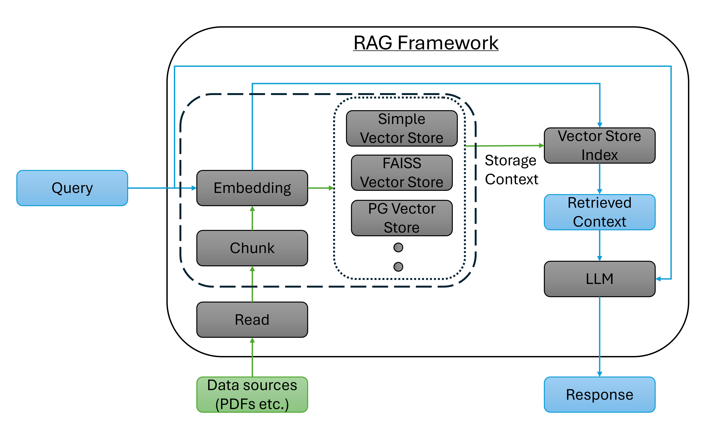

# RAG Implementation with LlamaIndex

In the previous lessons, we looked at custom semantic RAG implementations that leveraged both an in-memory vector store and an online docker container-based vector store. Now we will implement the same semantic RAG frameworks as before using a library called [LlamaIndex](https://www.llamaindex.ai/). LlamaIndex provides a simple API that automates the database reading, chunking, storing, context retrieval and augmentation, and response generation steps. Moreover, LlamaIndex also includes support for many external data storage libraries, models, and embeddings making it a very versatile tool to develop your own custom RAG frameworks. LlamaIndex also includes methods to evaluate your RAG framework, which we will go over briefly towards the end of this lesson.



<!-- Note the "index" in LlamaIndex refers directly to the same kind of semantic index we built manually in previous lessons. It is a package built around the concept of semantic indexes. 

LlamaIndex is a framework for building LLM-powered agents over your data with LLMs and workflows. It can use RAG pipelines. 

As LLM offers an interface between humans and data. They are pre-trained on huge public data. At the same time, Llamaindex provides us with the facility to build a use case on our own data. That is, context augmentation (eg, RAG), where we make our data available to LLM to solve the problem. 

Here, agents are LLM assistants uses tools to perform a given task, like data extraction or research.
Workflows are multi-step processes that combine one or more agents to create a complex LLM application. 

LlamaIndex can be used to ingest existing data and structured data, has helper functions for API integrations, and can also monitor apps. 

Use cases:
- Question Answering
- Chatbots
- Document Understanding and Data Extraction
- Autonomous Agents -->

Here are some additional resources to look at: [Youtube video on introduction to LlamaIndex](https://www.youtube.com/watch?v=cCyYGYyCka4), [IBM article on LlamaIndex](https://www.ibm.com/think/topics/llamaindex).


> **Note:** Make sure your environment has the following packages installed that are important for the current notebook: 
> - `llama-index-core`:  the base library for llamaindex (make sure the llama-index-core version is 0.14.10)
> - `llama-index-embeddings-openai`: support for OpenAI's embedding models
> - `llama-index-vector-stores-postgres`: support for PostgreSQL
> - `psycopg2-binary`: pgvector library in Python to interact with the postgreSQL database
> - `pypdf` and `python-dotenv`: for PDF and key loading

We will first begin with an implementation of the in-memory semantic RAG framework. We will use the same Brightleaf Solar Company example as used in the previous lessons. Note that although LlamaIndex has support for FAISS, we will use LlamaIndex's internal functionality to search through the embeddings and retrieve the relevant context for a query. 

## In-memory Semantic RAG using LlamaIndex

As we have done for previous lessons, we will load the OpenAI API key from .env file and print `success` if it is loaded.

```python
from dotenv import load_dotenv

if load_dotenv():
    print("success")
else:
    print("oops")
```

Once the API key is loaded, we will load the Brightleaf company documents into LlamaIndex's storage index. 

<!-- Basically what we've been building toward can now be done in four lines of code:

    docs = SimpleDirectoryReader("brightleaf_pdfs").load_data()
    index = VectorStoreIndex.from_documents(docs)
    query_engine = index.as_query_engine()
    response = query_engine.query("What is BrightLeaf Solar's mission?")

This replaces almost everything we built manually in Step 2 with a framework-focused solution that handles things for you. We'll walk through these code steps below, but stripped of all the explanatory padding, it really is that simple! -->

### Read, Chunk, and Store Documents

LlamaIndex provides a default storage index called `VectorStoreIndex` to store the chunked and embedded text from the documents. The following code shows how to create the vector store index for the brightleaf documents.

```python
from llama_index.core import SimpleDirectoryReader, VectorStoreIndex

# Load documents directly from PDFs in the folder
docs = SimpleDirectoryReader("brightleaf_pdfs").load_data()

# Build a vector index automatically (handles chunking + embeddings)
index = VectorStoreIndex.from_documents(docs)
```

> **Note**: Make sure the `brightleaf_pdfs` directory is in the appropriate location, you can additionally add an `assert` statement to check the existence of the directory if it is located elsewhere.

Compared to the custom implementation from the semantic RAG lesson, the above two lines of code capture the document reading, chunking, embedding, and storing steps, demonstrating a huge reduction in lines of code! LlamaIndex uses the inbuilt `SimpleDirectoryReader` method to read the documents and store the metadata and text into the `docs` list. Each element of this list is a `Document` object containing the metadata and text for each loaded document. To make sure the text has been read correctly, you can check the metadata and text for each document. For example, to check the first document's metadata you can run the following code.

```python
print(docs[0].metadata)
```
The output should look something like this.
```
{'page_label': '1',
 'file_name': 'earnings_report.pdf',
 'file_path': 'c:\\Users\\rosha\\Downloads\\CTD RAG\\rag\\brightleaf_pdfs\\earnings_report.pdf',
 'file_type': 'application/pdf',
 'file_size': 3658,
 'creation_date': '2025-10-22',
 'last_modified_date': '2025-11-10'}
```
Now, to make sure the text from the "earnings_report" document (or whichever document was read first) has been read correctly you can check the first 100 characters of the text by running the following code.
```python
print(docs[0].text_resource.text[:100])
```
The output should look something like this.
```
"Overview\nThis report summarizes BrightLeaf Solar's financial performance from 2021 through 2025. The"
```
If there is a reading error (usually due to the document not being in the UTF-8 encoding format), the text will have some random symbols that do not resemble the english language. 

<!-- Document: LlamaIndex’s core data structure that represents one source file (like a PDF) after it’s loaded.
id_: A unique identifier automatically assigned to each document.
embedding: A numerical vector representation of the document used for semantic search; None means it hasn’t been created yet.
metadata: Descriptive information about the file (name, path, type, size, dates) used for filtering and source tracking.
excluded_embed_metadata_keys: Metadata fields that are ignored when generating embeddings to keep them semantically meaningful.
excluded_llm_metadata_keys: Metadata fields hidden from the LLM to avoid unnecessary or irrelevant context.
text_resource: The container holding the extracted text from the PDF.
MediaResource: An internal wrapper used by LlamaIndex to manage different content types (text, image, audio, video).
content / text: The raw extracted data from the PDF; in this case it shows PDF internals rather than cleaned text.
file_path / file_name / file_type: Identify where the document came from and what format it is.
Vector embeddings (later step): Used to compare documents and queries based on meaning rather than keywords. 

```python
type(docs[0])
```
    llama_index.core.schema.Document

```python
len(docs)
```
    6

Look at docs[0]: Fill this in some, don't print entire thing, look at a few attributes:

```python
docs[0].doc_id, docs[0].text[:500]
```
    ('8190b231-abe2-45d8-a2cc-05dec4840041',
     '%PDF-1.4\n% ReportLab Generated PDF document http://www.reportlab.com\n1 0 obj\n<<\n/F1 2 0 R /F2 3 0 R /F3 4 0 R /F4 5 0 R\n>>\nendobj\n2 0 obj\n<<\n/BaseFont /Helvetica /Encoding /WinAnsiEncoding /Name /F1 /Subtype /Type1 /Type /Font\n>>\nendobj\n3 0 obj\n<<\n/BaseFont /Helvetica-BoldOblique /Encoding /WinAnsiEncoding /Name /F2 /Subtype /Type1 /Type /Font\n>>\nendobj\n4 0 obj\n<<\n/BaseFont /ZapfDingbats /Name /F3 /Subtype /Type1 /Type /Font\n>>\nendobj\n5 0 obj\n<<\n/BaseFont /Helvetica-Bold /Encoding /WinAnsiEncodi') -->

Once the documents are read, the next step is to chunk the text, convert them into embeddings, and store them. `VectorStoreIndex` automatically handles the chunking, embedding and storing of the documents. By default, LlamaIndex stores the embeddings in a `SimpleVectorStore` object. You can check this by running the following code.

```python
print(type(index._vector_store).__name__)
```
The output should say the following.
```
SimpleVectorStore
```

LlamaIndex uses predefined defaults for the chunking parameters and the embedding model. If not specified, LlamaIndex uses OpenAI's "text-embedding-ada-002" model. You can change these values before creating the vector store index to make sure LlamaIndex uses your custom values. To check the default values you can run the following code.

```python
from llama_index.core import Settings

print(f"Default chunk size:  {Settings.chunk_size}")
print(f"Default chunk overlap: {Settings.chunk_overlap}")
print(f"Default embedding model: {Settings.embed_model.model_name}")
```
The output should be the following.
```
Default chunk size:  1024
Default chunk overlap: 200
Default embedding model: text-embedding-ada-002
```
To change these values and the embedding model to different OpenAI embedding model, you can do the following.
```python
## Optional: Change default chunking parameters and embedding model (Run before creating vector store index)
from llama_index.embeddings.openai import OpenAIEmbedding

# Specify the new model
Settings.embed_model = OpenAIEmbedding(model="text-embedding-3-small")

# Specify the new chunking parameters
Settings.chunk_size = 512
Settings.chunk_overlap = 50
```

Now that we have the text chunked, embedded and stored, the next step is to retrieve the relevant context based on the user query, augment it to the query and generate the response from the LLM.

<!-- ### Create index
Here we're using OpenAI for embeddings and llamaindex's default fallback vector store `SimpleVectorStore` for our vector store. When we used FAISS previously, we manually created a vector index and handled the similarity search ourselves. LlamaIndex takes care of that for us. By default, it uses a small in-memory vector store called SimpleVectorStore. You can think of this as a lightweight, Python-based version of FAISS: it stores each chunk’s embedding and performs similarity search under the hood. It isn't meant for large production systems, but is great for learning the basic RAG workflow because there’s nothing to install or configure. Later, when we want a real database-backed vector store (like pgvector), we'll need to swap out this default back end. 

```python
# Build a vector index automatically (handles chunking + embeddings)
index = VectorStoreIndex.from_documents(docs)
```

```python
# dir(index)
```
-->

### Retrieve Context, Augment, and Generate Response - The Query Engine
LlamaIndex uses a helper object called a "query engine" that wraps the entire context retrieval, augmentation, and response generation process. This contributes to further reduction in lines of code. 

LlamaIndex uses OpenAI's "gpt-3.5-turbo" model in the backend by default to generate the response to the user query. You can check this by running the following code.

```python
#check LLM model currently being used
print(f"LLM model: {Settings.llm.model}")
```
As mentioned earlier, the output should be the following.
```
LLM model: gpt-3.5-turbo
```
    
Below, we create the query engine from the vector store index and look at the responses and the retrieved contexts to three sample questions.

```python
query_engine = index.as_query_engine(similarity_top_k=3)

questions = [
    "What is BrightLeaf Solar's mission?",
    "How did profits change between 2023 and 2024?",
    "Which partner joined most recently?"
]

for q in questions:
    print(f"\nQ: {q}")
    response = query_engine.query(q)
    print("A:", response)
    
    for node_with_score in response.source_nodes:
        print(f"Node ID: {node_with_score.node.node_id}")
        print(f"Similarity Score: {node_with_score.score:.4f}")
        print(f"Text Snippet: {node_with_score.node.get_content()[:100]}...")
        print("-" * 30)
```

When creating the query engine, we define the number of retrieved chunks by setting `similarity_top_k=3`. The vector store index query engine uses cosine similarity to search through the embeddngs to obtain the most relevant chunks. We can also look at the most relevant chunks and their corresponding similarity scores through the `response` object's `source_nodes`. The output will look like the following (minus the HTTP requests).

```
Q: What is BrightLeaf Solar's mission?
A: BrightLeaf Solar's mission is to make solar power practical, affordable, and accessible to communities that have historically been left behind in the transition to clean energy. They aim to be educators, partners, and advocates for a more resilient and equitable power grid, with each installation representing an investment in long-term community well-being.
Node ID: 6db23967-7cb2-49a8-9814-6d381ce5b69e
Similarity Score: 0.9034
Text Snippet: Overview
BrightLeaf Solar was founded on the belief that renewable energy should be a right, not a p...
------------------------------
Node ID: b6833bf4-3fea-487c-9843-6b52be02bedb
Similarity Score: 0.8534
Text Snippet: EcoVolt Energy (2022 Partnership)
BrightLeaf's collaboration with EcoVolt Energy, established in 202...
------------------------------
Node ID: 566668b4-d22b-49df-b166-1932fd899d92
Similarity Score: 0.8440
Text Snippet: Overview
This report summarizes BrightLeaf Solar's financial performance from 2021 through 2025. The...
------------------------------

Q: How did profits change between 2023 and 2024?
A: Profits increased from 0.5 million USD in 2023 to 1.1 million USD in 2024.
Node ID: 566668b4-d22b-49df-b166-1932fd899d92
Similarity Score: 0.7936
Text Snippet: Overview
This report summarizes BrightLeaf Solar's financial performance from 2021 through 2025. The...
------------------------------
Node ID: 6db23967-7cb2-49a8-9814-6d381ce5b69e
Similarity Score: 0.7257
Text Snippet: Overview
BrightLeaf Solar was founded on the belief that renewable energy should be a right, not a p...
------------------------------
Node ID: b6833bf4-3fea-487c-9843-6b52be02bedb
Similarity Score: 0.7239
Text Snippet: EcoVolt Energy (2022 Partnership)
BrightLeaf's collaboration with EcoVolt Energy, established in 202...
------------------------------

Q: Which partner joined most recently?
A: SunSpan Microgrids joined most recently.
Node ID: b6833bf4-3fea-487c-9843-6b52be02bedb
Similarity Score: 0.7601
Text Snippet: EcoVolt Energy (2022 Partnership)
BrightLeaf's collaboration with EcoVolt Energy, established in 202...
------------------------------
Node ID: 566668b4-d22b-49df-b166-1932fd899d92
Similarity Score: 0.7209
Text Snippet: Overview
This report summarizes BrightLeaf Solar's financial performance from 2021 through 2025. The...
------------------------------
Node ID: 6db23967-7cb2-49a8-9814-6d381ce5b69e
Similarity Score: 0.7166
Text Snippet: Overview
BrightLeaf Solar was founded on the belief that renewable energy should be a right, not a p...
------------------------------
```
Since we only want to augment the top 3 most relevant chunks, the response will only have 3 source nodes. As can be seen, the model is able to respond accurately and retrieve generally relevant chunks to each question.

Congratulations! You've implemented a semantic RAG pipeline using Llamaindex, heavily reducing the total lines of code compared to the custom implementation in the previous lesson!

What makes this so powerful is how much work is wrapped into so little code. LlamaIndex is a fully maintained, widely used framework built by a dedicated team, and it bundles together a large amount of engineering that we would otherwise have to implement ourselves. The library handles chunking, embedding, vector storage, retrieval, ranking, and passing the right context to the LLM, all through a clean and consistent interface. Of course, a big reason for this reduction in lines of code is that LlamaIndex is designed to be a plug-and-play tool with many hyperparameters predefined. Changing these default values will increase some lines of code, but the overall reduction in code lines is still significant.

It also supports multiple RAG architectures beyond the simple naive semantic RAG architecture we show here, which makes it adaptable to different real-world use cases as projects grow. As an example, we will look at the implementation for the online-database semantic RAG with pgvector and postgreSQL in LlamaIndex next. Additionally, LlamaIndex includes built-in tools for evaluating how well a RAG system is performing which we will look at later.

## Online database semantic RAG using LlamaIndex

LlamaIndex provides support to work with online databases using pgvector and postgreSQL through the `llama-index-vector-stores-postgres` package. As you will see, the package provides the functionality to store chunked and embedded documents into the online database (emulated here using the same docker container as the previous lesson). While the docker container is the same, we will not use the `rag_chunks` table created in the previous lesson but we will have LlamaIndex create its own table. Before we begin with creating the vector store, make sure that your Postgres + pgvector docker container is running and reachable at `localhost:5432`. You can refer to the previous lesson to look at the procedure for starting/restarting your docker container.

<!-- This notebook is the "framework sequel" to the earlier RAG notebooks:

- Hand-rolled semantic RAG (FAISS)
- Hand-rolled Postgres + pgvector RAG (Docker)
- Framework RAG with LlamaIndex + SimpleVectorStore (SVS)

Here we use **LlamaIndex + pgvector** while reusing the **same Postgres server/container** you already set up.

## Key idea

- We reuse the same Postgres database **server**.
- We **do not reuse** the hand-rolled table schema (e.g., `rag_chunks`).
- Instead, LlamaIndex manages its own table (e.g., `li_brightleaf_pgvector`) to store nodes + embeddings.

## Prereqs

1. Your Postgres + pgvector container is running and reachable at `localhost:5432`.
2. You have PDFs in `brightleaf_pdfs/` (same as the previous notebooks).
3. Your OpenAI key is set:

```bash
export OPENAI_API_KEY="..."
```

(Or set it in the notebook environment.)

Make sure the following are installed in your virtual environment

    llama-index llama-index-vector-stores-postgres llama-index-embeddings-openai psycopg2-binary
-->

We first define some variables associated with the docker container, table name, and embedding model.

```python
# Connection + indexing configuration
# Update these to match your Docker pgvector setup from the previous notebook.

PG_HOST = "localhost"
PG_PORT = 5432
PG_DATABASE = "ctd_rag"
PG_USER = "ctd"
PG_PASSWORD = "ctdpassword"

# LlamaIndex will manage THIS table (separate from your hand-rolled rag_chunks table).
LI_TABLE_NAME = "li_brightleaf_pgvector"

# Embedding model choice must match embed_dim.
EMBED_MODEL_NAME = "text-embedding-3-small"
EMBED_DIM = 1536

PDF_DIR = "brightleaf_pdfs"

# If you rerun "build" repeatedly, you will insert duplicates.
# Recommended: build once, then use the query-only section below.
BUILD_INDEX = True
```

### Connect with docker container

Before we let LlamaIndex modify the contents of the docker container, we first check to make sure the container is reachable using the `psycopg2` library.

```python
import psycopg2

conn = psycopg2.connect(
    host=PG_HOST,
    port=PG_PORT,
    dbname=PG_DATABASE,
    user=PG_USER,
    password=PG_PASSWORD,
)
cur = conn.cursor()
cur.execute("SELECT version();")
print(cur.fetchone()[0])
cur.close()
conn.close()
```

Assuming that the connection is successful, you should get the following output.

```
PostgreSQL 15.4 (Debian 15.4-2.pgdg120+1) on x86_64-pc-linux-gnu, compiled by gcc (Debian 12.2.0-14) 12.2.0, 64-bit
```

Once the connection is established, we go ahead with building the PostgreSQL table in the docker container using LlamaIndex.

### Build the database table (for the first run)

Since this is the first time using LlamaIndex to create the database table, we will read, chunk, and embed the documents before storing them in the PostgreSQL table in the docker container via LlamaIndex. For this, we first setup our OpenAI client using the loaded API key. 

```python
import os
from dotenv import load_dotenv
from openai import OpenAI
from llama_index.core import SimpleDirectoryReader, StorageContext, VectorStoreIndex, Settings
from llama_index.embeddings.openai import OpenAIEmbedding
from llama_index.vector_stores.postgres import PGVectorStore

# Load .env (expects OPENAI_API_KEY)
if load_dotenv():
    print("Loaded openai api key")
else:
    print("no api key loaded check out .env")
    
client = OpenAI(api_key=os.getenv("OPENAI_API_KEY"))
```
Following a successful extraction of the OpenAI API key, the output should be the following
```
Loaded openai api key
```
Since we want to use a different embedding model, we change the default model in the `Settings` object. Then we use the `SimpleDirectoryReader` as before to read our documents. 
```python
Settings.embed_model = OpenAIEmbedding(model=EMBED_MODEL_NAME)

docs = SimpleDirectoryReader(PDF_DIR).load_data()
print(f"Loaded {len(docs)} documents from: {PDF_DIR}")
```
The successful output looks as follows (minus any user warnings):
```
Loaded 6 documents from: brightleaf_pdfs
```
Unlike the previous implementation where we used a `SimpleVectorStore` to store our embeddings in memory, now we use a `PGVectorStore` to connect to the docker container, build the postgreSQL table, and retrieve the relevant chunks using pgvector.

```python 
vector_store = PGVectorStore.from_params(
    host=PG_HOST,
    port=PG_PORT,
    database=PG_DATABASE,
    user=PG_USER,
    password=PG_PASSWORD,
    table_name=LI_TABLE_NAME,
    embed_dim=EMBED_DIM,
)
```
In the previous implementation with `SimpleVectorStore`, LlamaIndex used default in-memory storage behind the scenes, so we could build the `VectorStoreIndex` index without thinking about storage. In this pgvector version, we want the embeddings database to be the PostgreSQL table instead of local RAM, so we create the `PGVectorStore` and pass it to the `VectorStoreIndex` via a `StorageContext`. 

```python
if BUILD_INDEX:
    storage_context = StorageContext.from_defaults(vector_store=vector_store)
    index = VectorStoreIndex.from_documents(docs, storage_context=storage_context)
    print(f"Indexed documents into Postgres table: {LI_TABLE_NAME}")
else:
    print("BUILD_INDEX is False; skipping indexing.")
```
When building the index for the first time (`BUILD_INDEX=True`), the output will look like the following:
```
Indexed documents into Postgres table: data_li_brightleaf_pgvector
```
You can think of `StorageContext` as the wiring step that tells LlamaIndex, "store and search embeddings in the PostgreSQL table." It basically acts like an abstraction layer that allows the `VectorStoreIndex` to be built from different kinds of vector stores (such as `PGVectorStore`). After that, the rest of the workflow is the same as the previous implementation: LlamaIndex chunks the documents into nodes (which are called chunks in the example from the previous lesson), embeds them, stores them, and later embeds the user query to retrieve the top-k most relevant nodes for the LLM.

Once we have the index constructed, we can build the query engine.

### Build the query engine and generate response

Recall that once the Postgres table is added to the docker container, you do not need to read, chunk, and embed the documents again. When building the table for the first run, the vector index is already build so it can be directly used to create the query engine with `similarity_top_k=3`. 

```python
# Query (works immediately after build)
from llama_index.core import VectorStoreIndex

# If you just built the index above, you already have `index` in memory.
# If not, attach to the existing Postgres-backed vector store.
if "index" not in globals():
    index = VectorStoreIndex.from_vector_store(vector_store=vector_store)

qe = index.as_query_engine(similarity_top_k=3)
```
In subsequent runs (make sure to set `BUILD_INDEX=False` to avoid duplicate table entries), since the table is already present in the docker container all you need to do is to create the `PGVectorStore` object with the parameters required to connect to the postgres table and create the vector index from it. This is done using the `from_vector_store()` method instead of the `from_documents()` method used before. Note that we don't need to provide a storage context here as it is inferred from the vector store itself.

Now we test the pgvector based query engine with a question and observe the response and retrieved nodes (or chunks) with their similarity scores. Note that, like the `SimpleVectorStore`, `PGVectorStore` also uses cosine similarity by default. 

```python
question = "When did BrightLeaf partner with SunSpan and what did they focus on?"
response = qe.query(question)

print("Q:", question)
print()
print(response)
for node_with_score in response.source_nodes:
    print(f"Node ID: {node_with_score.node.node_id}")
    print(f"Similarity Score: {node_with_score.score:.4f}")
    print(f"Text Snippet: {node_with_score.node.get_content()[:100]}...")
    print("-" * 30)
```

The output should look something like so:
```
Q: When did BrightLeaf partner with SunSpan and what did they focus on?

BrightLeaf partnered with SunSpan Microgrids in 2025. Their partnership focused on developing hybrid renewable infrastructure for the Midwest, targeting legacy industrial zones in Ohio and Michigan. The collaboration involved pairing solar and wind power systems with SunSpan's real-time grid analytics, resulting in improved grid stability and lower emissions at the first hybrid sites. Additionally, SunSpan and BrightLeaf co-authored a white paper on the economic benefits of decarbonizing regional manufacturing supply chains.
Node ID: 1d116f12-c67e-4538-a6dc-d77fda8dab6a
Similarity Score: 0.7224
Text Snippet: EcoVolt Energy (2022 Partnership)
BrightLeaf's collaboration with EcoVolt Energy, established in 202...
------------------------------
Node ID: d60981ba-879a-4760-a3f2-74f0d858299c
Similarity Score: 0.6353
Text Snippet: Overview
BrightLeaf Solar was founded on the belief that renewable energy should be a right, not a p...
------------------------------
Node ID: 64657f51-466d-4ba5-b9dc-b599a8b14c8c
Similarity Score: 0.5912
Text Snippet: Overview
This report summarizes BrightLeaf Solar's financial performance from 2021 through 2025. The...
------------------------------
```
The response is comprehensive and accurate with the retrieved nodes (chunks) also bearing high relevance to the query and high similarity scores.

That's it! We've set up the system to build and query the pgvector store! Let's test it out without the table creation steps.

### Query-only pattern (for later runs)
The following code merely creates the `PGVectorStore` with the database connection parameters, creates the `VectorStoreIndex` from it, converts it to a query engine and answers a user query. It is assumed that the Postgres table is already present and populated in the docker container so the steps to build and populate the table are skipped. To test this properly, clear all outputs and restart the kernel (assuming a jupyter notebook), stop running the docker container, then restart it and try running the following code. 

```python
from llama_index.core import VectorStoreIndex, Settings
from llama_index.embeddings.openai import OpenAIEmbedding
from llama_index.vector_stores.postgres import PGVectorStore

Settings.embed_model = OpenAIEmbedding(model=EMBED_MODEL_NAME)

vector_store_q = PGVectorStore.from_params(
    host=PG_HOST,
    port=PG_PORT,
    database=PG_DATABASE,
    user=PG_USER,
    password=PG_PASSWORD,
    table_name=LI_TABLE_NAME,
    embed_dim=EMBED_DIM,
)

index_q = VectorStoreIndex.from_vector_store(vector_store=vector_store_q)
qe_q = index_q.as_query_engine(similarity_top_k=3)

question2 = "Which partner joined most recently?"
response2 = qe_q.query(question2)

print("Q:", question2)
print()
print(response2)
for node_with_score in response2.source_nodes:
    print(f"Node ID: {node_with_score.node.node_id}")
    print(f"Similarity Score: {node_with_score.score:.4f}")
    print(f"Text Snippet: {node_with_score.node.get_content()[:100]}...")
    print("-" * 30)
```

Assuming the table exists and connection to the docker container was successful, the ouput should look something like this:
```
Q: Which partner joined most recently?

SunSpan Microgrids joined most recently.
Node ID: 1d116f12-c67e-4538-a6dc-d77fda8dab6a
Similarity Score: 0.3178
Text Snippet: EcoVolt Energy (2022 Partnership)
BrightLeaf's collaboration with EcoVolt Energy, established in 202...
------------------------------
Node ID: 1aaa91d0-193d-4bb4-84a9-d559e1ef9aa6
Similarity Score: 0.2184
Text Snippet: Introduction
BrightLeaf Solar views employee well-being as inseparable from long-term innovation. Ou...
------------------------------
Node ID: 64657f51-466d-4ba5-b9dc-b599a8b14c8c
Similarity Score: 0.1899
Text Snippet: Overview
This report summarizes BrightLeaf Solar's financial performance from 2021 through 2025. The...
------------------------------
```
The answer is correct but interestingly the similarity scores for the top 3 most relevant chunks is relatively low. This can be because of the relative brevity of the question. However, the chunks do seem relevant to the query.

Congratulations! You have now created a semantic RAG framework that leverages an online database using LlamaIndex. As with the in-memory semantic RAG framework, the creation of the postgres table and using it to generate a response to a query was achieved with much fewer lines of code compared to the custom implementation. The number of lines reduces even further after the table is already populated. This is why LlamaIndex is so helpful in creating custom RAG frameworks quickly.

### Extra Utilities and Common Issues

Here are a few optional code snippets that address certain utilitarian needs. For example, the code below displays the list of tables in your docker container.

```python
# Optional: List tables

import psycopg2

list_sql = "SELECT table_name FROM information_schema.tables WHERE table_schema = 'public' AND table_type = 'BASE TABLE';"

conn = psycopg2.connect(
    host=PG_HOST,
    port=PG_PORT,
    dbname=PG_DATABASE,
    user=PG_USER,
    password=PG_PASSWORD,
)
conn.autocommit = True
cur = conn.cursor()
cur.execute(list_sql)
tables = cur.fetchall()

cur.close()
conn.close()

print(f"Listed tables: {tables}")
```

Recall that you're using pgvector to explicitly communicate with PostgreSQL in the docker container through SQL commands. The `list_sql` command is basically an SQL command to output the list of table names. Assuming you only built the `data_li_brightleaf_pgvector` table once, the output should be the following:
```
Listed tables: [('rag_chunks',), ('data_li_brightleaf_pgvector',)]
```
`rag_chunks` is the table from the previous lesson. In case you found duplicates of the `data_li_brightleaf_pgvector` table, you can drop one copy of the table using the following code.

```python
# Optional reset: drop the LlamaIndex-managed table so you can rebuild cleanly
# This is useful for teaching and demos.

import psycopg2

drop_sql = f'DROP TABLE IF EXISTS "{LI_TABLE_NAME}";'

conn = psycopg2.connect(
    host=PG_HOST,
    port=PG_PORT,
    dbname=PG_DATABASE,
    user=PG_USER,
    password=PG_PASSWORD,
)
conn.autocommit = True
cur = conn.cursor()
cur.execute(drop_sql)
cur.close()
conn.close()

print(f"Dropped table (if existed): {LI_TABLE_NAME}")
```

Additionally, here are some common issues you may face and how to solve them.
- If you see duplicate retrieval behavior, you probably re-ran the build cell and inserted more nodes.
  Use the reset cell (drop table) and rebuild.

- If you get an embedding dimension mismatch error:
  - Ensure `EMBED_MODEL_NAME` and `EMBED_DIM` agree.
  - For OpenAI `text-embedding-3-small`, `EMBED_DIM = 1536`.

- If you cannot connect to Postgres:
  - Confirm the Docker container is running.
  - Confirm the port mapping is `-p 5432:5432` (or update `PG_PORT`).

Now that we saw how to create a semantic RAG framework using LlamaIndex, the last section in this lesson deals with evaluation of a RAG framework using LlamaIndex. 

## RAG Evaluation using LlamaIndex

In general, the evaluation of a RAG framework is split into two parts:
- **Retrieval evaluation**: Evaluation of context retrieval process
- **Generation/Response evaluation**: Evaluation of the generated response

The evaluation is carried out using an "LLM-as-a-judge" approach, meaning the evaluation metrics are computed using an external LLM (different from the RAG framework). The key reason for this is that an external LLM (trained appropriately) will be able to assess these subjective metrics faster compared to multiple human experts. Multiple metrics have been developed for both retrieval and response evaluation. Here are some additional resources on RAG evaluation to explore: [Huggingface article on RAG evaluation](https://huggingface.co/learn/cookbook/en/rag_evaluation), [LlamaIndex documentation on evaluation](https://developers.llamaindex.ai/python/framework/module_guides/evaluating/), [Youtube video on RAG evaluation](https://www.youtube.com/watch?v=cRz0BWkuwHg).

In this exercise, we will look at two such metrics: 
- Faithfulness: Metric representing whether the response is faithful to the retrieved contexts, i.e. whether the response contains hallucinations or lying.
- Relevancy: Metric representing whether the response is relevant to the query using the retrieved contexts, i.e. whether the response is off-topic or rambling.

LlamaIndex provides support for multiple models including local Ollama models. But in this case, we use OpenAI's gpt-4o-mini as our judge llm. We use the `FaithfulnessEvaluator` and `RelevancyEvaluator` to compute the faithfulness and relevancy metrics respectively for the given RAG framework (in this case the in-memory semantic RAG framework from earlier). For the evaluation process we need a dataset of user queries, responses, and retrieved contexts for each query (some metrics will also need a reference/true response for each query). In the following example, we show the computation of both metrics using a single query.

```python
from llama_index.llms.openai import OpenAI
from llama_index.core.evaluation import FaithfulnessEvaluator, RelevancyEvaluator

# Create Judge LLM
llm = OpenAI(model="gpt-4o-mini", temperature=0.2)

# Define evaluator
faithfulness_evaluator = FaithfulnessEvaluator(llm=llm)
relevancy_evaluator = RelevancyEvaluator(llm=llm)

# Get response to query
q = "What is BrightLeaf Solar's mission?"
response = query_engine.query(q)

# Evaluate faithfulness and relevancy
faithfulness_result = faithfulness_evaluator.evaluate_response(query=q, response=response)
print("Faithfulness Evaluation: " + str(faithfulness_result.score))

relevancy_result = relevancy_evaluator.evaluate_response(query=q, response=response)
print("Relevancy Result: " + str(relevancy_result.score))
```
Note that for the relevancy evaluator, we don't need to provide the contexts separately as the response object contains the retrieved nodes. 

To compute a certain evaluation metric, the judge LLM is queried with set prompts based on the evaluation metric and is instructed to output a "YES" or "NO" based on whether the metric is satisfied. If the response if "YES," the corresponding score is 1.0 otherwise it is 0.0. The result objects for both metrics contain the following important attributes: `query`, `contexts`, `response`, `passing`, `score`, and `feedback`. `Feedback` is the response from the judge LLM, `passing` is True if the `feedback` is "YES" and False if "NO."  

The output looks like the following (minus the HTTP requests):
```
Faithfulness Evaluation: 1.0
Relevancy Result: 1.0
```

Both the faithfulness and relevancy scores are 1.0 implying that the in-memory semantic RAG implementation has passed the evaluation. Ideally, you would have to test your RAG implementation on a large dataset that covers the entire scope of queries in your application using different evaluation metrics. LlamaIndex provides great support to compute the predefined metrics as well as create your own custom metrics based on the goal of your RAG framework. 

Congratulations! In this lesson, you have learned to create both an in-memory and an online database semantic RAG implementation using LlamaIndex, greatly reducing the lines of code needed to do so. You also learned about RAG evaluation and tested your in-memory semantic RAG implementation on two evaluation metrics. Now you are ready to create your own RAG framework and evaluate it to continue refining it's performance.

Interestingly, there also exist hybrid approaches that use both keyword and semantic search techniques to improve the accuracy of the RAG response in situations where the exact context of a common word is different from its commonly understood meaning. Here's some additional resources to explore this approach if interested: [Hybrid Search article](https://machinelearningplus.com/gen-ai/hybrid-search-vector-keyword-techniques-for-better-rag/), [Postgres vector store documentation in LlamaIndex which includes hybrid search](https://developers.llamaindex.ai/python/examples/vector_stores/postgres/).

Although we covered only naive keyword and semantic RAG in this class, it is important to note that RAG frameworks are a hot topic of research today. As a result, there are many different vairants of RAG being developed continuously. You can learn more in this [Youtube video](https://www.youtube.com/watch?v=tLMViADvSNE).

## Check for Understanding

### Question 1
By default, what similarity metric does the `VectorStoreIndex` created from a `SimpleVectorStore` use to retrieve the relevant contexts to a user query?

Choices:
- A. L2 distance
- B. Cosine similarity
- C. L1 distance
- D. Hamming distance

<details>
<summary> View Answer </summary>
<strong>Answer: B - Cosine similarity</strong>  <br>
By default, the simple vector store uses cosine similarity to find the most relevant chunks to the query.
</details>

### Question 2
What does the faithfulness metric try to address during the evaluation of a RAG framework?

Choices:
- A. Hallucinations
- B. Off-topic ramblings
- C. Response conciseness
- D. Both A and B

<details>
<summary> View Answer </summary>
<strong>Answer: A - Hallucinations</strong>  <br>
The faithfulness metric represents whether the response is faithful to the retrieved contexts (i.e. whether the RAG framework hallucinates). The relevancy metric addresses off-topic rambling responses. Response conciseness is not addressed by any of the predefined metrics.
</details>


