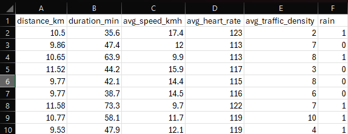
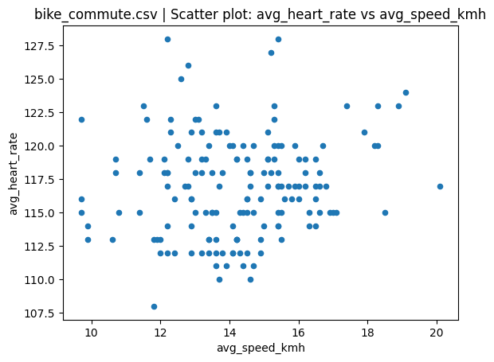
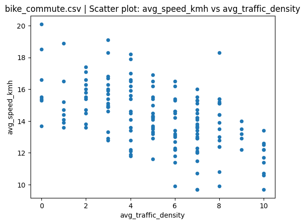

# Data Analysis Tool Agent

In the last lesson, we saw how an agent can use an external tool to tell the current time. In this lesson, we will extend this tool calling agent to a more interesting and complex use case. Once again, its useful to look at the ReAct loop image from the previous lesson, shown again below. We will use this image to look at the functioning of the agent in this lesson.


In the previous lesson, since we provided just a single external tool the LLM only had to reason whether the tool needed to be used to answer the use query. In this lesson, we will provide multiple tools (methods) to the agent and examine its reasoning capability for determining which tool(s) to use based on the user query. 

## Implementation

The use case we're examining is a data analysis agent that can read a csv file and analyse the data using a set of tools that we will provide. First, let's have a look at the data we want to analyse using our agent.

### The data

The "bike_commute.csv" file has data on different bike rides. It has 6 columns:
- Ride distance in km
- Ride duration in mins
- Average speed in km/hr
- Average heart rate in bpm
- Average traffic density - a value from 0 to 10, 0 being no traffic and 10 being heavy traffic
- Presence of rain - a boolean value (0 or 1)

Here's a snapshot of the first 10 rows of the file:


The idea is to use our tool agent to read and analyse this data to ascertain trends and relationships between the different columns. Let us develop the agent and tools we will use.

### Setting up

As usual we're using the OpenAI client as the base LLM in our agent. So we will setup and connect to the client as we have done before. Additionally, we will also register the path to the `resources` directory that contains the `bike_commute.csv` data file.

```python
from dotenv import load_dotenv
import json
from pathlib import Path

import matplotlib.pyplot as plt
import pandas as pd
from openai import OpenAI

if load_dotenv():
    print("Successfully loaded environment variables from .env")
else:
    print("Warning: could not load environment variables from .env")

client = OpenAI()
print("OpenAI client created.")

RESOURCES_DIR = Path("resources")
RESOURCES_DIR
```

Once the client and path to the `resources` directory have been successfully created, the output should look like the following:
    
    Successfully loaded environment variables from .env
    OpenAI client created.

    WindowsPath('resources')

### Defining the external tools

We will first define the external tools (defined as methods) that the agent will have access to in order to analyse the data in the CSV file. Since the methods will all share parameters such as the filepath and the pandas dataframe obtained by reading the CSV file, the methods are defined within a `CsvManager` class seen below. Creating separate methods would require either the data to be loaded every time or some global dictionary to track the state, which would be both time and token intensive. 

```python
class CsvManager:
    def __init__(self, resources_dir: Path):
        self.resources_dir = resources_dir
        self.df = None
        self.csv_name = None

    # --- Small internal helpers --------------------------------------

    def _normalize_csv_name(self, filename: str) -> str:
        if not filename.lower().endswith(".csv"):
            return filename + ".csv"
        return filename

    def _available_csv_files(self) -> list[str]:
        if not self.resources_dir.exists():
            return []
        return sorted(
            [
                p.name
                for p in self.resources_dir.iterdir()
                if p.is_file() and p.suffix.lower() == ".csv"
            ]
        )

    def _ensure_loaded(self):
        if self.df is None:
            files = self._available_csv_files()
            example = files[0] if files else "your_file.csv"
            return {
                "error": (
                    "No CSV is loaded yet. First load one from resources/. "
                    f"For example: load_csv '{example}'."
                )
            }
        return None

    # --- Tools (public methods) --------------------------------------

    def list_csv_files(self):
        """
        List available CSV files in resources/.
        """
        files = self._available_csv_files()
        if not files:
            return {
                "message": (
                    "No CSV files found in resources/. "
                    "Create a resources/ folder and put one or more .csv files inside it."
                ),
                "files": [],
            }
        return {"files": files}

    def load_csv(self, filename: str):
        """
        Load a CSV file from resources/ and make it the active dataset.

        filename can be "bike_commute" or "bike_commute.csv".
        """
        filename = self._normalize_csv_name(filename)
        path = self.resources_dir / filename

        if not path.exists():
            return {
                "error": f"Could not find '{filename}' in resources/.",
                "available_files": self._available_csv_files(),
            }

        self.df = pd.read_csv(path)
        self.csv_name = filename

        return {
            "message": f"Loaded {filename} with shape {self.df.shape}.",
            "columns": self.df.columns.tolist(),
        }

    def get_columns(self):
        """
        Return column names for the currently loaded CSV.
        """
        error = self._ensure_loaded()
        if error:
            return error
        return self.df.columns.tolist()

    def summarize_columns(self, columns: list[str] | None = None):
        """
        Return basic summary stats for one or more columns.

        If columns is None, summarize all columns.
        Uses pandas.describe(include="all") to stay simple and readable.
        """
        error = self._ensure_loaded()
        if error:
            return error

        if columns is None:
            data = self.df
        else:
            missing = [c for c in columns if c not in self.df.columns]
            if missing:
                return {"error": f"These columns are not in the data: {missing}"}
            data = self.df[columns]

        summary = data.describe(include="all").transpose().round(3)
        return summary.to_dict()

    def describe_column(self, column: str):
        """
        Simple summary for a single column using pandas.describe().
        """
        error = self._ensure_loaded()
        if error:
            return error

        if column not in self.df.columns:
            return {"error": f"'{column}' is not a column. Options: {self.df.columns.tolist()}"}

        s = self.df[column]
        summary = s.describe().to_dict()

        cleaned = {}
        for key, value in summary.items():
            if isinstance(value, (int, float)):
                cleaned[key] = round(value, 3)
            else:
                cleaned[key] = value

        return cleaned

    def plot_data(self, y: str, x: str | None = None, plot_type: str = "line"):
        """
        Plot from the active CSV.
    
        - If x is None: plot y vs row index.
        - If x is provided: plot y vs x.
        """
        error = self._ensure_loaded()
        if error:
            return error
    
        if plot_type not in ["scatter", "line"]:
            return "Error: I can only do 'scatter' or 'line'."
    
        if y not in self.df.columns:
            return f"Error: column '{y}' is not in {self.df.columns.tolist()}"
    
        # If someone accidentally passes x == y, treat it like "plot y"
        if x == y:
            x = None
    
        # Scatter needs x
        if plot_type == "scatter" and x is None:
            return "Error: scatter plots need both x and y columns."
    
        title_csv = self.csv_name or "current CSV"
    
        if x is None:
            ax = self.df[y].plot(kind="line")
            ax.set_title(f"{title_csv} | Line plot: {y} vs row index")
            plt.show()
            return f"Plotted {y} vs row index as a line plot."
    
        if x not in self.df.columns:
            return f"Error: column '{x}' is not in {self.df.columns.tolist()}"
    
        ax = self.df.plot(x=x, y=y, kind=plot_type)
        ax.set_title(f"{title_csv} | {plot_type.title()} plot: {y} vs {x}")
        plt.show()
        
        return f"Plotted {y} vs {x} as a {plot_type}."

print("Class defined")

```

Overall the `CsvManager` class has the following methods to be used as external tools:
- `list_csv_files`: Lists available CSV files in the `resources` directory.
- `load_csv`: Load a CSV file into a pandas dataframe
- `get_columns`: List the columns in a loaded CSV file
- `summarize_columns`: Using pandas' `describe` method to provide a succinct, readable description of all the dataframe's columns
- `describe_column`: Using pandas' `describe` method to provide a succinct, readable description of a specific dataframe column
- `plot_data`: Plotting one or two columns from a dataframe using matplotlib's scatter or line plotting functionality

These methods also use internal helper functions (`_normalize_csv_name`, `_available_csv_files`, and `_ensure_loaded`, note that they begin with "_" signifying that they are internal methods to the class) to aid in the loading of the data. These methods provide the basic functionality to load, describe, and plot data from a CSV file and are meant to assist the agent in data analysis. It is important to note that in case the methods are called without the data being loaded, the error statements are returned as outputs so that the agent can reason the need to load the data first. 

Assuming that the class definition does not produce any errors, the output should be the following: 

    Class defined

Now that we have defined the external tools, the next step is to pass the description and parameters of these tools to the agent through the tool schema.

### Defining the tool schema

Just like we did for the last lesson, we define the JSON tool schema providing the method names, descriptions, and parameters to the agent. First, we initialize the `CsvManager` class and create a dictionary matching the names to the corresponding class methods. Then, we define the tool schema below.

```python
csv_backend = CsvManager(RESOURCES_DIR)

node_tools = {
    "list_csv_files": csv_backend.list_csv_files,
    "load_csv": csv_backend.load_csv,
    "get_columns": csv_backend.get_columns,
    "summarize_columns": csv_backend.summarize_columns,
    "describe_column": csv_backend.describe_column,
    "plot_data": csv_backend.plot_data,
}

tools_schema = [
    {
        "type": "function",
        "function": {
            "name": "list_csv_files",
            "description": "List available CSV files in the resources/ folder.",
        },
    },
    {
        "type": "function",
        "function": {
            "name": "load_csv",
            "description": "Load a CSV file from the resources/ folder and make it the active dataset.",
            "parameters": {
                "type": "object",
                "properties": {
                    "filename": {
                        "type": "string",
                        "description": "CSV filename in resources/, e.g. 'bike_commute.csv'.",
                    }
                },
                "required": ["filename"],
            },
        },
    },
    {
        "type": "function",
        "function": {
            "name": "get_columns",
            "description": "Get the column names of the currently loaded CSV.",
        },
    },
    {
        "type": "function",
        "function": {
            "name": "summarize_columns",
            "description": "Show basic summary statistics for columns (uses pandas.describe).",
            "parameters": {
                "type": "object",
                "properties": {
                    "columns": {
                        "type": "array",
                        "items": {"type": "string"},
                        "description": "Optional list of column names. If omitted, summarize all columns.",
                    }
                },
            },
        },
    },
    {
        "type": "function",
        "function": {
            "name": "describe_column",
            "description": "Show basic summary statistics for a single column (uses pandas.describe).",
            "parameters": {
                "type": "object",
                "properties": {
                    "column": {
                        "type": "string",
                        "description": "Column name to describe.",
                    }
                },
                "required": ["column"],
            },
        },
    },
    {
        "type": "function",
        "function": {
            "name": "plot_data",
            "description": "Plot data from the active CSV. If only y is provided, plot y vs row index.",
            "parameters": {
                "type": "object",
                "properties": {
                    "y": {"type": "string", "description": "Column name for y-axis."},
                    "x": {"type": "string", "description": "Optional column name for x-axis."},
                    "plot_type": {
                        "type": "string",
                        "enum": ["scatter", "line"],
                        "description": "Type of plot to create.",
                    },
                },
                "required": ["y"],
            },
        },
    },
]
```

The `node_tools` dictionary is created simply to run the methods as requested by the agent. Note that the descriptions do not mention that the methods are part of the same class. The agent merely decides which tools to use and the dictionary maps the agent's tool call to the class method. Next, we define a method that represents one agent ReAct loop in response to a user query (the image at the beginning of the lesson).

### Defining a response cycle

The `run_agent_cycle` method is defined as a single ReAct loop to generate the response to a user query. 

```python
def run_agent_cycle(messages, user_text, max_tool_rounds=5):
    """
    Run through one react-agent loop using a simple tool-using agent.
    `messages` parameter will usually just contain a system prompt, 
    and then user text will be appended.  

    The loop has three main steps:

    REASON:
      - Call the model with the conversation so far.
      - The model either replies normally, or asks to call a tool from tool set.

    ACT:
      - If tools are requested, run the Python functions

    OBSERVE:
      - Append each requested tool result back into the LLMs conversation history.
      - On the next iteration, the model reads those tool call results and determines
        whether it has reached the goal.

    Stop condition:
      - If the model returns an assistant message with no tool calls, this is the 
        final answer for this react cycle, this implies that reasoning alone without 
        tool calls was enough.  
      - max_tool_rounds is a safety cap to prevent infinite loops.
    """
    messages.append({"role": "user", "content": user_text})

    def observe_tool_result(tool_call_id, result):
        """
        Return a tool's return value as a message that can be appended to the
        LLMs conversation history. The model will read this tool output on the next
        REASON step.
        """
        content = json.dumps(result, default=str) if not isinstance(result, str) else result
        tool_message = {"role": "tool",
                        "tool_call_id": tool_call_id,
                        "content": content,}
        return tool_message

    for loop_idx in range(max_tool_rounds):
        # REASON: call the model
        # Here it will make use of any previous tool outputs it appended ("observed")
        response = client.chat.completions.create(
            model="gpt-4.1-mini",
            messages=messages,
            tools=tools_schema,
        )

        msg = response.choices[0].message

        # Append the assistant message to the conversation history.
        # Use a plain dict so `messages` stays simple and inspectable.
        assistant_entry = {"role": "assistant", "content": msg.content}
        if msg.tool_calls:
            assistant_entry["tool_calls"] = [tc.model_dump() for tc in msg.tool_calls]
        messages.append(assistant_entry)

        # No tool calls means the model is answering directly.
        if not msg.tool_calls:
            return msg.content 

        # ACT + OBSERVE: run each tool call, then append its result.
        # Note there may be multiple tool calls
        for tool_call in msg.tool_calls:
            name = tool_call.function.name
            tool_args = json.loads(tool_call.function.arguments or "{}")

            print(f"ACT: {name}({tool_args})")

            fn = node_tools.get(name)
            if fn is None:
                result = {"error": f"Tool '{name}' not found."}
            else:
                try:
                    result = fn(**tool_args) if tool_args else fn()
                except Exception as e:
                    print(f"Tool error in {name}: {type(e).__name__}: {e}")
                    result = {"error": f"Tool '{name}' failed: {type(e).__name__}: {e}"}
                    
            # OBSERVE: append the tool result back into the conversation history.
            messages.append(observe_tool_result(tool_call.id, result))
            
            # After we appending information about all tool outputs, we loop back and REASON again.

    return "I hit the tool-round limit. Try a simpler request."
```

The `messages` argument is to pass the system prompt to the agent before the chat begins. First, the user query is appended to the messages list and passed to the LLM (OpenAI API client) to generate the initial response. If, the LLM deems that one or more tool(s) must be used, a tool call message is output (the "requests" arrow in the image). For each tool call, the corresponding function is obtained from the `node_tools` dictionary based on the name and tool arguments obtained from the agent tool call.

    name = tool_call.function.name
    tool_args = json.loads(tool_call.function.arguments or "{}")
    fn = node_tools.get(name)

The result from the function run is then "observed" by the LLM (the "results" arrow in the image) and the agent either creates a response (the arrow from LLM to the responses block in the image) or requests more tool calls. A key difference with the previous lesson is that the tools schema is passed onto the agent in every iteration, meaning that the agent can ask for more tool calls based on the observation of the previous tool runs. This loop can be conducted for a `max_tool_rounds=5` rounds (the looping arrow in the LLM block in the image) to reduce token usage. The `observe_tool_result` method is defined internally and simply outputs the LLM response to the tool result. 

Next, we set up the script to chat with the agent.

### Setting up agent chat

Once the response generation method is defined, we will now create the method to simulate the chatbot that conducts a conversation with a user and leverages the external tools as needed through the ReAct process. We first define our system prompt that is provided to the agent with instructions dictating its behaviour. The system prompt is shown below.

```python
SYSTEM_PROMPT = (
    "You are a small data assistant for CSV files stored in resources/. "
    "Use the available tools to do any data work (do not guess). "
    "If no CSV is loaded yet, load one first (or list available CSV files). "
    "Keep answers short and student-friendly."
)
```

It is imperative to provide as much context as you deem necessary to the agent before the start of the conversation. The agent is instructed to behave as a data assistant for CSV files stored in the `resources` directory. Most importantly, we explicitly state that the agent must use the available tools and not guess for data analysis. It is also useful to mention that a CSV file must be loaded from the available list if not done so. Next we create the `run_agent` method that simulates the conversation, shown below.

```python
def run_agent():
    """
    Simple command-line chat loop so it feels like a chatbot.

    We keep a single 'messages' list for the whole session so the model
    sees the conversation history each turn.
    """
    messages = [
        {
            "role": "system",
            "content": SYSTEM_PROMPT
        }
    ]

    print("CSV data agent at your service. Here to help look at your CSV data!")
    print("Type a question. Type 'exit' to quit.\n")
    print("To start, try 'list csv files' or 'load bike_commute.csv'\n")

    while True:
        user_text = input("You: ").strip()
        if user_text.lower() in ["exit", "quit", "q"]:
            print("Bye.")
            break
        
        print(f"User query: {user_text}")
        assistant_text = run_agent_cycle(messages, user_text)
        print(f"\nAssistant: {assistant_text}\n")
```

First, the system prompt is added to the `messages` list which is input to the `run_agent_cycle` method defined previously. Recall that this was the reason to include the `messages` argument in the `run_agent_cycle` method. In every iteration, when a user query is provided to the agent it will go through one ReAct loop cycle to either directly generate the response or request the use of external tools to generate the response. The conversation stops when the user enters either "exit," "quit," or "q." In terms of simulating a conversation with the user, this method is similar to the chatbot we developed previously (see the [chatbots lesson](../05_AI_intro/chat_basics.md)). Let's run this agent on the `bike_commute.csv` file and assess its data analysis capabilities.

### Running the agent

To start the conversation we simply call the `run_agent` method.

```python
run_agent()
```

The example conversation shown here is broken down into question and answer pairs to better understand the working of the agent. You're encouraged to try your own questions and assess the responses.

*Example Chat*:

    CSV data agent at your service. Here to help look at your CSV data!
    Type a question. Type 'exit' to quit.

    To start, try 'list csv files' or 'load bike_commute.csv'

As we had mentioned in the print statement in the `run_agent` method, we must start by either listing the available CSV files or loading the `bike_commute.csv` file. Let's first list the available CSV files.

    User query: list the csv files available to you
    ACT: list_csv_files({})

    Assistant: There is one CSV file available: bike_commute.csv. Would you like to load it to explore its content?

Based on the user query, the agent requests the use of the `list_csv_files` method and responds that there is one CSV file available. So far, so good. Let's go ahead and load this file.

    User query: Yes go ahead
    ACT: load_csv({'filename': 'bike_commute.csv'})

    Assistant: The file bike_commute.csv is loaded. It has 160 rows and 6 columns: distance_km, duration_min, avg_speed_kmh, avg_heart_rate, avg_traffic_density, and rain. What would you like to do next?

The agent loads the `bike_commute.csv` file as requested. Note that we do not need to provide more specifications as the context of the previous messages is being input to the agent. Recall that the output of the `load_csv` method is the shape of the pandas dataframe and the list of the columns, which the agent incorporates in its response. Next, we summarize the columns of the dataframe.

    User query: summarize the columns in the loaded csv file
    ACT: summarize_columns({})

    Assistant: Summary of the columns in bike_commute.csv:

    - distance_km: Mean ~9.93 km, range 7.38 to 12.46 km
    - duration_min: Mean ~42.57 min, range 27.3 to 73.3 min
    - avg_speed_kmh: Mean ~14.22 km/h, range 9.7 to 20.1 km/h
    - avg_heart_rate: Mean ~117 bpm, range 108 to 128 bpm
    - avg_traffic_density: Mean ~5.21, range 0 to 10
    ...
    Let me know if you want details or any specific analysis!

The agent requests the use of the `summarize_columns` method and incorporates the result into its response as expected. Now we assess its data analysis capabilities by having it plot two columns and ascertain the correlation between them.

    User query: plot the relationship between the average speed and average heart rate
    ACT: plot_data({'x': 'avg_speed_kmh', 'y': 'avg_heart_rate', 'plot_type': 'scatter'})



    Assistant: I have created a scatter plot showing the relationship between average speed (km/h) and average heart rate (bpm). Let me know if you want to see the plot or further analyze the data.

First, we ask the agent to plot the average speed against the average heart rate. The agent appropriately asks for the `plot_data` tool to create a scatter plot with the average speed as the X-axis and the average heart rate as the Y-axis. The agent made the decision to create a scatter plot instead of a line plot which is correct. Next, we assess its data analysis capabilities by asking the kind of correlation between these columns (it can be positive, negative, or none).

    User query: What kind of correlation do you see between the columns you plotted?

    Assistant: I see a positive correlation between average speed and average heart rate: as average speed increases, the average heart rate tends to increase too. This suggests that cycling faster raises the rider's heart rate.

In this case, the agent deemed that it does not need to use any external tools to answer the query. While its response makes logical sense, it is not readily apparent from the plot or the data by itself. This suggests that the agent might be leaning more on its internal reasoning than the data. This is quite common among agents and is a potential danger that must be accounted for in practice. Let's try this again with the average speed and average traffic density, but this time we ask the agent to both plot and determine the correlation between the two in the same prompt.

    User query: Plot the average speed against the average traffic density and ascertain the correlation between the two based on this
    ACT: plot_data({'x': 'avg_traffic_density', 'y': 'avg_speed_kmh', 'plot_type': 'scatter'})



    Assistant: A scatter plot of average speed against average traffic density has been created. 

    To ascertain correlation, from the look of the points, do you want me to calculate a correlation coefficient as well?

Again as expected, the `plot_data` tool is called for by the agent and the scatter plot is created. However, the agent does not provide any analysis on the correlation between the average speed and average traffic density. Instead it asks whether we would like to calculate a correlation coefficient. Interestingly, this comes from the LLM's internal reasoning. We know that none of the external tools have the ability to compute the correlation coefficient. But to see how the agent tackles this problem, we ask it to go ahead.

    User query: Yes go ahead
    ACT: describe_column({'column': 'avg_speed_kmh'})
    ACT: describe_column({'column': 'avg_traffic_density'})
    ACT: summarize_columns({'columns': ['avg_speed_kmh', 'avg_traffic_density']})
    ACT: get_columns({})
    ACT: load_csv({'filename': 'bike_commute.csv'})

    Assistant: I hit the tool-round limit. Try a simpler request.

This is where the limits of the tool-based agent begin to show. The agent begins by calling for the `describe_column` tool for the average speed and average traffic density columns, ostensibly to gain more knowledge about the spread of values for both. However, evey subsequent tool call (`summarize_columns`, `get_columns` and `load_csv`) is not needed and signifies the agent grasping at straws to answer the query. Since we had set the ReAct loop to run for a maximum of 5 rounds in the `run_agent_cycle` method, the agent is not able to create an appropriate response. Interestingly, based on the pattern of tool calls it is unlikely that the agent would've gotten to an answer even if the maximum number of ReAct rounds were increased. But it is clear that the agent realizes that it does not have the requisite information from any of the tool calls to generate an appropriate response. We now end the conversation, which outputs the following.

    Bye.

Congratulations! You have created a tool-based agent that is able to consider and leverage multiple external tools in a smart manner to respond appropriately to a user query. The major limitation here is that tool-based agents do poorly for tasks that are outside of the capabilities of the external tools, as we just saw. The next step in this paradigm is to allow the agent to create its own code to perform the action that is outside of the purview of the available tools. We will see how these so-called code-based agents fill in the gaps in the capabliities of tool-based agents in the next lesson.

## Check for Understanding

### Question 1

What are the major steps an agent takes in the ReAct loop?

Choices:
- A. Reason, and Act
- B. Reason, Act, and Observe
- C. Reason, Create, Act
- D. None of the Above

<details>
<summary> View Answer </summary>
<strong>Answer: B: Reason, Act, and Observe</strong>  <br>
In a single ReAct loop iteration, the agent reasons based on the query, acts by requesting a tool call, and generates the response based on the result of the tool call. This response can be a request for more tool calls or the final response to the query.
</details>

### Question 2

In the example chat shown in this lesson, how did the decision to specifically create a "scatter" plot of two columns come about?
Choices:
- A. System prompt 
- B. User query
- C. Agent's reasoning
- D. Both B and C

<details>
<summary> View Answer </summary>
<strong>Answer: C. Agent's reasoning</strong>  <br>
Neither the system prompt nor the user query specifically mention the need to create a scatter plot. This decision came directly from the agent's internal reasoning.
</details>