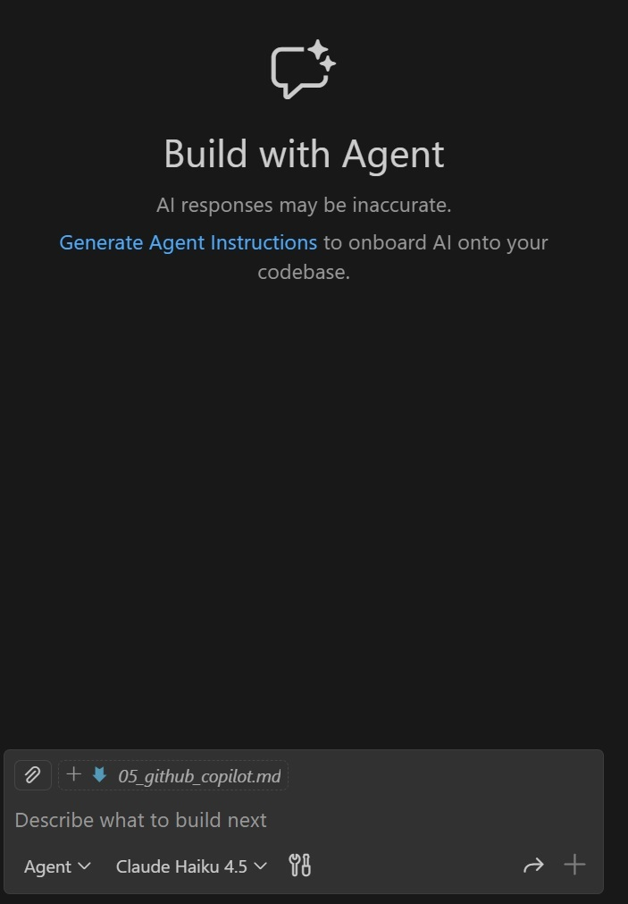

# Paired Programming Demo with GitHub Copilot
In this practical demo, you will use GitHub Copilot to assist you in evaluating and improving a code project.

## What is GitHub Copilot?
GitHub Copilot is a paired programming agent that can look over an entire code base (not just single files), work with VS Code via extensions in agentic mode, and help you write, fix, and improve code. It uses advanced AI models to understand the context of your code and provide relevant suggestions. It can be surprisingly effective at debugging and "understanding" code bases, making it a powerful tool for developers. This is one practical demonstration of agentic AI in action, and is a direction that you will probably see things move in the future. 

## Our project
 The project we'll work with is a simple Python project that includes some functions and corresponding tests. The project, called `mini-etl` (located in `resources/`) performs basic ETL (Extract, Transform, Load) operations on CSV files. More specifically, given a CSV file with a date column and a value (sales) column, it has some simple column cleanup functions, a function to aggregate sales by date, and a "pipeline" function that ties everything together.

The details for the project aren't that important, but what is important is that the code is *broken*, and we need some help fixing it. There are five tests that are supposed to validate the functionality of the code (in the projects `tests/` directory), but currently, all five tests are failing. Your task is to use GitHub Copilot to help you fix the code so that all tests pass. Additionally, you will ask GitHub Copilot to generate a Jupyter notebook that demonstrates the functionality of the `mini-etl` project. 

## Steps to follow

> We recommend creating a copy of the `mini-etl` project before taking the following steps, as GitHub Copilot will be editing the code directly, and you might want to have the original code for reference later. You can always revert changes via git if you are using version control, but making a copy is often easier for demos like this.

### Get tests passing
1. Sign up for GitHub Copilot online using your GitHub account (there is a free version that will give you a limited number of requests each month, which will be plenty for this demo). 
2. In your VS Code IDE, install and enable the following extensions: `GitHub Copilot` and `GitHub Copilot Chat`. 
3. Open your terminal and make sure your virtual environment is activated for Python 200, and navigate to the `mini-etl` project directory. Try running the main script: `python mini_etly.py`. It will generate errors. Also, run the test suite: `python -m pytest -q`. This package is a mess!
4. Hit `ctrl-alt-i` to open the interactive Copilot chat window (it will pop up on the right)and set it to "agent" mode. Then, at the bottom, you can select which LLM to use (e.g., Claude Haiku 4.5 is excellent). There will be a message box at the bottom that says "Describe what to build next". See the attached screenshot.

5. Using your prompt-engineering skills, ask GitHub Copilot to fix the python package. Something like:

    You are in a small Python repo for creating simple ETL operations, and there are failing tests.

    Your task: make `python -m pytest -q` pass by editing `mini_etl.py` only.
    Rules:
    - Do NOT change anything in `tests/`.
    - After each change, re-run tests and continue until all pass.

Once you hit enter, GitHub Copilot will start analyzing your code and making suggestions. You can accept or reject the suggestions as they come in. Continue this process until all tests pass. It may require you to give it permission to edit files and other things along the way, it is quite interactive! 
6. Go ahead and run the tests to confirm they all pass: `python -m pytest -q`. Also, run the main script to see that it works: `python mini_etl.py`. 

### Have it write a demo
Once the tests are passing, you can ask GitHub Copilot to generate a Jupyter notebook that demonstrates the functionality of the `mini-etl` package. In the same chat window, you can type something like:

    Now, please create a Jupyter notebook called `mini_etl_demo.ipynb` that demonstrates how to use the `mini-etl` package. The notebook should include:
    - An introduction to the package
    - Examples of how to use each function in the package
    - A demonstration of the full ETL pipeline using sample data

Try opening the generated notebook in Jupyter and see how well the code runs, are the explanations helpful and clear? If there are problems, does it fix them when you tell the agent what went wrong?

Feel free to explore the repo, and continue tweaking it with GitHub Copilot's help, adding and improving functionality as you see fit!

### Discussion
This demo is meant to showcase the potential of AI agents like GitHub Copilot in assisting with software development tasks. It moves way beyond simple code completion, and asking an LLM questions about code snippets. Here, the agent is able to understand the context of an entire code base, run tests, and make meaningful changes. It can be a powerful tool for developers, especially when working on complex projects or when trying to debug tricky issues. It can also help with generating documentation and demo materials, as we saw with the Jupyter notebook generation.

One thing to consider is that the mini-etl project was intentionally kept very small and simple, partly so we would stay well within the limitations of the free tier of GitHub Copilot. 

Things may not be as neat and tidy when working on a huge sprawling code base. However, this demo should give you a taste of the potential of AI agents in software development. One thing to consider is just how easy it would be to simply accept all the changes that GitHub Copilot suggests without really understanding what is going on. This could lead to problems down the line if the code is not well understood by the developer. 

Especially when working with large-scale, project-wide code changes, it is extremely important to review and understand AI-generated code before acceptpting it. *Always treat it as a **first draft** that needs to be carefully reviewed and tested.* This is especially true for code in production settings where security, performance, and reliability are critical. 

There is a reason that we went through this demo nearly last in the Python data engineering sequence: at this point you have a strong enough foundation in Python, debugging, and general software development practices to be able to critically evaluate the code that GitHub Copilot generates. As AI agents become more prevalent in software development, these skills will be increasingly important.

