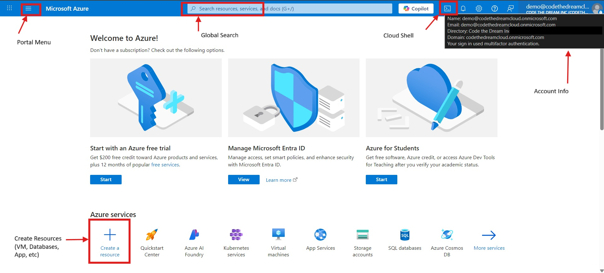

# Week 2 — Hands-On with Microsoft Azure

## **Lesson Overview**
Welcome to the cloud! ☁️  
In this lesson, you’ll take your very first hands-on steps into **Microsoft Azure**, one of the world’s leading cloud platforms. You’ll learn to log into the Azure Portal, explore Cloud Shell, use the Azure CLI, and even write and run your first Python script directly in the cloud.

By the end, you’ll not only understand how to navigate Azure — you’ll *feel like a real cloud engineer.* 

---

## **Learning Objectives**
By the end of this lesson, you will be able to:
- Log into the Azure Portal and identify its main features.
- Launch and use Azure Cloud Shell (Bash).
- Navigate the Cloud Shell filesystem.
- Use Azure CLI commands to explore your subscription and resources.
- Write and execute a Python script directly in the cloud.
- Understand alternative ways to work with Azure.

---

## **Table of Contents**
1. Introduction to the Azure Portal  
   - 1.1 What Is the Azure Portal  
   - 1.2 Logging In and Exploring  
2. Working in the Cloud Shell  
   - 2.1 Getting Started with Cloud Shell  
   - 2.2 Exploring the Filesystem  
   - 2.3 Running Azure CLI Commands  
   - 2.4 Using the Cloud Shell Editor  
3. Executing Python in the Cloud  
4. Other Ways to Work with Azure  
5. Wrap-Up & Next Steps  

---

## **1.1 What Is the Azure Portal**

Before we dive into commands and code, let’s talk about where it all starts — the **Azure Portal**.  
Think of the portal as your *home base in Azure*: it’s a powerful, web-based dashboard where you can create, monitor, and manage everything you build in the cloud.

From here, you can spin up virtual machines, configure security, manage networks, and track costs — all in one place. This is the same interface that professional cloud engineers use every day.

### **What You Can Do in the Portal**
- Create and manage resources (virtual machines, databases, and storage accounts).  
- Configure networking and security to control access.  
- Monitor usage, costs, and performance.  

### **Real-World Use Cases**
- **Developers:** Deploy and scale applications.  
- **IT Teams:** Manage identity and access.  
- **Businesses:** Maintain reliability, security, and compliance.  

> 

🔗 [Learn more: Azure Portal Overview](https://learn.microsoft.com/en-us/azure/azure-portal/azure-portal-overview)

---

## **1.2 Logging In and Exploring the Portal**

Welcome to Azure! 
This is your first step into a professional-grade cloud environment. Using your **CTD Azure account**, you’ll log into the same kind of platform that powers applications used by millions worldwide.

### **Steps**
1. Go to [https://portal.azure.com](https://portal.azure.com).
2. Sign in with the **CTD Azure account** you’ve been provided (check your email for credentials).  
3. Once logged in, take a minute to explore the interface. Don’t worry — we’ll go through everything together.

### **Explore These Key Areas**
- **Search Bar:** Instantly find any Azure service.  
- **Create a Resource (+):** Add new virtual machines, databases, or storage accounts.  
- **Dashboard:** Your customizable home screen.  
- **Cloud Shell Icon (>_):** Opens a terminal in the cloud — we’ll use this soon!  

**Activity:** Try searching for *“Virtual Machine.”* You don’t need to create anything yet — just notice how easy it is to access services.  

>**Tip:** The search bar is one of the most powerful tools in Azure. Use it often to find what you need quickly!

---

## **2.1 Getting Started with Cloud Shell**

Let’s spin up your very first **command-line in the cloud!**  
Azure Cloud Shell is a browser-based terminal that runs a small virtual machine behind the scenes — giving you a Linux environment right in your browser.

### **Steps**
1. Click the **Cloud Shell icon (>_)** in the top menu of the Azure Portal.  
2. Choose **Bash** (the Linux-style shell).  
3. If prompted, **create storage** — this will save your files for next time.  
4. Select your subscription if asked.

### **Test the Environment**
Run a couple of commands to confirm everything is working:
```bash
az --version
python3 --version
```
If both return version numbers, congratulations! 🎉 You now have a live cloud terminal that runs both Azure CLI and Python.

> **Tip:** Cloud Shell automatically authenticates you — no need to log in again!


---

## **2.2 Exploring the Cloud Shell Filesystem**

Just like you use folders and files on your own computer, you can explore and organize files in Cloud Shell. The difference? These files live in Azure and can be accessed from anywhere in the world.

### **Try These Commands**
```bash
pwd                      # show current directory
ls -la                   # list files
mkdir azure-lab          # create a folder
cd azure-lab
echo "Welcome to Azure Cloud Shell" > hello.txt
cat hello.txt
```

**Outcome:** You can now navigate and manage files within a cloud-based filesystem.  
Notice how familiar this feels — it’s just like using your own terminal, but this one lives in the cloud!

> 

---

## **2.3 Running Azure CLI Commands**

The Azure Command-Line Interface (`az`) is a powerful tool that lets you create, view, and manage resources directly from your terminal.

> ⚠️ **Warning:** The CLI gives you *direct access* to Azure resources. With one command, you can create or delete entire systems — so always double-check what you’re running.  
> For now, we’ll stick with **safe, read-only commands**.

### **Try These Commands**
```bash
az account show --output table     # show your current subscription
az account list --output table     # list all accessible subscriptions
az group list --output table       # list existing resource groups
az vm --help                       # explore VM options
```

🔗 [Learn more: Azure CLI Overview](https://learn.microsoft.com/en-us/cli/azure/get-started-with-azure-cli)

**Outcome:** You’ve learned how to interact with Azure programmatically — the same way professional engineers automate their tasks!

---

## **2.4 Using the Cloud Shell Editor**

The Cloud Shell comes with a **built-in code editor** that feels like a lightweight version of VS Code right inside your browser. You can write and run scripts directly in the cloud — no setup required!

> 
### **Steps**
1. Open the editor:
   ```bash
   code .
   ```
2. Create a new Python file:
   ```bash
   touch hello_azure.py
   code hello_azure.py
   ```
3. Paste this code into the editor:
```python
# hello_azure.py
import os, sys, platform

print("Hello from Azure Cloud Shell!")
print("Python version:", sys.version.split()[0])
print("Platform:", platform.platform())
print("Current directory:", os.getcwd())
print("Files:", os.listdir("."))
```
4. Save your work (**Ctrl+S** on Windows or **Cmd+S** on Mac).  
5. Run your script:
   ```bash
   python hello_azure.py
   ```

**Outcome:** You’ve written and executed your first Python script *in the cloud*!

---

## **3. Executing Python in the Cloud**
Running Python in Cloud Shell lets you process data, test APIs, or automate workflows without installing anything locally. You can write code from anywhere — even on a Chromebook or tablet — and it’ll just work.

> **Tip:** Python and Azure CLI can be combined for automation, reporting, and managing cloud resources at scale.

---

## **4. Other Ways to Work with Azure**

Once you’re comfortable in the Portal and Cloud Shell, there are **other environments** you can explore:
- **VS Code Desktop:** Connect directly to Azure, manage resources, and deploy code.  
- **VS Code Web:** A browser-based IDE (still a bit buggy but fun to explore).  
- **Cloud-Based IDEs:** Platforms like GitHub Codespaces or Azure Lab Services allow fully online development.

These are advanced tools, but they show just how flexible cloud development can be — you’re no longer limited by your local machine.

---

## **5. Wrap-Up & Next Steps**

Congratulations! You just completed your first hands-on Azure lab.  

You’ve learned how to:
- Log into Azure using a CTD account.
- Explore the Portal and Cloud Shell.
- Run commands and scripts directly in the cloud.
- Write and execute a Python script from the Cloud Shell editor.

### **Next Steps**
- Try creating your first **Resource Group** using Azure CLI.  
- Compare the **Portal GUI vs. CLI** experience.  
- Explore **VS Code integration** for future lessons.  

> You’ve just taken your first real step into cloud computing — and this is only the beginning!

---
