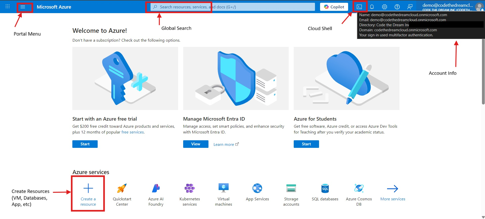

# Getting Started with Azure

The previous lesson covered the conceptual landscape of cloud computing -- what it is, why it exists, and how services are organized. Now it's time to get your hands on an actual cloud environment. By the end of this lesson you'll have a working sense of how to navigate the Azure Portal, a persistent Azure Cloud Shell workspace, and a set of SSH keys that will last through the entire course.

Your instructors have already provisioned an Azure environment for you. A quick note on two terms you'll see constantly: an Azure *subscription* is the billing account that owns all the resources in an organization -- CTD has one subscription, and everything in this course lives inside it. Within that subscription, each student gets their own *resource group*, a sandbox that bundles all your related cloud resources together -- think of it as a project directory. Inside your personal resource group, the storage infrastructure you need for Cloud Shell is already set up. Our main task today is to log in and get everything set up properly.


## Accepting Your Invitation

Your instructors have added you to the Code the Dream Azure *tenant*. A tenant is Microsoft's term for an organization's Azure directory -- the layer that controls who can log in and what they can do. CTD has an Azure tenant, and you'll be receiving an invitation to join so you can work on the hands-on portion of our cloud computing class.

To get started, accept your invitation:

1. Check your email for a message inviting you to join Azure Code the Dream. The subject line will be something like "Code the Dream Inc invited you to access applications within their organization". This email will contain an "Accept invitation" link.
2. Click that link. It will take you to a Microsoft page that looks like a generic application screen with multiple panes -- this is normal, if a bit perplexing.
3. You *may* be prompted to set up multi-factor authentication (MFA). Follow the prompts to configure it -- this is required for guest access to the CTD tenant.
4. Once that's done, go to [https://portal.azure.com](https://portal.azure.com) and sign in with the same email address the invitation was sent to (you might be logged in automatically).

### Troubleshooting: existing Microsoft or Azure accounts

If you already have a Microsoft or Azure account associated with your email, you may run into problems during login -- this is a known rough edge. The most reliable fix is to navigate directly to the CTD portal using the tenant ID in the URL:

```
https://portal.azure.com/0f040ddd-301f-4665-8677-7b21f129d605
```

This drops you straight into the CTD tenant. Bookmark it.

If you're still seeing strange errors or the portal is behaving unexpectedly, session state from your existing account is likely interfering. We strongly recommend setting up a dedicated Chrome profile for CTD work: click your profile icon in the top-right corner of Chrome, create a new profile, and use it exclusively for the CTD Azure account. This will keep the two accounts from stepping on each other.

## The Azure Portal

The Azure Portal is the web-based control panel for everything you'll do in Azure. It's where you create and manage resources, monitor costs, configure permissions, and launch tools like Cloud Shell. Professional cloud engineers spend a significant amount of time here, so getting comfortable navigating it early is worthwhile.

Before moving on, feel free to check out the following overviews of the Azure portal:
- [Azure Portal overview (text)](https://learn.microsoft.com/en-us/azure/azure-portal/azure-portal-overview)
- [Azure portal overview (video)](https://www.youtube.com/watch?v=_Dy_1VIJ-m4)

Take some time to orient yourself before moving on.



The arrow in the screenshot above points to the account area where you switch directories. Once "Code the Dream" appears there, you're in the right place. You'll land on the home dashboard, which shows recently used services and pinned shortcuts.

The *search bar* at the top is the fastest way to navigate -- type the name of any service or resource and it will appear immediately. The *Cloud Shell icon* (the `>_` symbol in the top menu bar) opens a terminal in the browser, which you'll use throughout the course (we will show how to set it up shortly). The *portal menu* will show you important links and frequently used resources.

One useful exercise: search for "Resource groups" and open the one assigned to you. Its name follows the pattern `p200-year-<yourname>-rg`. This is the sandbox you'll be working in for the rest of the cloud portion of the course. Inside it you'll see the storage account your instructors created.

## Setting Up Cloud Shell ☁️

The Azure Cloud Shell is a browser-based terminal that gives you a full Linux environment without installing anything locally. It runs in a small container managed by Azure, and by default that container is *ephemeral* -- every time you close the shell, all the files and directories you created will be deleted. That's fine for quick prototyping, but not for a course where SSH keys and scripts need to survive between sessions.

The solution is to connect Cloud Shell to a *file share* -- a named storage folder in Azure, similar to a network drive. Once connected, your entire home directory persists between sessions: SSH keys, scripts, config files, anything you create under `~`. Your instructors have already created this file share for you. The steps below connect Cloud Shell to it for the first time.

### Setting up Persistent Shell

Click the Cloud Shell icon (`>_`) in the top menu bar. If this is your first time opening it, you'll see a Welcome setup screen. Choose *Bash* when prompted for the shell type.

A `Getting Started` screen will open. You'll be asked how to handle storage. Click on the "Mount  storage account" option (and select the `CTD Nonprofit Sponsorship` in the subscription field). Click `Apply`.

In the "Mount Storage Account" screen that folows, click "select existing storage account" and "Next."

In the "Select storage account" screen:

- *Subscription:* CTD Nonprofit Sponsorship
- *Resource group:* `p200-year-<yourname>-rg`
- *Storage account:* Select the name that follows the pattern `<yourname>ctd<year>sa`. Storage account names must be unique accross all of azure so it might be slightly different.
- *File share:* `home`

Click *Select*. You will see it deploying, and then Azure will confirm that Cloud Shell is now backed by your storage account. From this point on, your home directory is persistent!

This is the first main hurdle in setting things up. You should then see a standard bash prompt at the bottom of your screen -- something like `$`.

This means you are ready to work in the cloud! YOu can enter standard bash commands. If you enter `ls` you will see `clouddrive` which was a default drive created in your home directory during setup.

For work in the cloud, you can create/use anything in your home directory (`~`)

### Verifying Persistence

Run the following to create a test file and confirm it's there:

```bash
echo "hello cloud shell" > ~/clouddrive/test.txt
```

Now close Cloud Shell by clicking the `X` in the shell panel, then reopen it with the `>_` icon. Run:

```bash
ls ~/clouddrive
```

If `test.txt` is still there, your storage is properly connected.


## Exploring the Shell

With Cloud Shell running, take a few minutes to get your bearings. Since you've used a terminal before, these commands will be familiar -- the main difference is that this shell is running on a Linux machine in an Azure data center, not on your laptop.

```bash
pwd              # show your current directory
ls -la           # list files, including hidden ones
whoami           # show your username
```

You also have access to the Azure CLI, a powerful command-line tool for interacting with Azure resources. These read-only commands give you a quick picture of your environment:

```bash
az account show --output table          # show your current subscription
az group list --output table            # list resource groups you can access
```

The `--output table` flag formats results as a readable table rather than raw JSON. None of these commands create or modify anything -- they just display information.

For more on the Azure CLI:
> [Getting started with the Azure CLI](https://learn.microsoft.com/en-us/cli/azure/get-started-with-azure-cli)

In our third week in the cloud, we will show how to connect to your cloud account from your local machine and not be tethered to the portal. This will involve setting up the azure CLI in your local machine.

## SSH Keys

With persistent storage in place, you can now create SSH keys that will be available for the entire course. This matters because SSH keys are how you'll authenticate when connecting to virtual machines and other resources in later weeks.

### What is SSH?

SSH (Secure Shell) is an encrypted protocol for communicating securely between computers over a network. It replaced older, insecure login methods like `telnet` by adding encryption and cryptographic identity verification. Today it underlies secure connections to servers, cloud platforms, and developer tools like GitHub.

SSH uses a *key pair* to prove identity without transmitting a password. Your *private key* stays on your machine and should never be shared. Your *public key* is uploaded to the systems you want to access. When you connect, SSH verifies that the two match -- confirming who you are without a password ever crossing the network.

> [What is SSH?](https://www.cloudflare.com/learning/access-management/what-is-ssh/)

### Generating Your Keys

To generate SSH keys, run the following commands in your Cloud Shell:

```bash
mkdir -p ~/.ssh
ssh-keygen -t rsa -b 4096
```

The first command creates the `.ssh` directory in your home folder if it doesn't exist yet (`-p` means "don't fail if it's already there"). The second command generates your key pair: `-t rsa` specifies the RSA encryption algorithm, and `-b 4096` sets the key length to 4096 bits -- a longer key is significantly harder to crack than the default 2048-bit key.

When prompted for a save location and a passphrase, press Enter to accept the defaults. The keys will be saved to `~/.ssh/id_rsa` (private) and `~/.ssh/id_rsa.pub` (public).

After the key is generated you'll see a block of characters called *randomart* -- a visual fingerprint for your key. It's just decorative, nothing you need to record.

Verify the keys were created:

```bash
ls ~/.ssh
```

You should see both `id_rsa` and `id_rsa.pub`. Because `~/.ssh` is inside your persistent home directory, these keys will be available in every Cloud Shell session going forward.

## Exploring Azure

Take a few minutes to browse the portal. Click "All services" in the left menu (or just start searching for things). You will find hundreds of services organized into categories: Compute, Databases, AI + Machine Learning, Networking, DevOps, Security, and more.

This course will only scratch the surface of that ecosystem. The services you'll use directly -- virtual machines, storage, and eventually Azure ML -- are a small slice of what's available. In the future, as a data engineer or analyst, you'll regularly encounter Azure services you haven't seen before. Getting comfortable exploring is part of the job.

## A Note on Costs

Your instructors have put guardrails in place to keep costs under control: VM sizes are restricted to small, cheap options, regions are locked to East US, and all VMs are scheduled to shut down automatically at 4am Eastern. But guardrails are not perfect -- they are a safety net.

Please only spin up resources that course assignments explicitly ask for, and shut down anything you no longer need. Cloud costs can escalate fast, and CTD's Azure budget is shared across the entire cohort. This is a situation where trust is key.

If you're curious about what things cost, the [Azure Pricing Calculator](https://azure.microsoft.com/en-us/pricing/calculator/) is the right tool -- you can estimate costs before committing to anything. We'll use it in an upcoming assignment.
