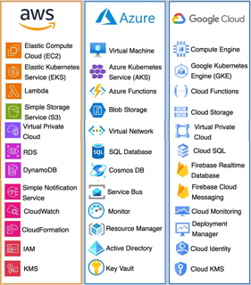
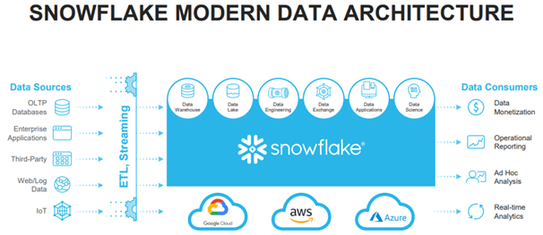

# Introduction to Cloud Computing

> ### Contributor Note 
> This is a working template for Python 200, Week 8. Each section below needs to be expanded into a full lesson. Use the code ideas and goals as a starting point — feel free to add examples, exercises, and links to visualizations or datasets. 

Welcome to the Week 8 in Python 200, Introduction to Cloud Computing! 

# Learning Objective
+ In this class, you will
  + Know the big picture of cloud computing, including what/why/when to use cloud computing
  + Set up and start working on cloud computing with Azure

# Table of Contents
1. [Cloud overview](#1-cloud-overview)
2. [Hands-on introduction to Azure](#2-a-hands-on-introduction-to-azure)
3. [Wrap-up](#wrap-up)

## 1. Cloud Overview

+ **What is “Cloud”?**
  + Imagine a remote computer(s) where you can run resource-intensive compute, handle millions or billions of API request, store petabytes of data, and everything else without the need to physically purchase and manage all the machines.  

  + **Major provider: Amazon Web Service, Google Cloud Platform, Microsoft Azure**  
  These service providers build data centers around the world and maintain the physical machines in their data centers so that you don't have to! Inside each of the data centers, the Cloud Service Providers (CSP) manage hundreds of thousands of harddrive, GPU, CPU. When you use AWS/Azure/GCP service, their program will start the right machines for you so you can run the code from your desktop.  

  + While many of them use different jargons, the services they provide are fairly consistent across the platforms. They usually include the following major services
    + **Storage (AWS S3, Azure Blob, GCP Bucket)**  
    These services allow you to store large volume of data without purchasing multiple hard drives. They are similar to google drive with more functionality. For example, you can set up automatic backup and file deletion rules, manage read/write access, and transform millions of file with code and graphic user interface.  
    + **Compute and Virtual Machine** (AWS EC2, AWS EMR, Azure Virtual Machines, Azure HDInsight)  
    What if my local computer start burning once I hit the run botton on my IDE? Maybe you need a larger computer or you should consider moving the job to the cloud. Virtual machines are like computers that is managed in a data center,and you can control them directly from your laptop/desktop remotely. The major cloud service providers provide highly optimized machines to satisfy most, if not all, the computing resources you will ever need. Want to train a large language model? Go to Azure AI Studio or AWS Sagemaker. Want to host your website? Give Azure API Management and Azure App Service a try! With these cloud services, you can customize the machine you want without physically purchasing them, and you can also stop the machine once you finish your task.
    + **Networking and Security**  
    Cloud providers offer robust networking and security services to help you connect, protect, and monitor your resources. For example, you can create private networks (like AWS VPC, Azure Virtual Network, GCP VPC) to isolate your resources from the public internet, set up firewalls and security groups to control traffic, and use VPNs or ExpressRoute for secure connections between your on-premises environment and the cloud. Security services also include tools for monitoring threats, encrypting data at rest and in transit, and managing compliance requirements. With these features, you can ensure your applications and data are both accessible and secure, whether you are running a small website or a large enterprise system.
    + **Identity and Access Management**  
    If you need to use cloud extensively, chances are you are not the only person working on the project. In fact, many companies build their infrastructures so that multiple people, teams, or even entire organizations can collaborate securely. Identity and Access Management (IAM) services (like AWS IAM, Azure Active Directory, GCP IAM) allow you to control who can access which resources in your cloud environment. You can create users, groups, and roles, assign permissions based on the principle of least privilege, and enforce policies such as multi-factor authentication. IAM also helps you audit activity, manage API keys and service accounts, and integrate with your organization's existing identity systems. With proper IAM setup, you can ensure that only the right people and applications have access to sensitive data and critical services, reducing the risk of accidental or malicious actions.
    + Many other services (IOT, Code Editors etc)  
    Cloud providers offer a wide range of additional services beyond the basics. For example, Internet of Things (IoT) services (like AWS IoT Core, Azure IoT Hub, GCP IoT Core) let you connect, manage, and analyze data from millions of devices and sensors. Managed code editors and development environments (such as AWS Cloud9, Azure Cloud Shell, and even browser-based VS Code) allow you to write and run code directly in the cloud. There are also services for databases (relational and NoSQL), AI and machine learning (like Azure AI Studio, AWS SageMaker, GCP Vertex AI), serverless computing (AWS Lambda, Azure Functions), messaging and event streaming, DevOps pipelines, and much more. No matter what kind of application or workflow you want to build, there is likely a cloud service that can help you do it faster, more securely, and at scale.
  + In this course, we will use Azure as the primary platform for hands-on activities. However, most of the logics and concepts in cloud computing work across all the platforms, so 
    + [What is Azure?](https://azure.microsoft.com/en-us/resources/cloud-computing-dictionary/what-is-azure)
      This is the Microsoft's official introduction about azure take a look at it to get a better sense of the platform you will be using.
  + [Azure Service Overview](https://azure.microsoft.com/en-us/products)

  + Cloud Services Overview
  The following graph offers a side by side comparison of similar services across the cloud platforms. Don't panic if you think this is overwhelmingly complicated, we will walk you through the key services over the next few modules!
  

+ **Core Cloud Concepts**
  + **Vertical and Horizontal Scability**  
  When your computer does not have enough resources to run your task, what do you do? Normally you have two options: get a better computer or distribute your job to multiple computers, and that is the essesn of vertical and horizontal scaling.
    + **Vertical Scaling**  
    Vertical scaling is essentially upgrade the machine that is running your code in the data center. When you try to assign a new service, you could select the machine with larger GPU (i.e. 16Gb vs 64Gb), more CPU cores (i.e. 2 cores vs 4 cores) depending on the need of your compute task. 
    + **Horizontal Scaling**  
    To handle millions or billions of API requests or train a large language model, chances are there one single machine is not enough, unless you have a supercomputer. This is when horizontal scaling becomes handy. Horizontal scaling allows you to spread your compute task into multiple machines so that instead of waiting your code execution forever, you can have two, three, or dozens of machines at the same time to speed up the work. Most of the cloud service providers also allow you to dynamically allocate the horizontal scaling dynamically, so you can spin up your machines only when you needed to save cost (if you used them wisely).
  + **PaaS, IaaS, Saas**
    + **PaaS: Platform as a Service**  
      PaaS provides you with a platform to build, run, and manage applications without worrying about the underlying hardware or operating system. You get tools, libraries, and services to develop and deploy your code quickly. Example: Azure App Service, Google App Engine, or AWS Elastic Beanstalk. You just upload your code, and the platform takes care of the rest (like scaling, patching, and monitoring).
    + **IaaS: Infrastructure as a Service**  
      IaaS gives you access to basic computing resources like virtual machines, storage, and networks. You have full control over the operating system and the software you install, just like renting a computer in the cloud. Example: Azure Virtual Machines, AWS EC2, or Google Compute Engine. You are responsible for managing everything from the OS up, but you don't have to buy or maintain physical hardware.
    + **SaaS: Software as a Service**  
      SaaS delivers ready-to-use software applications over the internet. You just log in and start using the software—no installation or maintenance required. The provider manages everything behind the scenes. Examples: Microsoft 365, Google Workspace, Dropbox, or Zoom. SaaS is great for tools you want to use right away without worrying about setup or updates.

+ **Why cloud?** 
  + My computing task does not fit into a single machine
    + My API is called by millions of users per day, but I do not have a machine that could handle millions of requests
    + I am training a machine learning model with over 1 billion parameters, my GPU is crashed the moment I started training
    + I have 500+TB of data, and my local disk is growing out of control
  + I need a consistent machine as stable as possible
    + My personal network provider refresh IP address every week, and it is causing problems for my hosted service
    + I need to restart my local machine due to hardware or other physical reasons, and this is causing service interruptions
  + All of the cases above are great scenarios to consider moving your code/service/compute to the cloud. In general, cloud computing offer the following advantage:
    + Great vertical and horizontal scalability  
    What if your website become so popular due to a viral video, and now you have 100X traffic to handle, but your server is constantly overloaded? Well, the vertical and horizontal scalibility of the cloud can handle this scenario perfectly.
    + Service consistency  
    Most of the cloud providers have less than 5 seconds of average service interruption per year, which means that you hardly ever have to worry about problems like your code execution is interrupted because your computer is broken.
    + Almost no need for physical equipments  
    What if you have 1000TB of data to handle? Do you purchase 1000 hard drive at $50 each? How about the physical storage of all these disks and the wiring? With cloud, you do not have to worry about these unnerving scenarios, and you can have the luxury to use the best CPU and GPU on your finger tips.
    + Cost Efficient  
    They are more cost efficient than maintaining multiple hard drives, ethernet cables, servers, **if you manage them properly**.
  + [AWS Cost Horror Story](https://www.reddit.com/r/aws/comments/17a663w/whats_the_most_you_have_accidentally_spent_on_aws/)
    + You heard it right, **you could potentially burn $1.5 million a month** if you messed up seriously
  + When should I stick to local server or workstation?
    + If your data is under policy control, such as healthcare related data or other highly confidential data, you might want to check if it is allowed to upload your data onto the cloud.
    + If your data can fit into a single machine, maybe you should stick with your local workstation. 

+ **Manage Resources on the Cloud**
  + **Region**  
    A region is a physical location in the world where a cloud provider has data centers. When you create resources (like virtual machines or databases), you choose a region so your data and services are close to your users or meet specific legal requirements. For example, you might pick "East US" or "West Europe" as your region in Azure. Choosing the right region can help with speed, reliability, and compliance.
  + **Identity Management**  
    Identity management is about controlling who can access your cloud resources and what they can do. Cloud providers offer tools to create user accounts, assign roles, and set permissions. This helps keep your data and services secure by making sure only the right people have access. For example, you might give a developer permission to manage code but not to access billing information. Azure uses Azure Active Directory for identity management.
  + **Resource Group**  
   A resource group is a container that holds related resources for a cloud project. Think of it like a folder where you keep all the things for a specific app or task—virtual machines, databases, storage, and more. Resource groups make it easier to organize, manage, and delete resources as a unit. For example, you can delete a whole project by deleting its resource group. Resource groups are also useful for identity management. For instance, you can give your engineering team permission to manage everything inside a specific resource group (like starting or stopping servers, or updating databases) without giving them access to other projects or billing information. This way, teams only see and control what they need for their work.
  

+ **Managed Data Platforms vs Cloud Service Providers**
  + Cloud Service Providers
    + Major player: AWS, GCP, Azure
    + Provide most, if not all, the cloud services you may possibly need
    + More complex to set-up and manage, and often require dedicated efforts to architect for your own task
    + Even though each provider name their services in their own way, the fundamental workflow and concepts are consistent across platforms
  + Managed Data Platforms
    + Major player: Snowflake, Databricks, Dataiku
    + Managed data platforms are built on top of the cloud service providers. They essentially architect all the cloud services you need on each of the platforms so that you can have way fewer configurations and can enjoy the same UI across different cloud providers. The following diagram summarize the architecture of Databricks on Azure, and the same architecture work for databricks on AWS and GCP.
    
    + Managed data platforms specialize in data related tasks and provide simpler workflow and optimization for data engineering, data analysis, machine learning, and AI tasks, but usually do not offer as many services like cloud providers. For instance, you can't find internet of thing (IOT) services on Databricks or Snowflake.
    + In order to fully utilize managed data platforms, you need to have a valid cloud service provider account and set up payment as these service will charge directly onto your cloud provider.
      + For instance, your databricks on azure bill will be charged directly on your azure account.
      + Caution: the exact payment split will depend on the policy and the platform provider.
  + Which one should I pick?
    + For most of the data analytics and data engineering task, starting with managed data platforms is easier as you do not need to configure 10+ different services on the cloud platform, but they tend to bit more costly.
    + Building your own workflow with cloud providers offers more flexibility and could be more cost-efficient if you know what you are doing.

## 2. A Hands-on Introduction to Azure
This will be their first hands-on introduction to Azure. The main focus is on making sure students can log in and access the portal, and familiarizing them with the basic layout and organization of the portal. I'm assuming this will be a heavy week of troubleshooting, so nothing too heavy. The assignments should be mostly about logging in and making sure things are working for the students, getting acquainted with the portal. 

- Logging in and getting to the portal (log in etc)
-  Overview of portal it's their first time in the cloud! 🎉
- Run and use Azure CLI (something simple exploring the file system): it's just bash but in the cloud. 
- Write/run a simple python script from IDE (they can `runcode .` from CLI and start VS Code in cloud): again, it's effectively VS Code but in the cloud. 
- Explore cost estimator for significant job that they won't actually do but is costly (using some of the resources/services discussed in 1)

## Wrap-up 
Summarize the key takeaways from this lesson. Discuss connection to assignment (and give link to assignment). Preview next lesson, especially if it is connected to this one. 

+ Review each module of the Azure Training resources and complete the quizzes.
  + [Introduction to Microsoft Azure: Describe Cloud Concept](https://learn.microsoft.com/en-us/training/paths/microsoft-azure-fundamentals-describe-cloud-concepts/)
  + [Describe the core architectural components of Azure](https://learn.microsoft.com/en-us/training/modules/describe-core-architectural-components-of-azure/)

