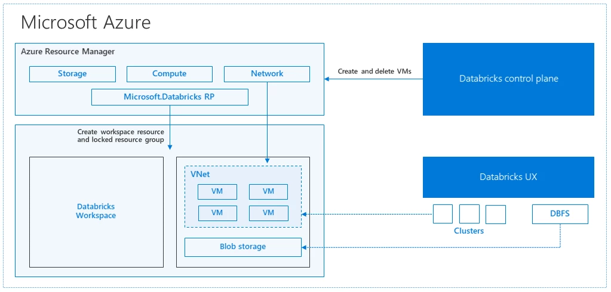

# Introduction to Cloud Computing

> ### Contributor Note 
> This is a working template for Python 200, Week 8. Each section below needs to be expanded into a full lesson. Use the code ideas and goals as a starting point — feel free to add examples, exercises, and links to visualizations or datasets. 

Welcome to the Week 8 in Python 200, Introduction to Cloud Computing! 

# Learning Objective
+ In this class, you will
  + Know the big picture of cloud computing, including what/why/when to use cloud computing
  + Set up and start working on cloud computing with Azure

# Table of Contents
1. [Cloud overview](#1-cloud-overview)
2. [Hands-on introduction to Azure](#2-a-hands-on-introduction-to-azure)
3. [Wrap-up](#wrap-up)

## 1. Cloud Overview

+ **What is “Cloud”?**
  + Imagine a remote computer(s) where you can host API, run resource-intensive compute, and everything you want to run
  + Major provider: Amazon Web Service, Google Cloud Platform, Microsoft Azure
  + While many of them use different jargons, the services they provide are fairly consistent across the platforms. They usually include the following major services
    + Storage (AWS S3, Azure Blob, GCP Bucket)
    + Compute and Virtual Machine (AWS EC2, AWS EMR, Azure Virtual Machines, Azure HDInsight)
    + Networking
    + Identity and Access Management
    + Many other services (IOT, Code Editors etc)
  + For every single thing you can run on your computer, you could probably find a matching service on the cloud. In addition, you could run the same service on the cloud in various ways depending on your need
    + Example: You can set up a ETL pipeline with Azure Prefect and Azure Data Factory doing almost the same job, but cost, scalability could vary depending on your task.
  + [Azure Service Overview](https://azure.microsoft.com/en-us/products)

+ **Why cloud?** 
  + My computing task does not fit into a single machine
    + My API is called by millions of users per day, but I do not have a machine that could handle millions of requests
    + I am training a machine learning model with over 1 billion parameters, my GPU is crashed the moment I started training
    + I have 500+TB of data, and my local disk is growing out of control
  + I need a consistent machine as stable as possible
    + My personal network provider refresh IP address every week, and it is causing problems for my hosted service
    + I need to restart my local machine due to hardware or other physical reasons, and this is causing service interruptions
  + All of the cases above are great scenarios to consider moving your code/service/compute to the cloud. In general, cloud computing offer the following advantage:
    + Great vertical and horizontal scalability
    + Service consistency
    + Almost no need for physical equipments
  + They are more cost efficient than maintaining multiple hard drives, ethernet cables, servers, **if you manage them properly**.
  + [AWS Cost Horror Story](https://www.reddit.com/r/aws/comments/17a663w/whats_the_most_you_have_accidentally_spent_on_aws/)
    + You heard it right, **you could potentially burn $1.5 million a month** if you messed up seriously
  + When should I stick to local server or workstation?
    + If your data is under policy control, such as healthcare related data or other highly confidential data, you might want to check if it is allowed to upload your data onto the cloud.
    + If your data can fit into a single machine, maybe you should stick with your local workstation. 

+ **Managed Data Platforms vs Cloud Service Providers**
  + Cloud Service Providers
    + Major player: AWS, GCP, Azure
    + Provide most, if not all, the cloud services you may possibly need
    + More complex to set-up and manage, and often require dedicated efforts to architect for your own task
    + Even though each provider name their services in their own way, the fundamental workflow and concepts are consistent across platforms
  + Managed Data Platforms
    + Major player: Snowflake, Databricks, Dataiku
    + Managed data platforms are built on top of the cloud service providers. They essentially architect all the cloud services you need on each of the platforms so that you can have way fewer configurations and can enjoy the same UI across different cloud providers. The following diagram summarize the architecture of Databricks on Azure, and the same architecture work for databricks on AWS and GCP.
    
    + Managed data platforms specialize in data related tasks and provide simpler workflow and optimization for data engineering, data analysis, machine learning, and AI tasks, but usually do not offer as many services like cloud providers. For instance, you can't find internet of thing (IOT) services on Databricks or Snowflake.
    + In order to fully utilize managed data platforms, you need to have a valid cloud service provider account and set up payment as these service will charge directly onto your cloud provider.
      + For instance, your databricks on azure bill will be charged directly on your azure account.
      + Caution: the exact payment split will depend on the policy and the platform provider.
  + Which one should I pick?
    + For most of the data analytics and data engineering task, starting with managed data platforms is easier as you do not need to configure 10+ different services on the cloud platform, but they tend to bit more costly.
    + Building your own workflow with cloud providers offers more flexibility and could be more cost-efficient if you know what you are doing.
  + Additional Learning Resources
    + [Databricks Free Edition](https://www.databricks.com/learn/free-edition)
    + [Azure Free Credit](https://azure.microsoft.com/en-us/pricing/purchase-options/azure-account/)
    + [Databricks on Azure Architecture](https://azure.microsoft.com/en-us/blog/a-technical-overview-of-azure-databricks/)
    + Caution: Many of these free services is not completely free! For instance, you can easily go over the free allocated resources and exhaust your $300 free credit on your Azure account! Usually, you will only realize you are overusing your resources until you get the bill next month!

  

## 2. A Hands-on Introduction to Azure
This will be their first hands-on introduction to Azure. The main focus is on making sure students can log in and access the portal, and familiarizing them with the basic layout and organization of the portal. I'm assuming this will be a heavy week of troubleshooting, so nothing too heavy. The assignments should be mostly about logging in and making sure things are working for the students, getting acquainted with the portal. 

- Logging in and getting to the portal (log in etc)
-  Overview of portal it's their first time in the cloud! 🎉
- Run and use Azure CLI (something simple exploring the file system): it's just bash but in the cloud. 
- Write/run a simple python script from IDE (they can `runcode .` from CLI and start VS Code in cloud): again, it's effectively VS Code but in the cloud. 
- Explore cost estimator for significant job that they won't actually do but is costly (using some of the resources/services discussed in 1)

## Wrap-up 
Summarize the key takeaways from this lesson. Discuss connection to assignment (and give link to assignment). Preview next lesson, especially if it is connected to this one. 

