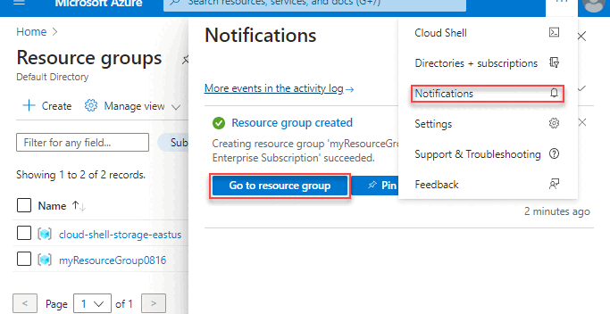

# Learning Objective
+ In this class, you will
  + Learn how to manage computing resources on the cloud
  + Understand the fundamental concepts related to deploying applications on the cloud
  + Host your own cloud application with OpenAI's API

# Table of Contents
1. [Managing Cloud Resources](#1-managing-cloud-resources)
2. [Deploy Applications on the Cloud](#2-deploy-applications-on-the-cloud)
3. [Hands-on Activity: Your First Cloud AI Application](#3-hands-on-activity-your-first-cloud-ai-application)
4. [Wrap-up](#4-wrap-up)

# 1. Managing Cloud Resources

+ **What is a resource group?**  
  In Azure, a resource group is a collection of resource, such as virtual machines and storage, that is managed with the same rules. You can set one lifecycle, netrowking, or auto-scale policy and apply them to all the resource in the same resource group so that you don't have to specify the rule every time you start a new virtual machine. 

+ **Region and Project**  
  In addition to resource group, you will also need to specify the region and project. A **region** is where your resources are physically located: if you select US East, that means the machines running your code are physically located in a data center somewhere in the US East region.  

  In Azure, a **project** is not a fixed object but rather a concept that can be implemented using tags, naming conventions, or resource groups. For example, you can use a tag like `project:CustomerPortal` to group resources related to a specific project. This allows you to filter, organize, and report on resources across multiple resource groups or subscriptions.

  + **Warning: One resource group is bound to one region**  
  This means that, by default, all of your resources will be running from the same region. However, this does not mean you cannot manage multiple resources across regions. You can create multiple resource groups in different regions to distribute your resources geographically. For example, you might have one resource group in `East US` for low-latency access to users on the East Coast and another in `West Europe` for European users. While resources within a single resource group are typically optimized for the same region, cross-region management is possible using Azure's global tools, such as Azure Resource Manager (ARM) templates or the Azure CLI.

+ **Resource Management Accross Platform**  
  Notice that resource group, project, and region exist in GCP, AWS, and Azure, but there are some minor differences. In Azure, a resource group is a logical container for resources, while in AWS, a similar concept is implemented using tags and organizational units. GCP uses projects as the primary organizational unit, which combines the functionality of Azure's resource groups and subscriptions. Regions, on the other hand, are consistent across all three platforms, representing the physical location of data centers, but the naming conventions and available regions may vary slightly between providers.

+ **Manage Resource Group:**
  Azure provide the following ways to manage resources so you can choose whichever is most convenient to work with. The following is a simple summary of Azure's resource group management taken from Azure's website  
     
    + **Azure Portal:**  
      A graphic user interface where you can login to your Azure account and manage the resources with mouse and keyboard. The following is a quick snapshot of creating a resource group with Azure portal.  
    
    + **Command Line Interface (Azure CLI, Azure Powershell)**  
      Azure, AWS, GCP all have built-in command line tool so that you can manage resources with bash or powershell syntax. For instance, we can create resource group called `exampleGroup` in `westus` region with the following command:  
      `az group create --name exampleGroup --location westus`  
      We can also delete the resource group we just created like this:
      `az group delete --name exampleGroup`   
      
    + **Python API**
      Most of the cloud providers also have python APIs so that you can manage your resources with python code. For instance, the same create and delete operations could be done in the following python API:  
      + Create resource group
      ```
      import os
      from azure.identity import AzureCliCredential
      from azure.mgmt.resource import ResourceManagementClient

      credential = AzureCliCredential()
      subscription_id = os.environ["AZURE_SUBSCRIPTION_ID"]

      resource_client = ResourceManagementClient(credential, subscription_id)

      rg_result = resource_client.resource_groups.create_or_update(
          "exampleGroup",
          {
              "location": "westus"
          }
      )

      print(f"Provisioned resource group with ID: {rg_result.id}")
      ```
      + Delete Resource Group
      ```
      import os
      from azure.identity import AzureCliCredential
      from azure.mgmt.resource import ResourceManagementClient

      credential = AzureCliCredential()
      subscription_id = os.environ["AZURE_SUBSCRIPTION_ID"]

      resource_client = ResourceManagementClient(credential, subscription_id)

      rg_result = resource_client.resource_groups.begin_delete("exampleGroup")
      ```
    + **Warning**
      The Python API allows you to control the resources without logging into your Azure account so that you can control your resources from your personal computer or anywhere else. However, you will need to have valid API keys corresponding to your account and configure them properly.

+ Read the following page in Azure for more details:
  + [Azure: Manage Resource Group](https://learn.microsoft.com/en-us/azure/azure-resource-manager/management/manage-resource-groups-portal)


# 2. Deploy Applications on the Cloud
+ **Select the right machines**:  
  Azure, AWS, and GCP offer myriad ways to host an application, and choosing the right service for your application is critical to the performance and cost! The following are some common types of services to host your application:  

+ **Virtual Machines**  
  Virtual machines (VMs) provide a flexible and scalable way to host applications by emulating physical hardware. You can choose the operating system, configure the environment, and install software as needed. VMs are ideal for applications requiring full control over the server or legacy software that cannot run in modern containerized environments. However, they require more management effort, such as patching and scaling, compared to other options.  
  + **Warning: Operating System and Bash Scripting**  
    Notice that by default, most of the virtual machines are working on Linux based operating systems (so does most of the CLI tools!). As a result, knowing the basic bash scripts will help tremendously while working with cloud. If you are unfamiliar with bash scripting, the following is a good reference and practice.  
    https://www.w3schools.com/bash/bash_commands.php

+ **Containerized Compute**  
  Containerized compute services, such as Kubernetes or Docker, allow you to package applications and their dependencies into lightweight, portable containers. These containers can run consistently across different environments, making them ideal for microservices architectures and CI/CD workflows. Container orchestration platforms like Azure Kubernetes Service (AKS) or AWS Elastic Kubernetes Service (EKS) simplify scaling, deployment, and management. Containers are more resource-efficient than VMs but may require expertise in containerization and orchestration.  

+ **Serverless API Endpoint**  
  Hosting API endpoints is essential for applications that expose functionality to external clients or other services. Cloud providers offer managed services like Azure Functions, AWS Lambda, or Google Cloud Functions to host APIs without worrying about server management. Comparing to virtual machines, serverless managed services will handle the CPU, RAM, operating systems for you, so all you need to worry is your code (and cost). These serverless solutions automatically scale based on demand and charge only for the compute time used. They are ideal for lightweight, event-driven applications but may not be suitable for long-running or resource-intensive tasks.  

+ **Batch Data Processing**  
  Batch data processing services are designed for applications that handle large volumes of data in scheduled or on-demand jobs. Examples include Azure Batch, AWS Batch, and Google Cloud Dataflow. These services are ideal for tasks like ETL (Extract, Transform, Load), machine learning model training, or video rendering. They provide high scalability and cost efficiency by distributing workloads across multiple compute nodes. However, they are not suitable for real-time processing and require careful job configuration to optimize performance.

<!-- I am debating if I should add a section about containerization here. It is a natural place to introduce the concept, but I think it might be too involved here. -->

# 3. Hands-on Activity: Your First Cloud AI Application

This short guide walks through creating a resource group and provisioning a virtual machine (VM) on Azure. We will use the Azure Portal (web interface) for the first step and the Azure Command-Line Interface (CLI) for the second step. The goal is to get a working cloud computer ready to host a small Python app.

## Step 1: Create a Resource Group
As we saw last week, a *resource group* is a container that holds related resources for an Azure project. You can think of it like a project folder that will contain everything associated with your cloud computer, such as the virtual machine, its network, and its public IP address. -- add more details here and link to rg discussion from azure --

Creating a resource group first keeps your resources organized and makes it easy to delete everything later when you are done (so you do not continue being charged for any of those resources!).

### How to do it

1. Go to [https://portal.azure.com](https://portal.azure.com) and sign in.
2. In the left sidebar or search bar, type **Resource group** and select it.
3. Click **+ Create**.
4. Under the **Basics** tab:
   - **Subscription**: choose your default subscription (David: not sure how this will work for CTD students we should figure this out).
   - **Resource group name**: `ctd-ai-rg` (stands for code the dream ai resource group)
   - **Region**: choose one close to you, such as `East US` or `Central US`. 
5. (Optional) Under **Tags**, you can add name-value pairs,e.g.
   - `project = ctd-ai`
   - `owner = <yourname>`
6. Click **Review + create**, then **Create**.

When the deployment finishes, you will have a resource group ready to hold your virtual machine. You can confirm by returning to **Resource groups** in the portal and checking that `ctd-ai-rg` appears in the list. You can also list all resource groups in your account from the command line with: `az group list --output table`

## Step 2: Provision the Virtual Machine 

A **virtual machine (VM)** is your cloud computer. It runs an operating system, such as Ubuntu Linux, on Azure hardware. *Provisioning* a VM means creating and configuring it, including network rules and disk size. We will use the Cloud Shell to create the VM. We already set things up last week so we have a persistent shell, with a cloud drive mounted and created SSH keys for authentication. 

We will create a small, low-cost Ubuntu server. Replace `<yourname>` with your name in all commands below. You can copy and paste everything into the Cloud Shell at once.

First we will set up some convenience variables to use in some of the remaining steps. You will need to replace some of them with your values (e.g., what location did you set up your resource group, etc). This is a useful pattern to use generally (for instance if you ever automate deployments or need to build up resources using scripts):


```bash
RG="ctd-ai-rg"      # resource group name
VMNAME="ctd-ai-vm"  # desired vm name
LOCATION="eastus"   # you might need to change this
USERNAME="azureuser" #
MY_IP=$(curl -s ifconfig.me)  #ip address of your computer
```

To see the values of these later, you can use the `echo` command, e.g., `echo $RG`.

Now let's create the virtual machine. Wait until you actually want to use it, because unlike the resource group this will spin up a running compute instance (VM) that will start to generate charges in the cloud :dollar: 

```bash
az vm create \
  --resource-group $RG \
  --name $VMNAME \
  --image Ubuntu2204 \
  --size Standard_B1ms \
  --os-disk-size-gb 30 \
  --admin-username $USERNAME \
  --ssh-key-values ~/.ssh/id_rsa.pub \
  --tags project=ctd-ai owner=eric \
  --public-ip-sku Standard \
  --output yaml
```

### What we just did
The parameters we just used in setting up the VM:

- `--resource-group`: puts the VM inside the resource group you just created.
- `--image Ubuntu2204`: uses Ubuntu Linux 22.04
- `--size Standard_B1ms`: creates a small, cost-efficient VM.
- `--os-disk-size-gb 30`: sets a 30 GB system disk.
- `--ssh-key-values  ~/.ssh/id_rsa.pub`: uses public ssh key you made last week
- `--public-ip-sku Standard`: gives your VM a static, routable IP address.
- `--tags`: attaches metadata for organization.
- `--output yaml` tells azure api to create human-readable output when command runs

This command takes a few minutes (you will see a `Running` message while it deploys). When it finishes, you will see output containing information about the VM, including its public IP address. 

View and Manage Virtual Machines
+ Via Portal:
  1. In the search bar, enter virtual machine
  2. Click and go to page for virtual machines
  3. You should be able to view the status of the virtual machine you just created as well as manage it

+ Via Command Line:
  1. Open Azure Cloud Shell
  2. Make sure you are using the bash shell
  3. Enter `az vm list --output table` to view all VMs in tabular format

You can also select the relevant VMs based on image, region, disk size, project and other metrics in both CLI and portal. For more details, take a look at the following learning resources: [Azure Training on Virtual Machines](https://learn.microsoft.com/en-us/training/modules/provision-linux-virtual-machine-in-azure/)

### Availability zones and NSGs
There were a couple of properties, not discussed above, that were set implicitly when we created the VM:

#### Availability zones
Azure lets you decide how much redundancy you want when creating a virtual machine. As a failsafe, you can use *availability sets* or *zones* to spread copies of the same VM across different physical hardware or datacenters so that if one server fails, another will keep running. For our purposes, we only needed the default of a single, inexpensive development VM. This keeps costs and complexity low.

#### Network security groups
Every VM in Azure sits behind a small virtual firewall called a network security group (NSG). Inbound port rules (into the VM) control which kinds of network traffic are allowed to reach the VM. By default, Azure automatically adds a rule that opens port 22 so we can connect securely using our SSH key pair. Later, if we run a Streamlit app or web server, we'll need to open an additional port (usually 8501 or 80) so that others can view our application in a browser. By setting  `--generate-ssh-keys` as we did above, Azure implicitly created an NSG rule allowing inbound SSH (port 22) for your public key authentication.

Note using this default rule, anyone on the internet could attempt to connect to your VM over port 22. To tighten security for our VM, we could add a new NSG rule so that only connections coming from your own public IP address are allowed. If we were in a high traffic production environment, we would do this, but for this little lesson, the default rules are good enough. 

### Enable automatic shutdown
In production, where an application needs to stay online continuously, auto-shutdown is rarely used (or wanted). In a classroom setting, or when learning to use a cloud system, however, it can be crucial for keeping costs under control and ensuring cloud resources are used efficiently. Otherwise, VMs will just run continuously, accumulating charges even if they are not being used!

Azure does not let you enable auto-shutdown during VM creation. It must be configured afterward as a separate step, either in the portal under **Operations → Auto-shutdown** or by using the CLI. This setting makes sure your VM automatically powers off at a set time each day so you do not accumulate unnecessary charges if you forget to stop it manually. 


The following enable automatic shutdown at 7:00 PM local time.

```bash
az vm auto-shutdown \
  --resource-group $RG \
  --name $VMNAME \
  --time 1900 \
  --email "<your_email@example.com>"
```
You can change the shutdown hour if needed. The shutdown time follows the time of the Azure region your VM is in (for this example, Eastern US). As mentioned, this shutdown will recur *each day*. 

To restart the VM, you can do it from the portal (go to the VM and click `Start`), or from the Cloud Shell using the `az vm start` command:

    `az vm start --resource-group $RG --name $VMNAME`


## Step 3: Create Application

### Connect to VM
We will use Azure's built-in SSH connection to open a terminal *directly inside your VM*. Until now, you have been using *Cloud Shell*, which runs on a temporary container. When you connect to your **VM**, you are now working on your own persistent computer in the cloud.  

To ssh into your VM:

1. In the Azure Portal, open your VM (for example, `ctd-ai-vm`).
2. Click **Connect**.
3. Scroll down to **More ways to connect**.
4. Click the icon labeled **SSH using Azure CLI**.


A cli window will open at the bottom of the screen.  

It is also possible to connect and manage the virual machines with your SSH key from your personal computer or other machines. However, this require additional configurations and might pose some security risk. **Warning: You should never expose your SSH key to the internet or commit your keys to code repos! Your keys should be managed separately from your code!**

For more details about connecting to your virtual machines, visit Azure's guide on [Connect to Virtual Machines](https://learn.microsoft.com/en-us/azure/virtual-machines/linux-vm-connect?tabs=Linux)


<!-- -- david we might want to put a screenshot of this, and/or link to discussion of this form another source--
I am thinking about creating a student account and use that to generate sample images and test the accounts the students will get 
-->

### Set up virtual environment
Now that you are connected to your Virtual Machine (VM), we will set up your project directory and Python environment on the VM itself. This is the kind of thing you do locally all the time when setting up Python projects, the main difference now is you will be doing it on a remote computer (VM) in the cloud. 

Everything here runs inside the VM terminal window that opened when you connected.

In what follows we will create a directory to store our project, create a virtual environment, and download our application and .env file that stores our openai api key. 

```bash
mkdir -p ~/chatbot
cd ~/chatbot
```
This folder will hold all your chatbot files (code, environment, and configuration).

Some VM images do not include the venv module by default, so we can install it:
```bash
sudo apt update
sudo apt install -y python3.10-venv
```

This installs the system package that allows Python to create virtual environments.

Create and activate your virtual environment

```bash
python3 -m venv .venv
source .venv/bin/activate
```
Your prompt should now show `(.venv)` at the beginning. This means you are working inside your isolated environment. All packages you install will stay in this folder and not affect other projects.

Upgrade pip and install required packages

```bash
pip install --upgrade pip
pip install streamlit openai python-dotenv
```

These are the tools you need for the chatbot:
- streamlit – builds the user interface  
- openai – connects to Azure OpenAI  
- python-dotenv – loads your API keys and configuration from a `.env` file

You now have a persistent project directory (`~/chatbot`) and an isolated Python environment (`.venv`) running on your VM. Everything you install here will remain available as long as the VM exists! Note even when you stop the VM, these will persist as long as the resource group continues to exist. 

When you stop a virtual machine in Azure, all of your files and configurations remain safely stored on its attached disk. This means that the next time you start the VM, your folders, virtual environment, and project files—such as your chatbot app—will all be exactly as you left them. Stopping the VM does not delete anything; it simply pauses the compute resources that cost the most money. The main expense in cloud computing comes from running the VM itself, not from the small ongoing charges for disk storage or networking. This is one of the advantages of the "pay as you go" model in the cloud: you can turn off compute power when it is not needed and save significantly, while keeping all your work intact for later.

### Set up application

<!-- I included the instructions for downloading app.py here. I don't think pushing the .env file to the repo is a good idea, so I am omitting that part here. -->

First, you will need to download two files `app.py` and `.env`
- `app.py` contains a simple streamlit application that we will run on the virtual machine we just created
- `.env` contains the OpenAI API key required to run the application


To download the file run the following command:  

```bash
curl -o app.py https://github.com/Code-the-Dream-School/python-200/lessons/09_cloud_AI/resources/app.py
```

Once that is done (downloading app.py and .env), you can enter the following --  

    streamlit run app.py --server.port 8501 --server.address 0.0.0.0

With that command, you are telling Streamlit which port to use and where to listen for connections. 
- `--server.port 8501` means your app is running on port 8501, which is Streamlit’s default port. 
- `--server.address 0.0.0.0` tells Streamlit to listen on all network interfaces, not just inside the VM itself. In networking, 0.0.0.0 is a special address that means "accept connections from anywhere." This allows your app to receive requests that come from outside the VM, such as from your web browser.

When you run the above command, you will see something like:

    You can now view your Streamlit app in your browser. URL: http://0.0.0.0:8501

but don't be fooled -- that's the server talking to itself. To actually see the app, you'll need to use your VM’s public IP instead (which you can find in the Portal): 

    http://<vm ip address>:8501

But we aren't quite ready yet, we need to open port 8501 to connections.


#### Open port 8501 in your NSG
Even though Streamlit is listening, the NSG will still block traffic until you explicitly open port 8501 to inbound connections. In other words, setting the server address to 0.0.0.0 makes your app reachable in theory, and updating the NSG rule makes it reachable in practice. Here we will open it up to be reachable by traffic from your IP address.

Go back to your VM and Click Network settings and under Network security group (NSG) click Create port rule -> Inbound port rule.

We will make an inbound port rule that opens things up only for your IP address.

   Setting	Value
   Source	My IP Address
   Source port ranges	*
   Destination port ranges	8501
   Protocol	TCP
   Action	Allow
   Priority	1010 (or next available)
   Name	allow_streamlit_8501_myip

### Turn-off Virtual Machines
+ Via Portal:
  1. In the search bar, enter "virtual machine".
  2. Click and go to the page for virtual machines.
  3. Select the virtual machine you want to turn off.
  4. Click the "Stop" button to shut down the VM.

+ Via Command Line:
  1. Open Azure Cloud Shell.
  2. Make sure you are using the bash shell.
  3. The command `az vm stop --resource-group ctd-ai-rg --name ctd-ai-vm` will to stop the VM given reosurce
  4. To confirm the VM is stopped, enter `az vm list --show-details --output table` and check the "PowerState" column.

+ **Warning: Make Sure VM Cleaned-up Properly**
  If you do not stop your VM, you will keep incurring cost! This could be extremely expensive if you have a giant (like 64GB, 8 core) VM running. Notice that when you delete a VM, all of the files you downloaded into the VM will be deleted permanently, whereas stopping the VM only pauses its compute resources while preserving all files and configurations on its attached disk.

# 4. Wrap-up
  Congratulations! You have just created your first application on the cloud platform, and now you just learn the tools to deploy and scale your application! Managing virtual machines and cloud application is not an easy task. In fact, it's more complicated than managing your personal computer as they have a lot more scalability and flexibility.