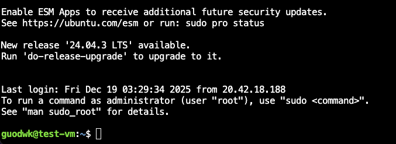

# Learning Objective
+ In this class, you will
  + Learn how to manage computing resources on the cloud
  + Understand the fundamental concepts related to deploying applications on the cloud
  + Host your own cloud application with OpenAI's API

# Table of Contents
1. [Managing Cloud Resources](#1-managing-cloud-resources)
2. [Deploy Applications on the Cloud](#2-deploy-applications-on-the-cloud)
3. [Hands-on Activity: Your First Cloud AI Application](#3-hands-on-activity-your-first-cloud-ai-application)
4. [Wrap-up](#4-wrap-up)

Last week, we have successfully set up our cloud account and gtt the first touch of cloud compute. Now we are ready to create something more interesting: a real AI ChatBOT application hosted on a virtual machine on Azure. But before that, we need to make sure we have the right set up!

Here’s what you’ll learn to do:
1. Use a **Resource Group** to organize your cloud resources 
2. Set up a **Virtual Machine (VM)** — your own computer in the cloud 
3. Install Python and deploy a **Streamlit + OpenAI chatbot app** 
4. Open the correct network ports so you can view your app in a browser 
5. Shut everything down safely so you don’t rack up charges
You’ll do all of this through the **Azure Portal** and **Cloud Shell** that we learned about in the previous week.

# 1. Managing Cloud Resources

In Azure, you can create resources to store files, host API, run codes, and do everything you need. But before doing these cool stuff, you will first need to create a resource group.

+ **What is a resource group?**  
  A resource group is like a folder that holds all the pieces of one project. For example, your virtual machine, storage, and network settings can all live in the same group. Managing them together makes it easy to update or delete everything later with one command. 

  When you create a resource group, you also choose a **region**. A region is the physical location of Azure’s data center (for example, "East US" or "West Europe"). All resources in one group live in that region.  

  *Tip:* If you want resources in different locations, just make another resource group in a different region.

  In this class, you will not create your own resource group. Instead, you will be using a resource group created and managed by CTD staffs and mentors, so you have a little less overhead in managing resource group, and you can focus on managing the resources instead burning your brain on managing resource group. For more information on creating resource group, visit the following [Azure Learn: Create Resource Group](https://learn.microsoft.com/en-us/azure/azure-resource-manager/management/manage-resource-groups-portal)
  
+ **Mange Resources in Resource Group**  
  Once you have a resource group, you can create and manage different resources, including virtual machines, storage, API endpoint, and everything you need, and manage them under the same unit. For instance, you can set a policy to manage who can create and delete new resources, and you can also create limit on the type of services a specific user can create. In a more real-life example, the system administrator can grant data scientist Joe access to cloud storage, cloud compute, and AI related services while blocking Joe from accessing confidential information for compliance. In principal, you can use either the portal or Azure CLI commands to control your resource group. For more materials on managing resource group, visit [Azure Documentation: Manage Resource Groups] (https://learn.microsoft.com/en-us/azure/azure-resource-manager/management/manage-resource-groups-portal)

# 2. Deploy Applications on the Cloud
+ **Select the right services**:  
  Azure, as well as other cloud service providers, offers myriad of ways to host an application, and choosing the right service for your application is critical to the performance and cost! For this class, we will only deploy small virtual machines for light weight applications, and we will stick to a more traditional ways of deployment so that you can have more hands-on experience in working with virtual machines.

+ **Virtual Machines**
  A **virtual machine (VM)** is your cloud computer. It runs an operating system, such as Ubuntu Linux, on Azure hardware. *Provisioning* a VM means creating and configuring it, including network rules and disk size. Virtual machines (VMs) provide a flexible and scalable way to host applications by emulating physical hardware. You can choose the operating system, configure the environment, and install software as needed. VMs are ideal for applications requiring full control over the server or legacy software that cannot run in modern containerized environments. However, they require more management effort, such as patching and scaling, compared to other options. This week, you will learn to create your first virtual machine on Azure and get the first taste of it!
  + **Warning: Operating System and Bash Scripting**  
    Notice that by default, most of the virtual machines are working on Linux based operating systems (so does most of the CLI tools!). As a result, knowing the basic bash scripts will help tremendously while working with cloud. If you are unfamiliar with bash scripting or Linux based system, the following is a good reference and practice.  
    https://www.w3schools.com/bash/bash_commands.php


# 3. Hands-on Activity: Your First Cloud AI Application

This short guide walks through provisioning a virtual machine (VM) on Azure. We will use the Azure Portal (web interface) for the first step and the Azure Command-Line Interface (CLI) for the second step. The goal is to get a working cloud computer ready to host a small Python app.

## Step 1: Find Your Resource Group
As we saw last week, a *resource group* is a container that holds related resources for an Azure project. You can think of it like a project folder that will contain everything associated with your cloud computer, such as the virtual machine, its network, and its public IP address. 

For the purpose of this class, we have already created a resource group `ctd-ai-rg` for you. In order to proceed to the next step, you will first need to make sure you can manage the resources in this resource group.

### How to do it
1. Go to [https://portal.azure.com](https://portal.azure.com) and sign in.
2. In the left sidebar or search bar, type **Resource group** and select it.
3. You should see a resource group called `ctd-ai-rg`
  - Optionally, you can also enter `az group list --output table` to see all the resource groups you have access to
4. Click the `ctd-ai-rg` resource group, and another window should pop up.

You should see a similar interface once you follow the step


Now that we have selected the resource group to create our resources, and we are ready to create resources for our applications!

## Step 2: Provision the Virtual Machine 

 We will use the Cloud Shell to create the VM. We already set things up last week so we have a persistent shell, with a cloud drive mounted and created SSH keys for authentication. 

First we will set up some convenience variables to use in some of the remaining steps. You will need to replace some of them with your values (e.g., replace `<yourname>` to your username like `jane_doe`). This is a useful pattern to use generally (for instance if you ever automate deployments or need to build up resources using scripts):


<!-- I noticed that students should not use the same name for VMs, this will cause errors in VM creation and SSH connection, so I added some instructions for naming -->

You will need a unique name for your VM. The name of a VM should be unique accross a resource group, so we will use your name and `uuidgen` to create a unique name for your VM. `uuidgen` is a bash command to create unique string every time you run it so that you do not need to burn your brain for unique name each time you create something new. Here is an example of `uuidgen`

```bash
ctd-$(uuidgen) # will generate a name like ctd-f47ac10b-58cc-4372-a567-0e02b2c3d479
ctd-$(uuidgen | cut -d- -f1) # will generate shorter name like ctd-118fede1
```

We will create a small, low-cost Ubuntu server. Replace `<yourname>` with your name in all commands below. You can copy and paste everything into the Cloud Shell at once.


```bash
RG="ctd-ai-rg"      # resource group name
VMNAME="ctd-vm-<yourname>-$(uuidgen | cut -d- -f1)"  # use your name and uuidgen to create a unique name for VM
LOCATION="eastus"   # you might need to change this
USERNAME="<yourname>" # configure user name
MY_IP=$(curl -s ifconfig.me)  #ip address of your computer
```

To see the values of these later, you can use the `echo` command, e.g., `echo $RG`.

**Important Note: do not add white space at will in bash**

In bash, whitespace is significant and has special meaning. Spaces around the `=` operator in variable assignments will cause errors. For example:
- ✅ Correct: `RG="ctd-ai-rg"` (no spaces around `=`)
- ❌ Wrong: `RG = "ctd-ai-rg"` (spaces around `=` will fail)
- ❌ Wrong: `RG= "ctd-ai-rg"` or `RG ="ctd-ai-rg"` (space on either side causes errors)

Additionally, when using variables in commands, be careful about spaces in file paths or arguments. For example, if you set `RG="ctd ai"` (with a space), then:
- ✅ Correct: `az vm create --resource-group "$RG" ...` will pass `ctd ai` as a single argument
- ❌ Wrong: `az vm create --resource-group $RG ...` will split it into two arguments (`ctd` and `ai`), causing an error
- In general, you are encouraged to avoid spaces in your variable name to avoid errors, so `ctd ai rg` is not a not recommended, while `ctd-ai-rg` and `ctd_ai_rg` are strongly preferred.

Quoting variables ensures they are treated as a single argument, even if they contain spaces or special characters, so they are highly recommended.

Now let's create the virtual machine. Wait until you actually want to use it, because unlike the resource group this will spin up a running compute instance (VM) that will start to generate charges in the cloud :dollar: 

```bash
az vm create \
  --resource-group "$RG" \
  --name "$VMNAME" \
  --image Ubuntu2204 \
  --size Standard_B1ms \
  --os-disk-size-gb 30 \
  --admin-username "$USERNAME" \
  --ssh-key-values ~/.ssh/id_rsa.pub \
  --public-ip-sku Standard \
  --output yaml
```

### What we just did
The parameters we just used in setting up the VM:

- `--resource-group`: puts the VM inside the resource group created by CTD staff
- `--image Ubuntu2204`: uses Ubuntu Linux 22.04
- `--size Standard_B1ms`: creates a small, cost-efficient VM.
- `--os-disk-size-gb 30`: sets a 30 GB system disk.
- `--ssh-key-values  ~/.ssh/id_rsa.pub`: uses public ssh key you made last week
- `--public-ip-sku Standard`: gives your VM a static, routable IP address.
- `--tags`: attaches metadata for organization.
- `--output yaml` tells azure api to create human-readable output when command runs

This command takes a few minutes (you will see a `Running` message while it deploys). When it finishes, you will see output containing information about the VM, including its public IP address. 

Hooray! Now we have successfully created our VM, and we are ready to view and manage the virtual machines. We can view and manage them in the following ways:
+ Via Portal:
  1. In the search bar, enter virtual machine
  2. Click and go to page for virtual machines
  3. You should be able to view the status of the virtual machine you just created as well as manage it

+ Via Command Line:
  1. Open Azure Cloud Shell
  2. Make sure you are using the bash shell
  3. Enter `az vm list --output table` to view all VMs in tabular format

You can also select the relevant VMs based on image, region, disk size, project and other metrics in both CLI and portal. For more details, take a look at the following learning resources: [Azure Training on Virtual Machines](https://learn.microsoft.com/en-us/training/modules/provision-linux-virtual-machine-in-azure/)

### Availability zones and NSGs
There were a couple of properties, not discussed above, that were set implicitly when we created the VM:

#### Availability zones
Azure lets you decide how much redundancy you want when creating a virtual machine. As a failsafe, you can use *availability sets* or *zones* to spread copies of the same VM across different physical hardware or datacenters so that if one server fails, another will keep running. For our purposes, we only needed the default of a single, inexpensive development VM. This keeps costs and complexity low.

#### Network security groups
Every VM in Azure sits behind a small virtual firewall called a network security group (NSG). Inbound port rules (into the VM) control which kinds of network traffic are allowed to reach the VM. By default, Azure automatically adds a rule that opens port 22 so we can connect securely using our SSH key pair. Later, if we run a Streamlit app or web server, we'll need to open an additional port (usually 8501 or 80) so that others can view our application in a browser. By setting  `--generate-ssh-keys` as we did above, Azure implicitly created an NSG rule allowing inbound SSH (port 22) for your public key authentication.

Note using this default rule, anyone on the internet could attempt to connect to your VM over port 22. To tighten security for our VM, we could add a new NSG rule so that only connections coming from your own public IP address are allowed. If we were in a high traffic production environment, we would do this, but for this little lesson, the default rules are good enough. 

### Enable automatic shutdown
In production, where an application needs to stay online continuously, auto-shutdown is rarely used (or wanted). In a classroom setting, or when learning to use a cloud system, however, it can be crucial for keeping costs under control and ensuring cloud resources are used efficiently. Otherwise, VMs will just run continuously, accumulating charges even if they are not being used!

Azure does not let you enable auto-shutdown during VM creation. It must be configured afterward as a separate step, either in the portal under **Operations → Auto-shutdown** or by using the CLI. This setting makes sure your VM automatically powers off at a set time each day so you do not accumulate unnecessary charges if you forget to stop it manually. 


The following enable automatic shutdown at 7:00 PM local time.

```bash
az vm auto-shutdown \
  --resource-group $RG \
  --name $VMNAME \
  --time 1900 \
  --email "<your_email@example.com>"
```
You can change the shutdown hour if needed. The shutdown time follows the time of the Azure region your VM is in (for this example, Eastern US). As mentioned, this shutdown will recur *each day*. 

To restart the VM, you can do it from the portal (go to the VM and click `Start`), or from the Cloud Shell using the `az vm start` command:

    `az vm start --resource-group $RG --name $VMNAME`


## Step 3: Create Application

### Connect to VM
We will use Azure's built-in SSH connection to open a terminal *directly inside your VM*. Until now, you have been using *Cloud Shell*, which runs on a temporary container. When you connect to your **VM**, you are now working on your own persistent computer in the cloud.  

To ssh into your VM, first you will need to open your cloudshell and enter the following command:

```
az ssh vm \
--resource-group $RG \
--vm-name $VM \
--local-user <yourname>
```

Once you run this command successfully, you should see some messages in your cloudshell



Notice that you should see `<yourname>@VMNAME` as your new username for the shell, which indicate that you have successfully connected to your VM on Azure. Now, this is supposedly an empty environment, and you can use commands like `ls` and `pwd` to verify that you are in a completely empty machine before we start building our applications here.

Notice that now all of the commands you run will be executed inside this virtual machines, which means that you will not be able to run Azure CLI commands without further setup, just like you can't run many commands in a python virtual environment without some setup. You will need to leave the virtual machine before you can run the Azure CLI commands. 

To exit the virtual machine, you can simply enter `exit` in command like (similar to how you would like to exit a python virtual machine!)


It is also possible to connect and manage the virual machines with your SSH key from your personal computer or other machines. However, this require additional configurations and might pose some security risk. **Warning: You should never expose your SSH key to the internet or commit your keys to code repos! Your keys should be managed separately from your code!**

For more details about connecting to your virtual machines, visit Azure's guide on [Connect to Virtual Machines](https://learn.microsoft.com/en-us/azure/virtual-machines/linux-vm-connect?tabs=Linux)


### Set up virtual environment
Now that you are connected to your Virtual Machine (VM), we will set up your project directory and Python environment on the VM itself. This is the kind of thing you do locally all the time when setting up Python projects, the main difference now is you will be doing it on a remote computer (VM) in the cloud. 

Everything here runs inside the VM terminal window that opened when you connected.

In what follows we will create a directory to store our project, create a virtual environment, and download our application and .env file that stores our openai api key. 

```bash
mkdir -p ~/chatbot
cd ~/chatbot
```
This folder will hold all your chatbot files (code, environment, and configuration).

Some VM images do not include the venv module by default, so we can install it:
```bash
sudo apt update
sudo apt install -y python3.10-venv
```

This installs the system package that allows Python to create virtual environments.

Create and activate your virtual environment

```bash
python3 -m venv .venv
source .venv/bin/activate
```
Your prompt should now show `(.venv)` at the beginning. This means you are working inside your isolated environment. All packages you install will stay in this folder and not affect other projects.

Upgrade pip and install required packages

```bash
pip install --upgrade pip
pip install streamlit openai python-dotenv
```

These are the tools you need for the chatbot:
- streamlit – builds the user interface  
- openai – connects to Azure OpenAI  
- python-dotenv – loads your API keys and configuration from a `.env` file

You now have a persistent project directory (`~/chatbot`) and an isolated Python environment (`.venv`) running on your VM. Everything you install here will remain available as long as the VM exists! Note even when you stop the VM, these will persist as long as the resource group continues to exist. 

When you stop a virtual machine in Azure, all of your files and configurations remain safely stored on its attached disk. This means that the next time you start the VM, your folders, virtual environment, and project files—such as your chatbot app—will all be exactly as you left them. Stopping the VM does not delete anything; it simply pauses the compute resources that cost the most money. The main expense in cloud computing comes from running the VM itself, not from the small ongoing charges for disk storage or networking. This is one of the advantages of the "pay as you go" model in the cloud: you can turn off compute power when it is not needed and save significantly, while keeping all your work intact for later.

### Set up application

<!-- I included the instructions for downloading app.py here. I don't think pushing the .env file to the repo is a good idea, so I am omitting that part here. -->

First, you will need to download two files `app.py` and `.env`
- `app.py` contains a simple streamlit application that we will run on the virtual machine we just created
- `.env` contains the OpenAI API key required to run the application


To download the file run the following command:  

```bash
curl -o app.py https://github.com/Code-the-Dream-School/python-200/lessons/09_cloud_AI/resources/app.py
```

Once that is done (downloading app.py and .env), you can enter the following --  

    streamlit run app.py --server.port 8501 --server.address 0.0.0.0

With that command, you are telling Streamlit which port to use and where to listen for connections. 
- `--server.port 8501` means your app is running on port 8501, which is Streamlit’s default port. 
- `--server.address 0.0.0.0` tells Streamlit to listen on all network interfaces, not just inside the VM itself. In networking, 0.0.0.0 is a special address that means "accept connections from anywhere." This allows your app to receive requests that come from outside the VM, such as from your web browser.

When you run the above command, you will see something like:

    You can now view your Streamlit app in your browser. URL: http://0.0.0.0:8501

but don't be fooled -- that's the server talking to itself. To actually see the app, you'll need to use your VM’s public IP instead (which you can find in the Portal): 

    http://<vm ip address>:8501

But we aren't quite ready yet, we need to open port 8501 to connections.


#### Open port 8501 in your NSG
Even though Streamlit is listening, the NSG will still block traffic until you explicitly open port 8501 to inbound connections. In other words, setting the server address to 0.0.0.0 makes your app reachable in theory, and updating the NSG rule makes it reachable in practice. Here we will open it up to be reachable by traffic from your IP address.

Go back to your VM and Click Network settings and under Network security group (NSG) click Create port rule -> Inbound port rule.

We will make an inbound port rule that opens things up only for your IP address.

   Setting	Value
   Source	My IP Address
   Source port ranges	*
   Destination port ranges	8501
   Protocol	TCP
   Action	Allow
   Priority	1010 (or next available)
   Name	allow_streamlit_8501_myip

### Turn-off Virtual Machines
+ Via Portal:
  1. In the search bar, enter "virtual machine".
  2. Click and go to the page for virtual machines.
  3. Select the virtual machine you want to turn off.
  4. Click the "Stop" button to shut down the VM.

+ Via Command Line:
  1. Open Azure Cloud Shell.
  2. Make sure you are using the bash shell.
  3. The command `az vm stop --resource-group ctd-ai-rg --name ctd-ai-vm` will to stop the VM given reosurce
  4. To confirm the VM is stopped, enter `az vm list --show-details --output table` and check the "PowerState" column.

+ **Warning: Make Sure VM Cleaned-up Properly**
  If you do not stop your VM, you will keep incurring cost! This could be extremely expensive if you have a giant (like 64GB, 8 core) VM running. Notice that when you delete a VM, all of the files you downloaded into the VM will be deleted permanently, whereas stopping the VM only pauses its compute resources while preserving all files and configurations on its attached disk.

# 4. Wrap-up
  Congratulations! You have just created your first application on the cloud platform, and now you just learn the tools to deploy and scale your application! Managing virtual machines and cloud application is not an easy task. In fact, it's more complicated than managing your personal computer as they have a lot more scalability and flexibility.