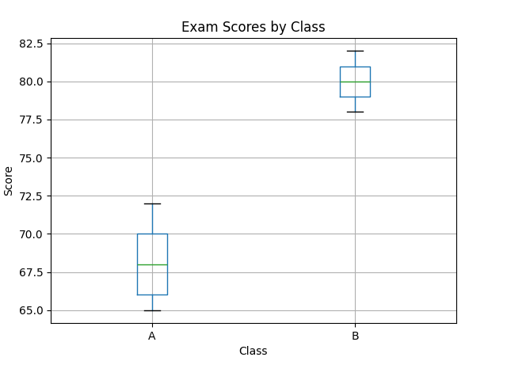

# Pipelines with Prefect

Imagine running your analysis once, then being asked to run it again tomorrow, next week, or on a larger dataset. Manually re-running each step—loading, cleaning, analyzing, and reporting—would be painful, error-prone, and time-consuming.

**Pipelines solve this**. They give us reproducible, modular workflows where each step is defined and orchestrated. This becomes especially powerful in **cloud computing** (This is a topic we'll explore in more detail in future lessons of Python 200).

### Learning objective: 
In this lesson, you’ll learn:

- Why pipelines matter for reproducibility and modularity.
- How to use Prefect to build and orchestrate pipelines.
- How to wrap multiple analysis steps into one end-to-end workflow.
By the end, you'll be able to design a complete data analysis workflow that loads data, cleans it, explores it, performs statistical tests, and reports results—all with a single command.

### Table of Contents
1. Understanding Data Pipelines
2. Prefect Basics: Flows and Tasks
3. Building Your First Prefect Pipeline
4. Wrap-up

## 1. Understanding Data Pipelines

What is a **Data Pipeline**?
A **data pipeline** is a series of connected data processing steps where the output of one step becomes the input of the next. Think of it like a factory assembly line for data-raw materials (data) enter at one end, go through various transformation stations, and emerge as a finished product (insights, reports, or processed datasets).

```python
Raw Data → Load → Clean → Analyze → Visualize → Report
```
- Without pipelines → manual re-runs, messy scripts, hard to reproduce results.
- With pipelines → clear modular steps, easy to run end-to-end, scalable to cloud systems.

2. ## Prefect

Now that we understand why pipelines are essential, let's look at a tool that helps us build them: **Prefect**.  

Prefect is an open-source workflow orchestration tool that helps you define, run, and monitor your data pipelines. It's designed to make data workflows more **robust** and **observable**.

---

### Core Concepts in Prefect

At its core, Prefect uses two main concepts to define your pipeline:

1. **`@task()` decorator**  
   - Transforms a regular Python function into a Prefect **task**.  
   - A task is a fundamental unit of work within a pipeline.  
   - When a task runs, Prefect:  
     - Tracks its state (*running, successful, failed*)  
     - Logs its output  
     - Handles retries if something goes wrong  

2. **`@flow()` decorator**  
   - Transforms a Python function into a Prefect **flow**.  
   - A flow is a collection of tasks and defines the overall workflow      logic. It orchestrates the execution order of your tasks and handles dependencies.  
   - Provides a single entry point to run your entire pipeline. 

---

### Simple Example

Let's see a super simple example to get the idea:

```python
from prefect import task, flow

# Define a task
@task
def say_hello(name):
    print(f"Hello, {name}!")

# Define a flow that uses the task
@flow
def my_pipeline():
    say_hello("Niharika")
    say_hello("Students")

# To run the flow
# This condition checks if the current script is the one being executed directly.
if __name__ == "__main__":  
    my_pipeline()
```
- Each function marked with @task becomes a pipeline step.
- The @flow function orchestrates those steps.
- Running my_pipeline() executes the whole workflow. 

## 3. Building Your First Prefect Pipeline
Let's build a data analysis pipeline using Prefect step by step.

### Step 0: Setup
```python
# First, install Prefect:
pip install prefect pandas matplotlib scipy
```
### Step 1: Imports & Data Loader `(load_data)`:

Imports: We import necessary libraries: pandas for data manipulation, prefect for our pipeline magic, matplotlib.pyplot for plotting, scipy.stats for the t-test, and os for file path checks.

```python

from prefect import task, flow
import pandas as pd
import matplotlib.pyplot as plt
from scipy.stats import ttest_ind

@task
def load_data() -> pd.DataFrame:
    """
    Create a tiny, readable dataset:
      - Class: which class the student is in ('A' or 'B')
      - Score: exam score (numeric)
    """
    data = {
        "Class": ["A","A","A","A","A",  "B","B","B","B","B"],
        "Score": [65, 70, 68, 72, 66,    78, 82, 80, 79, 81]
    }
    df = pd.DataFrame(data)
    print("Exam scores loaded")
    return df

```

#### 📌Function Reference:

- pd.DataFrame(data) → creates a table (DataFrame) from a dictionary.
- **load_data** returns a DataFrame, which later tasks will receive as input.

Note: This is just a shortcut to build repeated labels:
```python
["A"]*5 + ["B"]*5
# → ["A","A","A","A","A","B","B","B","B","B"]
```

### Step 2: Clean the Data `(clean_data)`

```python
@task
def clean_data(df: pd.DataFrame) -> pd.DataFrame:
    """
    Basic cleaning:
      1) Ensure Score is numeric.
      2) Drop missing values.
    (This is minimal on purpose for clarity.)
    """
    df = df.copy()
    df["Score"] = pd.to_numeric(df["Score"], errors="coerce")
    df = df.dropna(subset=["Score", "Class"])
    print("Data cleaned")
    return df
```
Real data is messy. Converting to numeric and dropping NAs prevents errors later (plotting, stats). 

#### 📌Function Reference:
- df.copy() → makes a safe copy so we don’t overwrite the original.
- pd.to_numeric(..., errors="coerce") → converts values to numbers (invalid → NaN).
- df.dropna(...) → removes rows with missing values

### Step 3: Describe & Plot (describe_and_plot)

```python
@task
def describe_and_plot(df: pd.DataFrame) -> None:
    """
    - Print summary stats per class.
    - Make a boxplot comparing Class A vs Class B scores.
    - Save the plot AND show it.
    """
    # Generate descriptive statistics for each class
    summary = df.groupby("Class")["Score"].describe()
    print(summary)

    # Plot
    ax = df.boxplot(by="Class", column="Score")
    plt.title("Exam Scores by Class")
    plt.suptitle("")  # removes automatic 'Score by Class' super-title
    plt.xlabel("Class")
    plt.ylabel("Score")

    # Save and show (both)
    plt.savefig("scores_boxplot.png")
    print('Plot saved to "scores_boxplot.png"')
    plt.close()
```

When this task runs, it prints something like:

```
       count   mean   std   min   25%   50%   75%   max
Class
A        5.0  68.2   2.59  65.0  66.0  68.0  70.0  72.0
B        5.0  80.0   1.87  78.0  79.0  80.0  81.0  82.0
```

**Explanation**
Here, pandas `.describe()` automatically gives us a mini summary for each group (Class A and Class B):

- **count** tells us how many scores are in the group.
- **mean** is the average score.
- **std** (standard deviation) shows how spread out the scores are.
- **min** and **max** are the lowest and highest scores.
- **25%, 50%, 75%** are the quartiles - with 50% being the median.
- From the output, we can see that **Class B has higher average scores (80 vs 68.2)**, and both groups are fairly consistent since the standard deviation is small.



#### 📌Function Reference: 

- df.groupby("Class") → splits data into Class A and Class B. 
- .describe() → gives stats: count, mean, std, min, max, quartiles. 
- df.boxplot(by="Class", column="Score") → makes side-by-side boxplots.
- plt.savefig("file.png") → saves plot as an image.
- plt.show() → shows the plot window.

### Step 4: Run a t-test (run_ttest)

```python
@task
def run_ttest(df: pd.DataFrame) -> tuple[float, float]:
    """
    Independent samples t-test:
      - Compares average Score between Class A and Class B.
      - Returns (t_statistic, p_value).
    """
    a = df[df["Class"] == "A"]["Score"]
    b = df[df["Class"] == "B"]["Score"]

    # Welch’s t-test (robust when variances differ)
    t_stat, p_val = ttest_ind(a, b, equal_var=False)

    print(f"T-test result: t={t_stat:.2f}, p={p_val:.4f}")
    return t_stat, p_val
```
#### 📌 Function Reference:

- df[df["Class"] == "A"]["Score"] → filter rows where Class = A, get scores.
- ttest_ind(a, b, equal_var=False) → compares mean of group A vs group B.
- t-statistic = size of the difference relative to variation.
- Null hypothesis (H0): both classes have the same average score.
- p-value: probability we’d see a difference this large if H0 were true.

**T-test output**
```python
T-test result: t = -8.07, p = 0.0002
```

1. t = -8.07

- This is the t-statistic. It measures how many standard errors the difference between the group means is away from zero.
- Negative sign just means the mean of the first group (Class A) is less than the mean of the second group (Class B).
- The magnitude (8.07) is large, which indicates a strong difference between the groups.

2. p = 0.0002

- This is the p-value, which tells you the probability of observing such a difference if the groups were actually the same (null hypothesis).
- A very small p-value (< 0.05) means the difference is statistically significant.


### Step 5: Report Results (report_results)

```python
@task
def report_results(ttest_result, df):
    t_stat, p_val = ttest_result
    mean_a = df[df["Class"] == "A"]["Score"].mean()
    mean_b = df[df["Class"] == "B"]["Score"].mean()
    print(f"Class A mean: {mean_a:.1f}, Class B mean: {mean_b:.1f}")
    
    if p_val < 0.05:
        print("Conclusion: The difference is statistically significant (p < 0.05).")
    else:
        print("Conclusion: No statistically significant difference (p ≥ 0.05).")
```
Prints `Conclusion: The difference is statistically significant (p < 0.05)`

📌 Function Reference:
- .mean() → calculates average of values.
- if p_val < 0.05: → 5% threshold is a common cutoff for significance.

### Step 6: Orchestrate Everything (@flow)

```python
@flow
def analysis_pipeline():
    """
    The *recipe* that runs all steps in order.
    """
    df = load_data()
    clean_df = clean_data(df)
    describe_and_plot(clean_df)
    result = run_ttest(clean_df)
    report_results(result, clean_df)

if __name__ == "__main__":
    analysis_pipeline()
```
- The **@flow** decorator turns analysis_pipeline into a complete workflow.
- When called, it executes all steps in order, passing data between tasks.

**Key takeaways**

- A task is one step; a flow runs steps in order.
- Keep steps small and single-purpose (load → clean → describe/plot → test → report).
- Save plots to files for reproducibility; use plt.show() to display.
- Prefect adds orchestration, logging, and structure.

## 4. Wrap-up and Summary
In this lesson, you've learned how pipelines automate complex workflows, making your data analysis reproducible and scalable. Prefect simplifies orchestration with decorators and tasks, enabling modular, maintainable code. Building a pipeline from individual steps allows you to execute the entire analysis with a single command, reducing errors and saving time.

For your upcoming assignment, you'll build your own data pipeline following this structure. You will define tasks for each analysis step and orchestrate them with a flow. Think about how to modularize your analysis and leverage Prefect to run it efficiently.

**👏 Well done!**
You just walked through your very first Prefect pipeline 🎉keep this momentum for your assignment. 