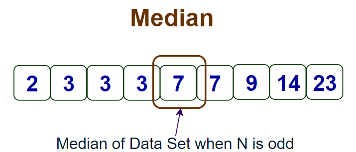
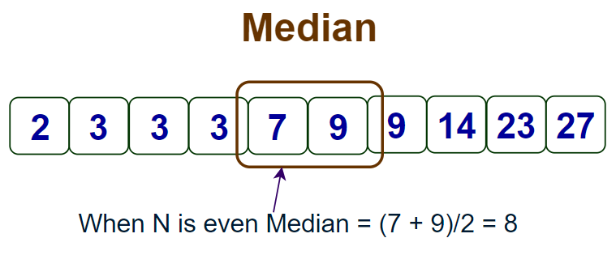
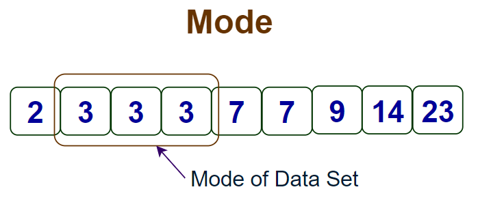
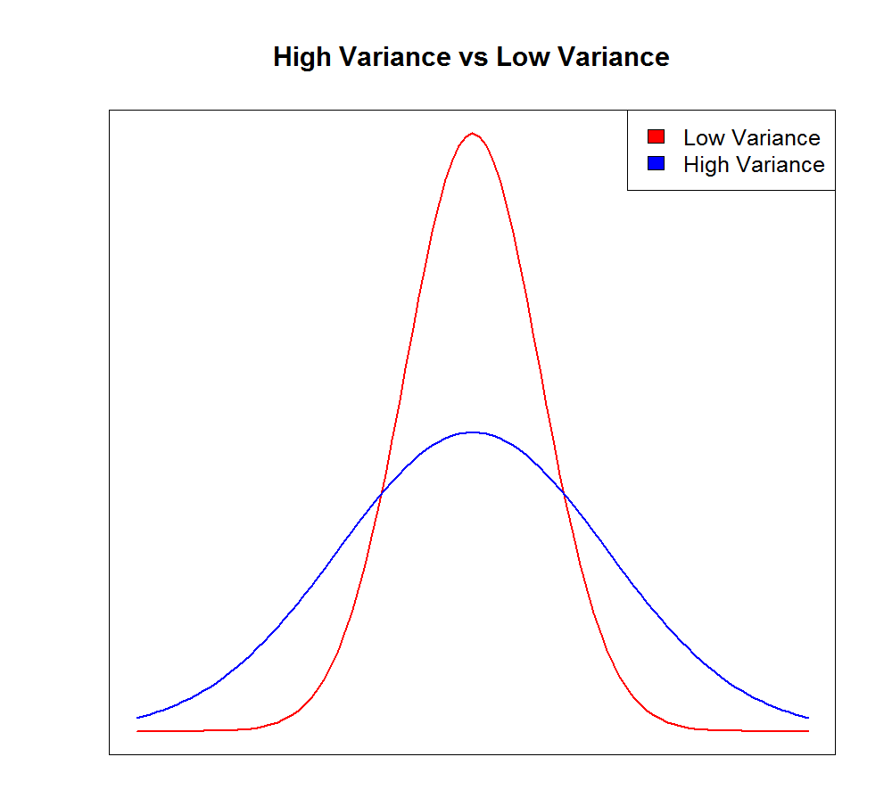
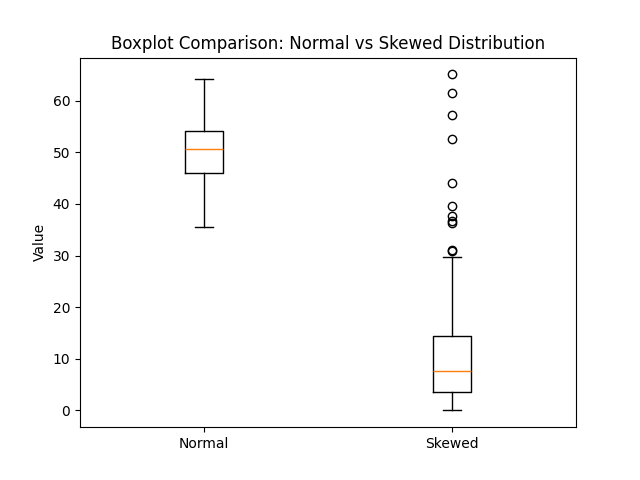

# Descriptive statistics and distributions

## **Learning Objective**: 
Every dataset tells a story - but without the right tools, we can’t understand it. Descriptive statistics and distributions help us summarize, visualize, and see patterns at a glance.  

## **Overview**
This lesson introduces fundamental concepts in descriptive statistics, focusing on how to summarize and understand data through measures of central tendency, variability, and distribution shapes. 

🎯 **Learning Goals**:

By the end of this lesson, you’ll be able to:
- Understand measures of **central tendency** (mean, median, mode).  
- Understand measures of **spread** (variance, standard deviation, IQR).  
- Build intuition for **distributions & Probability**.  
- Use visual tools like **histograms** and **boxplots**.  
- Compute summary statistics by groups.  

## Descriptive Statistics 
Descriptive statistics are methods used to summarize and describe datasets. Instead of looking at thousands of raw values, descriptive statistics condense the information into numbers and visuals so we can quickly understand:
- What’s typical (center)
- How spread out the data is
- How values are distributed

Descriptive statistics is divided into **two main categories**: 
**1. Measures of Central Tendency**  
   → Describes the “center” or typical value of data. (Mean, Median, Mode)  

**2. Measures of Variability (Spread)**  
   → Describes how much the data varies around the center. (Variance, Standard Deviation)  


We’ll cover each category step by step with explanations, examples, and code.  

1. ## Measures of Central Tendency
In data analysis, we often need to describe the **"typical" value** of a dataset. Measures of central tendency summarize the dataset with one value. The three most common measures are the mean, median, and mode. 
Let's dive into each of them:

### Mean (Arithmetic Average)
The **mean** is the sum of all values divided by the number of values.  
It gives the "balance point" of the dataset.

**Computing Mean in Python:**

We can calculate these values by hand, but in real data analysis we use Python libraries. 

```python

import numpy as np

data = [10, 20, 30, 40, 50]
print("Mean:", np.mean(data))

Output: 
Mean: 30.0

```
### Median
- The median is the middle value when the data is sorted. 
- If the dataset has an odd number of values → take the middle one.
- If it has an even number of values → take the average of the two middle values. 





**Example**:
```python
import numpy as np
print("Median (odd count):", np.median([10,20,30,40,50]))
print("Median (even count):", np.median([10,20,30,40]))

Output:
Median (odd count): 30.0
Median (even count): 25.0
```

### Mode
The mode is the most frequently occurring value.
- Useful for categorical data (e.g., favorite ice cream flavor).
- Less useful for continuous numeric data (like heights), because exact repeats are rare. 



👉 Note: NumPy does not have a direct `mode()` function.  
That’s why here we use the built-in **`statistics`** library for simplicity.  

**Example:**

```python
import statistics as stats

flavors = ["Vanilla", "Chocolate", "Vanilla", "Strawberry", "Vanilla"]
print("Mode:", stats.mode(flavors))
Output:
Mode: Vanilla

```

## 2. Measures of Variability (Spread)
Knowing the **center** of the data (mean/median/mode) is useful, but not enough. Two students may have the same average exam score, yet one is very consistent while the other’s scores fluctuate widely.

To capture this difference, we measure **variability** (or spread).

Variability measures tell us how spread out our data is. Two datasets can have the same mean but very different spreads, leading to different interpretations and decisions.

### 2.1 Variance
Variance measures the **average squared distance** of values from the mean. It gives us an idea of how much individual data points differ from the center.
- Why Variability Matters:
- Low variability: Data points cluster tightly around the mean (consistent, predictable)
- High variability: Data points are spread out (inconsistent, unpredictable)



In NumPy:

```python
import numpy as np
data = [10, 12, 23, 23, 16, 23, 21, 16]
print("Variance:", np.var(data)) 
```
Output:
```
Variance: 20.0
```

### 2.2 Standard Deviation 
The standard deviation is the square root of variance, expressed in the same units as the original data. It's more interpretable than variance.
- Small SD → stable, predictable.
- Large SD → highly variable.

In NumPy:

```
print("Standard Deviation:", np.std(data))
```

**Example: Student Exam Scores**
Two students take 5 exams. Both have similar averages, but one is consistent while the other is not.

```python
import numpy as np
student_A = [80, 82, 81, 79, 83]   # very consistent
student_B = [60, 95, 50, 90, 100]  # very variable

print("Student A - Mean:", np.mean(student_A), "Std Dev:", np.std(student_A))
print("Student B - Mean:", np.mean(student_B), "Std Dev:", np.std(student_B))
```

Output:
```
Student A - Mean: 81.0 Std Dev: 1.41
Student B - Mean: 79.0 Std Dev: 19.24
```

➡️ Both have similar averages, but Student A is consistent (small SD) while Student B swings widely (large SD).

### 2.3 Outliers and Their Impact on Central Tendency and Spread

#### What are Outliers?
An **outlier** is also a data point that is drastically different from the other records in the dataset, with the differences being either too high or too low when compared to the rest of the observations. 
  
- Outliers can come from genuine rare events (e.g., a billionaire’s income).  
- Or from errors (e.g., a typo when entering data).  

[Check out this YouTube video to see how outliers can affect measures of spread and centre](https://www.youtube.com/watch?v=vcbMinm_1Q8)

#### Impact of Outliers on Each Measure
Mean → highly sensitive. One extreme value can drastically change it.

Median → more robust. Outliers don’t change the middle value much.

Mode → unaffected (only cares about frequency).

👉 Outliers matter because they can **distort statistics** and **mislead conclusions**.  

## ✅ Check for Understanding

Q1. Which measure of central tendency is most sensitive to outliers?

- A) Mean
- B) Median
- C) Mode
- D) All equally

<details> <summary>Show Answer</summary>
Answer: A) Mean
</details>

Q2. Why is standard deviation easier to interpret than variance?

- A) It is always larger
- B) It is expressed in the same units as the data
- C) It ignores outliers
- D) It is always smaller

<details> <summary>Show Answer</summary>
Answer: B) It is expressed in the same units as the data
</details>

Q3. Which measure is least affected by outliers?

- A) Mean
- B) Median
- C) Mode
- D) Variance

<details> <summary>Show Answer</summary>
Answer: B) Median
</details>

## 3. Distributions and Probability

So far, we've summarized data with numbers (mean, median, variance, std). But numbers alone don't always show the shape of the data. To truly understand our data, we need to explore distributions - both what we observe in our data and the underlying probability patterns that generate it. 

### 3.1 The Connection: Frequency and Probability Distributions

👉 Think of it this way:

Frequency distribution = What we actually observe in our dataset.
Probability distribution = The theoretical pattern that explains what we observe.

When we collect data from the real world, we're essentially taking samples from underlying probability distributions. Understanding this connection helps us:

- Identify patterns in our data.
- Make predictions about future observations.
- Choose appropriate statistical methods.
- Detect when something unusual is happening.

### 3.2 Normal Distribution: The Foundation
The normal distribution (bell curve) is the most important probability distribution in statistics:

- Perfectly symmetrical around the mean.
- Mean ≈ Median ≈ Mode.
- Many natural processes follow this pattern: human height, exam scores,   measurement errors. 

It is also known as a Gaussian distribution and is a theoretical model where the mean, median, and mode are all equal. 

**Generating Normal Data:** 

```python
import numpy as np

# This simulates what we'd observe if we collected data from a normal process
data_normal = np.random.normal(loc=50, scale=5, size=1000)
# loc = mean of the probability distribution
# scale = standard deviation of the probability distribution  
# size = how many samples we observe

```
### 3.3 Skewed Distributions: When Data Isn't Symmetric
Many real-world processes follow skewed probability distributions:

**Right-skewed (positive skew):**

- Most values are small, few are very large
- Mean > Median (pulled toward the tail)
- Examples: Income, house prices, wait times

**Left-skewed (negative skew):**

- Most values are large, few are very small
- Mean < Median (Tail goes to the left)
- Examples: Test scores when most students do well

**The Exponential Distribution**
A classic right-skewed probability distribution is the exponential distribution, perfect for modeling:

- Waiting times (bus arrivals, customer service calls).
- Time between events.
- Lifespans of products.

```python
# Sample from an exponential probability distribution
data_skewed = np.random.exponential(scale=10, size=1000)
print("Exponential sample mean:", np.mean(data_skewed))
print("Exponential sample median:", np.median(data_skewed))
# Notice: mean > median (characteristic of right skew)
### Skewed Distribution
```

[Check out this YouTube video to understand the location of the mean, median, and mode in symmetric and skewed distributions.](https://www.youtube.com/watch?v=2x9ZdBLL-6I)

( #### Key Takeaways from the video: 
- Normal data: Mean is a reliable summary.
- Skewed data: Median is more robust because it resists being pulled by extreme outliers.
- Understanding the shape helps decide which summary statistics and tests to use.)

### 3.4 Probability in Action: Coin Toss Simulation 

Let's explore probability through coin tosses - a simple, intuitive example that demonstrates how probability distributions work in practice:

**Fair vs Biased Coins**

```python
import numpy as np

# Fair coin: Equal probability for heads and tails.
# np.random.choice(elements, size, p=probabilities) 
# lets us assign custom probabilities.
def flip_fair_coin(n_flips):
    return np.random.choice(['H', 'T'], size=n_flips, p=[0.5, 0.5])

# Biased coin: Favors heads
def flip_biased_coin(n_flips):
    return np.random.choice(['H', 'T'], size=n_flips, p=[0.7, 0.3])

# Simulate many flips
n_flips = 1000
fair_flips = flip_fair_coin(n_flips)
biased_flips = flip_biased_coin(n_flips)

# Count heads in each case
fair_heads = np.sum(fair_flips == 'H')
biased_heads = np.sum(biased_flips == 'H')

print(f"Fair coin: {fair_heads}/{n_flips} heads ({fair_heads/n_flips:.3f})")
print(f"Biased coin: {biased_heads}/{n_flips} heads ({biased_heads/n_flips:.3f})")
```
Expected Output:

```markdown
Fair coin: 507/1000 heads (0.507)
Biased coin: 706/1000 heads (0.706)
```

This coin toss example illustrates a fundamental concept in data analysis: when we understand the underlying probability distribution, we can distinguish between normal variation and unusual patterns.

**Case 1: 507 heads out of 1000 flips**

- This is very close to what we'd expect from a fair coin (500 heads).
- The small difference is easily explained by random variation.

Conclusion: This looks like normal behavior for a fair process.

**Case 2: 706 heads out of 1000 flips**

- This is much higher than what we'd typically see from a fair coin.
- Such a large deviation suggests the underlying process might be different.

Conclusion: This pattern suggests we're not dealing with a fair coin.

## 4. Visualization: Histograms & Boxplots

Now that we understand **normal vs skewed distributions**, we can use visual tools to **see the shape and spread** of data.

Two common visualization tools are:

1. **Histograms** – Show the frequency distribution of values.  
2. **Boxplots (or Whisker Plots)** – Summarize spread, quartiles, and highlight outliers.

### 4.1 Histograms
A histogram is a graphical representation of the distribution of numerical data. It uses bars to display the frequency of data points within specified ranges or intervals, often called bins. The height of each bar corresponds to the number of data points that fall within that specific range. 


#### 4.1.2 Pyplot
Matplotlib is a low level graph plotting library in python that serves as a visualization utility. Most of the Matplotlib utilities lies under the pyplot submodule, and are usually imported under the plt alias:
`import matplotlib.pyplot as plt`

In Matplotlib, we use the **hist()** function to create histograms.

#### Example: Normal Distribution vs Exponential(right-skewed) distribution

```python
import numpy as np
import matplotlib.pyplot as plt

# Generate 1000 data points from different probability distributions
data_normal = np.random.normal(loc=50, scale=5, size=1000)
exponential_data = np.random.exponential(scale=10, size=1000)

# Create side-by-side histograms using plt directly
plt.figure(figsize=(10,4))  # Creates the overall window (10x4 inches)

# First subplot
plt.subplot(1, 2, 1)
plt.hist(data_normal, bins=30, color="skyblue", edgecolor="black")
plt.title("Normal Distribution") #sets title of the histogram.
plt.xlabel("Value")     # X-axis label
plt.ylabel("Frequency") # Y-axis label

# Second subplot  
plt.subplot(1, 2, 2)
plt.hist(exponential_data, bins=30, color="salmon", edgecolor="black")
plt.title("Exponential Distribution")
plt.xlabel("Value")
plt.ylabel("Frequency")

plt.tight_layout()  # Auto-adjusts spacing between plots to prevent overlap
plt.show()   #Displays the generated plot
```

**Explanation:** 
- np.random.normal(loc=50, scale=5, size=1000) → generates normal data.
- loc = mean, scale = standard deviation, size = number of samples.
- plt.figure(figsize=(width, height)): Creates a new figure (the overall canvas for our plots)
- plt.subplot(nrows, ncols, index) → Divides canvas into 1 row, 2 columns, select position 1. 
- plt.hist(data, bins=30) → creates histogram with 30 bins.
- color and edgecolor → improve readability.


### 4.2 Boxplots 

A box plot, also known as a box-and-whisker plot, is a standardized way of displaying the distribution of data based on a **five-number summary**: minimum, first quartile (Q1), median (Q2), third quartile (Q3), and maximum. It provides a visual representation of the center, spread, and skewness of a dataset, and can also highlight outliers. 


#### Here's a breakdown of the key components of a box plot:
- **Box**:
The box itself represents the interquartile range (IQR), which is the range between the first and third quartiles (Q1 and Q3). 
- **Median**:alt text
A line inside the box marks the median, which is the middle value of the dataset. 
- **Whiskers**:
Lines extending from the box, called whiskers, typically extend to the minimum and maximum values within a certain range (e.g., 1.5 times the IQR). 
- **Outliers**:
Data points that fall outside the whiskers are considered outliers, potentially indicating unusual or extreme values. 

#### How to interpret a box plot:
- **Center**:
The median line within the box indicates the center of the data. 
- **Spread**:
The length of the box (IQR) and the whiskers indicates the spread or variability of the data. 
- **Skewness**:
If the median line is not in the center of the box, or if the whiskers are of different lengths, it suggests that the data is skewed. 

[Checkout this video to see how to interpret and analyze data from Boxplot](https://www.youtube.com/watch?v=KwqWuRvt7XQ&t=6s)


### Boxplot Syntax in Python

The `matplotlib.pyplot` module of matplotlib library provides `boxplot()` function with the help of which we can create box plots.

```python
plt.boxplot([data1, data2])
```

### Boxplot: Normal vs Skewed Together

```python
import numpy as np
import matplotlib.pyplot as plt

# Generate Normal data (mean=50, std=5)
data_normal = np.random.normal(loc=50, scale=5, size=200)

# Generate Skewed data (Exponential distribution)
data_skewed = np.random.exponential(scale=10, size=200)

# Create boxplot for both
plt.boxplot([data_normal, data_skewed], labels=["Normal", "Skewed"])
plt.title("Boxplot Comparison: Normal vs Skewed Distribution")
plt.ylabel("Value")
plt.show()

```


### 📊 Observations from the Plot: 
- **Normal distribution**:  
  - Box is symmetric around median.  
  - Whiskers extend about equally.  
  - Very few dots (outliers).  
- **Skewed distribution**:  
  - Box is shifted toward smaller values.  
  - Long whisker on the right (tail).  
  - Many dots beyond whiskers → outliers.

## Topic: Computing Summary Statistics by Groups 
So far, we’ve calculated summary statistics (mean, median, standard deviation, etc.) for entire datasets. But in real-world data analysis, we often want to compare **subgroups**.

👉 Example: Suppose we have weekly work hours of employees, and we want to compare results by Department: HR and Department: IT. Instead of just computing the overall mean, we calculate it per group. This helps us answer questions like:
- Do employees in IT work more hours on average than HR?
- Which department shows more consistency in work hours?

## 📌 Using `groupby()` in Pandas  

In Python, the most common way to compute group-level statistics is using **`groupby()`** with aggregation functions like `.mean()`, `.median()`, `.std()`, etc.  

```python
import pandas as pd

# Sample dataset
data = {
    "Department": ["HR", "HR", "HR", "IT", "IT", "IT"],
    "Hours_Worked": [40, 42, 38, 45, 50, 48]
}
df = pd.DataFrame(data)

# Compute mean hours per department
group_means = df.groupby("Department")["Hours_Worked"].mean()
print("Mean hours by department:\n", group_means)

# Compute multiple statistics per group
group_stats = df.groupby("Department")["Hours_Worked"].agg(["mean", "median", "std"])
print("\nSummary stats by department:\n", group_stats)

```
**Explanation of Code**

- groupby("Department") → groups the data based on the Department column.
- ["Hours_Worked"].mean() → computes the mean of Hours_Worked within each group.
- .agg(["mean", "median", "std"]) → computes multiple statistics (mean, median, standard deviation) at once.

Output:

```
Mean hours by department:
 Department
HR    40.000000
IT    47.666667
Name: Hours_Worked, dtype: float64

Summary stats by department:
                  mean  median       std
Department
HR          40.000000    40.0  2.000000
IT          47.666667    48.0  2.516611
```
**Conclusion:**
- IT employees work more hours on average than HR.
- HR has slightly lower standard deviation → work hours are more consistent.
- IT shows higher spread → some employees work significantly more than others.

Group-level statistics are critical for comparing teams, employee segments, experiment groups, or any situation where data naturally splits into subgroups.

## ✅ Check for Understanding

Q1. A right-skewed distribution typically has:

- A) Mean < Median
- B) Mean > Median
- C) Mean = Median
- D) No relationship

<details> <summary>Show Answer</summary>
Answer: B) Mean > Median
</details>

Q2. Unequal whisker lengths in a boxplot indicate:

- A) Symmetry
- B) Skewness in the data
- C) No variability
- D) Error in plotting

<details> <summary>Show Answer</summary>
Answer: B) Skewness in the data
</details>

Q3. Which visualization is better for comparing multiple groups’ spread and outliers?

- A) Histogram
- B) Line Chart
- C) Boxplot
- D) Pie Chart

<details> <summary>Show Answer</summary>
Answer: C) Boxplot
</details>

Q4. Why is groupby() useful in Pandas?

- A) To filter missing values
- B) To combine datasets
- C) To compute statistics for subgroups
- D) To visualize plots

<details> <summary>Show Answer</summary>
Answer: C) To compute statistics for subgroups
</details>

In this lesson, we explored the foundations of **Descriptive Statistics and Distributions**, key building blocks of data analysis.  

You learned how to:  
- Compute **mean, median, and mode** to summarize data.  
- Use **variance and standard deviation** to measure spread.  
- Recognize **normal vs skewed distributions**.  
- Visualize data with **histograms and boxplots**.  
- Compute summary statistics for 2 subgroups using *groupby()*.

You’ve now seen how probability and sampling distributions help us understand what outcomes to expect. In the next step, we’ll use these ideas to test **hypotheses** – asking whether our data are consistent with a given assumption (e.g., a fair coin with p = 0.5). This sets the stage for statistical testing.

## 🎉 Well Done!
**🙌 Great work getting through these foundational concepts!**
