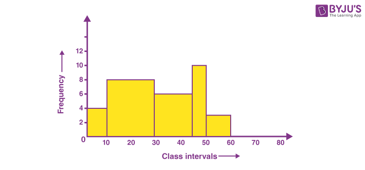
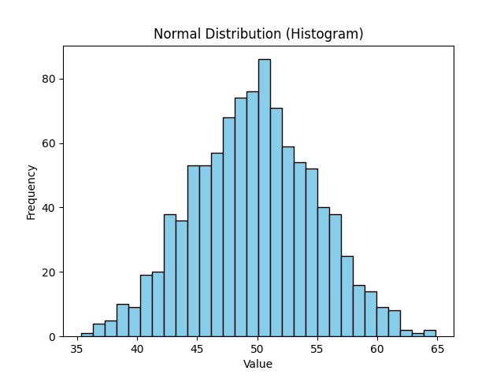
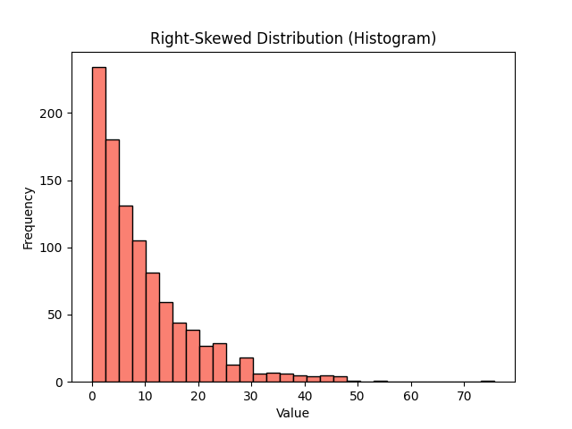
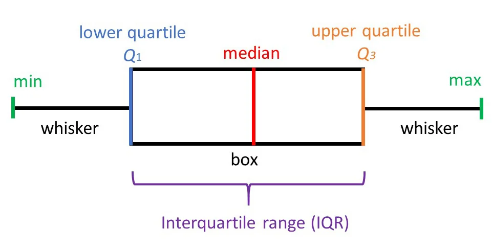
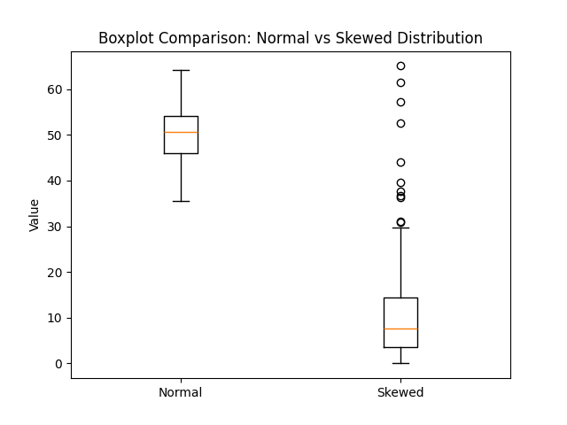

# Descriptive statistics and distributions

## **Learning Objective**: 
Every dataset tells a story - but without the right tools, we can’t understand it. Descriptive statistics and distributions help us summarize, visualize, and see patterns at a glance.  

## **Overview**
This lesson introduces fundamental concepts in descriptive statistics, focusing on how to summarize and understand data through measures of central tendency, variability, and distribution shapes. (Students will learn to compute key statistics, interpret different distribution types, and create effective visualizations.)?

🎯 **Learning Goals**
By the end of this lesson, you’ll be able to:
- Understand measures of **central tendency** (mean, median, mode).  
- Understand measures of **spread** (variance, standard deviation, IQR).  
- Build intuition for **distributions** (normal vs skewed).  
- Use visual tools like **histograms** and **boxplots**.  
- Explore robustness of stats to **outliers**. 

## Descriptive Statistics 
Descriptive statistics are methods used to summarize and describe datasets. Instead of looking at thousands of raw values, descriptive statistics condense the information into numbers and visuals so we can quickly understand:
What’s typical (center)
How spread out the data is
How values are distributed

Descriptive statistics is divided into **three main categories**: 
1. **Measures of Central Tendency**  
   → Describes the “center” or typical value of data. (Mean, Median, Mode)  

2. **Measures of Variability (Spread)**  
   → Describes how much the data varies around the center. (Variance, Standard Deviation)  

3. **Frequency Distribution (Shape of Data)**  
   → Describes how values are distributed across the dataset. (Normal, Skewed, Uniform)  
   → Often visualized with **histograms and boxplots**.  

We’ll cover each category step by step with explanations, examples, code, and visualizations.  

1. ## Measures of Central Tendency
In data analysis, we often need to describe the **"typical" value** of a dataset. Measures of central tendency summarize the dataset with one value. The three most common measures are the mean, median, and mode. 
Let's dive into each of them:

### Mean (Arithmetic Average)
The **mean** is the sum of all values divided by the number of values.  
It gives the "balance point" of the dataset.

**Computing Mean in Python:**

We can calculate these values by hand, but in real data analysis we use Python libraries. 

``python
import numpy as np

data = [10, 20, 30, 40, 50]
print("Mean:", np.mean(data))
``
`Output: 
Mean: 30.0`

### Median
The median is the middle value when the data is sorted. 
If the dataset has an odd number of values → take the middle one.
If it has an even number of values → take the average of the two middle values. 

**Example**:
`import numpy as np
print("Median (odd count):", np.median([10,20,30,40,50]))
print("Median (even count):", np.median([10,20,30,40]))`

`Output:
Median (odd count): 30.0
Median (even count): 25.0`

### Mode
The mode is the most frequently occurring value.
- Useful for categorical data (e.g., favorite ice cream flavor).
- Less useful for continuous numeric data (like heights), because exact repeats are rare.  

👉 Note: NumPy does not have a direct `mode()` function.  
That’s why here we use the built-in **`statistics`** library for simplicity.  

**Example:**

`import statistics as stats

flavors = ["Vanilla", "Chocolate", "Vanilla", "Strawberry", "Vanilla"]
print("Mode:", stats.mode(flavors))
Output:
Mode: Vanilla
`
## 2. Measures of Variability (Spread)
Knowing the **center** of the data (mean/median/mode) is useful, but not enough. Two students may have the same average exam score, yet one is very consistent while the other’s scores fluctuate widely.

To capture this difference, we measure **variability** (or spread).

Variability measures tell us how spread out our data is. Two datasets can have the same mean but very different spreads, leading to different interpretations and decisions.

### 2.1 Variance
Variance measures the **average squared distance** of values from the mean. It gives us an idea of how much individual data points differ from the center.
Why Variability Matters
Low variability: Data points cluster tightly around the mean (consistent, predictable)
High variability: Data points are spread out (inconsistent, unpredictable)

In NumPy:
`python
import numpy as np
data = [10, 12, 23, 23, 16, 23, 21, 16]
print("Variance:", np.var(data)) 

Output:
Variance: 20.0
`
### 2.2 Standard Deviation 
The standard deviation is the square root of variance, expressed in the same units as the original data. It's more interpretable than variance.
Small SD → stable, predictable.
Large SD → highly variable.

In NumPy:
`print("Standard Deviation:", np.std(data))`

**Example: Student Exam Scores**
Two students take 5 exams. Both have similar averages, but one is consistent while the other is not.

`import numpy as np
student_A = [80, 82, 81, 79, 83]   # very consistent
student_B = [60, 95, 50, 90, 100]  # very variable

print("Student A - Mean:", np.mean(student_A), "Std Dev:", np.std(student_A))
print("Student B - Mean:", np.mean(student_B), "Std Dev:", np.std(student_B))`

Output:
`Student A - Mean: 81.0 Std Dev: 1.41
Student B - Mean: 79.0 Std Dev: 19.24`

➡️ Both have similar averages, but Student A is consistent (small SD) while Student B swings widely (large SD).

### 2.3 Outliers and Their Impact on Central Tendency and Spread

#### What are Outliers?
An **outlier** is also a data point that is drastically different from the other records in the dataset, with the differences being either too high or too low when compared to the rest of the observations. 
  
- Outliers can come from genuine rare events (e.g., a billionaire’s income).  
- Or from errors (e.g., a typo when entering data).  

[Check out this YouTube video to see how outliers can affect measures of spread and centre](https://www.youtube.com/watch?v=vcbMinm_1Q8)

#### Impact of Outliers on Each Measure
Mean → highly sensitive. One extreme value can drastically change it.

Median → more robust. Outliers don’t change the middle value much.

Mode → unaffected (only cares about frequency).

👉 Outliers matter because they can **distort statistics** and **mislead conclusions**.  

## 3. Frequency Distribution
So far, we’ve summarized data with numbers (mean, median, variance, std).  
But numbers alone don’t always show the **shape** of the data.  

👉 A **frequency distribution** shows how often each value or range of values occurs. This helps us understand whether data is **symmetrical (normal)** or **skewed (lopsided)**.

### Normal Distribution (Bell Curve)

- The most common distribution in statistics.  
- Symmetrical around the mean.  
- Mean ≈ Median ≈ Mode.  
- Many natural and social processes follow it (e.g., human height, exam scores).  

#### Syntax to Generate a normal distribution

`data = np.random.normal(loc=mean_value, scale=standard_deviation_value, size=number_of_samples)
`
### Skewed Distribution

- Skewed Right (positive skew): Tail goes to the right. Mean > Median.
- Skewed Left (negative skew): Tail goes to the left. Mean < Median.
- Common in income data, housing prices, wait times — where extreme values “stretch” one side.

[Check out this YouTube video to understand the location of the mean, median, and mode in symmetric and skewed distributions.](https://www.youtube.com/watch?v=vcbMinm_1Q8)

#### Key Takeaways from the video: 
Normal data: Mean is a reliable summary.
Skewed data: Median is more robust because it resists being pulled by extreme outliers.
Understanding the shape helps decide which summary statistics and tests to use.

📖 Example in Data Analysis
Average salary (mean) may look high because of a few millionaires.
Median salary is usually more representative of what a “typical” person earns.

## 4. Visualization: Histograms & Boxplots

Now that we understand **normal vs skewed distributions**, we can use visual tools to **see the shape and spread** of data.

Two common visualization tools are:

1. **Histograms** – Show the frequency distribution of values.  
2. **Boxplots (or Whisker Plots)** – Summarize spread, quartiles, and highlight outliers.

### 4.1 Histograms
A histogram is a graphical representation of the distribution of numerical data. It uses bars to display the frequency of data points within specified ranges or intervals, often called bins. The height of each bar corresponds to the number of data points that fall within that specific range. 

#### 4.1.2 Pyplot
Matplotlib is a low level graph plotting library in python that serves as a visualization utility. Most of the Matplotlib utilities lies under the pyplot submodule, and are usually imported under the plt alias:
`import matplotlib.pyplot as plt`

In Matplotlib, we use the **hist()** function to create histograms.

#### Example: Normal Distribution

`import numpy as np
import matplotlib.pyplot as plt

# Generate 1000 data points from a normal distribution (mean=50, std=5)
data_normal = np.random.normal(loc=50, scale=5, size=1000)

plt.hist(data_normal, bins=30, color="skyblue", edgecolor="black")
plt.title("Normal Distribution (Histogram)") #sets title of the histogram.
plt.xlabel("Value")     # X-axis label
plt.ylabel("Frequency") # Y-axis label
plt.show()  #Displays the generated plot`

**Explanation:** 
np.random.normal(loc=50, scale=5, size=1000) → generates normal data.
loc = mean
scale = standard deviation
size = number of samples
plt.hist(data, bins=30) → creates histogram with 30 bins.
color and edgecolor → improve readability.

#### Example: Skewed Distribution

In real-world data, not everything follows a neat bell curve (normal distribution).  
Some datasets are **skewed**, meaning most values are small but a few values are much larger.  

💡 **Analogy (to build intuition):**  
Think about **waiting times for a bus**:  
- Most people wait just a few minutes.  
- Occasionally, someone waits 20–30 minutes.  
- Rarely, someone waits an hour.  

This is exactly how a **exponential data** looks like:  
- Many small values.  
- A few very large values (outliers).  

To simulate this kind of skewed data in Python, we use the **exponential distribution** with `np.random.exponential()`.

`import numpy as np
import matplotlib.pyplot as plt

# Generate 1000 data points from a right-skewed distribution
data_skewed = np.random.exponential(scale=10, size=1000)

plt.hist(data_skewed, bins=30, color="salmon", edgecolor="black")
plt.title("Right-Skewed Distribution (Histogram)")
plt.xlabel("Value")
plt.ylabel("Frequency")
plt.show()`

### 4.2 Boxplots 
A box plot, also known as a box-and-whisker plot, is a standardized way of displaying the distribution of data based on a **five-number summary**: minimum, first quartile (Q1), median (Q2), third quartile (Q3), and maximum. It provides a visual representation of the center, spread, and skewness of a dataset, and can also highlight outliers. 

#### Here's a breakdown of the key components of a box plot:
**Box**:
The box itself represents the interquartile range (IQR), which is the range between the first and third quartiles (Q1 and Q3). 
**Median**:
A line inside the box marks the median, which is the middle value of the dataset. 
**Whiskers**:
Lines extending from the box, called whiskers, typically extend to the minimum and maximum values within a certain range (e.g., 1.5 times the IQR). 
**Outliers**:
Data points that fall outside the whiskers are considered outliers, potentially indicating unusual or extreme values. 

#### How to interpret a box plot:
**Center**:
The median line within the box indicates the center of the data. 
**Spread**:
The length of the box (IQR) and the whiskers indicates the spread or variability of the data. 
**Skewness**:
If the median line is not in the center of the box, or if the whiskers are of different lengths, it suggests that the data is skewed. 

[Checkout this video to see how to interpret and analyze data from Boxplot](https://www.youtube.com/watch?v=KwqWuRvt7XQ&t=6s)

The matplotlib.pyplot module of matplotlib library provides boxplot() function with the help of which we can create box plots.

### Boxplot Syntax in Python

We use `plt.boxplot()` function from **Matplotlib**’s library

`plt.boxplot(data, labels=["Group1"])`

### Boxplot: Normal vs Skewed Together

`import numpy as np
import matplotlib.pyplot as plt

# Generate Normal data (mean=50, std=5)
data_normal = np.random.normal(loc=50, scale=5, size=200)

# Generate Skewed data (Exponential distribution)
data_skewed = np.random.exponential(scale=10, size=200)

# Create boxplot for both
plt.boxplot([data_normal, data_skewed], labels=["Normal", "Skewed"])
plt.title("Boxplot Comparison: Normal vs Skewed Distribution")
plt.ylabel("Value")
plt.show()`

### 📊 Observations from the Plot: 
- **Normal distribution**:  
  - Box is symmetric around median.  
  - Whiskers extend about equally.  
  - Very few dots (outliers).  
- **Skewed distribution**:  
  - Box is shifted toward smaller values.  
  - Long whisker on the right (tail).  
  - Many dots beyond whiskers → outliers.

### Topic: Probability and Simulating Dice 🎲

#### 1. Why Probability in Data Analysis?  

When we work with data, we often don’t know outcomes for sure — we can only talk about how **likely** they are.  
- Example: A company wants to predict whether a customer will buy a product.  
- They can’t know for sure, but they can estimate the **probability** based on past data.  

So probability is the **foundation** of:
- Statistical inference (drawing conclusions from samples).  
- Machine learning (models predict probabilities).  
- Risk analysis and decision-making.  

#### 2. Quick Intuition for Probability  

**Probability** = likelihood of an event happening.
P = (Favorable Outcomes) / (Total Outcomes)
- Example: If you roll a fair die 🎲, each face (1–6) has an equal chance:  
  - Probability of rolling any number = **1/6 ≈ 0.1667 (16.7%)**.  
- Probabilities of all outcomes always add up to **1 (100%)**.  

So:  
- **Fair die** → All numbers equally likely.  
- **Biased die** → Some numbers are more likely than others.

### 3. Simulation with Python

We’re simulating dice rolls to see probability in action. Before diving into the code, let’s understand the main Python functions we’ll use:

#### 3.1 Key Functions

1. **`np.random.randint(low, high, size)`**  
   - Generates random integers between `low` (inclusive) and `high` (exclusive).  
   - Example: `np.random.randint(1, 7, size=100)` → simulates 100 rolls of a fair six-sided die.

2. **`np.random.choice(elements, size, p=probabilities)`**  
   - Randomly selects elements from a list, with optional probabilities `p`.  
   - Probabilities must sum to 1.  
   - Example: `np.random.choice([1,2,3,4,5,6], size=100, p=[0.1,0.1,0.1,0.1,0.1,0.5])` → biased die favoring 6.

3. **Axes**(plural of axis): axes() method in Matplotlib is used to create a new Axes instance (i.e., a plot area) within a figure.

A Figure can contain multiple Axes objects, allowing for the creation of multi-panel plots or subplots within a single figure window.

**`axes[i].hist(data, bins, rwidth)`**  
   - Plots a histogram in a specific subplot (`axes[i]`).  
   - `bins` specify the edges of the histogram bars.  
   - `rwidth` controls the relative width of bars.

xticks() Function:
This function in Matplotlib allows you to control the x-axis ticks.

**`axes[i].set_xticks(list_of_ticks)`**  
   - Manually sets x-axis labels.  
   - Useful for discrete outcomes like dice (1–6).

4. **plt.subplots()**: The most common way to create a figure and one or more axes simultaneously.
**`plt.subplots(nrows, ncols, figsize=(w,h))`**  
   - Creates multiple subplots in one figure.  
   - Returns `fig` (figure) and `axes` (array of plot spaces).  
   - Example: `fig, axes = plt.subplots(1, 2, figsize=(10,4))` → 1 row, 2 columns for side-by-side histograms.

Let’s simulate rolling dice to see probability in action.  

`import numpy as np
import matplotlib.pyplot as plt

# Number of rolls
n_rolls = 10000  

# --- Fair Die ---
# np.random.randint(low, high, size) generates random integers
# Here: numbers between 1 and 6 (high is exclusive → so use 7)
fair_rolls = np.random.randint(1, 7, size=n_rolls)

# --- Biased Die ---
# np.random.choice(elements, size, p=probabilities) 
# lets us assign custom probabilities.
# Probabilities must sum to 1.
biased_rolls = np.random.choice(
    [1, 2, 3, 4, 5, 6],
    size=n_rolls,
    p=[0.1, 0.1, 0.1, 0.1, 0.1, 0.5]  # 50% chance of rolling a 6
)

# --- Visualization ---
fig, axes = plt.subplots(1, 2, figsize=(10,4))

# Histogram for fair die
axes[0].hist(fair_rolls, bins=np.arange(0.5, 7.5, 1), rwidth=0.8)
axes[0].set_title("Fair Die (Uniform Distribution)")
axes[0].set_xticks([1,2,3,4,5,6])

# Histogram for biased die
axes[1].hist(biased_rolls, bins=np.arange(0.5, 7.5, 1), rwidth=0.8, color="orange")
axes[1].set_title("Biased Die (6 is favored)")
axes[1].set_xticks([1,2,3,4,5,6])

plt.show()`

Fair die: All outcomes (1–6) have roughly equal frequency → a uniform distribution.
Biased die: The number 6 dominates the histogram because it has a much higher probability (50%). 

In this lesson, we go beyond plt.hist() basics because we want two separate plots, bars aligned with dice values, clear spacing, and accurate x-axis labels. These small adjustments make the visualization accurate and easy to compare.

Simulating a fair vs biased die helps us see how bias changes distributions. Understanding probability helps you detect whether data is balanced or biased and interpret random simulations, experiments, or surveys.  

## 🎉 Well Done!
**🙌 You’ve done a fantastic job working through concepts**